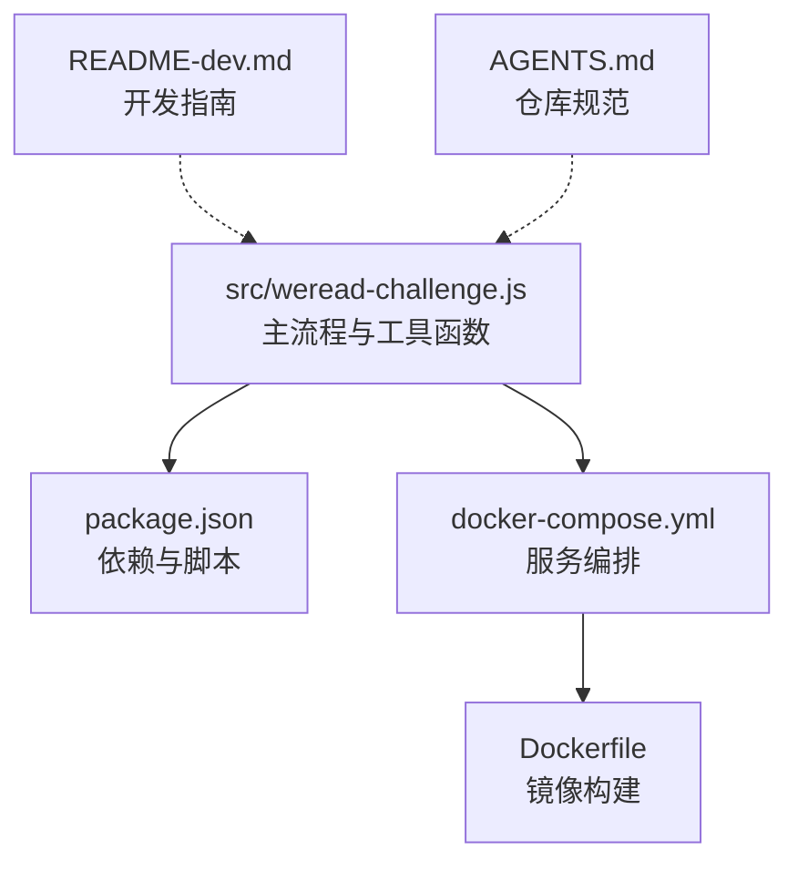
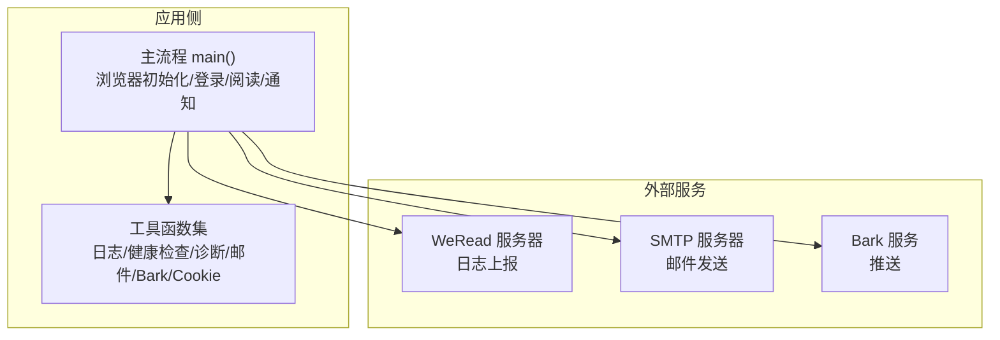
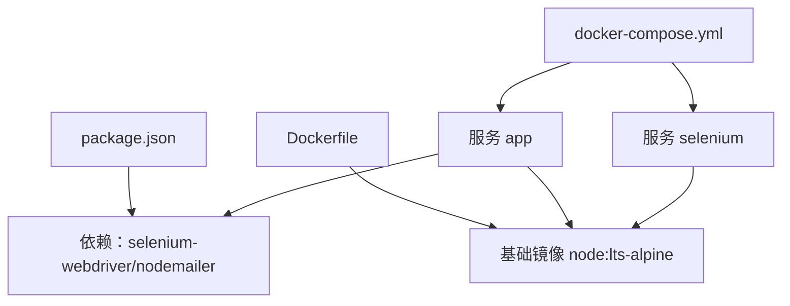

# API 参考

<cite>
**本文引用的文件**
- [src/weread-challenge.js](file://src/weread-challenge.js)
- [package.json](file://package.json)
- [docker-compose.yml](file://docker-compose.yml)
- [Dockerfile](file://Dockerfile)
- [README-dev.md](file://README-dev.md)
- [AGENTS.md](file://AGENTS.md)
</cite>

## 目录
1. [简介](#简介)
2. [项目结构](#项目结构)
3. [核心组件](#核心组件)
4. [架构总览](#架构总览)
5. [详细组件分析](#详细组件分析)
6. [依赖分析](#依赖分析)
7. [性能考虑](#性能考虑)
8. [故障排查指南](#故障排查指南)
9. [结论](#结论)
10. [附录](#附录)

## 简介
本文件为 WeRead 挑战赛自动化项目的 API 参考文档，聚焦于公开可调用的函数与配置项，帮助开发者准确理解并使用项目提供的能力。项目基于 Node.js 与 Selenium WebDriver，实现微信读书挑战赛的自动登录、阅读、截图与通知等流程。

## 项目结构
- 核心入口与主流程位于 src/weread-challenge.js，包含环境变量配置、浏览器初始化、登录流程、阅读循环、截图与通知等。
- package.json 定义了运行脚本与依赖（selenium-webdriver、nodemailer）。
- docker-compose.yml 与 Dockerfile 提供容器化部署与远程浏览器编排。
- README-dev.md 与 AGENTS.md 提供开发与运维指南。

图表来源
- [src/weread-challenge.js](file://src/weread-challenge.js#L1-L1279)
- [package.json](file://package.json#L1-L10)
- [docker-compose.yml](file://docker-compose.yml#L1-L32)
- [Dockerfile](file://Dockerfile#L1-L8)

章节来源
- [src/weread-challenge.js](file://src/weread-challenge.js#L1-L1279)
- [package.json](file://package.json#L1-L10)
- [docker-compose.yml](file://docker-compose.yml#L1-L32)
- [Dockerfile](file://Dockerfile#L1-L8)
- [README-dev.md](file://README-dev.md#L1-L14)
- [AGENTS.md](file://AGENTS.md#L1-L34)

## 核心组件
本项目以“函数式模块”组织，主要对外暴露以下能力：
- 主流程函数：负责浏览器初始化、登录、阅读、截图与通知。
- 工具函数：日志重定向、健康检查、诊断信息采集、邮件与 Bark 推送、Cookie 读写、元素点击与滚动辅助等。
- 配置项：通过环境变量控制浏览器类型、远程节点、阅读时长、速度、截图开关、通知开关等。

章节来源
- [src/weread-challenge.js](file://src/weread-challenge.js#L745-L1279)
- [src/weread-challenge.js](file://src/weread-challenge.js#L94-L303)
- [src/weread-challenge.js](file://src/weread-challenge.js#L350-L371)
- [src/weread-challenge.js](file://src/weread-challenge.js#L447-L487)
- [src/weread-challenge.js](file://src/weread-challenge.js#L572-L665)
- [src/weread-challenge.js](file://src/weread-challenge.js#L667-L743)

## 架构总览
系统由“主流程驱动器”与“外部服务”构成：
- 主流程驱动器：Selenium WebDriver 控制浏览器，执行登录、阅读、截图与通知。
- 外部服务：WeRead 服务器（日志上报）、SMTP（邮件）、Bark（推送）。

图表来源
- [src/weread-challenge.js](file://src/weread-challenge.js#L745-L1279)
- [src/weread-challenge.js](file://src/weread-challenge.js#L250-L303)
- [src/weread-challenge.js](file://src/weread-challenge.js#L572-L665)
- [src/weread-challenge.js](file://src/weread-challenge.js#L667-L743)

## 详细组件分析

### 主流程 API
- 函数名：main()
- 功能：串联浏览器初始化、登录、阅读、截图与通知，统一异常处理与资源回收。
- 参数：无
- 返回值：Promise<void>
- 关键行为
  - 根据 WEREAD_BROWSER 选择浏览器类型并构建 WebDriver 实例；支持本地或远程（Selenium Grid）。
  - 加载 Cookie 并访问目标 URL，等待登录完成或二维码刷新。
  - 进入阅读循环，按 WEREAD_DURATION 与 WEREAD_SPEED 控制阅读节奏，按分钟截图并检测页面异常。
  - 结束后保存 Cookie，并根据 ENABLE_EMAIL 发送邮件，发送 Bark 推送。
  - 异常时采集诊断信息并上报日志（如同意条款）。
- 使用示例
  - 本地运行：设置 WEREAD_BROWSER、WEREAD_DURATION、DEBUG 等环境变量后执行。
  - 远程运行：通过 WEREAD_REMOTE_BROWSER 指向 Selenium Grid，配合 docker-compose 启动。
- 最佳实践
  - 长时阅读建议设置 WEREAD_SCREENSHOT=true 以便回溯进度。
  - 远程运行务必先执行健康检查，确保 Grid 正常。
  - 遵循 AGENTS.md 的提交与安全规范，敏感信息通过环境变量注入。

章节来源
- [src/weread-challenge.js](file://src/weread-challenge.js#L745-L1279)
- [docker-compose.yml](file://docker-compose.yml#L1-L32)
- [AGENTS.md](file://AGENTS.md#L29-L34)

### 工具函数 API

#### 日志与诊断
- 函数名：redirectConsole(method)
- 功能：重定向 console.info/warn/error 到文件与控制台。
- 参数
  - method: 字符串，日志级别（"info"|"warn"|"error"）
- 返回值：void
- 使用示例：在非调试模式下自动启用重定向。

- 函数名：collectDiagnostics(reason)
- 功能：收集 Selenium 健康状态与容器日志。
- 参数
  - reason: 错误原因字符串
- 返回值：Promise<void>

- 函数名：checkSeleniumHealth(remoteUrl)
- 功能：探测远程 Selenium Grid 的健康状态。
- 参数
  - remoteUrl: 字符串，Selenium Hub 地址
- 返回值：Promise<{endpoint, ready, raw} | null>

- 函数名：collectSeleniumLogs(tail)
- 功能：抓取运行中 Selenium 容器日志并输出到 data 目录。
- 参数
  - tail: 数字，日志行数
- 返回值：Promise<string|null>

- 函数名：dockerAvailable()/findSeleniumContainers()
- 功能：检测 Docker 可用性与列出相关容器。
- 返回值：布尔/数组

- 函数名：formatLocalTimestamp(d)
- 功能：格式化本地时间戳。
- 返回值：字符串

- 函数名：getOSInfo()
- 功能：获取操作系统信息。
- 返回值：字符串

- 函数名：logEventToWereadLog(err)
- 功能：向 WeRead 服务器上报事件日志（含版本、浏览器、时长、用户信息等）。
- 参数
  - err: 字符串，错误信息
- 返回值：void
- 行为：根据 DEBUG 选择本地或线上上报地址。

- 函数名：getUserInfo()
- 功能：从 Cookie 文件解析用户信息（如 wr_gid、wr_name 等）。
- 返回值：对象

- 使用示例
  - 在异常时调用 collectDiagnostics 收集日志。
  - 通过 logEventToWereadLog 上报错误摘要。

章节来源
- [src/weread-challenge.js](file://src/weread-challenge.js#L75-L92)
- [src/weread-challenge.js](file://src/weread-challenge.js#L224-L232)
- [src/weread-challenge.js](file://src/weread-challenge.js#L125-L152)
- [src/weread-challenge.js](file://src/weread-challenge.js#L186-L222)
- [src/weread-challenge.js](file://src/weread-challenge.js#L154-L161)
- [src/weread-challenge.js](file://src/weread-challenge.js#L163-L184)
- [src/weread-challenge.js](file://src/weread-challenge.js#L65-L73)
- [src/weread-challenge.js](file://src/weread-challenge.js#L234-L248)
- [src/weread-challenge.js](file://src/weread-challenge.js#L250-L303)
- [src/weread-challenge.js](file://src/weread-challenge.js#L305-L348)

#### Cookie 管理
- 函数名：saveCookies(driver, filePath)
- 功能：保存当前会话 Cookie 至文件。
- 参数
  - driver: WebDriver 实例
  - filePath: 字符串，Cookie 文件路径
- 返回值：Promise<void>

- 函数名：loadCookies(driver, filePath)
- 功能：从文件加载 Cookie 并注入当前会话。
- 参数
  - driver: WebDriver 实例
  - filePath: 字符串，Cookie 文件路径
- 返回值：Promise<void>

- 使用示例
  - 登录成功后保存 Cookie，下次启动可自动登录。
  - 启动前加载 Cookie，减少手动扫码次数。

章节来源
- [src/weread-challenge.js](file://src/weread-challenge.js#L350-L371)

#### 元素交互与导航
- 函数名：safeClickElement(driver, element, description)
- 功能：安全点击元素，尝试多种点击策略（直接点击、JS 点击、Actions）。
- 参数
  - driver: WebDriver 实例
  - element: 元素对象
  - description: 字符串，元素描述
- 返回值：Promise<boolean>

- 函数名：isElementInViewport(driver, element)
- 功能：判断元素是否在视口内。
- 返回值：Promise<boolean>

- 函数名：pressDownArrow(driver)
- 功能：随机时长按下向下箭头键，模拟翻页。
- 返回值：Promise<void>

- 函数名：findQRCodeElement(driver)
- 功能：查找二维码相关元素（图片或包含“扫码/二维码”的文本）。
- 返回值：Promise<boolean>

- 函数名：refreshQRCode(driver)
- 功能：刷新二维码并截图保存。
- 返回值：Promise<boolean>

- 使用示例
  - 登录流程中自动刷新二维码。
  - 阅读循环中按需点击“下一章”或“下一页”。

章节来源
- [src/weread-challenge.js](file://src/weread-challenge.js#L447-L487)
- [src/weread-challenge.js](file://src/weread-challenge.js#L382-L414)
- [src/weread-challenge.js](file://src/weread-challenge.js#L373-L380)
- [src/weread-challenge.js](file://src/weread-challenge.js#L416-L445)
- [src/weread-challenge.js](file://src/weread-challenge.js#L489-L570)

#### 通知与邮件
- 函数名：sendMail(subject, text, filePaths)
- 功能：通过 SMTP 发送带截图附件的 HTML 邮件。
- 参数
  - subject: 字符串，主题
  - text: 字符串，正文
  - filePaths: 数组，附件路径列表
- 返回值：Promise<boolean>

- 函数名：sendBark(title, body, options)
- 功能：向 Bark 推送消息，支持音效、分组、图标、链接与级别。
- 参数
  - title: 字符串，标题
  - body: 字符串，内容
  - options: 对象，包含 subtitle、sound、group、icon、url、level
- 返回值：Promise<boolean>

- 使用示例
  - 登录成功/失败、阅读完成/异常时发送通知。
  - 通过 ENABLE_EMAIL 控制邮件开关。

章节来源
- [src/weread-challenge.js](file://src/weread-challenge.js#L572-L665)
- [src/weread-challenge.js](file://src/weread-challenge.js#L667-L743)

### 配置项参考
以下为环境变量与配置项的完整清单，包括类型、默认值与约束：

- WEREAD_REMOTE_BROWSER
  - 类型：字符串
  - 作用：远程 Selenium Grid 地址（http/https）
  - 默认值：未设置
  - 约束：为空则本地启动浏览器；非空时需先健康检查

- WEREAD_DURATION
  - 类型：数字（分钟）
  - 作用：阅读时长
  - 默认值：10
  - 约束：建议合理范围，避免过长导致页面异常

- WEREAD_SPEED
  - 类型：枚举字符串
  - 取值："slow"|"normal"|"fast"
  - 默认值："slow"
  - 约束：影响按键间隔随机范围

- WEREAD_SELECTION
  - 类型：数字
  - 作用：选择书籍的方式（-1 固定书目，0 随机，N 第 N 本书）
  - 默认值：2
  - 约束：当为 0 时随机选择 1~4

- WEREAD_BROWSER
  - 类型：枚举字符串
  - 取值："chrome"|"MicrosoftEdge"|"firefox"|"safari"
  - 默认值："chrome"
  - 约束：不同浏览器参数略有差异

- ENABLE_EMAIL
  - 类型：布尔
  - 作用：是否启用邮件通知
  - 默认值：false
  - 约束：需正确配置 SMTP 相关变量

- WEREAD_SCREENSHOT
  - 类型：布尔
  - 作用：阅读期间是否每分钟截图
  - 默认值：true
  - 约束：截图文件过大时会触发页面刷新

- WEREAD_AGREE_TERMS
  - 类型：布尔
  - 作用：是否同意上报日志
  - 默认值：true
  - 约束：同意后会在异常时上报错误摘要

- EMAIL_SMTP/EMAIL_PORT/EMAIL_USER/EMAIL_PASS/EMAIL_FROM/EMAIL_TO
  - 类型：字符串/数字
  - 作用：SMTP 配置与发件人/收件人
  - 默认值：无
  - 约束：端口 465 自动启用 SSL；其余端口按配置

- BARK_KEY/BARK_SERVER
  - 类型：字符串
  - 作用：Bark 推送密钥与服务地址
  - 默认值：BARK_KEY 空；BARK_SERVER 为官方地址
  - 约束：BARK_SERVER 需为合法 HTTP/HTTPS

- DEBUG
  - 类型：布尔
  - 作用：是否启用本地日志上报与控制台重定向
  - 默认值：false
  - 约束：调试模式下使用本地上报地址

- WEREAD_USER
  - 类型：字符串
  - 作用：浏览器配置文件目录名称
  - 默认值："weread-default"

- 其他
  - COOKIE_FILE："./data/cookies.json"
  - LOGIN_QR_CODE："./data/login.png"
  - WEREAD_URL："https://weread.qq.com/"

章节来源
- [src/weread-challenge.js](file://src/weread-challenge.js#L19-L56)
- [src/weread-challenge.js](file://src/weread-challenge.js#L756-L828)
- [docker-compose.yml](file://docker-compose.yml#L5-L7)
- [README-dev.md](file://README-dev.md#L1-L14)
- [AGENTS.md](file://AGENTS.md#L29-L34)

### 错误码与异常处理
- 健康检查失败
  - 现象：远程 Selenium 无有效响应
  - 处理：跳过健康检查或终止流程
  - 参考：checkSeleniumHealth()

- 二维码刷新失败
  - 现象：多次定位刷新按钮失败
  - 处理：回退到页面刷新并重新截图
  - 参考：refreshQRCode()

- 页面异常（已读完/需开通）
  - 现象：标题包含“已读完”，或出现“开通后即可阅读”
  - 处理：回到目录并重新进入下一章
  - 参考：阅读循环中的条件判断

- 截图异常（文件过小）
  - 现象：截图小于阈值 KB
  - 处理：刷新页面并重试
  - 参考：阅读循环中的截图校验

- 通知发送失败
  - 现象：邮件或 Bark 请求失败
  - 处理：记录错误并继续执行
  - 参考：sendMail()/sendBark()

- 日志上报失败
  - 现象：网络异常或服务端错误
  - 处理：记录错误并忽略
  - 参考：logEventToWereadLog()

章节来源
- [src/weread-challenge.js](file://src/weread-challenge.js#L125-L152)
- [src/weread-challenge.js](file://src/weread-challenge.js#L489-L570)
- [src/weread-challenge.js](file://src/weread-challenge.js#L1110-L1126)
- [src/weread-challenge.js](file://src/weread-challenge.js#L572-L665)
- [src/weread-challenge.js](file://src/weread-challenge.js#L667-L743)
- [src/weread-challenge.js](file://src/weread-challenge.js#L250-L303)

### 使用示例与最佳实践
- 本地快速调试
  - 设置 WEREAD_BROWSER、WEREAD_DURATION、DEBUG 等变量后直接运行。
  - 参考：README-dev.md 的调试说明。

- 远程运行（Selenium Grid）
  - 通过 WEREAD_REMOTE_BROWSER 指向 Hub，docker-compose 启动后等待健康检查。
  - 参考：docker-compose.yml 与 main() 中的远程构建逻辑。

- 长时阅读与截图
  - 建议开启 WEREAD_SCREENSHOT，以便回溯进度与问题定位。
  - 注意截图大小阈值，避免无效截图。

- 安全与合规
  - 敏感信息通过环境变量注入，避免硬编码。
  - 同意条款后才会上报日志，尊重用户隐私。
  - 参考：AGENTS.md 的安全与提交规范。

章节来源
- [README-dev.md](file://README-dev.md#L1-L14)
- [docker-compose.yml](file://docker-compose.yml#L1-L32)
- [src/weread-challenge.js](file://src/weread-challenge.js#L745-L828)
- [AGENTS.md](file://AGENTS.md#L29-L34)

## 依赖分析
- 运行时依赖
  - selenium-webdriver：浏览器驱动与页面操作
  - nodemailer：邮件发送
- 构建与运行
  - package.json 定义脚本与依赖安装
  - Dockerfile 基于 node:lts-alpine，仅安装生产依赖
  - docker-compose.yml 编排应用与 Selenium Standalone

图表来源
- [package.json](file://package.json#L5-L8)
- [Dockerfile](file://Dockerfile#L1-L8)
- [docker-compose.yml](file://docker-compose.yml#L1-L32)

章节来源
- [package.json](file://package.json#L1-L10)
- [Dockerfile](file://Dockerfile#L1-L8)
- [docker-compose.yml](file://docker-compose.yml#L1-L32)

## 性能考虑
- 浏览器窗口尺寸随机化，避免固定布局对页面渲染的影响。
- 阅读节奏通过随机间隔控制，模拟人类行为。
- 截图按分钟进行，可根据需求调整频率以平衡性能与可观测性。
- 远程运行时建议先健康检查，减少连接失败带来的重试成本。

## 故障排查指南
- 无法连接远程浏览器
  - 检查 WEREAD_REMOTE_BROWSER 是否带协议头，确认 Hub 地址可达。
  - 使用 checkSeleniumHealth() 获取健康状态。
- 登录失败或二维码过期
  - 使用 refreshQRCode() 刷新二维码并截图保存。
  - 若多次失败，回退到页面刷新并重新截图。
- 阅读中断或页面异常
  - 检查标题与特定文案，必要时回到目录并重新进入下一章。
  - 截图过小触发刷新，确认网络与页面渲染正常。
- 通知未送达
  - 核对 SMTP 配置与端口，465 自动启用 SSL。
  - Bark 密钥与服务地址需正确配置。
- 日志与诊断
  - 异常时调用 collectDiagnostics() 抓取 Selenium 日志。
  - 通过 logEventToWereadLog() 上报错误摘要（同意条款时）。

章节来源
- [src/weread-challenge.js](file://src/weread-challenge.js#L792-L801)
- [src/weread-challenge.js](file://src/weread-challenge.js#L125-L152)
- [src/weread-challenge.js](file://src/weread-challenge.js#L489-L570)
- [src/weread-challenge.js](file://src/weread-challenge.js#L1110-L1126)
- [src/weread-challenge.js](file://src/weread-challenge.js#L572-L665)
- [src/weread-challenge.js](file://src/weread-challenge.js#L667-L743)
- [src/weread-challenge.js](file://src/weread-challenge.js#L224-L232)
- [src/weread-challenge.js](file://src/weread-challenge.js#L250-L303)

## 结论
本 API 参考文档梳理了 WeRead 挑战赛自动化项目的核心函数、配置项与异常处理机制。通过环境变量与工具函数，开发者可以灵活地在本地或远程环境中运行自动化流程，并结合邮件与 Bark 推送实现可观测性与告警闭环。建议在生产环境中遵循安全与合规规范，合理配置远程节点与通知策略。

## 附录
- 运行命令
  - 本地：设置环境变量后直接运行主文件
  - 远程：docker-compose up -d 启动后，应用自动连接 Selenium Hub
- 脚本入口
  - package.json 中的 start 脚本提供示例环境变量注入方式

章节来源
- [package.json](file://package.json#L2-L4)
- [docker-compose.yml](file://docker-compose.yml#L1-L32)
- [README-dev.md](file://README-dev.md#L1-L14)