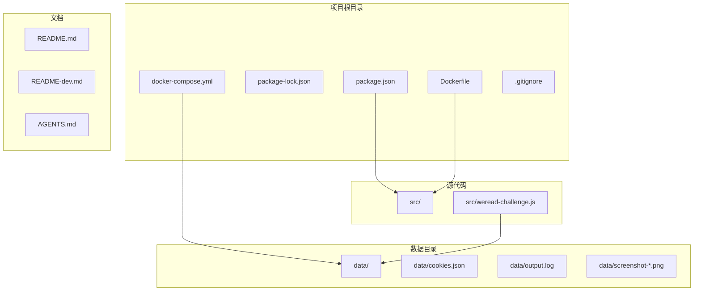
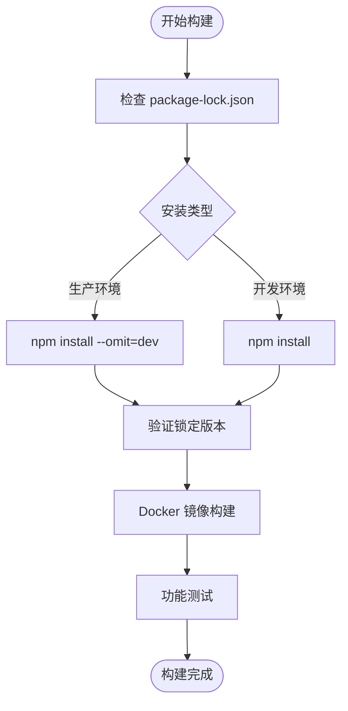
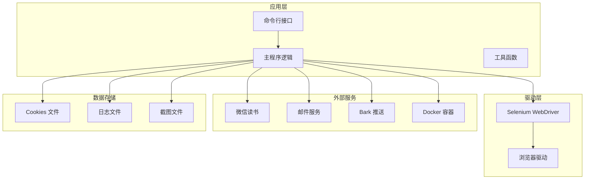
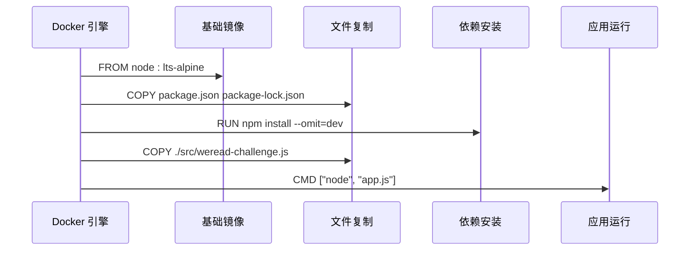
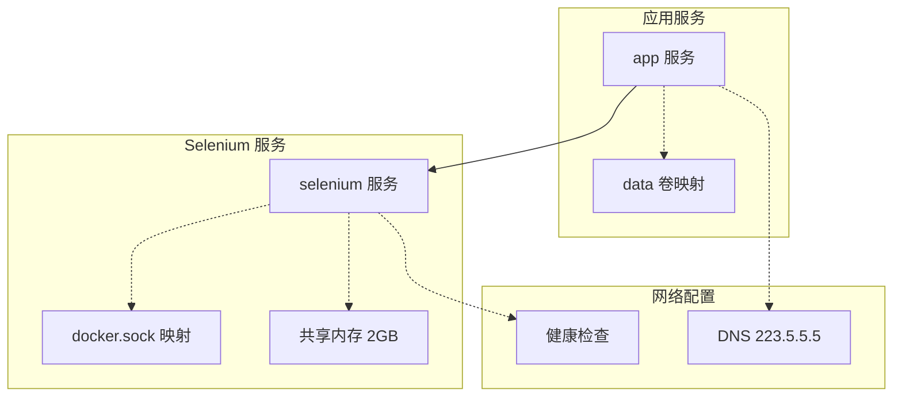
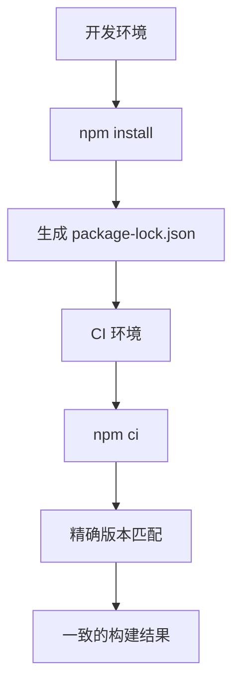
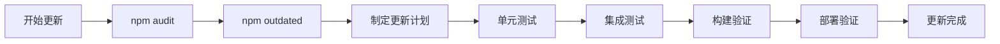
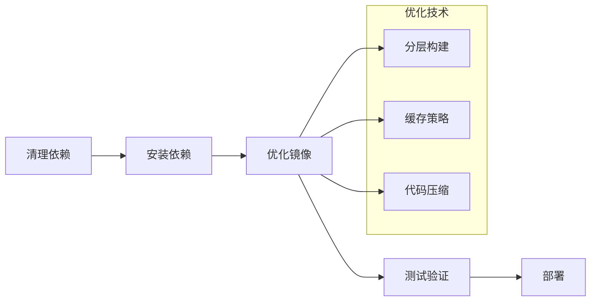
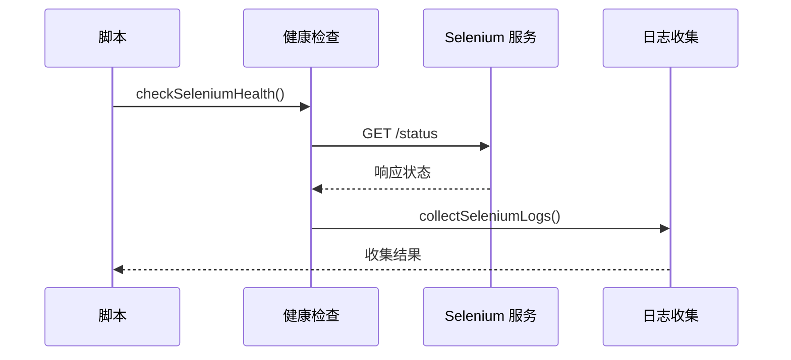

# 包管理与依赖

<cite>
**本文档引用的文件**
- [package.json](file://package.json)
- [package-lock.json](file://package-lock.json)
- [Dockerfile](file://Dockerfile)
- [docker-compose.yml](file://docker-compose.yml)
- [src/weread-challenge.js](file://src/weread-challenge.js)
- [README-dev.md](file://README-dev.md)
- [AGENTS.md](file://AGENTS.md)
- [.gitignore](file://.gitignore)
</cite>

## 目录
1. [简介](#简介)
2. [项目结构](#项目结构)
3. [核心组件](#核心组件)
4. [架构概览](#架构概览)
5. [详细组件分析](#详细组件分析)
6. [依赖分析](#依赖分析)
7. [性能考虑](#性能考虑)
8. [故障排除指南](#故障排除指南)
9. [结论](#结论)

## 简介

这是一个基于 Selenium WebDriver 的微信读书挑战自动化脚本。该项目实现了自动登录、阅读控制、截图监控等功能，支持本地和远程浏览器运行模式。本文档专注于项目的包管理和依赖管理策略。

## 项目结构

项目采用标准的 Node.js 项目结构，主要包含以下关键文件：



**图表来源**
- [package.json](file://package.json#L1-L31)
- [Dockerfile](file://Dockerfile#L1-L8)
- [docker-compose.yml](file://docker-compose.yml#L1-L32)

**章节来源**
- [package.json](file://package.json#L1-L31)
- [Dockerfile](file://Dockerfile#L1-L8)
- [docker-compose.yml](file://docker-compose.yml#L1-L32)

## 核心组件

### 包管理配置

项目使用 npm 作为包管理器，配置文件位于 `package.json`：

- **项目元数据**：名称、版本、描述、主入口文件
- **二进制文件**：提供命令行接口 `weread-challenge`
- **文件包含**：仅打包必要的源代码和文档文件
- **许可证**：MIT 许可证

### 依赖管理策略

项目采用严格的依赖管理策略：



**图表来源**
- [Dockerfile](file://Dockerfile#L6)
- [package-lock.json](file://package-lock.json#L1-L198)

**章节来源**
- [package.json](file://package.json#L23-L29)
- [package-lock.json](file://package-lock.json#L11-L16)

## 架构概览

项目采用三层架构设计：



**图表来源**
- [src/weread-challenge.js](file://src/weread-challenge.js#L1-L1330)
- [docker-compose.yml](file://docker-compose.yml#L1-L32)

## 详细组件分析

### 核心依赖分析

项目的核心依赖包括：

#### Selenium 生态系统
- **selenium-webdriver**: ^4.27.0 - 主要的 WebDriver 实现
- **@bazel/runfiles**: ^6.3.1 - Bazel 运行时支持
- **ws**: ^8.18.0 - WebSocket 支持
- **tmp**: ^0.2.3 - 临时文件管理

#### 图像处理
- **jsqr**: ^1.4.0 - 二维码识别
- **pngjs**: ^7.0.0 - PNG 图像处理

#### 通信服务
- **nodemailer**: ^6.9.16 - 邮件发送
- **qrcode-terminal**: ^0.12.0 - 终端二维码显示

#### 内部依赖关系
```mermaid
graph LR
SELENIUM[selenium-webdriver] --> RUNFILES[@bazel/runfiles]
SELENIUM --> WS[ws]
SELENIUM --> TMP[tmp]
SELENIUM --> JSZIP[jszip]
JSZIP --> LIE[lie]
JSZIP --> PAKO[pako]
JSZIP --> READABLE[readable-stream]
```

**图表来源**
- [package-lock.json](file://package-lock.json#L126-L149)

**章节来源**
- [package.json](file://package.json#L23-L29)
- [package-lock.json](file://package-lock.json#L11-L16)

### Docker 容器化策略

项目提供了完整的容器化解决方案：

#### Dockerfile 构建流程


**图表来源**
- [Dockerfile](file://Dockerfile#L1-L8)

#### Docker Compose 服务编排


**图表来源**
- [docker-compose.yml](file://docker-compose.yml#L1-L32)

**章节来源**
- [Dockerfile](file://Dockerfile#L1-L8)
- [docker-compose.yml](file://docker-compose.yml#L1-L32)

### 环境变量管理

项目使用环境变量进行配置管理：

#### 关键环境变量
| 变量名 | 类型 | 默认值 | 描述 |
|--------|------|--------|------|
| WEREAD_REMOTE_BROWSER | 字符串 | 未设置 | 远程浏览器地址 |
| WEREAD_DURATION | 数字 | 10 | 阅读时长（分钟） |
| WEREAD_SPEED | 字符串 | "slow" | 阅读速度 |
| WEREAD_SELECTION | 数字 | 2 | 书籍选择策略 |
| WEREAD_BROWSER | 字符串 | "chrome" | 浏览器类型 |
| ENABLE_EMAIL | 布尔值 | false | 启用邮件通知 |
| WEREAD_SCREENSHOT | 布尔值 | true | 启用截图功能 |
| EMAIL_PORT | 数字 | 465 | SMTP 端口号 |

**章节来源**
- [src/weread-challenge.js](file://src/weread-challenge.js#L42-L61)

### 依赖版本锁定机制

项目使用 `package-lock.json` 确保依赖版本一致性：

#### 版本锁定策略


**图表来源**
- [package-lock.json](file://package-lock.json#L1-L198)

**章节来源**
- [package-lock.json](file://package-lock.json#L1-L198)

## 依赖分析

### 依赖层次结构

项目依赖关系呈现清晰的层次结构：

```mermaid
graph TD
subgraph "顶级依赖"
SELENIUM[selenium-webdriver]
JSQR[jsqr]
NODMAILER[nodemailer]
PNGJS[pngjs]
QRCODE[qrcode-terminal]
end
subgraph "Selenium 依赖"
RUNFILES[@bazel/runfiles]
WS[ws]
TMP[tmp]
JSZIP[jszip]
end
subgraph "图像处理依赖"
LIE[lie]
PAKO[pako]
READABLE[readable-stream]
end
SELENIUM --> RUNFILES
SELENIUM --> WS
SELENIUM --> TMP
SELENIUM --> JSZIP
JSZIP --> LIE
JSZIP --> PAKO
JSZIP --> READABLE
```

**图表来源**
- [package-lock.json](file://package-lock.json#L11-L195)

### 依赖更新策略

项目采用渐进式依赖更新策略：

#### 更新流程


**章节来源**
- [README-dev.md](file://README-dev.md#L8-L12)

### 安全考虑

项目在安全方面采取了多项措施：

#### 依赖安全扫描
- 定期执行 `npm audit` 检查
- 使用 `--omit=dev` 确保生产环境安全
- 敏感信息通过环境变量管理

#### 最佳实践
- 依赖版本锁定
- 最小权限原则
- 定期安全更新

**章节来源**
- [AGENTS.md](file://AGENTS.md#L29-L33)

## 性能考虑

### 依赖性能优化

项目在依赖选择上注重性能：

#### 轻量级依赖
- 使用 `pngjs` 替代大型图像库
- 选择高效的二维码识别库
- 优化邮件发送组件

#### 运行时性能
- Docker 镜像大小优化
- 依赖安装时的精简策略
- 内存使用优化

### 构建性能

#### 构建优化策略


**章节来源**
- [Dockerfile](file://Dockerfile#L6)

## 故障排除指南

### 常见依赖问题

#### 依赖安装问题
- 确保 `package-lock.json` 存在
- 检查 Node.js 版本兼容性
- 验证网络连接稳定性

#### Docker 构建问题
- 检查 Docker 版本
- 确认网络访问权限
- 验证卷挂载配置

### 诊断工具

项目内置了完善的诊断功能：

#### 健康检查


**图表来源**
- [src/weread-challenge.js](file://src/weread-challenge.js#L144-L251)

**章节来源**
- [src/weread-challenge.js](file://src/weread-challenge.js#L144-L251)

### 错误处理机制

项目实现了多层次的错误处理：

#### 错误捕获
- 全局异常捕获
- 诊断信息收集
- 自动日志记录

#### 恢复策略
- 自动重试机制
- 失败降级处理
- 资源清理保证

**章节来源**
- [src/weread-challenge.js](file://src/weread-challenge.js#L1291-L1327)

## 结论

该项目展现了优秀的包管理和依赖管理实践：

### 主要优势

1. **严格的版本控制**：通过 `package-lock.json` 确保依赖一致性
2. **容器化部署**：提供完整的 Docker 解决方案
3. **环境隔离**：使用环境变量管理配置
4. **安全考虑**：敏感信息不硬编码在代码中
5. **可观测性**：内置诊断和日志功能

### 最佳实践总结

- 使用 `--omit=dev` 进行生产环境安装
- 定期执行安全审计
- 采用分层构建优化 Docker 镜像
- 实施环境变量配置管理
- 建立完善的错误处理机制

这些实践为项目的稳定运行和维护提供了坚实基础，值得在类似项目中借鉴和应用。