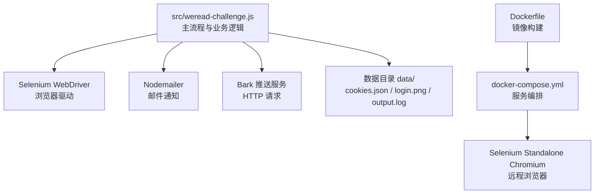
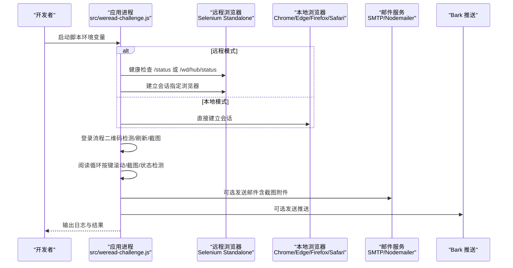
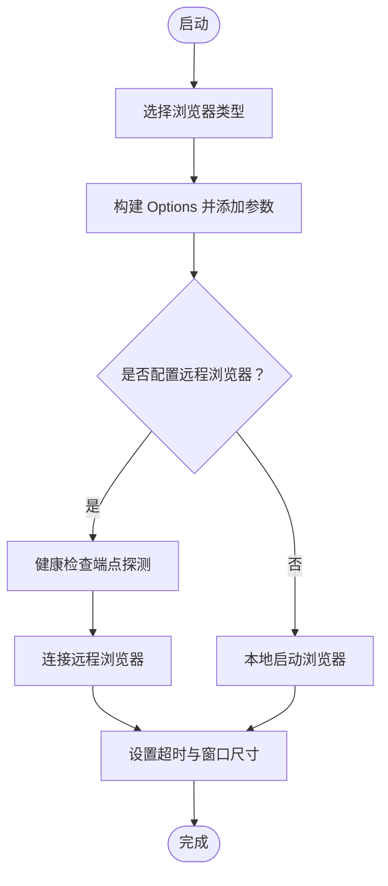
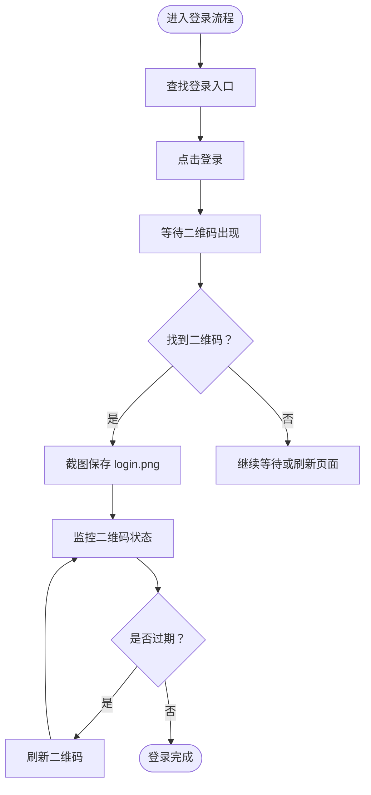
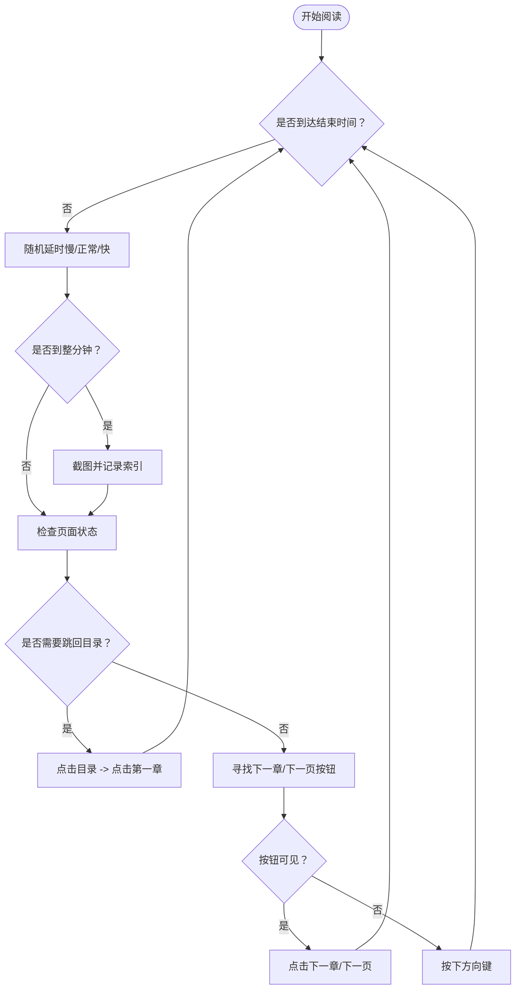
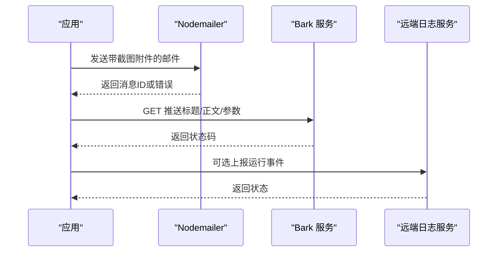
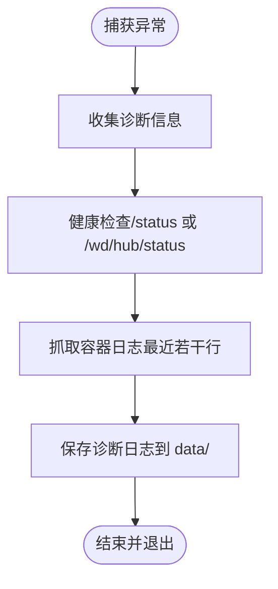
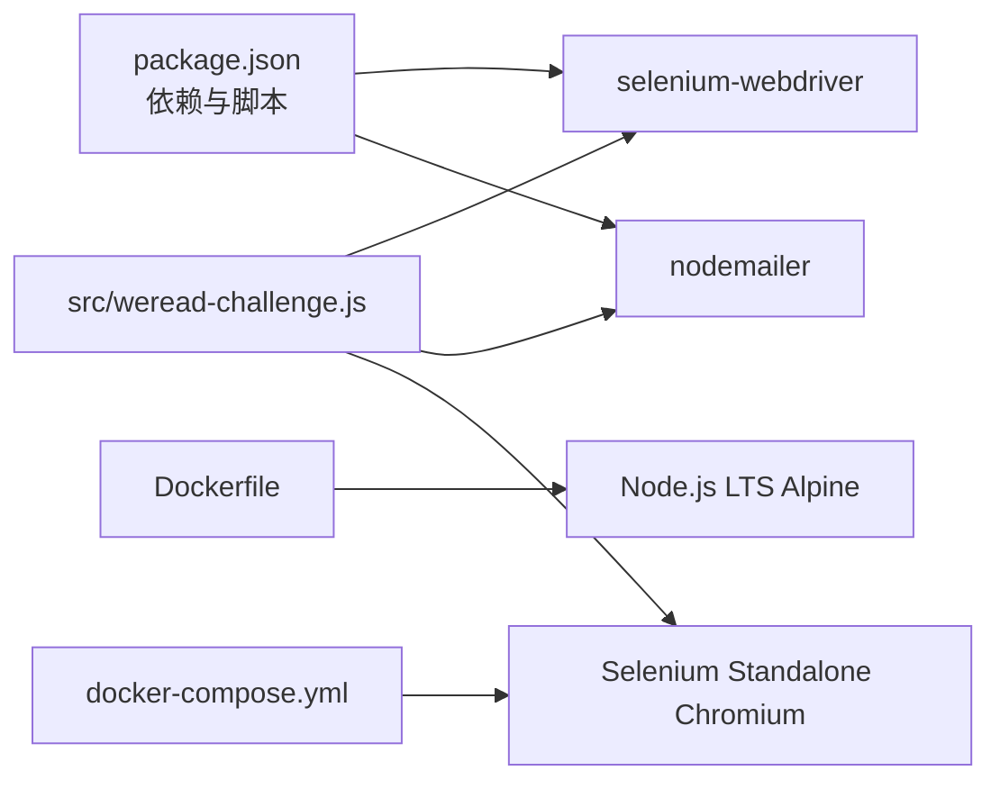

# 开发指南

<cite>
**本文引用的文件**
- [README-dev.md](file://README-dev.md)
- [package.json](file://package.json)
- [src/weread-challenge.js](file://src/weread-challenge.js)
- [Dockerfile](file://Dockerfile)
- [docker-compose.yml](file://docker-compose.yml)
- [AGENTS.md](file://AGENTS.md)
- [.gitignore](file://.gitignore)
</cite>

## 目录
1. [简介](#简介)
2. [项目结构](#项目结构)
3. [核心组件](#核心组件)
4. [架构总览](#架构总览)
5. [详细组件分析](#详细组件分析)
6. [依赖关系分析](#依赖关系分析)
7. [性能考虑](#性能考虑)
8. [故障排查指南](#故障排查指南)
9. [结论](#结论)
10. [附录](#附录)

## 简介
本指南面向 WeRead 挑战赛自动化项目的新开发者与维护者，提供从开发环境搭建、代码结构与编码规范、调试与测试方法，到版本控制与贡献流程的完整入门路径。项目基于 Node.js 与 Selenium WebDriver 实现微信读书挑战赛的自动化阅读与登录流程，支持本地与远程浏览器运行，并提供邮件与 Bark 推送通知能力。

## 项目结构
项目采用“单脚本主流程 + 容器编排”的轻量架构，核心文件与职责如下：
- 单脚本主流程：src/weread-challenge.js，负责登录、二维码刷新、阅读循环、截图、通知与日志等全流程。
- 容器化运行：Dockerfile 与 docker-compose.yml，一键拉起应用与 Selenium Standalone Chromium。
- 依赖与脚本：package.json，定义运行脚本与依赖。
- 开发与贡献指南：README-dev.md 与 AGENTS.md，提供调试、测试与提交规范。
- 版本控制：.gitignore 控制数据与日志文件不进入仓库。

图表来源
- [src/weread-challenge.js](file://src/weread-challenge.js#L1-L1279)
- [Dockerfile](file://Dockerfile#L1-L8)
- [docker-compose.yml](file://docker-compose.yml#L1-L32)

章节来源
- [src/weread-challenge.js](file://src/weread-challenge.js#L1-L1279)
- [Dockerfile](file://Dockerfile#L1-L8)
- [docker-compose.yml](file://docker-compose.yml#L1-L32)
- [AGENTS.md](file://AGENTS.md#L1-L34)

## 核心组件
- 浏览器驱动与会话管理
  - 支持 Chrome、Edge、Firefox、Safari，动态构建 Options 并设置窗口尺寸与超时。
  - 远程浏览器通过 WEREAD_REMOTE_BROWSER 环境变量连接，内置健康检查与端点探测。
- 登录与二维码处理
  - 自动定位登录入口、等待二维码出现、截图保存、检测二维码过期并自动刷新。
- 阅读循环与智能翻页
  - 基于随机延时与方向键滚动，按分钟截屏；检测“已读完”“开通后阅读”等状态并跳回目录重新开始。
- 通知与遥测
  - 支持邮件与 Bark 推送；可选上传运行日志至远端服务。
- 诊断与日志
  - 统一日志输出与文件落盘；捕获异常时自动采集 Selenium 健康状态与容器日志。

章节来源
- [src/weread-challenge.js](file://src/weread-challenge.js#L745-L1279)
- [package.json](file://package.json#L1-L10)

## 架构总览
下图展示应用在本地与远程两种运行模式下的交互关系：

图表来源
- [src/weread-challenge.js](file://src/weread-challenge.js#L745-L1279)
- [docker-compose.yml](file://docker-compose.yml#L1-L32)

## 详细组件分析

### 组件一：浏览器驱动与会话管理
- 功能要点
  - 根据 WEREAD_BROWSER 选择对应 Options 并添加常用参数（禁用沙箱、GPU、通知等）。
  - 支持远程浏览器：自动健康检查、协议补全、超时配置。
  - 设置窗口大小与超时策略，避免长时间阻塞。
- 关键流程

图表来源
- [src/weread-challenge.js](file://src/weread-challenge.js#L756-L828)

章节来源
- [src/weread-challenge.js](file://src/weread-challenge.js#L756-L828)

### 组件二：登录与二维码处理
- 功能要点
  - 查找登录入口并点击；等待二维码出现并截图保存。
  - 检测“二维码已失效/点击刷新二维码”提示，自动刷新并重试。
  - 登录成功后保存 Cookie，便于后续会话复用。
- 关键流程

图表来源
- [src/weread-challenge.js](file://src/weread-challenge.js#L865-L957)

章节来源
- [src/weread-challenge.js](file://src/weread-challenge.js#L865-L957)

### 组件三：阅读循环与智能翻页
- 功能要点
  - 按分钟截屏，检测页面状态（已读完、需开通、全书完）并跳回目录重新开始。
  - 随机延时与方向键滚动，模拟人类阅读节奏。
- 关键流程

图表来源
- [src/weread-challenge.js](file://src/weread-challenge.js#L1088-L1220)

章节来源
- [src/weread-challenge.js](file://src/weread-challenge.js#L1088-L1220)

### 组件四：通知与遥测
- 功能要点
  - 邮件：基于 Nodemailer 的 SMTP 传输，自动根据端口判断 SSL；支持附件与内嵌图片。
  - Bark：构造 GET 请求推送消息，支持声音、分组、图标、链接与级别。
  - 遥测：可选向远端服务上报运行信息（系统、浏览器、时长、是否启用邮件等）。
- 关键流程

图表来源
- [src/weread-challenge.js](file://src/weread-challenge.js#L572-L743)
- [src/weread-challenge.js](file://src/weread-challenge.js#L250-L303)

章节来源
- [src/weread-challenge.js](file://src/weread-challenge.js#L572-L743)
- [src/weread-challenge.js](file://src/weread-challenge.js#L250-L303)

### 组件五：诊断与日志
- 功能要点
  - 统一日志输出到文件与控制台；异常时自动采集 Selenium 健康状态与容器日志。
  - 诊断信息包括：健康检查端点、容器日志文件路径、OS 与浏览器信息。
- 关键流程

图表来源
- [src/weread-challenge.js](file://src/weread-challenge.js#L224-L232)
- [src/weread-challenge.js](file://src/weread-challenge.js#L125-L222)

章节来源
- [src/weread-challenge.js](file://src/weread-challenge.js#L224-L232)
- [src/weread-challenge.js](file://src/weread-challenge.js#L125-L222)

## 依赖关系分析
- 运行时依赖
  - selenium-webdriver：浏览器驱动与会话管理。
  - nodemailer：邮件发送能力。
- 构建与运行
  - Dockerfile：基于 Node.js LTS Alpine，复制依赖与脚本，仅安装生产依赖。
  - docker-compose.yml：编排应用与 Selenium Standalone Chromium，设置共享内存与健康检查。
- 环境变量
  - WEREAD_REMOTE_BROWSER、WEREAD_DURATION、WEREAD_BROWSER、ENABLE_EMAIL、WEREAD_SCREENSHOT、EMAIL_*、BARK_* 等。

图表来源
- [package.json](file://package.json#L1-L10)
- [Dockerfile](file://Dockerfile#L1-L8)
- [docker-compose.yml](file://docker-compose.yml#L1-L32)

章节来源
- [package.json](file://package.json#L1-L10)
- [Dockerfile](file://Dockerfile#L1-L8)
- [docker-compose.yml](file://docker-compose.yml#L1-L32)

## 性能考虑
- 浏览器与网络
  - 使用无头/最小化参数减少资源占用；合理设置页面加载与脚本超时，避免长时间阻塞。
  - 远程浏览器建议启用健康检查与稳定 DNS，降低连接抖动。
- 截图与存储
  - 按分钟截屏，注意磁盘空间与 IO 压力；对异常小尺寸截图进行刷新回退。
- 阅读节奏
  - 随机延时模拟人类行为，避免过于机械；根据速度模式调整延时范围。
- 容器资源
  - 分配足够共享内存（例如 2GB），避免 Chromium 崩溃；按需裁剪日志与附件大小。

## 故障排查指南
- 常见问题与定位
  - 远程浏览器连接失败：检查 WEREAD_REMOTE_BROWSER 是否带协议、健康检查端点是否可达。
  - 二维码过期：自动刷新；若仍失败，尝试刷新页面并重新截图。
  - 页面状态异常（已读完/需开通）：自动跳回目录并重新开始。
  - 截图无效或过小：刷新页面并重试。
- 诊断工具
  - 启用 DEBUG 模式输出更多日志；异常时自动抓取 Selenium 健康状态与容器日志。
  - 使用 docker-compose 查看服务健康状态与日志。
- 通知与遥测
  - 邮件发送失败：检查 SMTP 地址、端口与认证；465 端口自动启用 SSL。
  - Bark 推送失败：检查 Bark Key 与服务器地址；确认网络可达。

章节来源
- [src/weread-challenge.js](file://src/weread-challenge.js#L125-L232)
- [src/weread-challenge.js](file://src/weread-challenge.js#L898-L957)
- [src/weread-challenge.js](file://src/weread-challenge.js#L1110-L1126)
- [src/weread-challenge.js](file://src/weread-challenge.js#L572-L743)

## 结论
本项目以简洁的单脚本架构实现了微信读书挑战赛的自动化阅读与登录流程，配合容器化部署与通知机制，适合在本地或 CI 环境中稳定运行。建议后续在保持现有职责边界的同时，逐步将登录、阅读、通知等模块拆分为独立文件，提升可维护性与可测试性。

## 附录

### 开发环境搭建
- 本地运行
  - 安装依赖：参考开发指南中的安装命令。
  - 运行脚本：使用 npm 脚本或直接执行 Node 文件；可设置 DEBUG、WEREAD_BROWSER、WEREAD_DURATION 等环境变量。
- 远程运行（容器）
  - 使用 docker-compose 拉起应用与 Selenium 服务；确保共享内存充足与健康检查通过。

章节来源
- [README-dev.md](file://README-dev.md#L1-L14)
- [package.json](file://package.json#L1-L10)
- [docker-compose.yml](file://docker-compose.yml#L1-L32)

### VS Code 调试配置建议
- 使用 F5 启动，选择 Node.js 环境，预设浏览器为 Chrome。
- 建议在 launch.json 中设置环境变量（如 WEREAD_BROWSER、WEREAD_DURATION、DEBUG），便于快速验证。

章节来源
- [README-dev.md](file://README-dev.md#L9-L9)

### 编码规范与最佳实践
- 缩进与字符串：统一 2 空格缩进，尽量使用单引号；优先使用 async/await。
- 命名：常量使用 SCREAMING_SNAKE_CASE，变量与函数使用 camelCase。
- 日志：通过统一函数重定向 console 输出到文件；新增监控点时复用现有逻辑。
- 安全：敏感信息通过环境变量传入，避免硬编码；默认同意条款可选关闭。

章节来源
- [AGENTS.md](file://AGENTS.md#L14-L17)
- [AGENTS.md](file://AGENTS.md#L29-L32)

### 测试方法与贡献流程
- 测试
  - 当前无自动化单测，建议在 tests/ 下编写冒烟用例，覆盖登录、二维码刷新、章节跳转与通知开关。
- 提交
  - 使用 Conventional Commits 规范；PR 描述包含背景、变更要点、运行命令、环境变量与日志片段。

章节来源
- [AGENTS.md](file://AGENTS.md#L19-L27)

### 版本控制与发布
- .gitignore 已忽略 data/ 与日志文件；新增缓存文件时请同步更新忽略列表。
- Docker 镜像与 Compose 文件用于生产部署与回归验证。

章节来源
- [.gitignore](file://.gitignore)
- [Dockerfile](file://Dockerfile#L1-L8)
- [docker-compose.yml](file://docker-compose.yml#L1-L32)