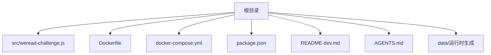
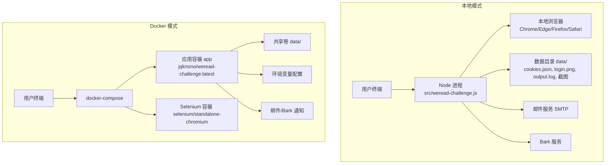
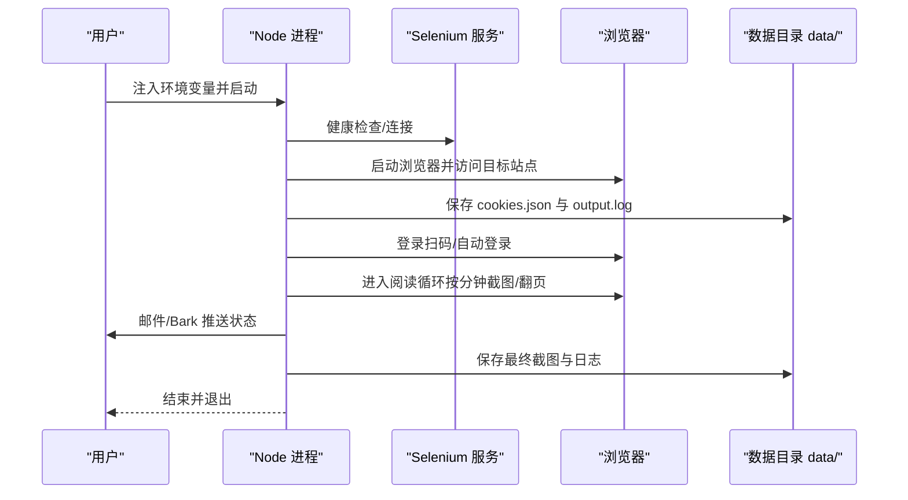
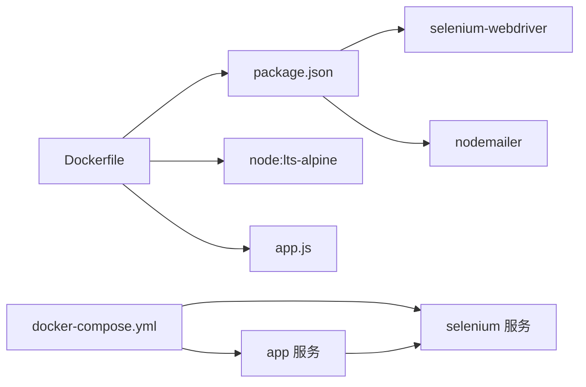
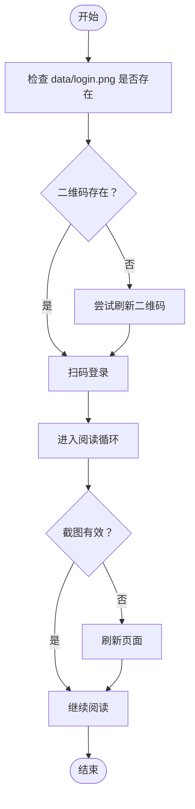

# 快速开始

<cite>
**本文引用的文件**
- [package.json](file://package.json)
- [Dockerfile](file://Dockerfile)
- [docker-compose.yml](file://docker-compose.yml)
- [src/weread-challenge.js](file://src/weread-challenge.js)
- [README-dev.md](file://README-dev.md)
- [AGENTS.md](file://AGENTS.md)
</cite>

## 目录
1. [简介](#简介)
2. [项目结构](#项目结构)
3. [核心组件](#核心组件)
4. [架构总览](#架构总览)
5. [详细组件分析](#详细组件分析)
6. [依赖关系分析](#依赖关系分析)
7. [性能注意事项](#性能注意事项)
8. [故障排查指南](#故障排查指南)
9. [结论](#结论)
10. [附录](#附录)

## 简介
本指南面向首次接触 WeRead 挑战赛自动化项目的用户，帮助你在 15 分钟内完成环境准备、安装部署与首次运行。项目基于 Node.js 与 Selenium WebDriver，支持本地与 Docker 两种运行方式，并内置邮件与 Bark 推送能力，便于自动化阅读任务的监控与反馈。

## 项目结构
- 核心逻辑位于 src/weread-challenge.js，负责登录、阅读循环、截图、通知与日志等。
- Docker 支持通过 Dockerfile 与 docker-compose.yml 实现一键编排。
- package.json 定义了脚本与依赖，便于本地与 CI 场景运行。
- README-dev.md 与 AGENTS.md 提供开发与运维指引。

图表来源
- [src/weread-challenge.js](file://src/weread-challenge.js#L1-L1279)
- [Dockerfile](file://Dockerfile#L1-L8)
- [docker-compose.yml](file://docker-compose.yml#L1-L32)
- [package.json](file://package.json#L1-L10)
- [README-dev.md](file://README-dev.md#L1-L14)
- [AGENTS.md](file://AGENTS.md#L1-L34)

章节来源
- [src/weread-challenge.js](file://src/weread-challenge.js#L1-L1279)
- [Dockerfile](file://Dockerfile#L1-L8)
- [docker-compose.yml](file://docker-compose.yml#L1-L32)
- [package.json](file://package.json#L1-L10)
- [README-dev.md](file://README-dev.md#L1-L14)
- [AGENTS.md](file://AGENTS.md#L1-L34)

## 核心组件
- 自动化驱动与浏览器控制：基于 selenium-webdriver，支持 Chrome、Edge、Firefox、Safari。
- 登录与二维码处理：自动检测登录态、二维码过期并刷新，截图保存登录二维码。
- 阅读循环：按分钟截屏、随机按键向下翻页、遇到“已读完”或“开通后阅读”等场景自动回到书首并进入下一章。
- 通知与日志：支持邮件与 Bark 推送，输出统一的日志文件至 data/output.log。
- Docker 编排：通过 docker-compose 启动应用与 Selenium Standalone Chromium。

章节来源
- [src/weread-challenge.js](file://src/weread-challenge.js#L10-L1279)
- [package.json](file://package.json#L1-L10)
- [docker-compose.yml](file://docker-compose.yml#L1-L32)

## 架构总览
下图展示了本地与 Docker 两种运行模式的总体交互关系。

图表来源
- [src/weread-challenge.js](file://src/weread-challenge.js#L745-L1279)
- [docker-compose.yml](file://docker-compose.yml#L1-L32)
- [Dockerfile](file://Dockerfile#L1-L8)

## 详细组件分析

### 环境要求
- Node.js：使用 Node LTS（Alpine）。Dockerfile 明确基础镜像为 node:lts-alpine。
- 浏览器：支持 Chrome、Edge、Firefox、Safari。默认使用 Chrome，可通过环境变量切换。
- Docker：如使用 Docker 模式，需安装 Docker 并确保宿主机具备足够内存与共享内存（建议 2GB）。

章节来源
- [Dockerfile](file://Dockerfile#L1-L8)
- [src/weread-challenge.js](file://src/weread-challenge.js#L29-L30)
- [AGENTS.md](file://AGENTS.md#L32-L32)

### 安装步骤
- 本地安装
  - 安装依赖：使用 npm 安装 selenium-webdriver 与 nodemailer。
  - 运行脚本：可直接运行 Node 脚本，或使用 npm scripts 注入远程浏览器地址后启动。
- Docker 安装
  - 拉取镜像并编排：使用 docker-compose 启动应用与 Selenium 容器。
  - 数据持久化：通过卷映射将本地 data 目录挂载到容器内，以便保存 cookies、截图与日志。

章节来源
- [README-dev.md](file://README-dev.md#L3-L7)
- [package.json](file://package.json#L2-L4)
- [docker-compose.yml](file://docker-compose.yml#L1-L32)

### 基本配置
- 关键环境变量（可在运行时注入）
  - WEREAD_REMOTE_BROWSER：远程浏览器地址（如 http://selenium:4444），留空则本地启动。
  - WEREAD_DURATION：阅读时长（分钟），默认 10。
  - WEREAD_BROWSER：浏览器类型（chrome/edge/firefox/safari），默认 chrome。
  - ENABLE_EMAIL：是否启用邮件通知，默认 false。
  - WEREAD_SCREENSHOT：是否每分钟截图，默认 true。
  - WEREAD_AGREE_TERMS：是否同意统计上报，默认 true。
  - EMAIL_SMTP/EMAIL_PORT/EMAIL_USER/EMAIL_PASS/EMAIL_FROM/EMAIL_TO：SMTP 配置。
  - BARK_KEY/BARK_SERVER：Bark 推送配置。
- 默认行为
  - 自动创建 data/ 目录，保存 cookies.json、login.png、output.log 与截图。
  - 登录成功后自动保存 cookies，下次可复用。
  - 阅读过程中按分钟截图，若截图小于阈值会刷新页面。

章节来源
- [src/weread-challenge.js](file://src/weread-challenge.js#L24-L55)
- [src/weread-challenge.js](file://src/weread-challenge.js#L57-L63)
- [src/weread-challenge.js](file://src/weread-challenge.js#L1076-L1126)

### 首次运行流程
- 本地模式
  - 设置环境变量并运行：参考 npm scripts 或直接 node 执行。
  - 观察 data/login.png 是否生成二维码，扫码登录后脚本自动完成阅读循环。
- Docker 模式
  - 启动编排：docker-compose up -d。
  - 查看日志：容器内会输出统一日志到 data/output.log，也可查看 Selenium 容器日志。
  - 清理资源：完成后 docker-compose down。

图表来源
- [src/weread-challenge.js](file://src/weread-challenge.js#L745-L1279)
- [docker-compose.yml](file://docker-compose.yml#L1-L32)

章节来源
- [package.json](file://package.json#L2-L4)
- [docker-compose.yml](file://docker-compose.yml#L1-L32)
- [src/weread-challenge.js](file://src/weread-challenge.js#L745-L1279)

### Docker 容器化部署
- 快速启动
  - 使用 docker-compose.yml 启动应用与 Selenium 容器，应用容器会等待 Selenium 变成健康状态后再运行。
  - 数据卷映射到本地 data/，便于持久化。
- 注意事项
  - 确保宿主机共享内存大小满足要求（建议 2GB）。
  - 如需远程浏览器，确保网络可达与 DNS 正常。
  - 健康检查通过 curl 访问 /status 或 /wd/hub/status。

章节来源
- [docker-compose.yml](file://docker-compose.yml#L1-L32)
- [src/weread-challenge.js](file://src/weread-challenge.js#L125-L152)

### 本地开发环境
- VS Code 调试
  - 在 VS Code 中按 F5 选择 Node 调试，可直接运行脚本并设置断点。
- 常用调试参数
  - DEBUG=true：启用重定向日志到文件。
  - WEREAD_BROWSER=chrome：指定浏览器。
  - WEREAD_DURATION=68：延长阅读时长进行验证。

章节来源
- [README-dev.md](file://README-dev.md#L9-L9)
- [AGENTS.md](file://AGENTS.md#L11-L11)

## 依赖关系分析
- 运行时依赖
  - selenium-webdriver：驱动浏览器自动化。
  - nodemailer：邮件通知。
- 构建与打包
  - Dockerfile 基于 node:lts-alpine，复制脚本与 package.json 后安装依赖并运行。
- 编排依赖
  - docker-compose.yml 定义 app 与 selenium 两个服务，app 依赖 selenium 健康。

图表来源
- [package.json](file://package.json#L5-L8)
- [Dockerfile](file://Dockerfile#L1-L8)
- [docker-compose.yml](file://docker-compose.yml#L1-L32)

章节来源
- [package.json](file://package.json#L5-L8)
- [Dockerfile](file://Dockerfile#L1-L8)
- [docker-compose.yml](file://docker-compose.yml#L1-L32)

## 性能注意事项
- 浏览器窗口尺寸随机化，避免固定尺寸导致的异常。
- 阅读循环中按键间隔随机，减少被风控概率。
- 截图按分钟进行，若截图过小会刷新页面，保证有效性。
- Docker 模式下建议为 Selenium 分配足够共享内存，避免浏览器崩溃。

章节来源
- [src/weread-challenge.js](file://src/weread-challenge.js#L839-L846)
- [src/weread-challenge.js](file://src/weread-challenge.js#L1090-L1126)
- [AGENTS.md](file://AGENTS.md#L32-L32)

## 故障排查指南
- 登录失败
  - 检查 data/login.png 是否生成，确认二维码是否过期并自动刷新。
  - 如多次失败，查看 data/output.log 获取详细错误。
- 远程浏览器连接失败
  - 使用健康检查函数验证 WEREAD_REMOTE_BROWSER 的连通性与端点。
  - 查看 Selenium 容器日志，必要时抓取容器日志并保存到 data/。
- 截图无效或为空
  - 若截图小于阈值，脚本会刷新页面；可手动检查 data/ 下的截图文件。
- 邮件或 Bark 推送失败
  - 确认 SMTP 配置正确，或 Bark 密钥与服务器地址有效。
- Docker 启动异常
  - 确认 docker-compose.yml 中的环境变量与卷映射正确，Selenium 健康检查通过。

图表来源
- [src/weread-challenge.js](file://src/weread-challenge.js#L883-L957)
- [src/weread-challenge.js](file://src/weread-challenge.js#L1110-L1126)

章节来源
- [src/weread-challenge.js](file://src/weread-challenge.js#L125-L152)
- [src/weread-challenge.js](file://src/weread-challenge.js#L186-L232)
- [src/weread-challenge.js](file://src/weread-challenge.js#L883-L957)
- [src/weread-challenge.js](file://src/weread-challenge.js#L1110-L1126)

## 结论
通过本指南，你可以在 15 分钟内完成环境准备、安装部署与首次运行。建议优先使用 Docker 模式进行快速验证，再根据需要切换到本地模式进行调试与定制。遇到问题时，优先检查 data/output.log 与 Selenium 容器日志，并结合环境变量与 Docker 编排配置进行定位。

## 附录

### 常用命令清单
- 本地安装与运行
  - 安装依赖：npm install selenium-webdriver nodemailer
  - 本地运行：node src/weread-challenge.js
  - 使用 npm scripts：npm start
- Docker 模式
  - 启动：docker-compose up -d
  - 停止：docker-compose down
  - 查看日志：docker-compose logs -f app

章节来源
- [README-dev.md](file://README-dev.md#L3-L7)
- [package.json](file://package.json#L2-L4)
- [docker-compose.yml](file://docker-compose.yml#L1-L32)

### 环境变量一览
- WEREAD_REMOTE_BROWSER：远程浏览器地址
- WEREAD_DURATION：阅读时长（分钟）
- WEREAD_BROWSER：浏览器类型
- ENABLE_EMAIL：启用邮件通知
- WEREAD_SCREENSHOT：启用每分钟截图
- WEREAD_AGREE_TERMS：同意统计上报
- EMAIL_SMTP/EMAIL_PORT/EMAIL_USER/EMAIL_PASS/EMAIL_FROM/EMAIL_TO：SMTP 配置
- BARK_KEY/BARK_SERVER：Bark 推送配置

章节来源
- [src/weread-challenge.js](file://src/weread-challenge.js#L24-L55)