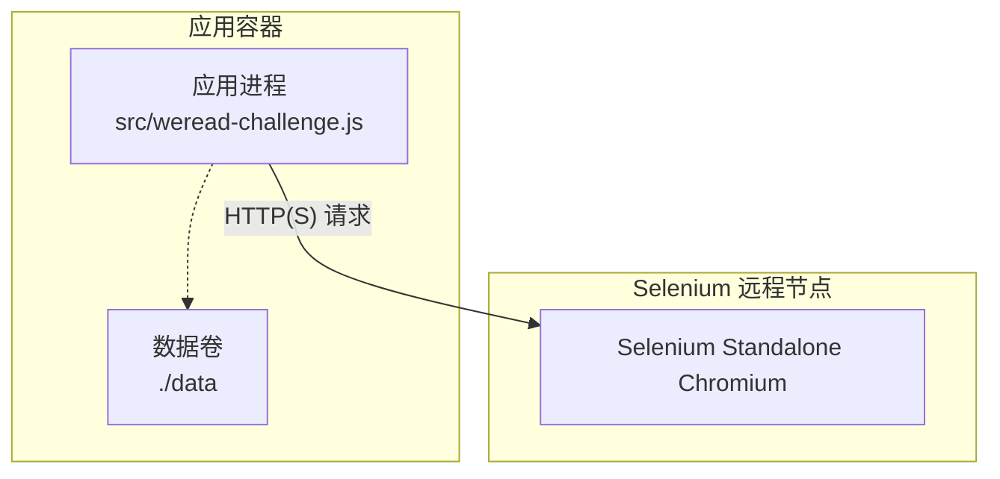
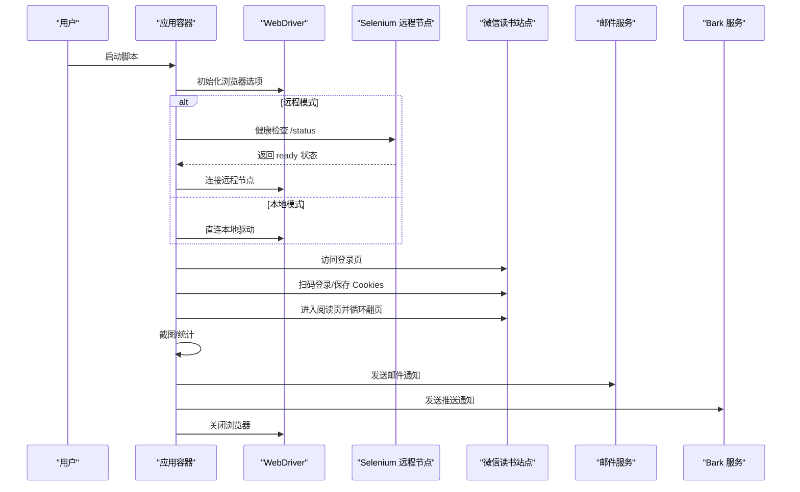
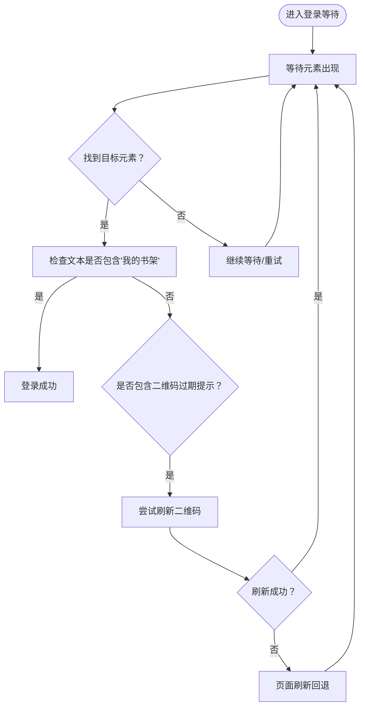
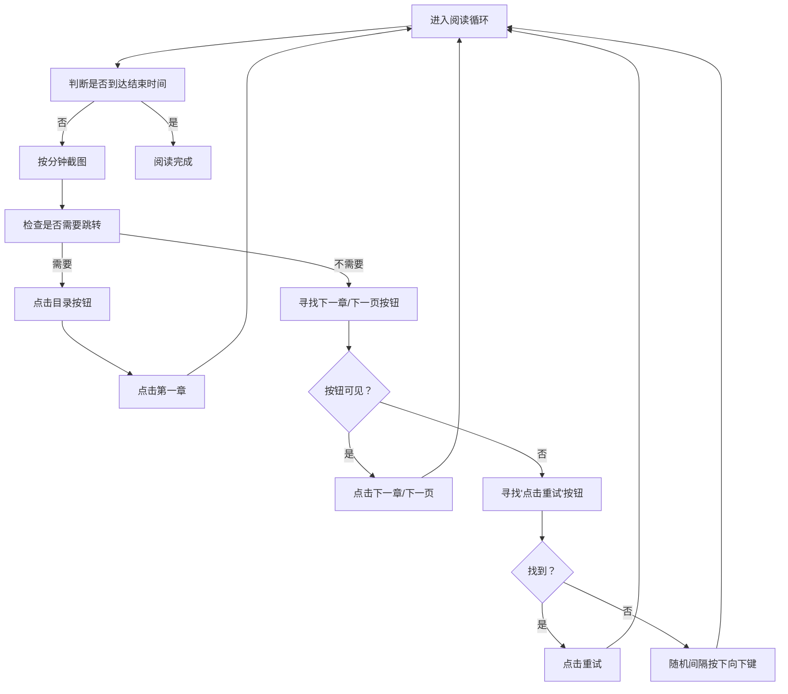
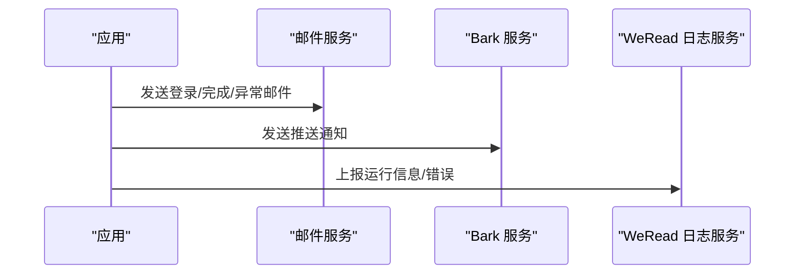
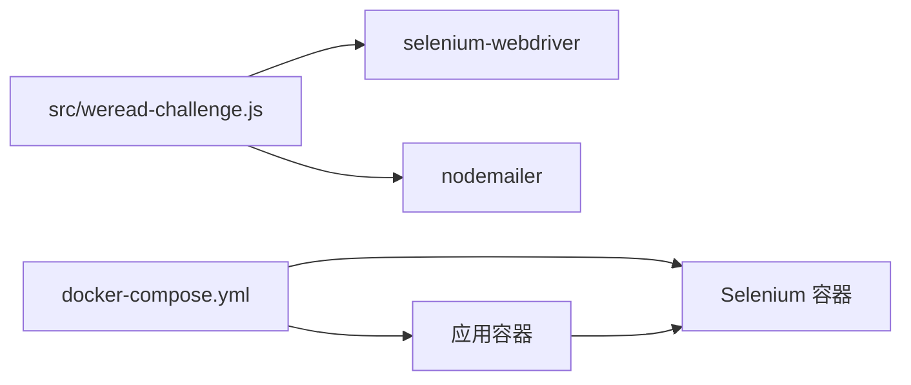

# 故障排除

<cite>
**本文引用的文件**
- [README.md](file://README.md)
- [README-dev.md](file://README-dev.md)
- [package.json](file://package.json)
- [Dockerfile](file://Dockerfile)
- [docker-compose.yml](file://docker-compose.yml)
- [src/weread-challenge.js](file://src/weread-challenge.js)
- [AGENTS.md](file://AGENTS.md)
</cite>

## 目录
1. [简介](#简介)
2. [项目结构](#项目结构)
3. [核心组件](#核心组件)
4. [架构总览](#架构总览)
5. [详细组件分析](#详细组件分析)
6. [依赖关系分析](#依赖关系分析)
7. [性能考虑](#性能考虑)
8. [故障排除指南](#故障排除指南)
9. [结论](#结论)
10. [附录](#附录)

## 简介
本故障排除文档面向 WeRead 挑战赛自动化项目使用者与维护者，聚焦于登录失败、阅读异常、通知发送失败等常见问题的诊断与修复路径。文档提供系统化的调试工具使用指南、日志分析技巧、性能监控方法、错误代码对照表、常见错误模式识别与预防措施，并给出紧急情况下的应急处理流程与数据恢复方案，帮助用户快速定位并解决问题。

## 项目结构
该项目是一个基于 Node.js 的自动化脚本，使用 Selenium WebDriver 控制浏览器完成登录、阅读、截图与通知推送。项目采用 Docker 化部署，Selenium Standalone Chromium 作为远程浏览器节点，支持本地与远程两种运行模式。

图表来源
- [docker-compose.yml](file://docker-compose.yml#L1-L32)
- [src/weread-challenge.js](file://src/weread-challenge.js#L745-L828)

章节来源
- [README.md](file://README.md)
- [docker-compose.yml](file://docker-compose.yml#L1-L32)
- [Dockerfile](file://Dockerfile#L1-L8)
- [package.json](file://package.json#L1-L10)

## 核心组件
- 自动化主流程：负责浏览器初始化、登录、阅读循环、截图、通知与日志上报。
- 诊断与健康检查：对远程 Selenium 节点进行健康检查，收集容器日志。
- 通知系统：支持邮件与 Bark 推送。
- 日志系统：统一输出到控制台与文件，便于离线分析。

章节来源
- [src/weread-challenge.js](file://src/weread-challenge.js#L94-L232)
- [src/weread-challenge.js](file://src/weread-challenge.js#L572-L665)
- [src/weread-challenge.js](file://src/weread-challenge.js#L667-L743)
- [src/weread-challenge.js](file://src/weread-challenge.js#L63-L92)

## 架构总览
整体运行时由应用容器与 Selenium 容器组成，应用通过 HTTP(S) 与远程浏览器节点通信。应用在启动时根据环境变量决定本地或远程模式，并在登录、阅读、异常等关键阶段进行诊断与通知。

图表来源
- [src/weread-challenge.js](file://src/weread-challenge.js#L745-L828)
- [src/weread-challenge.js](file://src/weread-challenge.js#L847-L970)
- [src/weread-challenge.js](file://src/weread-challenge.js#L1074-L1220)
- [src/weread-challenge.js](file://src/weread-challenge.js#L572-L665)
- [src/weread-challenge.js](file://src/weread-challenge.js#L667-L743)

## 详细组件分析

### 登录流程与二维码刷新
- 登录检测：通过“我的书架”或“点击刷新二维码”等文本判断登录状态。
- 二维码刷新：提供多种定位策略与回退方案，失败时尝试脚本触发与页面刷新。
- Cookie 管理：登录成功后保存/加载 Cookie，减少重复扫码。

图表来源
- [src/weread-challenge.js](file://src/weread-challenge.js#L896-L957)

章节来源
- [src/weread-challenge.js](file://src/weread-challenge.js#L896-L957)
- [src/weread-challenge.js](file://src/weread-challenge.js#L489-L570)
- [src/weread-challenge.js](file://src/weread-challenge.js#L849-L852)

### 阅读循环与异常处理
- 阅读时长：由环境变量控制，按分钟计数并定时截图。
- 异常检测：当页面标题包含“已读完”、出现“开通后即可阅读”或“全 书 完”等提示时，自动跳转至目录并重新开始阅读。
- 键盘模拟：随机间隔按下向下键，模拟人工翻页。
- 异常捕获：统一捕获错误并调用诊断工具与通知。

图表来源
- [src/weread-challenge.js](file://src/weread-challenge.js#L1088-L1220)

章节来源
- [src/weread-challenge.js](file://src/weread-challenge.js#L1088-L1220)

### 通知与日志上报
- 邮件通知：基于 nodemailer，支持附件截图，自动判断 SSL 端口。
- Bark 推送：通过 HTTP(S) 请求向 Bark 服务推送消息。
- WeRead 日志上报：在同意条款时，将运行信息与错误上报至服务端。

图表来源
- [src/weread-challenge.js](file://src/weread-challenge.js#L572-L665)
- [src/weread-challenge.js](file://src/weread-challenge.js#L667-L743)
- [src/weread-challenge.js](file://src/weread-challenge.js#L249-L303)

章节来源
- [src/weread-challenge.js](file://src/weread-challenge.js#L572-L665)
- [src/weread-challenge.js](file://src/weread-challenge.js#L667-L743)
- [src/weread-challenge.js](file://src/weread-challenge.js#L249-L303)

## 依赖关系分析
- 应用依赖：
  - selenium-webdriver：浏览器驱动与操作。
  - nodemailer：邮件发送。
- 运行时依赖：
  - Docker Compose：编排应用与 Selenium。
  - Selenium Standalone Chromium：远程浏览器节点。
- 环境变量：
  - 远程浏览器连接、阅读时长、浏览器类型、通知开关、截图开关、端口、Bark 配置等。

图表来源
- [package.json](file://package.json#L5-L8)
- [docker-compose.yml](file://docker-compose.yml#L1-L32)
- [src/weread-challenge.js](file://src/weread-challenge.js#L10-L17)

章节来源
- [package.json](file://package.json#L1-L10)
- [docker-compose.yml](file://docker-compose.yml#L1-L32)

## 性能考虑
- 页面加载与脚本超时：全局设置了隐式等待、页面加载与脚本执行超时，避免单次命令长时间挂起。
- 随机滚动：模拟人类行为，降低被风控概率。
- 截图频率：按分钟截图，可根据需求调整以平衡存储与可观测性。
- 远程节点健康检查：启动前检查远程节点状态，减少无效连接。

章节来源
- [src/weread-challenge.js](file://src/weread-challenge.js#L830-L835)
- [src/weread-challenge.js](file://src/weread-challenge.js#L1090-L1096)
- [src/weread-challenge.js](file://src/weread-challenge.js#L125-L152)

## 故障排除指南

### 通用排查步骤
- 检查日志：查看 data/output.log 与 selenium 容器日志，定位异常时间点与错误栈。
- 确认远程节点：使用健康检查函数或 curl 验证 /status。
- 验证环境变量：核对 WEREAD_REMOTE_BROWSER、EMAIL_*、BARK_*、WEREAD_* 等。
- 重启服务：停止并重新启动应用与 Selenium 容器，清理临时文件。

章节来源
- [src/weread-challenge.js](file://src/weread-challenge.js#L224-L232)
- [src/weread-challenge.js](file://src/weread-challenge.js#L125-L152)
- [docker-compose.yml](file://docker-compose.yml#L27-L31)

### 登录失败
- 症状
  - 无法找到“我的书架”或“点击刷新二维码”元素。
  - 二维码过期提示频繁出现。
- 可能原因
  - 远程节点不可用或网络不通。
  - 登录页面结构变化导致定位失败。
  - Cookie 未正确保存/加载。
- 修复步骤
  - 使用健康检查函数验证远程节点状态。
  - 手动访问登录页，确认二维码是否正常显示。
  - 清理 data/cookies.json 后重新扫码登录。
  - 调整 WEREAD_SPEED 与 WEREAD_DURATION，减少页面压力。
  - 如仍失败，启用 DEBUG 并收集诊断日志。

章节来源
- [src/weread-challenge.js](file://src/weread-challenge.js#L896-L957)
- [src/weread-challenge.js](file://src/weread-challenge.js#L125-L152)
- [src/weread-challenge.js](file://src/weread-challenge.js#L849-L852)

### 阅读异常
- 症状
  - 页面空白或截图过小，自动刷新。
  - “已读完”、“开通后即可阅读”等提示导致循环卡死。
  - “下一章/下一页”按钮不可见或点击失败。
- 可能原因
  - 页面渲染延迟或网络抖动。
  - DOM 结构变化导致定位失败。
  - 阅读速度过快导致页面未就绪。
- 修复步骤
  - 调整 WEREAD_SPEED 为 normal 或 slow。
  - 增大页面加载超时与隐式等待。
  - 在异常检测分支增加更多容错与重试。
  - 对“下一章/下一页”按钮增加可见性校验与滚动对齐。

章节来源
- [src/weread-challenge.js](file://src/weread-challenge.js#L1110-L1126)
- [src/weread-challenge.js](file://src/weread-challenge.js#L1128-L1219)
- [src/weread-challenge.js](file://src/weread-challenge.js#L382-L414)

### 通知发送失败
- 邮件发送失败
  - 症状：控制台输出错误信息，邮件未送达。
  - 可能原因：SMTP 地址/端口/认证错误、网络阻断、附件过大。
  - 修复步骤：核对 EMAIL_SMTP、EMAIL_PORT、EMAIL_USER、EMAIL_PASS、EMAIL_TO；使用 465 端口自动启用 SSL；缩小附件或禁用截图。
- Bark 推送失败
  - 症状：返回非 2xx 状态码或请求异常。
  - 可能原因：BARK_KEY 未配置、网络问题、服务端限流。
  - 修复步骤：确认 BARK_KEY 与 BARK_SERVER；检查网络连通性；降低推送频率。

章节来源
- [src/weread-challenge.js](file://src/weread-challenge.js#L572-L665)
- [src/weread-challenge.js](file://src/weread-challenge.js#L667-L743)

### 远程节点问题
- 症状：连接超时、节点不可用、健康检查失败。
- 可能原因：容器未启动、端口映射错误、网络策略限制。
- 修复步骤：使用 compose 健康检查命令验证；检查容器日志；确认 DNS 与网络策略；必要时重建容器。

章节来源
- [docker-compose.yml](file://docker-compose.yml#L27-L31)
- [src/weread-challenge.js](file://src/weread-challenge.js#L125-L152)

### 数据与文件问题
- 症状：缺少 cookies.json、login.png、output.log。
- 可能原因：首次运行未生成、权限不足、卷挂载异常。
- 修复步骤：确认 data 卷挂载；检查文件权限；删除旧文件后重新运行。

章节来源
- [src/weread-challenge.js](file://src/weread-challenge.js#L57-L60)
- [AGENTS.md](file://AGENTS.md#L4-L6)

### 调试工具与日志分析
- 启用调试
  - 设置 DEBUG=true，保留控制台输出与文件日志。
- 收集诊断
  - 调用诊断函数，自动检查远程节点健康并抓取容器日志。
- 日志分析
  - 关注时间戳、错误栈、网络请求状态码、截图大小阈值。
  - 使用 grep 定位关键字：登录、二维码、异常、通知、健康检查。

章节来源
- [src/weread-challenge.js](file://src/weread-challenge.js#L224-L232)
- [src/weread-challenge.js](file://src/weread-challenge.js#L63-L92)
- [README-dev.md](file://README-dev.md#L1-L14)

### 常见错误模式与预防
- 模式一：二维码过期循环
  - 现象：反复刷新二维码但未出现新元素。
  - 预防：增加刷新后等待与截图确认；必要时强制页面刷新。
- 模式二：页面空白/截图过小
  - 现象：截图小于阈值，自动刷新。
  - 预防：增大等待时间，检查网络与渲染。
- 模式三：通知失败
  - 现象：邮件/推送失败。
  - 预防：提前验证凭据与网络；降级通知策略。

章节来源
- [src/weread-challenge.js](file://src/weread-challenge.js#L934-L956)
- [src/weread-challenge.js](file://src/weread-challenge.js#L1110-L1126)
- [src/weread-challenge.js](file://src/weread-challenge.js#L572-L665)

### 应急处理流程
- 立即行动
  - 停止当前任务，退出浏览器。
  - 收集诊断日志与 selenium 容器日志。
  - 发送“项目停滞”通知给相关人员。
- 恢复运行
  - 清理 data/ 下临时文件。
  - 重启应用与 Selenium 容器。
  - 逐步降低 WEREAD_DURATION 与 WEREAD_SPEED，观察稳定性。
- 数据恢复
  - 备份 data/ 目录，确保 cookies.json 与截图可恢复。
  - 使用不同账户轮换，避免单一账户被风控。

章节来源
- [src/weread-challenge.js](file://src/weread-challenge.js#L1240-L1275)
- [AGENTS.md](file://AGENTS.md#L32-L34)

## 结论
通过系统化的诊断工具、完善的日志体系与通知机制，WeRead 挑战赛自动化项目能够在复杂环境中稳定运行。遇到问题时，建议优先检查远程节点健康、登录流程与通知配置，再结合日志与截图进行深入分析。遵循本文提供的应急流程与预防措施，可显著提升问题定位与恢复效率。

## 附录

### 环境变量对照表
- WEREAD_REMOTE_BROWSER：远程浏览器节点地址（可选）
- WEREAD_DURATION：阅读时长（分钟）
- WEREAD_BROWSER：浏览器类型（chrome/edge/firefox/safari）
- ENABLE_EMAIL：是否启用邮件通知
- WEREAD_SCREENSHOT：是否每分钟截图
- WEREAD_AGREE_TERMS：是否同意条款并上报日志
- EMAIL_SMTP/EMAIL_PORT/EMAIL_USER/EMAIL_PASS/EMAIL_FROM/EMAIL_TO：邮件配置
- BARK_KEY/BARK_SERVER：Bark 推送配置
- DEBUG：启用调试模式

章节来源
- [src/weread-challenge.js](file://src/weread-challenge.js#L29-L55)
- [docker-compose.yml](file://docker-compose.yml#L5-L7)

### 错误代码与状态码参考
- HTTP(S) 请求状态码：2xx 表示成功，其他表示失败。
- 邮件发送：nodemailer 抛出异常或返回错误对象。
- Bark 推送：非 2xx 状态码表示失败。
- WeRead 日志上报：非 2xx 表示上报失败。

章节来源
- [src/weread-challenge.js](file://src/weread-challenge.js#L104-L123)
- [src/weread-challenge.js](file://src/weread-challenge.js#L572-L665)
- [src/weread-challenge.js](file://src/weread-challenge.js#L667-L743)
- [src/weread-challenge.js](file://src/weread-challenge.js#L279-L302)