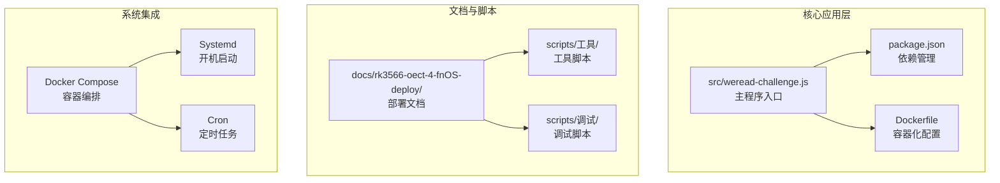
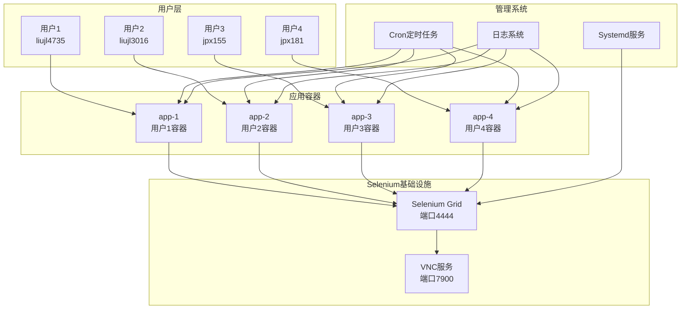
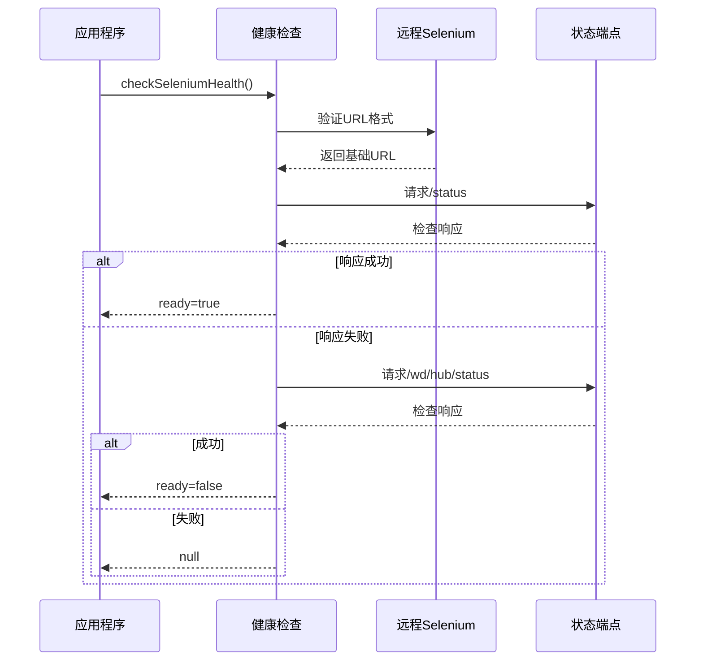
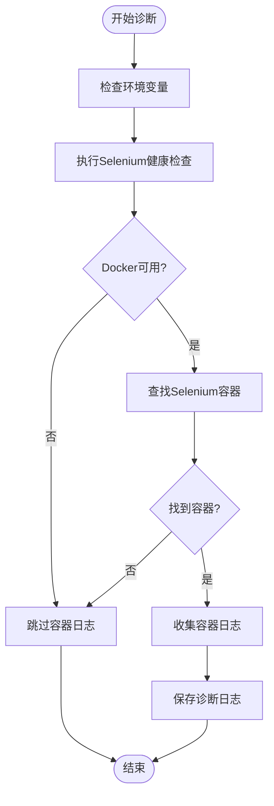
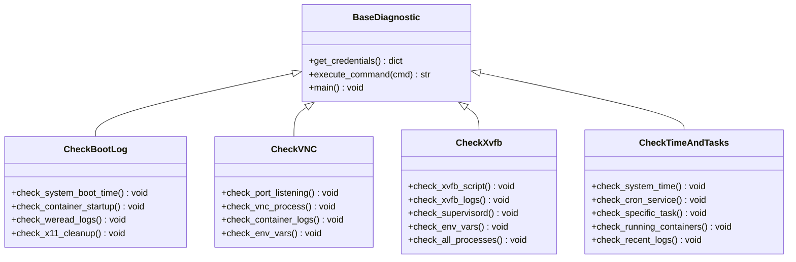
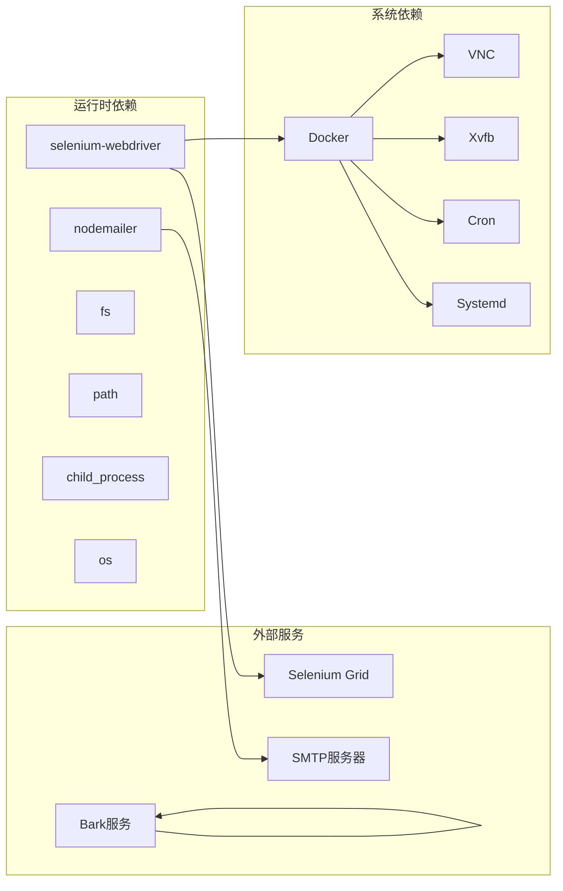
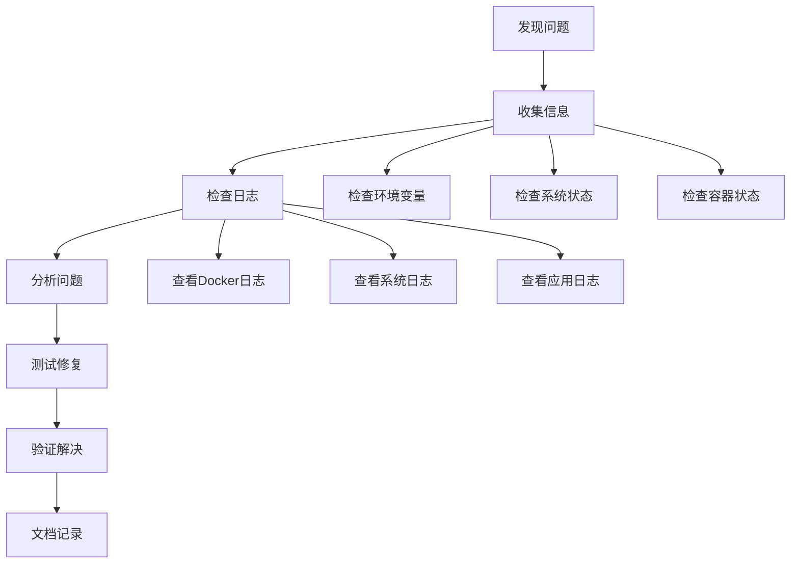

# 故障排除系统

<cite>
**本文档引用的文件**
- [src/weread-challenge.js](file://src/weread-challenge.js)
- [package.json](file://package.json)
- [Dockerfile](file://Dockerfile)
- [README-dev.md](file://README-dev.md)
- [docs/rk3566-oect-4-fnOS-deploy/README.md](file://docs/rk3566-oect-4-fnOS-deploy/README.md)
- [docs/rk3566-oect-4-fnOS-deploy/scripts/工具/check_boot_log.py](file://docs/rk3566-oect-4-fnOS-deploy/scripts/工具/check_boot_log.py)
- [docs/rk3566-oect-4-fnOS-deploy/scripts/工具/check_containers.py](file://docs/rk3566-oect-4-fnOS-deploy/scripts/工具/check_containers.py)
- [docs/rk3566-oect-4-fnOS-deploy/scripts/调试/check_vnc.py](file://docs/rk3566-oect-4-fnOS-deploy/scripts/调试/check_vnc.py)
- [docs/rk3566-oect-4-fnOS-deploy/scripts/调试/check_xvfb.py](file://docs/rk3566-oect-4-fnOS-deploy/scripts/调试/check_xvfb.py)
- [docs/rk3566-oect-4-fnOS-deploy/scripts/工具/check_time_and_tasks.py](file://docs/rk3566-oect-4-fnOS-deploy/scripts/工具/check_time_and_tasks.py)
- [docs/rk3566-oect-4-fnOS-deploy/scripts/工具/setup-autostart.sh](file://docs/rk3566-oect-4-fnOS-deploy/scripts/工具/setup-autostart.sh)
</cite>

## 目录
1. [简介](#简介)
2. [项目结构](#项目结构)
3. [核心组件](#核心组件)
4. [架构概览](#架构概览)
5. [详细组件分析](#详细组件分析)
6. [依赖关系分析](#依赖关系分析)
7. [性能考虑](#性能考虑)
8. [故障排除指南](#故障排除指南)
9. [结论](#结论)

## 简介

这是一个基于Selenium WebDriver的微信读书挑战自动化系统，专门设计用于在RK3566设备上进行多用户分时复用的自动化阅读。该系统实现了完整的故障排除机制，包括健康检查、日志收集、诊断信息提取和自动恢复功能。

系统采用Docker容器化部署，支持4个用户在不同时间段内分时使用同一套Selenium基础设施，实现了资源的最大化利用和成本优化。

## 项目结构



**图表来源**
- [src/weread-challenge.js:1-50](file://src/weread-challenge.js#L1-L50)
- [package.json:1-10](file://package.json#L1-L10)
- [Dockerfile:1-8](file://Dockerfile#L1-L8)

**章节来源**
- [src/weread-challenge.js:1-100](file://src/weread-challenge.js#L1-L100)
- [package.json:1-10](file://package.json#L1-L10)
- [Dockerfile:1-8](file://Dockerfile#L1-L8)

## 核心组件

### 主要功能模块

系统包含以下核心功能模块：

1. **Selenium WebDriver集成** - 支持Chrome、Firefox、Edge和Safari浏览器
2. **健康检查系统** - 自动检测Selenium Grid状态
3. **日志收集系统** - 捕获容器和系统日志
4. **故障诊断引擎** - 自动分析和报告问题
5. **通知系统** - 支持邮件和Bark推送通知
6. **容器管理** - Docker容器生命周期管理

### 环境配置

系统通过环境变量进行灵活配置：

- `WEREAD_REMOTE_BROWSER` - 远程Selenium Grid地址
- `WEREAD_DURATION` - 阅读持续时间（分钟）
- `WEREAD_SPEED` - 阅读速度（slow/normal/fast）
- `ENABLE_EMAIL` - 启用邮件通知
- `WEREAD_SCREENSHOT` - 启用截图功能

**章节来源**
- [src/weread-challenge.js:23-55](file://src/weread-challenge.js#L23-L55)
- [src/weread-challenge.js:745-828](file://src/weread-challenge.js#L745-L828)

## 架构概览



**图表来源**
- [docs/rk3566-oect-4-fnOS-deploy/README.md:395-401](file://docs/rk3566-oect-4-fnOS-deploy/README.md#L395-L401)
- [docs/rk3566-oect-4-fnOS-deploy/README.md:549-560](file://docs/rk3566-oect-4-fnOS-deploy/README.md#L549-L560)

## 详细组件分析

### Selenium健康检查系统



**图表来源**
- [src/weread-challenge.js:125-152](file://src/weread-challenge.js#L125-L152)

健康检查系统提供多级容错机制：

1. **URL验证** - 确保远程Selenium地址格式正确
2. **端点探测** - 优先检查`/status`端点
3. **兼容性处理** - 回退到`/wd/hub/status`端点
4. **状态解析** - 解析`ready`字段判断健康状态

**章节来源**
- [src/weread-challenge.js:125-152](file://src/weread-challenge.js#L125-L152)

### 日志收集与诊断系统



**图表来源**
- [src/weread-challenge.js:224-232](file://src/weread-challenge.js#L224-L232)
- [src/weread-challenge.js:186-222](file://src/weread-challenge.js#L186-L222)

诊断系统包含以下功能：

1. **自动健康检查** - 在错误发生时自动检查Selenium状态
2. **容器日志收集** - 收集所有Selenium相关容器的日志
3. **时间戳标记** - 为诊断文件添加精确的时间戳
4. **错误信息记录** - 记录导致故障的具体原因

**章节来源**
- [src/weread-challenge.js:224-232](file://src/weread-challenge.js#L224-L232)
- [src/weread-challenge.js:186-222](file://src/weread-challenge.js#L186-L222)

### 多用户容器管理

系统支持4个用户在不同时间段内分时使用：

| 用户 | 容器名称 | 定时规则 | 阅读时间 |
|------|----------|----------|----------|
| liujl4735 | app-1 | `0 0,6,13,19 * * *` | 00:00, 06:00, 13:00, 19:00 |
| liujl3016 | app-2 | `10 1,7,14,20 * * *` | 01:10, 07:10, 14:10, 20:10 |
| jpx155 | app-3 | `20 2,8,15,21 * * *` | 02:20, 08:20, 15:20, 21:20 |
| jpx181 | app-4 | `30 3,9,16,22 * * *` | 03:30, 09:30, 16:30, 22:30 |

**章节来源**
- [docs/rk3566-oect-4-fnOS-deploy/README.md:395-401](file://docs/rk3566-oect-4-fnOS-deploy/README.md#L395-L401)

### Python故障排除脚本

系统提供了完整的Python故障排除工具集：



**图表来源**
- [docs/rk3566-oect-4-fnOS-deploy/scripts/工具/check_boot_log.py:1-66](file://docs/rk3566-oect-4-fnOS-deploy/scripts/工具/check_boot_log.py#L1-L66)
- [docs/rk3566-oect-4-fnOS-deploy/scripts/调试/check_vnc.py:1-75](file://docs/rk3566-oect-4-fnOS-deploy/scripts/调试/check_vnc.py#L1-L75)
- [docs/rk3566-oect-4-fnOS-deploy/scripts/调试/check_xvfb.py:1-72](file://docs/rk3566-oect-4-fnOS-deploy/scripts/调试/check_xvfb.py#L1-L72)
- [docs/rk3566-oect-4-fnOS-deploy/scripts/工具/check_time_and_tasks.py:1-83](file://docs/rk3566-oect-4-fnOS-deploy/scripts/工具/check_time_and_tasks.py#L1-L83)

**章节来源**
- [docs/rk3566-oect-4-fnOS-deploy/scripts/工具/check_boot_log.py:1-66](file://docs/rk3566-oect-4-fnOS-deploy/scripts/工具/check_boot_log.py#L1-L66)
- [docs/rk3566-oect-4-fnOS-deploy/scripts/调试/check_vnc.py:1-75](file://docs/rk3566-oect-4-fnOS-deploy/scripts/调试/check_vnc.py#L1-L75)
- [docs/rk3566-oect-4-fnOS-deploy/scripts/调试/check_xvfb.py:1-72](file://docs/rk3566-oect-4-fnOS-deploy/scripts/调试/check_xvfb.py#L1-L72)
- [docs/rk3566-oect-4-fnOS-deploy/scripts/工具/check_time_and_tasks.py:1-83](file://docs/rk3566-oect-4-fnOS-deploy/scripts/工具/check_time_and_tasks.py#L1-L83)

## 依赖关系分析



**图表来源**
- [package.json:5-8](file://package.json#L5-L8)
- [src/weread-challenge.js:10-18](file://src/weread-challenge.js#L10-L18)

系统依赖关系特点：

1. **轻量级依赖** - 仅使用必要的Node.js核心模块和两个第三方包
2. **容器化友好** - 完全基于Docker容器运行
3. **系统集成** - 深度集成Linux系统服务（Systemd、Cron）
4. **外部服务解耦** - 通过环境变量配置外部服务地址

**章节来源**
- [package.json:5-8](file://package.json#L5-L8)
- [src/weread-challenge.js:10-18](file://src/weread-challenge.js#L10-L18)

## 性能考虑

### 资源优化策略

1. **容器共享** - 4个用户共享同一套Selenium基础设施
2. **分时复用** - 通过定时任务实现用户间的资源隔离
3. **智能重启** - 容器异常时自动重启，减少人工干预
4. **日志轮转** - 定期清理日志文件，控制磁盘使用

### 性能监控指标

- **启动时间** - 系统启动到浏览器就绪约4分钟
- **内存使用** - 每个用户容器平均占用内存较小
- **CPU效率** - 通过分时调度最大化CPU利用率
- **网络带宽** - 单用户网络使用量较低

## 故障排除指南

### 常见问题及解决方案

#### 容器启动失败

**症状**：`docker ps`显示容器状态异常

**诊断步骤**：
1. 检查容器日志：`docker compose logs selenium`
2. 验证Docker服务状态：`systemctl status docker`
3. 检查磁盘空间：`df -h`

**解决方案**：
```bash
# 重启Docker服务
sudo systemctl restart docker

# 清理停止的容器
docker container prune

# 重新创建容器
docker compose up -d selenium
```

#### VNC连接问题

**症状**：无法通过VNC访问浏览器界面

**诊断脚本**：
```python
# 检查VNC端口监听
netstat -tlnp | grep 7900

# 检查VNC进程
docker exec weread-challenge-selenium-muti-user ps aux | grep -i vnc
```

**解决方案**：
1. 重启Selenium容器
2. 检查防火墙设置
3. 验证VNC密码配置

#### 定时任务未执行

**症状**：用户容器未按时启动

**诊断步骤**：
1. 检查Cron服务状态：`systemctl status cron`
2. 验证crontab配置：`crontab -l`
3. 检查系统时间同步

**解决方案**：
```bash
# 重启Cron服务
sudo systemctl restart cron

# 重新加载crontab
crontab /vol1/docker/mycontainers/weread-challenge-selenium-muti-user/crontab

# 检查任务执行历史
grep CRON /var/log/syslog | tail -10
```

#### 系统启动问题

**症状**：系统重启后Selenium未自动启动

**诊断脚本**：
```python
# 检查开机启动日志
logread | grep -i weread | tail -10

# 检查X11清理日志
logread | grep -i "Cleaned\|X11" | tail -5
```

**解决方案**：
1. 检查systemd服务状态：`systemctl status weread-selenium.service`
2. 验证服务配置：`cat /etc/systemd/system/weread-selenium.service`
3. 重新启用服务：`systemctl enable weread-selenium.service`

### 诊断工具使用

#### 系统化故障排除流程



#### Python诊断脚本使用

所有Python诊断脚本遵循统一的使用模式：

1. **配置凭据** - 编辑`password.csv`文件
2. **执行脚本** - 运行相应的诊断脚本
3. **分析结果** - 查看输出的诊断信息
4. **采取行动** - 根据诊断结果执行修复操作

**章节来源**
- [docs/rk3566-oect-4-fnOS-deploy/README.md:429-541](file://docs/rk3566-oect-4-fnOS-deploy/README.md#L429-L541)

### 最佳实践

1. **预防性维护**
   - 定期检查系统资源使用情况
   - 监控容器健康状态
   - 验证网络连接稳定性

2. **快速响应机制**
   - 建立24/7监控体系
   - 准备标准修复流程
   - 维护知识库文档

3. **持续改进**
   - 定期回顾故障案例
   - 优化系统配置
   - 更新故障排除程序

## 结论

这个故障排除系统展现了现代容器化应用的完整运维解决方案。通过将自动化、诊断和恢复功能深度集成，系统实现了：

1. **主动防护** - 通过健康检查和监控预防问题发生
2. **自动恢复** - 在出现问题时自动尝试修复
3. **全面诊断** - 提供多层次的问题分析能力
4. **可视化管理** - 通过Python脚本提供直观的诊断界面

系统的多用户分时复用架构不仅提高了资源利用率，还为大规模部署提供了可扩展的基础。完善的故障排除机制确保了系统的高可用性和可靠性，为类似的企业级自动化项目提供了优秀的参考范例。

通过持续的监控、诊断和优化，这个系统能够长期稳定运行，为企业提供可靠的自动化服务支撑。