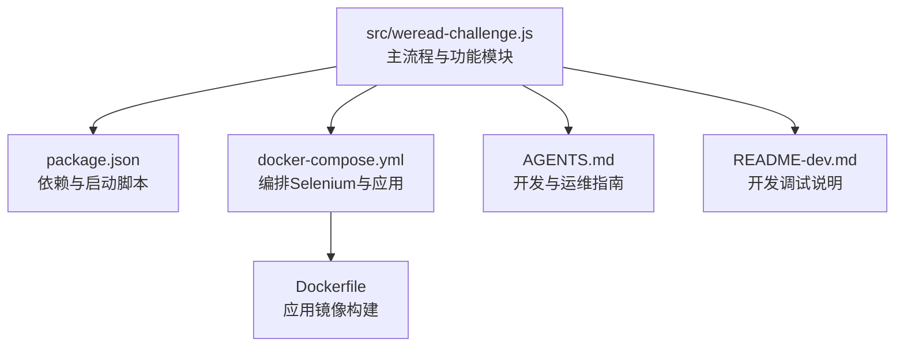
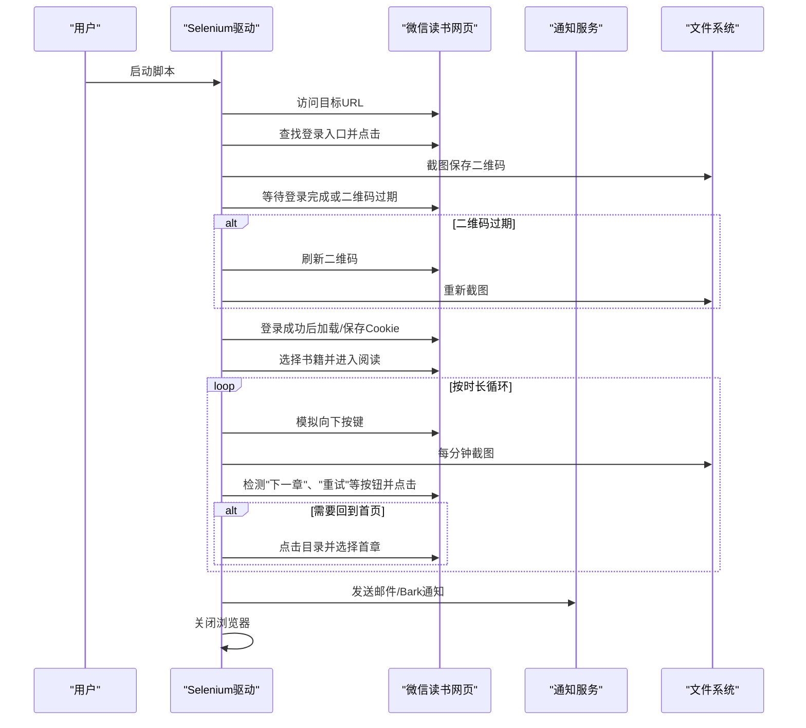
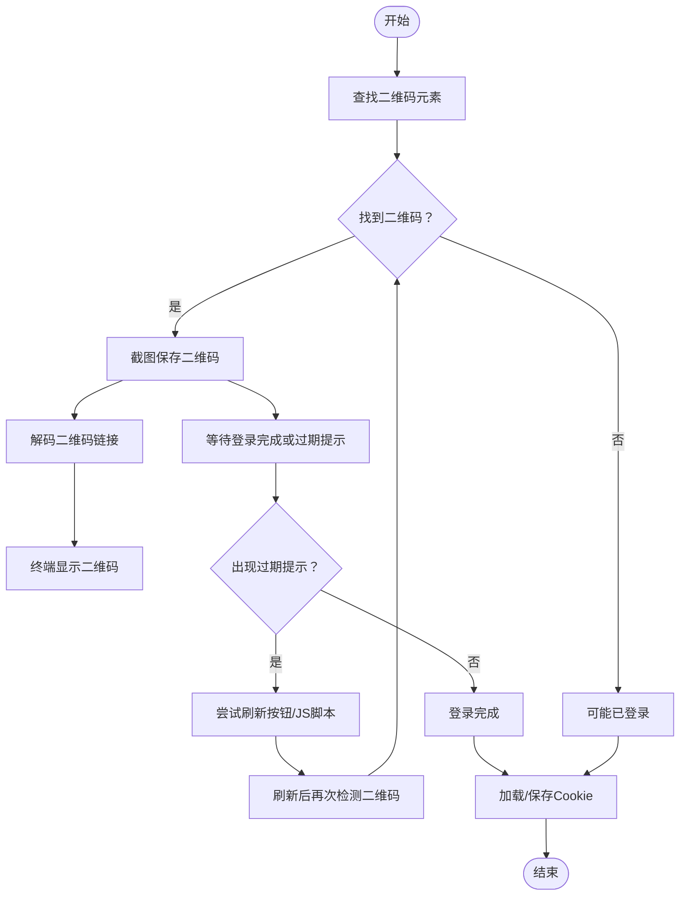
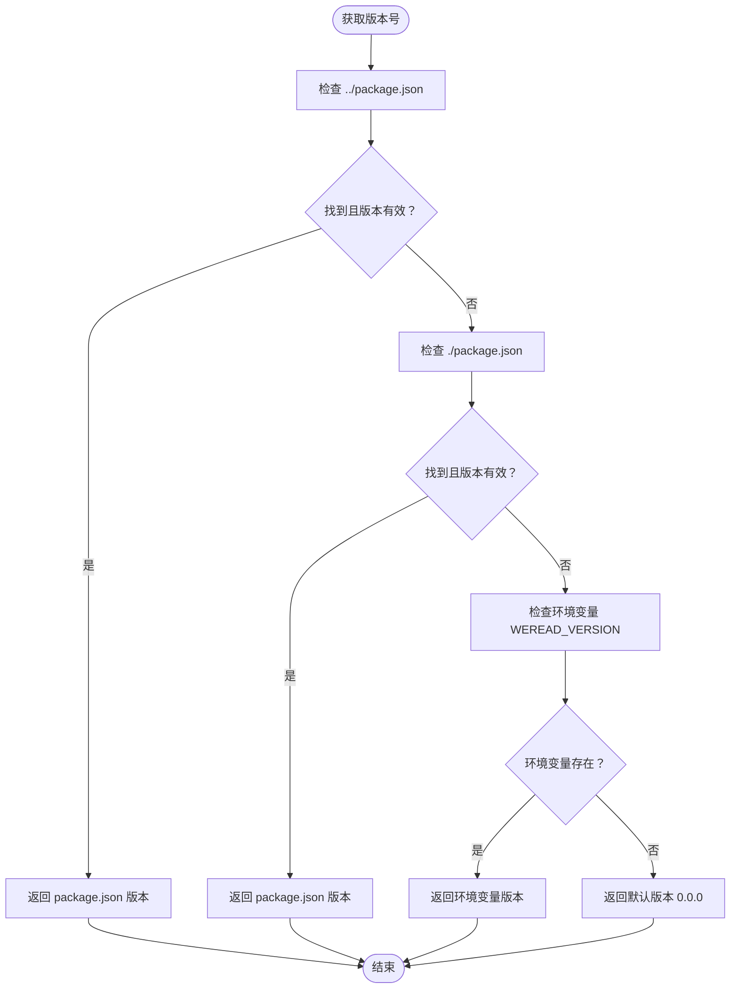
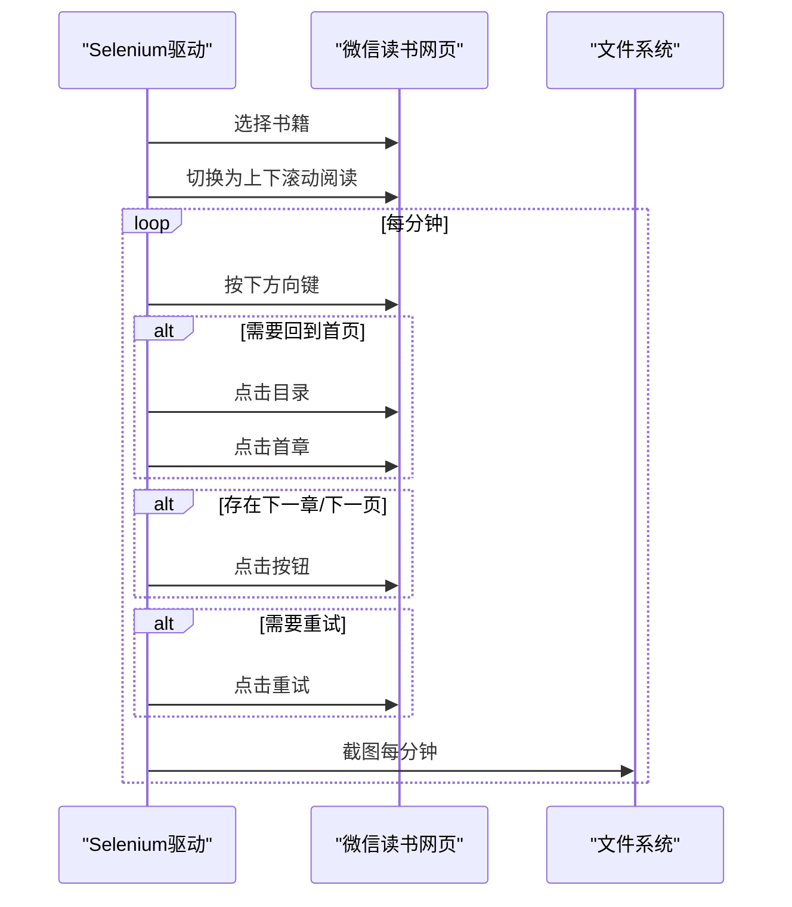
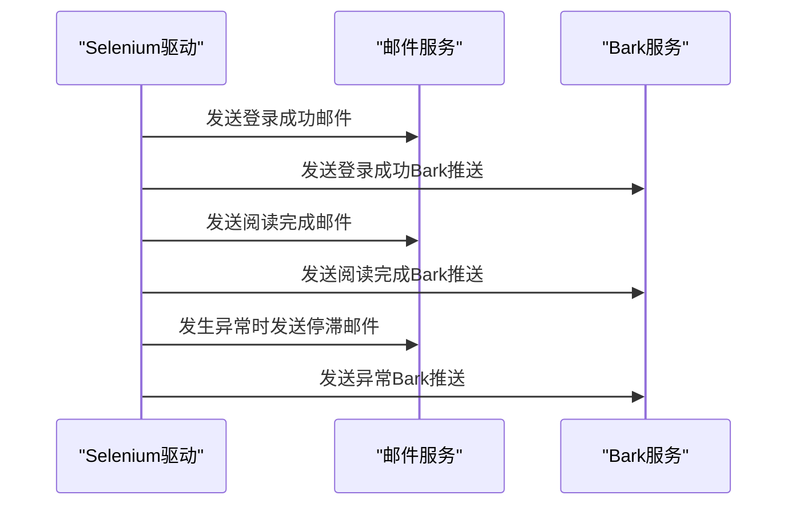
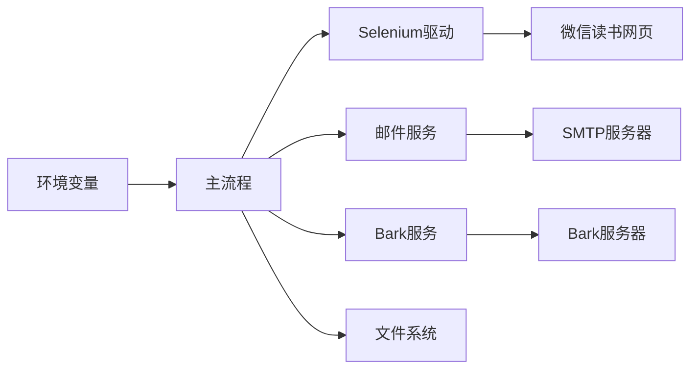

# 核心功能详解

<cite>
**本文引用的文件**
- [src/weread-challenge.js](file://src/weread-challenge.js)
- [package.json](file://package.json)
- [docker-compose.yml](file://docker-compose.yml)
- [Dockerfile](file://Dockerfile)
- [README-dev.md](file://README-dev.md)
- [AGENTS.md](file://AGENTS.md)
</cite>

## 更新摘要
**变更内容**
- 新增二维码登录系统的完整功能描述，包括动态版本管理和二维码处理流程
- 更新自动登录系统章节，详细说明二维码生成、检测、刷新机制
- 新增动态版本管理系统说明，包括版本获取策略和环境变量覆盖
- 更新二维码处理流程的实现细节和错误处理机制

## 目录
1. [简介](#简介)
2. [项目结构](#项目结构)
3. [核心组件](#核心组件)
4. [架构总览](#架构总览)
5. [详细组件分析](#详细组件分析)
6. [依赖关系分析](#依赖关系分析)
7. [性能考量](#性能考量)
8. [故障排查指南](#故障排查指南)
9. [结论](#结论)
10. [附录](#附录)

## 简介
本项目是 WeRead 挑战赛自动化脚本，目标是在微信读书网页端自动完成登录、书籍选择、章节导航与阅读行为模拟，并在关键节点进行截图与通知推送（邮件与 Bark）。项目基于 Selenium WebDriver 实现跨浏览器自动化，支持本地与远程（Docker/Selenium Grid）两种运行模式，具备完善的日志与诊断能力，便于在 CI/CD 环境中稳定运行。

## 项目结构
- 核心逻辑集中在 src/weread-challenge.js，包含登录流程、阅读循环、截图与通知等模块化函数。
- package.json 定义了启动脚本与依赖（selenium-webdriver、nodemailer）。
- docker-compose.yml 与 Dockerfile 提供容器化部署，一键拉起应用与 Selenium Standalone 容器。
- AGENTS.md 与 README-dev.md 提供开发与运维指南。

**图表来源**
- [src/weread-challenge.js](file://src/weread-challenge.js#L1-L1330)
- [package.json](file://package.json#L1-L31)
- [docker-compose.yml](file://docker-compose.yml#L1-L32)
- [Dockerfile](file://Dockerfile#L1-L8)
- [AGENTS.md](file://AGENTS.md#L1-L34)
- [README-dev.md](file://README-dev.md#L1-L14)

**章节来源**
- [src/weread-challenge.js](file://src/weread-challenge.js#L1-L1330)
- [package.json](file://package.json#L1-L31)
- [docker-compose.yml](file://docker-compose.yml#L1-L32)
- [Dockerfile](file://Dockerfile#L1-L8)
- [AGENTS.md](file://AGENTS.md#L1-L34)
- [README-dev.md](file://README-dev.md#L1-L14)

## 核心组件
- 自动登录系统：二维码生成与检测、Cookie 管理、登录等待与刷新。
- 阅读控制系统：书籍选择、章节导航、阅读行为模拟（按键与截图）。
- 通知系统：邮件与 Bark 推送。
- 诊断与健康检查：Selenium 健康检查、容器日志采集、错误上报。
- **动态版本管理系统**：自动版本检测与环境变量覆盖机制。

**章节来源**
- [src/weread-challenge.js](file://src/weread-challenge.js#L10-L60)
- [src/weread-challenge.js](file://src/weread-challenge.js#L416-L570)
- [src/weread-challenge.js](file://src/weread-challenge.js#L350-L371)
- [src/weread-challenge.js](file://src/weread-challenge.js#L572-L743)
- [src/weread-challenge.js](file://src/weread-challenge.js#L125-L232)
- [src/weread-challenge.js](file://src/weread-challenge.js#L20-L36)

## 架构总览
整体流程分为三阶段：
1) 启动与初始化：根据环境变量选择本地或远程浏览器，设置窗口尺寸与超时，访问目标站点。
2) 登录与会话：检测登录入口，保存二维码截图，等待登录完成；登录后加载/保存 Cookie。
3) 阅读与通知：进入阅读页，按配置进行书籍选择、章节导航、按键模拟与截图；结束时发送通知并退出。

**图表来源**
- [src/weread-challenge.js](file://src/weread-challenge.js#L794-L1330)

## 详细组件分析

### 自动登录系统
- 二维码生成与检测
  - 功能：在登录页查找二维码相关元素（图片或包含"扫码/二维码"的文本），保存截图以便用户扫码。
  - 定位策略：优先 XPath 匹配含"qr""二维码"等关键词的元素；若未找到则判定可能已登录。
  - 截图时机：二维码出现后延迟一段时间再截图，避免图片未完全渲染。
  - **新增**：支持二维码解码功能，使用 jsqr 库从截图中提取登录链接，并在终端显示二维码。
- 二维码刷新
  - 功能：当检测到"点击刷新二维码"等过期提示时，尝试多种定位器点击刷新按钮；若失败则回退到页面刷新。
  - 安全点击：提供多级点击策略（直接点击、JS 点击、Actions 移动点击），提升稳定性。
  - **增强**：支持多种刷新定位器组合，包括 CSS 选择器和 XPath 表达式，提高兼容性。
- Cookie 管理
  - 加载：启动时读取本地 cookies.json 并注入浏览器会话，刷新后生效。
  - 保存：登录成功后保存当前会话 Cookie，便于下次自动登录。
  - Safari 特殊处理：对 Safari 的 Cookie 设置 secure 标记以保证兼容性。

**图表来源**
- [src/weread-challenge.js](file://src/weread-challenge.js#L435-L570)
- [src/weread-challenge.js](file://src/weread-challenge.js#L350-L371)

**章节来源**
- [src/weread-challenge.js](file://src/weread-challenge.js#L435-L570)
- [src/weread-challenge.js](file://src/weread-challenge.js#L350-L371)

### 动态版本管理系统
- **新增功能**：自动版本检测与环境变量覆盖机制
- 版本获取策略：
  - 优先从 package.json 中读取版本号
  - 支持两种路径查找：../package.json 和 ./package.json
  - 如果 package.json 不存在或版本号为空，回退到环境变量 WEREAD_VERSION
  - 默认版本号为 "0.0.0"
- 版本使用场景：
  - 用于错误上报和遥测数据
  - 在 WeRead 服务器日志中记录脚本版本
  - 支持版本兼容性检查和问题追踪

**图表来源**
- [src/weread-challenge.js](file://src/weread-challenge.js#L20-L36)

**章节来源**
- [src/weread-challenge.js](file://src/weread-challenge.js#L20-L36)
- [package.json](file://package.json#L3)

### 阅读控制系统
- 书籍选择
  - 支持三种模式：
    - selection=-1：尝试打开特定书籍卡片；失败则回退到默认阅读链接。
    - selection=0：随机选择第 1~4 本书。
    - selection=N（1~N）：按序号选择对应书籍。
  - 容错：若未找到书籍或索引越界，回退到默认链接并等待标题匹配。
- 章节导航
  - 切换阅读模式：优先查找"切换到上下滚动阅读"按钮，兼容新旧版本定位。
  - 目录跳转：点击目录按钮，滚动到首章并点击第二项（第一项通常为当前章节）。
  - 下一章/下一页：检测可见的"下一章"或"下一页"按钮并点击。
  - 异常恢复：遇到"点击重试"或页面异常时自动点击重试。
- 阅读行为模拟
  - 按键模拟：周期性发送向下箭头键，按键时长随机，模拟自然阅读节奏。
  - 截图策略：每分钟截一张图，文件名包含分钟索引；若截图小于阈值则刷新页面。
  - 结束条件：到达设定时长后停止，保存最终 Cookie。

**图表来源**
- [src/weread-challenge.js](file://src/weread-challenge.js#L1127-L1271)

**章节来源**
- [src/weread-challenge.js](file://src/weread-challenge.js#L1032-L1271)

### 通知系统
- 邮件通知（SMTP/Nodemailer）
  - 配置项：SMTP 地址、端口、发件人、收件人、授权码、发件别名等。
  - 行为：登录成功/失败/完成时发送带截图附件的 HTML 邮件。
  - 安全：根据端口自动判断 SSL（465 使用 SSL）。
- Bark 推送
  - 配置项：Bark 密钥、服务器地址、声音、分组、图标、链接、级别等。
  - 行为：在脚本启动、登录成功/失败、阅读完成/异常时发送推送。

**图表来源**
- [src/weread-challenge.js](file://src/weread-challenge.js#L572-L743)

**章节来源**
- [src/weread-challenge.js](file://src/weread-challenge.js#L572-L743)

### 诊断与健康检查
- Selenium 健康检查：支持 /status 与 /wd/hub/status 两个端点，返回 ready 字段。
- 容器日志采集：在 Docker 环境下自动抓取运行中的 Selenium 容器日志并保存到 data 目录。
- 错误上报：向 WeRead 服务器上报 OS、浏览器、时长、通知开关、版本与错误信息。

**章节来源**
- [src/weread-challenge.js](file://src/weread-challenge.js#L125-L232)
- [src/weread-challenge.js](file://src/weread-challenge.js#L250-L303)

## 依赖关系分析
- 运行时依赖
  - selenium-webdriver：驱动浏览器自动化。
  - nodemailer：SMTP 邮件发送。
  - **新增**：jsqr、pngjs、qrcode-terminal 用于二维码处理和解码。
- 构建与运行
  - Docker Compose：编排应用与 Selenium Standalone 容器。
  - Node.js Alpine 镜像：轻量运行环境。
- 环境变量
  - 浏览器与远程节点：WEREAD_BROWSER、WEREAD_REMOTE_BROWSER。
  - 阅读参数：WEREAD_DURATION、WEREAD_SPEED、WEREAD_SELECTION、WEREAD_SCREENSHOT、WEREAD_AGREE_TERMS。
  - 邮件与 Bark：ENABLE_EMAIL、EMAIL_*、BARK_*。
  - 调试：DEBUG。
  - **新增**：WEREAD_VERSION 用于版本覆盖。

**图表来源**
- [src/weread-challenge.js](file://src/weread-challenge.js#L19-L60)
- [docker-compose.yml](file://docker-compose.yml#L1-L32)
- [package.json](file://package.json#L1-L31)

**章节来源**
- [src/weread-challenge.js](file://src/weread-challenge.js#L19-L60)
- [docker-compose.yml](file://docker-compose.yml#L1-L32)
- [package.json](file://package.json#L1-L31)

## 性能考量
- 浏览器参数优化：禁用沙箱、GPU、扩展与通知，减少资源占用。
- 随机化交互：按键时长与等待时间随机，降低被风控概率。
- 截图策略：仅在需要时截图，避免频繁 IO；对异常小尺寸截图进行页面刷新。
- 超时控制：统一设置隐式、页面加载与脚本超时，避免单次操作长时间挂起。
- 远程运行：通过 Docker 与 Selenium Grid 实现弹性扩展与资源隔离。
- **新增**：二维码处理优化：使用 jsqr 库进行高效二维码解码，支持多种格式。

**章节来源**
- [src/weread-challenge.js](file://src/weread-challenge.js#L780-L835)
- [src/weread-challenge.js](file://src/weread-challenge.js#L1088-L1126)

## 故障排查指南
- 登录失败
  - 现象：长时间未检测到"我的书架"，或二维码过期。
  - 处理：自动刷新二维码；若仍失败，发送邮件与 Bark 通知，并记录诊断信息。
  - **新增**：二维码解码失败时的处理机制。
- 页面异常
  - 现象：截图过小、出现"点击重试"。
  - 处理：自动刷新页面；必要时回到目录重新选择章节。
- 远程节点问题
  - 现象：Selenium 健康检查失败。
  - 处理：自动抓取容器日志并保存到 data 目录，便于定位问题。
- 邮件/推送失败
  - 现象：SMTP 认证失败、Bark 请求异常。
  - 处理：打印错误日志，不影响主流程继续执行。
- **新增**：版本管理问题
  - 现象：版本号获取失败或格式不正确。
  - 处理：回退到默认版本号，确保系统正常运行。

**章节来源**
- [src/weread-challenge.js](file://src/weread-challenge.js#L934-L957)
- [src/weread-challenge.js](file://src/weread-challenge.js#L1110-L1126)
- [src/weread-challenge.js](file://src/weread-challenge.js#L1250-L1263)

## 结论
本项目通过模块化设计与稳健的错误处理，实现了从登录到阅读再到通知的完整自动化闭环。其容器化与远程运行能力使其易于在 CI/CD 环境中稳定部署。新增的二维码登录系统和动态版本管理功能进一步增强了系统的健壮性和可维护性。建议在生产环境中配合 Cron 定时任务与数据卷挂载，实现多账户并发与日志留存。

## 附录

### 环境变量与配置参数
- 浏览器与运行模式
  - WEREAD_BROWSER：浏览器类型（chrome/edge/firefox/safari）。
  - WEREAD_REMOTE_BROWSER：远程 Selenium Grid 地址（可选）。
  - WEREAD_USER：浏览器配置文件目录（Chrome/Edge）。
- 阅读行为
  - WEREAD_DURATION：阅读时长（分钟）。
  - WEREAD_SPEED：阅读速度（slow/normal/fast）。
  - WEREAD_SELECTION：书籍选择策略（-1/0/N）。
  - WEREAD_SCREENSHOT：是否每分钟截图。
  - WEREAD_AGREE_TERMS：是否上报遥测。
- 通知
  - ENABLE_EMAIL：是否启用邮件通知。
  - EMAIL_SMTP/EMAIL_PORT/EMAIL_USER/EMAIL_PASS/EMAIL_FROM/EMAIL_TO：SMTP 配置。
  - BARK_KEY/BARK_SERVER：Bark 推送配置。
- 调试
  - DEBUG：是否重定向日志到文件。
- **新增**：版本管理
  - WEREAD_VERSION：手动指定版本号（覆盖 package.json）。

**章节来源**
- [src/weread-challenge.js](file://src/weread-challenge.js#L19-L60)
- [AGENTS.md](file://AGENTS.md#L29-L34)

### 使用场景与最佳实践
- 单次运行
  - 本地调试：设置 DEBUG=true、WEREAD_BROWSER=chrome、WEREAD_DURATION=68。
  - 远程运行：设置 WEREAD_REMOTE_BROWSER=http://selenium:4444，使用 docker compose。
- 多账户并发
  - 使用不同 WEREAD_USER 配置文件目录，避免 Cookie 冲突。
  - 通过 Cron 或调度系统定时触发，结合数据卷挂载持久化截图与日志。
- 安全与合规
  - 所有敏感信息通过环境变量注入，避免硬编码。
  - 遵循平台使用条款，合理设置阅读频率与时长。
- **新增**：版本管理最佳实践
  - 生产环境建议固定 WEREAD_VERSION，便于问题追踪。
  - 开发环境可省略 WEREAD_VERSION，自动使用 package.json 版本。

**章节来源**
- [AGENTS.md](file://AGENTS.md#L9-L13)
- [docker-compose.yml](file://docker-compose.yml#L1-L32)