# 自动登录系统

<cite>
**本文档引用的文件**
- [src/weread-challenge.js](file://src/weread-challenge.js)
- [package.json](file://package.json)
- [README.md](file://README.md)
- [README-dev.md](file://README-dev.md)
- [AGENTS.md](file://AGENTS.md)
- [Dockerfile](file://Dockerfile)
- [docker-compose.yml](file://docker-compose.yml)
</cite>

## 目录
1. [简介](#简介)
2. [项目结构](#项目结构)
3. [核心组件](#核心组件)
4. [架构总览](#架构总览)
5. [详细组件分析](#详细组件分析)
6. [依赖关系分析](#依赖关系分析)
7. [性能考虑](#性能考虑)
8. [故障排查指南](#故障排查指南)
9. [结论](#结论)
10. [附录](#附录)

## 简介
本项目是一个基于 Selenium WebDriver 的微信读书自动登录系统，支持：
- 二维码生成与检测
- **新增：二维码提取与终端显示（jsqr、pngjs、qrcode-terminal）**
- Cookie 管理与持久化
- 登录状态验证与自动重连
- 多种点击方法回退机制
- 二维码刷新逻辑与错误处理
- 截图与邮件/Bark 推送通知
- Docker 化部署与远程浏览器集成

该系统通过 XPath 精准定位二维码元素，提供多策略回退点击，自动刷新二维码并处理过期提示，同时具备完善的日志与诊断能力。**最新版本还集成了二维码图像解码功能，能够在终端中直接显示登录二维码，提升用户体验。**

## 项目结构
项目采用"单一主流程 + 辅助工具"的组织方式，核心逻辑集中在单个 JS 文件中，便于维护与调试；Docker 化部署简化了运行环境。

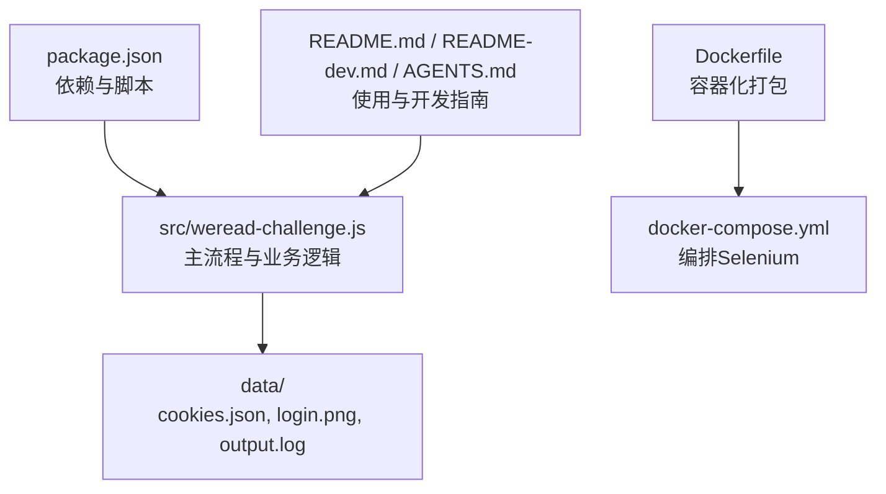

图表来源
- [src/weread-challenge.js](file://src/weread-challenge.js#L1-L1330)
- [package.json](file://package.json#L1-L31)
- [Dockerfile](file://Dockerfile#L1-L8)
- [docker-compose.yml](file://docker-compose.yml)

章节来源
- [src/weread-challenge.js](file://src/weread-challenge.js#L1-L1330)
- [package.json](file://package.json#L1-L31)
- [README.md](file://README.md)
- [README-dev.md](file://README-dev.md#L1-L14)
- [AGENTS.md](file://AGENTS.md#L1-L34)
- [Dockerfile](file://Dockerfile#L1-L8)

## 核心组件
- 浏览器驱动与会话管理：根据环境变量选择本地或远程浏览器，设置窗口大小与超时。
- 二维码检测与截图：通过 XPath 查找二维码相关元素，并保存登录二维码图片。
- **新增：二维码图像解码与显示：使用 jsqr 解析 PNG 图像中的二维码数据，在终端中使用 qrcode-terminal 实时显示二维码。**
- Cookie 管理：加载/保存 Cookie，支持跨会话复用，提升登录效率。
- 登录状态验证：等待"我的书架"或"点击刷新二维码"等关键元素出现，自动刷新过期二维码。
- 安全点击机制：提供三种点击回退策略，应对元素拦截与不可见问题。
- 阅读循环与自动翻页：根据速度与时长控制阅读节奏，自动处理章节跳转与异常重试。
- 通知与日志：邮件与 Bark 推送，统一日志输出与诊断信息收集。

章节来源
- [src/weread-challenge.js](file://src/weread-challenge.js#L466-L493)
- [src/weread-challenge.js](file://src/weread-challenge.js#L794-L1330)
- [package.json](file://package.json#L23-L29)

## 架构总览
系统整体流程包括：启动浏览器 -> 加载 Cookie -> 访问目标站点 -> 点击登录 -> 二维码检测与截图 -> **二维码图像解码与终端显示** -> 等待登录 -> 登录成功后进入阅读循环 -> 自动翻页与截图 -> 结束后保存 Cookie。

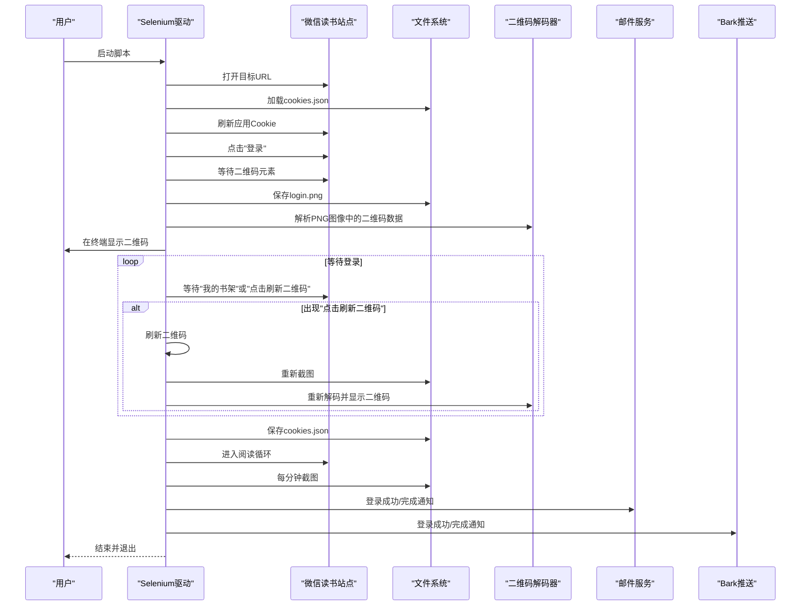

图表来源
- [src/weread-challenge.js](file://src/weread-challenge.js#L794-L1330)

## 详细组件分析

### 二维码生成与检测机制
- XPath 定位策略：优先查找包含"二维码"相关属性或文本的元素，若失败则回退到包含"扫码/二维码"的文本元素。
- 截图保存：一旦检测到二维码元素，延时后进行截图并保存至指定路径，便于用户扫码。
- 过期提示识别：通过预设关键词列表匹配"点击刷新二维码""二维码已失效"等提示，触发刷新流程。

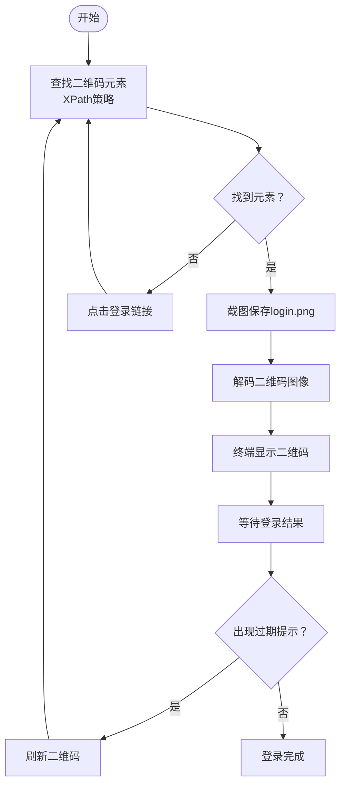

图表来源
- [src/weread-challenge.js](file://src/weread-challenge.js#L436-L464)
- [src/weread-challenge.js](file://src/weread-challenge.js#L466-L493)
- [src/weread-challenge.js](file://src/weread-challenge.js#L914-L946)

章节来源
- [src/weread-challenge.js](file://src/weread-challenge.js#L436-L464)
- [src/weread-challenge.js](file://src/weread-challenge.js#L466-L493)
- [src/weread-challenge.js](file://src/weread-challenge.js#L914-L946)

### 新增：二维码图像解码与显示功能
**更新** 本功能集成了三个核心库来实现完整的二维码处理流程：

- **jsqr 库**：用于解析 PNG 图像中的二维码数据，支持多种二维码格式
- **pngjs 库**：用于读取和处理 PNG 图像文件，提取像素数据
- **qrcode-terminal 库**：在终端中生成二维码字符矩阵，便于用户扫码

**工作流程**：
1. 从页面中定位二维码图片元素
2. 截取二维码图片为 Base64 PNG 数据
3. 使用 pngjs 解析 PNG 图像数据
4. 使用 jsqr 解码二维码内容
5. 使用 qrcode-terminal 在终端中显示二维码

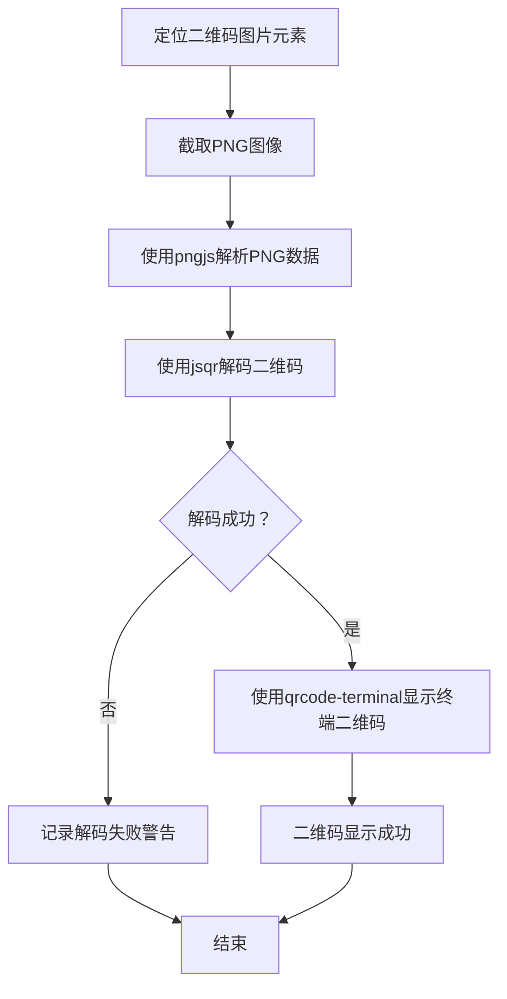

图表来源
- [src/weread-challenge.js](file://src/weread-challenge.js#L466-L493)

章节来源
- [src/weread-challenge.js](file://src/weread-challenge.js#L466-L493)
- [package.json](file://package.json#L24-L27)

### Cookie 管理与持久化
- 加载：启动时读取本地 Cookie 文件并注入到当前会话，随后刷新页面使 Cookie 生效。
- 保存：登录成功或阅读完成后将当前会话 Cookie 写回文件，支持下次自动登录。
- 浏览器差异：针对 Safari 浏览器对 Cookie 的 secure 标记进行特殊处理。

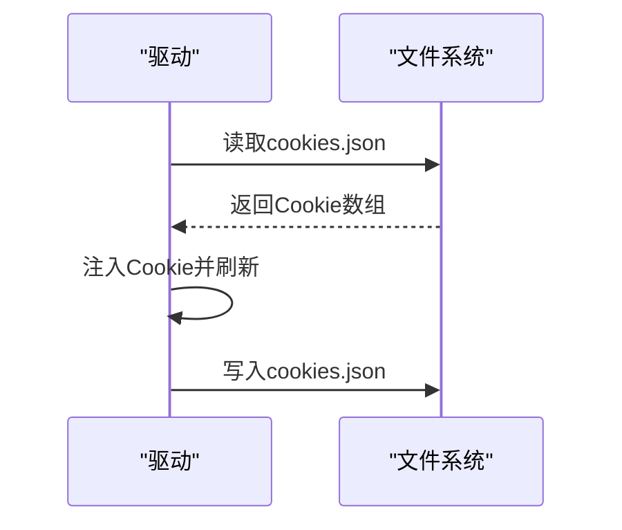

图表来源
- [src/weread-challenge.js](file://src/weread-challenge.js#L369-L390)
- [src/weread-challenge.js](file://src/weread-challenge.js#L1025-L1027)
- [src/weread-challenge.js](file://src/weread-challenge.js#L929-L941)

章节来源
- [src/weread-challenge.js](file://src/weread-challenge.js#L369-L390)
- [src/weread-challenge.js](file://src/weread-challenge.js#L1025-L1027)
- [src/weread-challenge.js](file://src/weread-challenge.js#L929-L941)

### 登录状态验证与自动重连
- 双元素等待：同时监听"我的书架"和"点击刷新二维码"，以提高健壮性。
- 过期自动刷新：当检测到过期提示时，调用刷新函数并重新截图；若仍失败则刷新页面并再次检测。
- 最大重试次数：限制等待循环次数，避免无限阻塞。

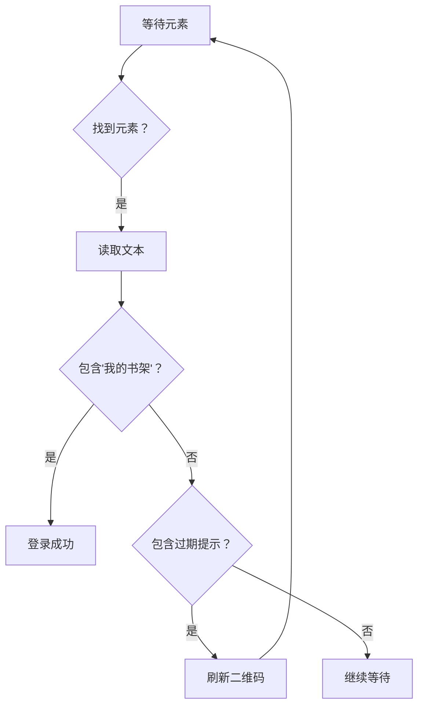

图表来源
- [src/weread-challenge.js](file://src/weread-challenge.js#L948-L1008)

章节来源
- [src/weread-challenge.js](file://src/weread-challenge.js#L948-L1008)

### 安全点击实现（多种点击方法回退机制）
- 直接点击：优先尝试原生点击。
- JavaScript 点击：若直接点击失败，使用执行脚本的方式触发。
- Actions 类点击：最后使用动作流移动到元素并点击，解决元素被遮挡或不可见问题。
- 可视区域检测：点击前滚动到可视区域，提升成功率。

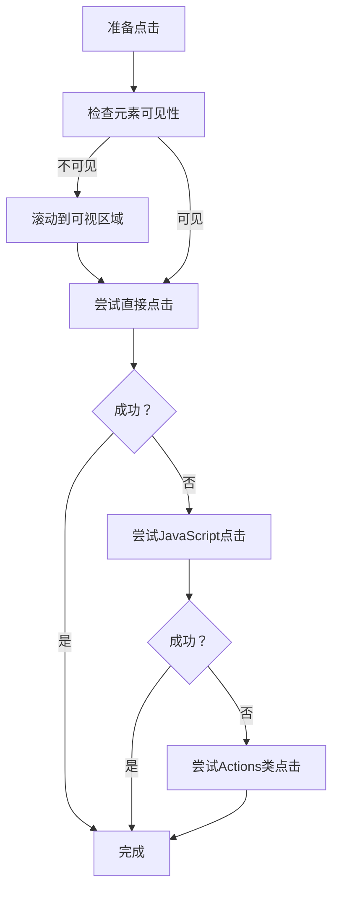

图表来源
- [src/weread-challenge.js](file://src/weread-challenge.js#L496-L535)

章节来源
- [src/weread-challenge.js](file://src/weread-challenge.js#L496-L535)

### 二维码刷新逻辑
- 多定位器回退：提供多个 CSS/XPath 定位器，逐个尝试定位"刷新"按钮。
- 脚本触发：若常规定位失败，通过执行脚本强制触发刷新。
- DOM 等待：点击后等待刷新元素从 DOM 中消失，再重新检测二维码。
- 截图确认：刷新成功后再次截图，确保二维码已更新。

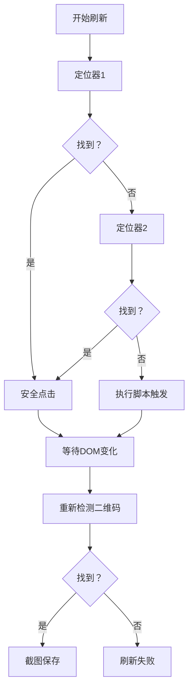

图表来源
- [src/weread-challenge.js](file://src/weread-challenge.js#L538-L619)

章节来源
- [src/weread-challenge.js](file://src/weread-challenge.js#L538-L619)

### 错误处理与诊断
- 健康检查：对远程 Selenium Grid 进行健康检查，支持两个端点。
- 日志重定向：在非调试模式下将日志写入文件，便于问题追踪。
- 诊断信息收集：捕获异常时自动收集 Selenium 容器日志与健康状态。
- 统一错误上报：通过 Bark 与邮件发送错误摘要，并可选上报到远端服务。

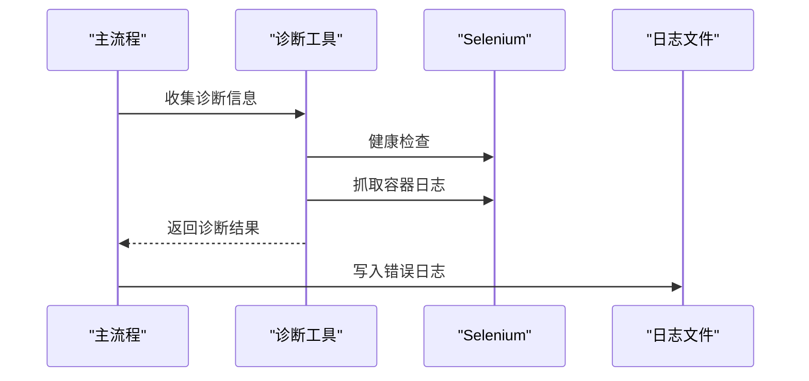

图表来源
- [src/weread-challenge.js](file://src/weread-challenge.js#L144-L251)
- [src/weread-challenge.js](file://src/weread-challenge.js#L1291-L1315)

章节来源
- [src/weread-challenge.js](file://src/weread-challenge.js#L144-L251)
- [src/weread-challenge.js](file://src/weread-challenge.js#L1291-L1315)

### 阅读循环与自动翻页
- 时长控制：根据环境变量设置阅读时长，循环内随机延时模拟人工操作。
- 截图策略：每分钟截图一次，若截图过小则刷新页面，保证数据有效性。
- 章节跳转：检测"目录"按钮与"下一章/下一页"按钮，自动翻页并回到顶部。
- 异常处理：遇到"点击重试"等提示时自动点击重试。

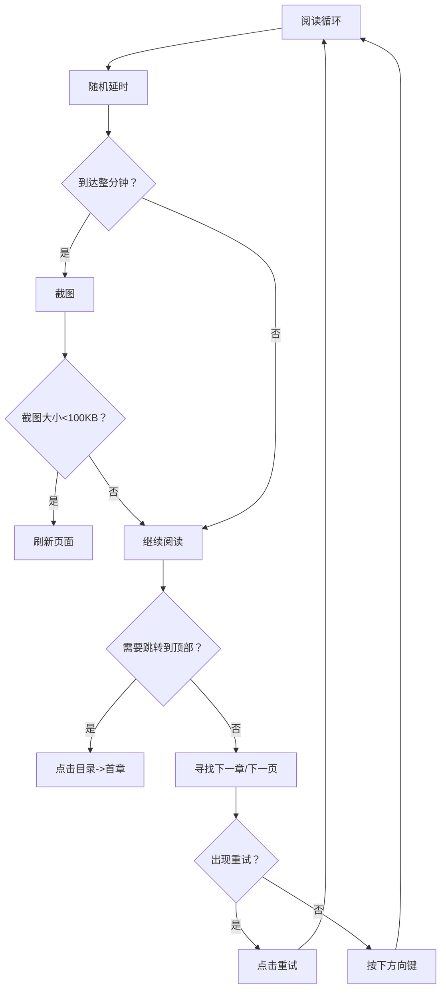

图表来源
- [src/weread-challenge.js](file://src/weread-challenge.js#L1127-L1271)

章节来源
- [src/weread-challenge.js](file://src/weread-challenge.js#L1127-L1271)

## 依赖关系分析
- 运行时依赖：selenium-webdriver、nodemailer、**新增：jsqr、pngjs、qrcode-terminal**。
- 构建与运行：Dockerfile 将脚本与依赖打包为容器镜像；docker-compose 编排 Selenium Standalone Chrome。
- 环境变量：通过环境变量控制浏览器类型、远程节点、截图开关、通知开关等。

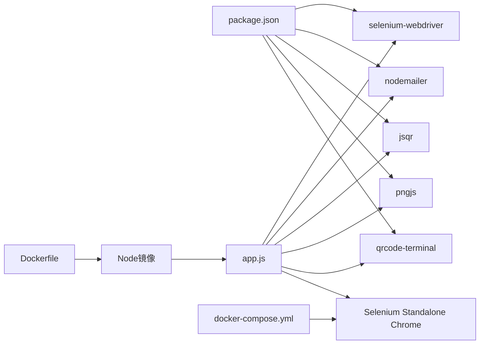

图表来源
- [package.json](file://package.json#L23-L29)
- [Dockerfile](file://Dockerfile#L1-L8)
- [docker-compose.yml](file://docker-compose.yml)

章节来源
- [package.json](file://package.json#L1-L31)
- [Dockerfile](file://Dockerfile#L1-L8)
- [AGENTS.md](file://AGENTS.md#L3-L6)

## 性能考虑
- 隐式等待与超时：合理设置隐式等待与页面加载超时，避免长时间阻塞。
- 随机延时：阅读循环内使用随机延时，降低被风控概率。
- 截图频率：仅在必要时截图，减少磁盘 IO 与网络传输。
- **新增：二维码解码性能优化**：使用高效的 jsqr 库进行图像解码，避免重复解码同一张图片。
- 远程浏览器：在 CI/CD 环境中使用远程 Selenium Grid，提升稳定性与并发能力。

## 故障排查指南
- 二维码未出现：检查登录链接是否正确，确认页面已加载完成；尝试手动刷新页面。
- **新增：二维码解码失败**：检查 PNG 图像完整性，确认 jsqr 库正常安装；验证二维码图像清晰度。
- 刷新失败：检查定位器是否适配当前页面结构；确认网络稳定；查看日志文件定位具体错误。
- 点击无效：启用安全点击回退机制；检查元素是否被遮挡；确认浏览器窗口尺寸。
- 远程浏览器连接失败：使用健康检查接口验证节点可用性；检查网络连通性与端口配置。
- Cookie 失效：删除旧 Cookie 文件，重新登录并保存新 Cookie。

章节来源
- [src/weread-challenge.js](file://src/weread-challenge.js#L144-L251)
- [src/weread-challenge.js](file://src/weread-challenge.js#L538-L619)
- [src/weread-challenge.js](file://src/weread-challenge.js#L914-L946)

## 结论
本系统通过严谨的定位策略、多回退点击机制与完善的错误处理，实现了微信读书的自动登录与阅读。**最新版本新增的二维码图像解码与终端显示功能，进一步提升了用户体验，使用户无需额外工具即可完成扫码登录。**其模块化设计与 Docker 化部署使其易于维护与扩展，适合在生产环境中长期运行。

## 附录

### 配置参数说明
- COOKIE_FILE：Cookie 文件路径，默认 "./data/cookies.json"
- LOGIN_QR_CODE：登录二维码截图路径，默认 "./data/login.png"
- WEREAD_URL：目标站点 URL，默认 "https://weread.qq.com/"
- DEBUG：调试模式开关，默认 false
- WEREAD_USER：浏览器用户配置目录名，默认 "weread-default"
- WEREAD_REMOTE_BROWSER：远程浏览器地址，如 http://host:port
- WEREAD_DURATION：阅读时长（分钟），默认 10
- WEREAD_SPEED：阅读速度，slow/normal/fast，默认 slow
- WEREAD_SELECTION：书籍选择策略，-1 自动选择特定书籍，0 随机，其他为序号
- WEREAD_BROWSER：浏览器类型，chrome/edge/firefox/safari，默认 chrome
- ENABLE_EMAIL：是否启用邮件通知，默认 false
- WEREAD_SCREENSHOT：是否每分钟截图，默认 true
- WEREAD_AGREE_TERMS：是否同意条款并上报统计数据，默认 true
- EMAIL_PORT：SMTP 端口，默认 465
- BARK_KEY：Bark 推送密钥
- BARK_SERVER：Bark 服务器地址，默认 "https://api.day.app"
- QR_EXPIRED_TEXTS：二维码过期提示关键词列表，默认包含"点击刷新二维码""二维码已失效"

### 新增：二维码解码库配置
- **jsqr**：^1.4.0 - 二维码图像解码库，支持多种二维码格式
- **pngjs**：^7.0.0 - PNG 图像处理库，用于解析 PNG 数据
- **qrcode-terminal**：^0.12.0 - 终端二维码显示库，提供字符矩阵二维码

章节来源
- [src/weread-challenge.js](file://src/weread-challenge.js#L39-L61)
- [package.json](file://package.json#L24-L27)

### 最佳实践建议
- 页面布局变化：优先使用包含关键字的 XPath，如"扫码/二维码/点击刷新二维码"，并提供多套备选定位器。
- 元素拦截：启用安全点击回退机制，先滚动到可视区域，再尝试多种点击方式。
- 网络异常：增加重试与超时配置，必要时刷新页面；使用健康检查与日志收集辅助诊断。
- Cookie 管理：定期轮换 Cookie，避免长期使用导致失效；在 Docker 环境中挂载独立数据卷。
- **新增：二维码解码优化**：确保二维码图像清晰度，避免模糊导致解码失败；在终端中使用小尺寸二维码显示以节省空间。
- 部署建议：使用 docker-compose 编排，设置合适的共享内存与资源限制；在 CI/CD 中使用远程浏览器节点。

章节来源
- [AGENTS.md](file://AGENTS.md#L29-L34)
- [README-dev.md](file://README-dev.md#L9-L13)
- [src/weread-challenge.js](file://src/weread-challenge.js#L466-L493)