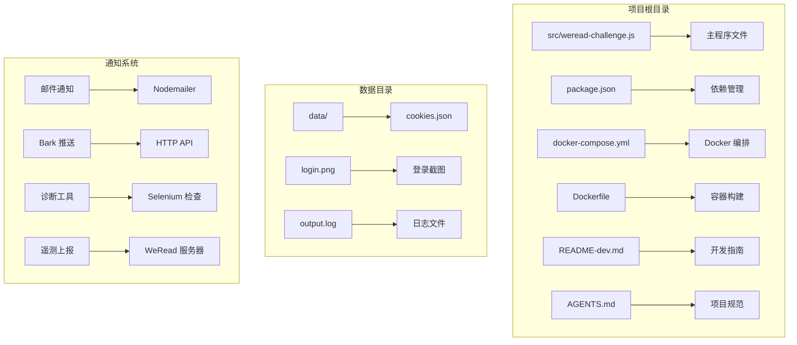
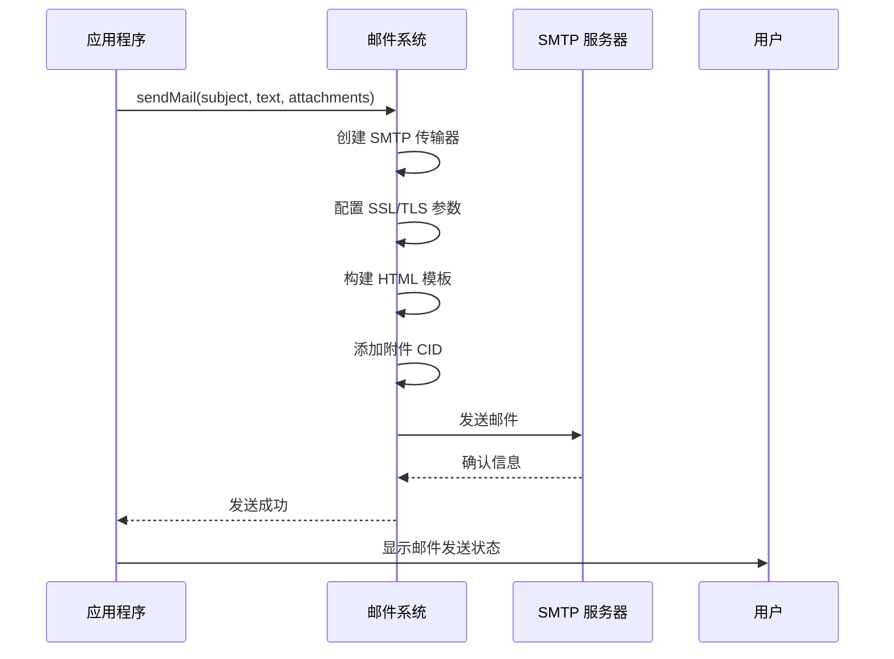
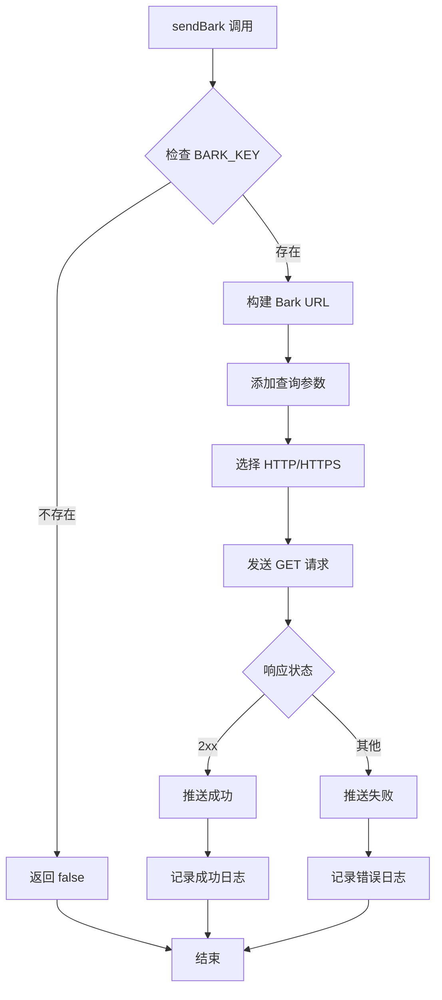
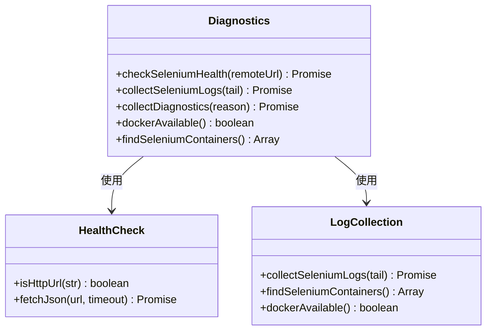
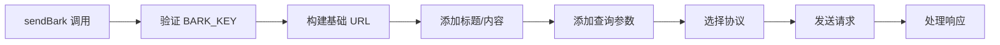
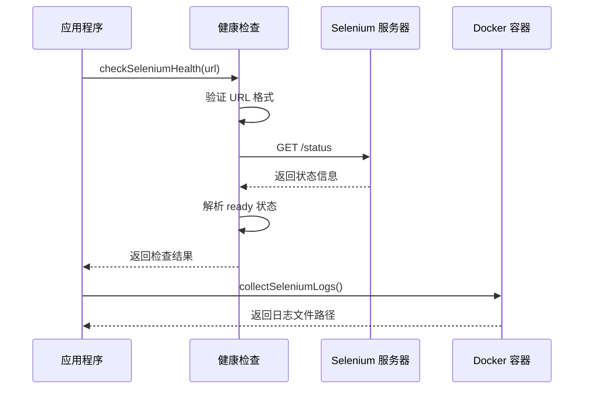
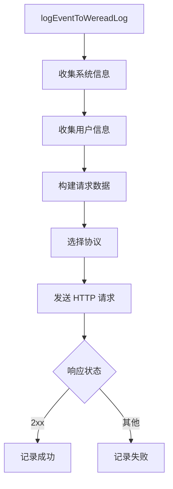
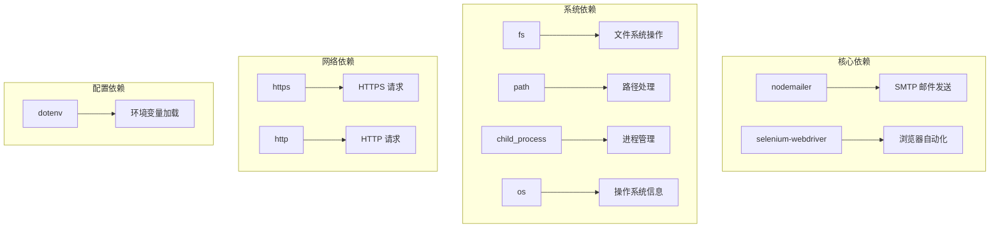

# 通知系统

<cite>
**本文档引用的文件**
- [src/weread-challenge.js](file://src/weread-challenge.js)
- [package.json](file://package.json)
- [docker-compose.yml](file://docker-compose.yml)
- [Dockerfile](file://Dockerfile)
- [README-dev.md](file://README-dev.md)
- [AGENTS.md](file://AGENTS.md)
</cite>

## 目录
1. [简介](#简介)
2. [项目结构](#项目结构)
3. [核心组件](#核心组件)
4. [架构概览](#架构概览)
5. [详细组件分析](#详细组件分析)
6. [依赖关系分析](#依赖关系分析)
7. [性能考虑](#性能考虑)
8. [故障排除指南](#故障排除指南)
9. [结论](#结论)

## 简介

微信读书通知系统是一个基于 Node.js 的自动化脚本，集成了多种通知机制来监控和报告微信读书应用的自动阅读过程。该系统主要包含以下通知功能：

- **邮件通知系统**：通过 Nodemailer 集成 SMTP 服务，支持 HTML 格式的邮件模板和附件处理
- **Bark 推送服务**：集成 iOS/macOS 推送通知服务，支持多平台推送
- **诊断信息收集**：内置 Selenium 健康检查和容器日志收集功能
- **远程日志上传**：向 WeRead 服务器发送遥测数据

该系统设计用于在无人值守的情况下运行微信读书的自动阅读功能，并通过多种渠道实时通知用户执行状态。

## 项目结构

项目采用模块化设计，主要文件结构如下：



**图表来源**
- [src/weread-challenge.js](file://src/weread-challenge.js#L1-L50)
- [package.json](file://package.json#L1-L10)

**章节来源**
- [src/weread-challenge.js](file://src/weread-challenge.js#L1-L100)
- [package.json](file://package.json#L1-L10)

## 核心组件

### 配置参数系统

系统通过环境变量进行配置，支持灵活的部署选项：

| 参数名称 | 类型 | 默认值 | 描述 |
|---------|------|--------|------|
| ENABLE_EMAIL | 布尔值 | false | 启用/禁用邮件通知 |
| EMAIL_SMTP | 字符串 | - | SMTP 服务器地址 |
| EMAIL_PORT | 整数 | 465 | SMTP 端口号 |
| EMAIL_USER | 字符串 | - | 邮箱用户名 |
| EMAIL_PASS | 字符串 | - | 邮箱密码 |
| EMAIL_FROM | 字符串 | EMAIL_USER | 发件人地址 |
| EMAIL_TO | 字符串 | - | 收件人地址 |
| BARK_KEY | 字符串 | - | Bark 推送密钥 |
| BARK_SERVER | 字符串 | https://api.day.app | Bark 服务器地址 |
| WEREAD_REMOTE_BROWSER | 字符串 | - | 远程浏览器地址 |

### 邮件通知系统

邮件系统基于 Nodemailer 实现，支持自动 SSL/TLS 配置和 HTML 模板：



**图表来源**
- [src/weread-challenge.js](file://src/weread-challenge.js#L572-L665)

### Bark 推送系统

Bark 推送系统提供跨平台通知支持：



**图表来源**
- [src/weread-challenge.js](file://src/weread-challenge.js#L667-L743)

### 诊断工具系统

系统内置了全面的诊断工具，用于故障排查：



**图表来源**
- [src/weread-challenge.js](file://src/weread-challenge.js#L94-L232)

**章节来源**
- [src/weread-challenge.js](file://src/weread-challenge.js#L30-L743)

## 架构概览

系统采用事件驱动的架构模式，通过环境变量控制不同的通知渠道：

```mermaid
graph TB
subgraph "核心引擎"
A[主程序 main()] --> B[浏览器控制]
B --> C[微信读书自动化]
end
subgraph "通知层"
D[邮件通知] --> E[Nodemailer]
F[Bark 推送] --> G[HTTP API]
H[诊断工具] --> I[Selenium 检查]
J[遥测上报] --> K[WeRead 服务器]
end
subgraph "配置层"
L[环境变量] --> M[邮件配置]
L --> N[Bark 配置]
L --> O[诊断配置]
end
C --> D
C --> F
C --> H
C --> J
M --> E
N --> G
O --> I
O --> K
```

**图表来源**
- [src/weread-challenge.js](file://src/weread-challenge.js#L745-L1279)
- [docker-compose.yml](file://docker-compose.yml#L1-L32)

## 详细组件分析

### 邮件发送实现

邮件系统实现了完整的 SMTP 集成，包括自动 SSL/TLS 配置和 HTML 模板支持：

#### SMTP 传输器配置

系统根据端口号自动判断 SSL/TLS 配置：
- 端口 465：启用 SSL
- 端口 587/25：使用 STARTTLS
- 其他端口：根据协议自动选择

#### HTML 模板设计

邮件模板采用响应式设计，包含以下特性：
- 微信读书品牌色彩方案
- 动态内容区域
- 图片附件嵌入支持
- 自动化消息头尾

#### 附件处理机制

系统支持多种类型的附件处理：
- 截图文件自动转换为附件
- CID（Content-ID）用于内联显示
- MIME 类型自动检测
- 文件名标准化

**章节来源**
- [src/weread-challenge.js](file://src/weread-challenge.js#L572-L665)

### Bark 推送 API 调用

Bark 推送系统提供了丰富的参数配置选项：

#### 参数构建流程



**图表来源**
- [src/weread-challenge.js](file://src/weread-challenge.js#L667-L743)

#### 错误处理机制

系统实现了多层次的错误处理：
- 网络连接超时检测
- HTTP 状态码验证
- 异常捕获和日志记录
- 失败重试机制

#### 多平台支持

Bark 推送支持多种客户端：
- iOS/macOS 推送
- Android 通知
- Web 推送
- 桌面应用通知

**章节来源**
- [src/weread-challenge.js](file://src/weread-challenge.js#L667-L743)

### 诊断信息收集

系统内置了全面的诊断工具，用于故障排查和性能监控：

#### Selenium 健康检查



**图表来源**
- [src/weread-challenge.js](file://src/weread-challenge.js#L125-L232)

#### 容器日志收集

系统能够自动检测和收集运行中的 Selenium 容器日志：
- Docker 可用性检测
- 容器列表获取
- 日志文件聚合
- 时间戳标记

#### 远程浏览器监控

系统支持远程浏览器节点的监控：
- 自动健康检查
- 状态信息获取
- 连接超时处理
- 备用端点支持

**章节来源**
- [src/weread-challenge.js](file://src/weread-challenge.js#L125-L232)

### 远程日志上传功能

系统实现了向 WeRead 服务器的遥测数据上报：

#### 数据收集流程



**图表来源**
- [src/weread-challenge.js](file://src/weread-challenge.js#L249-L303)

#### 上报数据内容

系统上报的数据包含：
- 操作系统信息
- 浏览器类型和版本
- 阅读时长配置
- 邮件通知状态
- 错误信息
- 版本信息

**章节来源**
- [src/weread-challenge.js](file://src/weread-challenge.js#L249-L303)

## 依赖关系分析

系统依赖关系清晰，主要依赖项包括：



**图表来源**
- [package.json](file://package.json#L5-L8)

**章节来源**
- [package.json](file://package.json#L1-L10)

## 性能考虑

### 内存管理

系统采用了高效的内存管理模式：
- 及时释放浏览器资源
- 控制日志文件大小
- 优化图片处理流程
- 合理的超时设置

### 网络优化

- 自动选择最优的 HTTP 协议
- 连接池复用
- 超时控制和重试机制
- 错误恢复策略

### 资源限制

系统实现了多项资源保护措施：
- 最大重试次数限制
- 超时时间控制
- 内存使用监控
- 文件大小限制

## 故障排除指南

### 邮件配置问题

**常见问题及解决方案：**

1. **SMTP 认证失败**
   - 检查 EMAIL_USER 和 EMAIL_PASS 配置
   - 验证邮箱服务商的 SMTP 设置
   - 确认是否启用了应用专用密码

2. **SSL/TLS 连接问题**
   - 确认 EMAIL_PORT 设置正确
   - 检查防火墙设置
   - 验证证书有效性

3. **邮件发送失败**
   - 查看输出日志中的错误信息
   - 检查收件人邮箱地址
   - 验证附件文件是否存在

### Bark 推送问题

**常见问题及解决方案：**

1. **推送失败**
   - 检查 BARK_KEY 是否正确配置
   - 验证 BARK_SERVER 地址
   - 确认网络连接正常

2. **推送延迟**
   - 检查服务器响应时间
   - 验证客户端网络状况
   - 考虑使用备用服务器

### 诊断工具问题

**常见问题及解决方案：**

1. **Selenium 健康检查失败**
   - 检查 WEREAD_REMOTE_BROWSER 配置
   - 验证 Docker 容器状态
   - 确认端口映射正确

2. **日志收集失败**
   - 检查 Docker 权限
   - 验证容器运行状态
   - 确认磁盘空间充足

### 环境变量配置

**配置验证步骤：**

1. **基本配置验证**
   ```bash
   # 检查必需的环境变量
   echo "ENABLE_EMAIL: $ENABLE_EMAIL"
   echo "EMAIL_SMTP: $EMAIL_SMTP"
   echo "BARK_KEY: $BARK_KEY"
   ```

2. **网络连通性测试**
   ```bash
   # 测试 SMTP 连接
   telnet $EMAIL_SMTP $EMAIL_PORT
   
   # 测试 Bark 服务器
   curl -I $BARK_SERVER
   ```

3. **Docker 环境验证**
   ```bash
   # 检查 Docker 状态
   docker ps
   
   # 验证 Selenium 容器
   docker logs selenium_container
   ```

**章节来源**
- [src/weread-challenge.js](file://src/weread-challenge.js#L125-L232)
- [AGENTS.md](file://AGENTS.md#L29-L34)

## 结论

微信读书通知系统是一个功能完整、设计合理的自动化通知解决方案。系统的主要优势包括：

### 技术特点

1. **模块化设计**：清晰的功能分离，便于维护和扩展
2. **多平台支持**：同时支持邮件和 Bark 推送
3. **智能诊断**：内置完善的故障排查工具
4. **配置灵活**：通过环境变量实现零代码配置

### 应用价值

1. **自动化监控**：无需人工干预的持续监控
2. **多渠道通知**：确保重要信息及时传达
3. **故障快速定位**：完善的诊断工具帮助快速解决问题
4. **易于部署**：Docker 化部署简化运维

### 改进建议

1. **增加更多通知渠道**：考虑集成企业微信、钉钉等
2. **增强配置管理**：提供图形化配置界面
3. **扩展监控指标**：增加更多业务指标监控
4. **优化性能**：考虑异步处理和缓存机制

该系统为微信读书的自动化阅读提供了可靠的监控和通知保障，是现代自动化测试和监控系统的优秀实践案例。