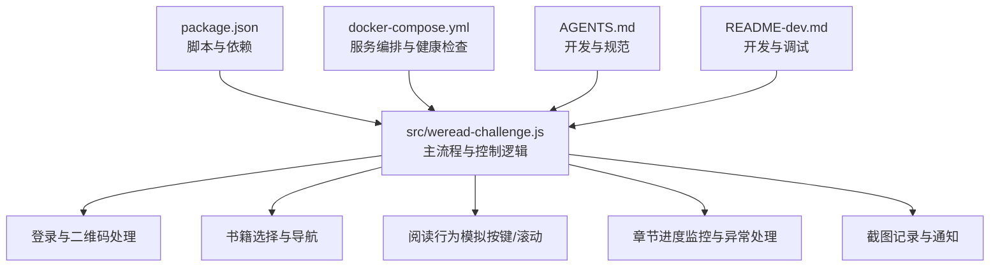
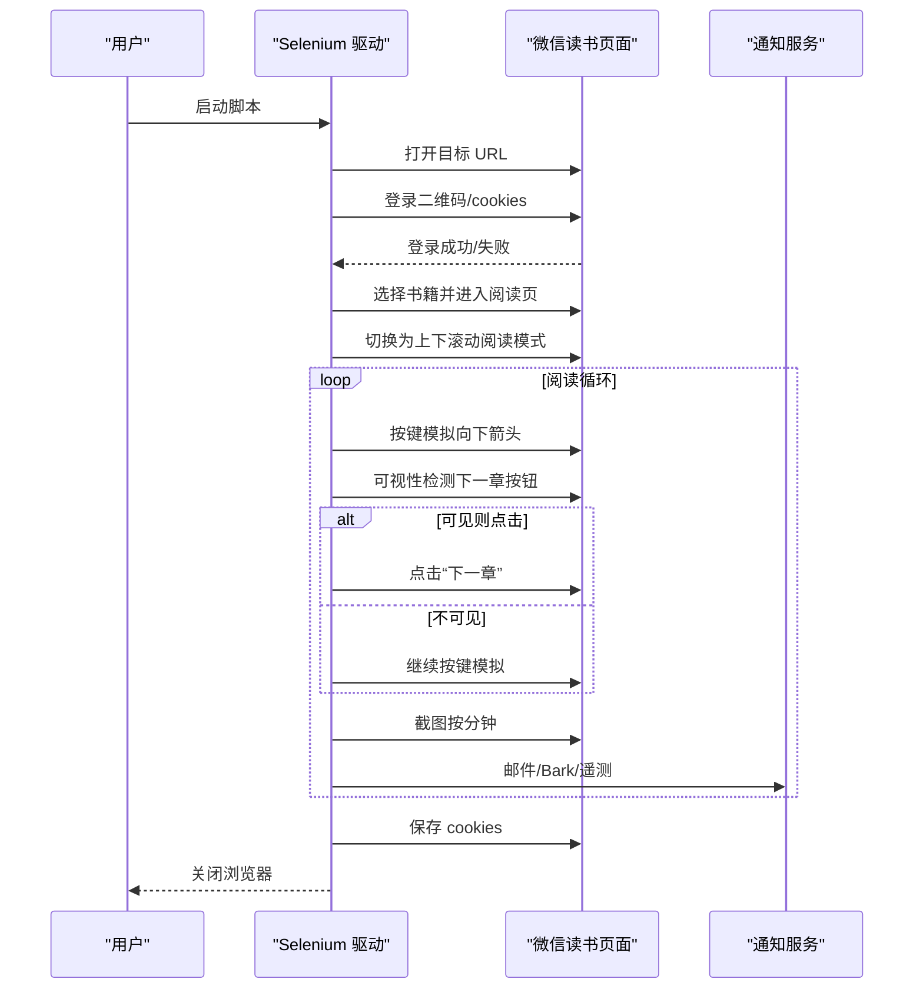
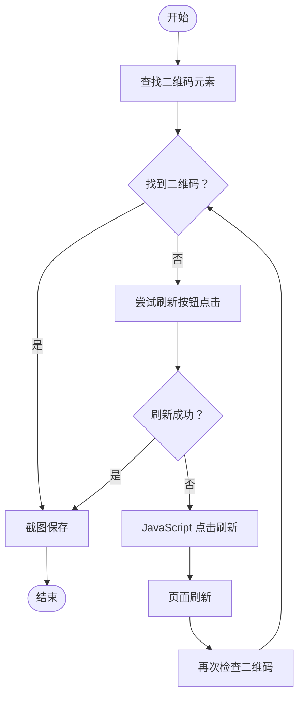
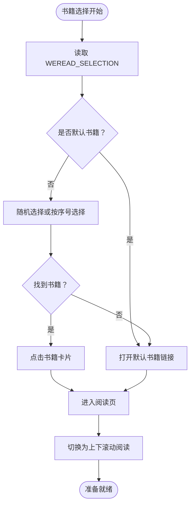
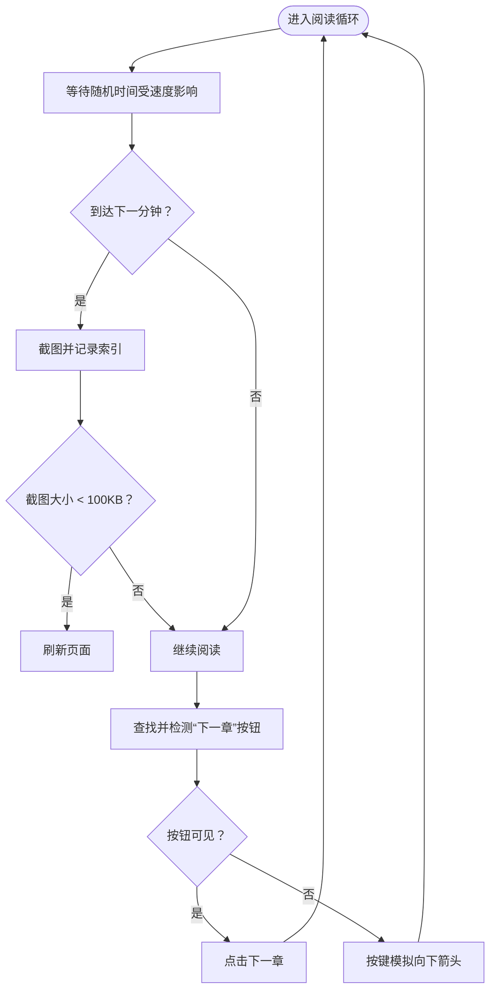
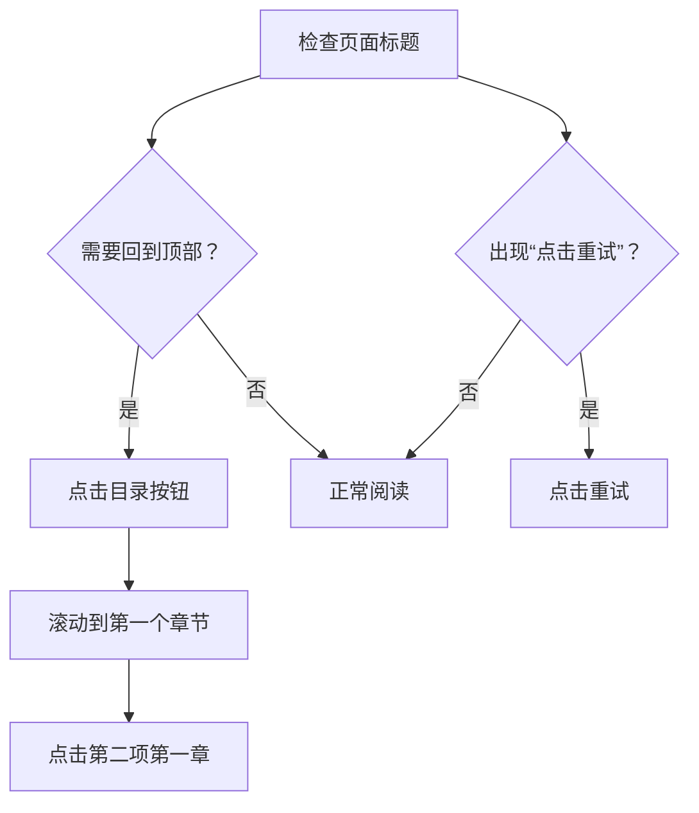
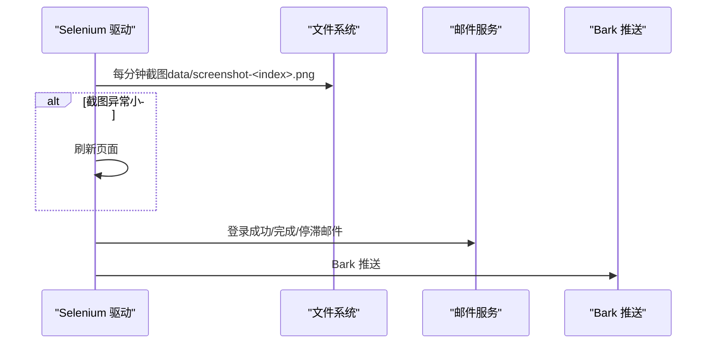
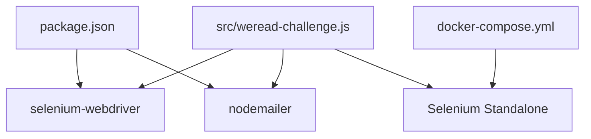

# 阅读控制系统

<cite>
**本文引用的文件**
- [src/weread-challenge.js](file://src/weread-challenge.js)
- [package.json](file://package.json)
- [AGENTS.md](file://AGENTS.md)
- [README-dev.md](file://README-dev.md)
- [docker-compose.yml](file://docker-compose.yml)
</cite>

## 目录
1. [简介](#简介)
2. [项目结构](#项目结构)
3. [核心组件](#核心组件)
4. [架构总览](#架构总览)
5. [详细组件分析](#详细组件分析)
6. [依赖关系分析](#依赖关系分析)
7. [性能考虑](#性能考虑)
8. [故障排查指南](#故障排查指南)
9. [结论](#结论)
10. [附录](#附录)

## 简介
本项目是一个基于 Selenium WebDriver 的微信读书阅读控制系统，旨在自动化完成登录、书籍选择与导航、阅读行为模拟（按键与滚动）、章节进度监控以及截图记录等功能。系统支持远程浏览器（Selenium Grid）与本地浏览器两种运行模式，并通过环境变量灵活配置阅读时长、速度、截图策略等参数。本文档将深入解析其架构设计、关键算法与实现细节，并提供配置参数说明、性能优化建议与常见问题排查方法。

## 项目结构
- 核心逻辑集中在 src/weread-challenge.js，涵盖登录流程、书籍选择、阅读循环、截图与通知等。
- package.json 定义了脚本与依赖，包括 selenium-webdriver 与 nodemailer。
- AGENTS.md 提供仓库规范、开发命令与测试建议。
- README-dev.md 说明开发与调试方式。
- docker-compose.yml 定义了应用与 Selenium Standalone 容器的服务编排与健康检查。

图表来源
- [src/weread-challenge.js](file://src/weread-challenge.js#L745-L1279)
- [package.json](file://package.json#L1-L10)
- [docker-compose.yml](file://docker-compose.yml#L1-L32)
- [AGENTS.md](file://AGENTS.md#L1-L34)
- [README-dev.md](file://README-dev.md#L1-L14)

章节来源
- [src/weread-challenge.js](file://src/weread-challenge.js#L1-L1279)
- [package.json](file://package.json#L1-L10)
- [AGENTS.md](file://AGENTS.md#L1-L34)
- [README-dev.md](file://README-dev.md#L1-L14)
- [docker-compose.yml](file://docker-compose.yml#L1-L32)

## 核心组件
- 环境变量与全局配置：WEREAD_DURATION、WEREAD_SPEED、WEREAD_SELECTION、WEREAD_BROWSER、WEREAD_SCREENSHOT、ENABLE_EMAIL、BARK_KEY、BARK_SERVER 等。
- 登录与二维码刷新：findQRCodeElement、refreshQRCode、safeClickElement。
- 书籍选择与导航：根据 WEREAD_SELECTION 选择书籍或默认书籍，进入阅读页后切换为“上下滚动阅读”模式。
- 阅读行为模拟：pressDownArrow 实现按键模拟与随机按下时长；isElementInViewport 用于元素可视性检测；safeClickElement 提供多种点击策略。
- 章节进度监控：通过标题与特定元素检测“已读完”、“开通后即可阅读”、“全书完”等状态，必要时回到目录并重新选择章节。
- 截图记录：按分钟截取屏幕快照，对异常小尺寸截图进行页面刷新。
- 通知与遥测：邮件通知、Bark 推送、WeRead 事件上报。

章节来源
- [src/weread-challenge.js](file://src/weread-challenge.js#L26-L41)
- [src/weread-challenge.js](file://src/weread-challenge.js#L373-L414)
- [src/weread-challenge.js](file://src/weread-challenge.js#L447-L487)
- [src/weread-challenge.js](file://src/weread-challenge.js#L489-L570)
- [src/weread-challenge.js](file://src/weread-challenge.js#L981-L1025)
- [src/weread-challenge.js](file://src/weread-challenge.js#L1071-L1220)
- [src/weread-challenge.js](file://src/weread-challenge.js#L572-L665)
- [src/weread-challenge.js](file://src/weread-challenge.js#L667-L743)
- [src/weread-challenge.js](file://src/weread-challenge.js#L250-L303)

## 架构总览
系统采用“主流程驱动 + 多策略辅助”的架构：
- 主流程负责浏览器初始化、登录、书籍选择、阅读循环与收尾。
- 辅助模块提供二维码刷新、元素点击、可视性检测、截图与通知等能力。
- 支持本地与远程（Selenium Grid）两种运行模式，通过环境变量与健康检查保障稳定性。

图表来源
- [src/weread-challenge.js](file://src/weread-challenge.js#L745-L1279)

## 详细组件分析

### 登录与二维码刷新
- 二维码定位：优先通过 XPath 查找二维码图片或包含“扫码/二维码”的文本元素；若失败则判定已登录。
- 二维码刷新：尝试多种定位器点击“刷新”按钮，若失败则回退到 JavaScript 点击或页面刷新。
- 截图保存：刷新后等待元素出现并截图保存至 data/login.png。

图表来源
- [src/weread-challenge.js](file://src/weread-challenge.js#L417-L445)
- [src/weread-challenge.js](file://src/weread-challenge.js#L489-L570)

章节来源
- [src/weread-challenge.js](file://src/weread-challenge.js#L417-L445)
- [src/weread-challenge.js](file://src/weread-challenge.js#L489-L570)

### 书籍选择与导航
- 选择策略：支持固定序号、随机选择或默认书籍。若指定书籍未找到，回退到默认链接。
- 导航模式：进入阅读页后尝试切换为“上下滚动阅读”模式，兼容新旧版本定位。
- 异常处理：若找不到目录按钮或章节列表，记录错误并继续阅读循环。

图表来源
- [src/weread-challenge.js](file://src/weread-challenge.js#L981-L1025)
- [src/weread-challenge.js](file://src/weread-challenge.js#L1027-L1053)

章节来源
- [src/weread-challenge.js](file://src/weread-challenge.js#L981-L1025)
- [src/weread-challenge.js](file://src/weread-challenge.js#L1027-L1053)

### 阅读行为模拟与页面滚动
- 按键模拟：pressDownArrow 通过 Actions 发送向下箭头键，设置随机按下时长（50–500ms），随后释放。
- 可视性检测：isElementInViewport 获取视口尺寸与元素边界框，判断元素是否完全可见且显示。
- 安全点击：safeClickElement 依次尝试直接点击、JavaScript 点击、Actions 移动点击，失败则返回 false。
- 阅读循环：按分钟截屏，根据 WEREAD_SPEED 调整随机等待时间；遇到异常小尺寸截图则刷新页面。

图表来源
- [src/weread-challenge.js](file://src/weread-challenge.js#L373-L380)
- [src/weread-challenge.js](file://src/weread-challenge.js#L382-L414)
- [src/weread-challenge.js](file://src/weread-challenge.js#L447-L487)
- [src/weread-challenge.js](file://src/weread-challenge.js#L1088-L1126)
- [src/weread-challenge.js](file://src/weread-challenge.js#L1192-L1219)

章节来源
- [src/weread-challenge.js](file://src/weread-challenge.js#L373-L380)
- [src/weread-challenge.js](file://src/weread-challenge.js#L382-L414)
- [src/weread-challenge.js](file://src/weread-challenge.js#L447-L487)
- [src/weread-challenge.js](file://src/weread-challenge.js#L1088-L1126)
- [src/weread-challenge.js](file://src/weread-challenge.js#L1192-L1219)

### 章节进度监控与异常处理
- 状态检测：通过标题包含“已读完”、出现“开通后即可阅读”、或存在“全书完”文本，判定需要回到顶部并重新选择章节。
- 回到顶部：点击目录按钮，滚动到第一个章节并点击第二项（通常为第一章）。
- 其他异常：若出现“点击重试”，自动点击重试按钮。

图表来源
- [src/weread-challenge.js](file://src/weread-challenge.js#L1128-L1190)

章节来源
- [src/weread-challenge.js](file://src/weread-challenge.js#L1128-L1190)

### 截图记录与通知
- 截图策略：按分钟截取屏幕快照，文件名包含分钟索引；当截图小于 100KB 时刷新页面。
- 通知：登录成功、项目完成、项目停滞等状态通过邮件与 Bark 推送通知；错误时收集诊断信息（Selenium 健康检查与容器日志）。

图表来源
- [src/weread-challenge.js](file://src/weread-challenge.js#L1088-L1126)
- [src/weread-challenge.js](file://src/weread-challenge.js#L572-L665)
- [src/weread-challenge.js](file://src/weread-challenge.js#L667-L743)

章节来源
- [src/weread-challenge.js](file://src/weread-challenge.js#L1088-L1126)
- [src/weread-challenge.js](file://src/weread-challenge.js#L572-L665)
- [src/weread-challenge.js](file://src/weread-challenge.js#L667-L743)

## 依赖关系分析
- 依赖管理：selenium-webdriver 用于浏览器自动化，nodemailer 用于邮件通知。
- 运行模式：支持本地浏览器与远程 Selenium Grid；通过 WEREAD_REMOTE_BROWSER 环境变量启用远程模式，并进行健康检查。
- 数据持久化：cookies.json 保存登录态，data 目录存放截图与日志。

图表来源
- [package.json](file://package.json#L5-L8)
- [src/weread-challenge.js](file://src/weread-challenge.js#L756-L828)
- [docker-compose.yml](file://docker-compose.yml#L15-L32)

章节来源
- [package.json](file://package.json#L5-L8)
- [src/weread-challenge.js](file://src/weread-challenge.js#L756-L828)
- [docker-compose.yml](file://docker-compose.yml#L15-L32)

## 性能考虑
- 随机等待与速度控制：通过 WEREAD_SPEED 控制每轮等待时间范围，降低被风控概率；pressDownArrow 的随机按下时长模拟人类行为。
- 视口检测：isElementInViewport 仅在按钮可见时点击，减少无效交互。
- 截图策略：按分钟截屏并校验大小，异常时刷新页面，避免无效数据。
- 超时与稳定性：设置隐式等待、页面加载与脚本执行超时，避免长时间阻塞；远程模式进行健康检查与日志收集。
- 浏览器窗口：随机设置窗口尺寸，提升稳定性与兼容性。

章节来源
- [src/weread-challenge.js](file://src/weread-challenge.js#L1088-L1126)
- [src/weread-challenge.js](file://src/weread-challenge.js#L373-L380)
- [src/weread-challenge.js](file://src/weread-challenge.js#L382-L414)
- [src/weread-challenge.js](file://src/weread-challenge.js#L830-L835)
- [src/weread-challenge.js](file://src/weread-challenge.js#L840-L845)

## 故障排查指南
- 登录失败：检查二维码元素是否存在、刷新按钮定位是否正确；若失败，尝试页面刷新并重新截图。
- 章节异常：若标题包含“已读完”或出现“开通后即可阅读”，回到目录并重新选择章节。
- 截图异常：若截图小于 100KB，自动刷新页面；确认 WEREAD_SCREENSHOT 是否开启。
- 远程浏览器：确认 WEREAD_REMOTE_BROWSER 地址与协议，执行健康检查；收集容器日志与 Selenium 状态。
- 错误上报：发生异常时自动发送邮件与 Bark 推送，并记录诊断信息。

章节来源
- [src/weread-challenge.js](file://src/weread-challenge.js#L934-L956)
- [src/weread-challenge.js](file://src/weread-challenge.js#L1128-L1190)
- [src/weread-challenge.js](file://src/weread-challenge.js#L1110-L1126)
- [src/weread-challenge.js](file://src/weread-challenge.js#L1250-L1251)
- [src/weread-challenge.js](file://src/weread-challenge.js#L1252-L1259)

## 结论
该阅读控制系统通过模块化的设计与多策略的容错机制，实现了从登录到阅读再到监控与通知的完整闭环。其关键特性包括：灵活的环境变量配置、稳健的二维码刷新与书籍导航、自然的按键与滚动模拟、完善的异常检测与恢复、以及可扩展的通知与遥测能力。建议在生产环境中结合远程浏览器与健康检查，合理设置速度与截图策略，以获得更高的稳定性与合规性。

## 附录

### 配置参数说明
- WEREAD_DURATION：阅读时长（分钟），默认 10。
- WEREAD_SPEED：阅读速度，slow | normal | fast，默认 slow。
- WEREAD_SELECTION：书籍选择策略，-1（默认书籍）、0（随机）、1~n（指定序号）。
- WEREAD_BROWSER：浏览器类型，chrome | edge | firefox | safari，默认 chrome。
- WEREAD_SCREENSHOT：是否每分钟截图，默认 true。
- ENABLE_EMAIL：是否启用邮件通知，默认 false。
- BARK_KEY / BARK_SERVER：Bark 推送密钥与服务器地址。
- WEREAD_REMOTE_BROWSER：远程 Selenium Grid 地址（含协议）。
- EMAIL_*：SMTP 配置（EMAIL_SMTP、EMAIL_PORT、EMAIL_USER、EMAIL_PASS、EMAIL_FROM、EMAIL_TO）。
- DEBUG：调试模式，控制日志输出与 WeRead 事件上报地址。

章节来源
- [src/weread-challenge.js](file://src/weread-challenge.js#L26-L41)
- [src/weread-challenge.js](file://src/weread-challenge.js#L31-L41)
- [src/weread-challenge.js](file://src/weread-challenge.js#L792-L800)
- [src/weread-challenge.js](file://src/weread-challenge.js#L572-L606)
- [src/weread-challenge.js](file://src/weread-challenge.js#L667-L700)

### 运行与开发
- 本地运行：node src/weread-challenge.js，可配合 DEBUG、WEREAD_BROWSER、WEREAD_DURATION 等环境变量验证。
- 远程运行：通过 docker-compose 启动，app 服务依赖 selenium 服务健康。
- 调试：VS Code 直接运行，选择 Node 调试，使用 chrome 浏览器。

章节来源
- [AGENTS.md](file://AGENTS.md#L9-L12)
- [README-dev.md](file://README-dev.md#L1-L14)
- [docker-compose.yml](file://docker-compose.yml#L1-L32)