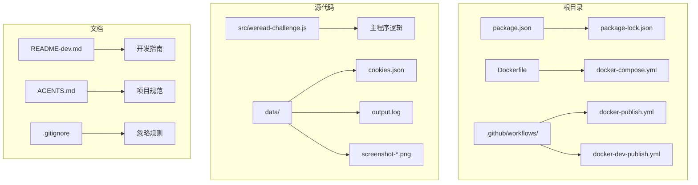
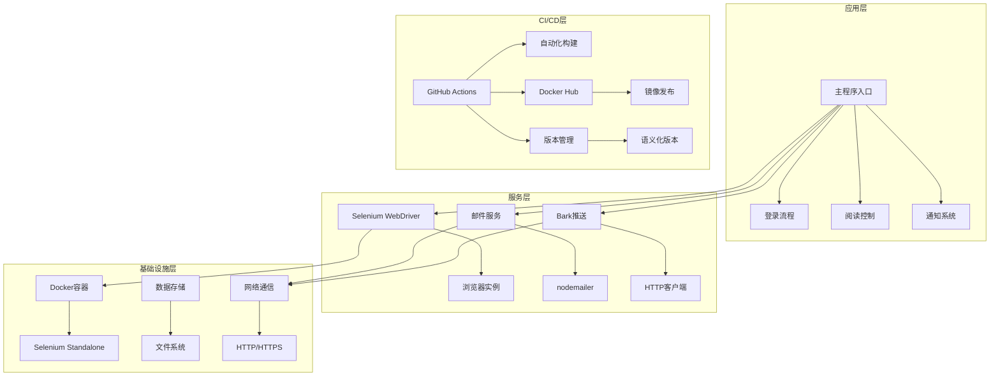
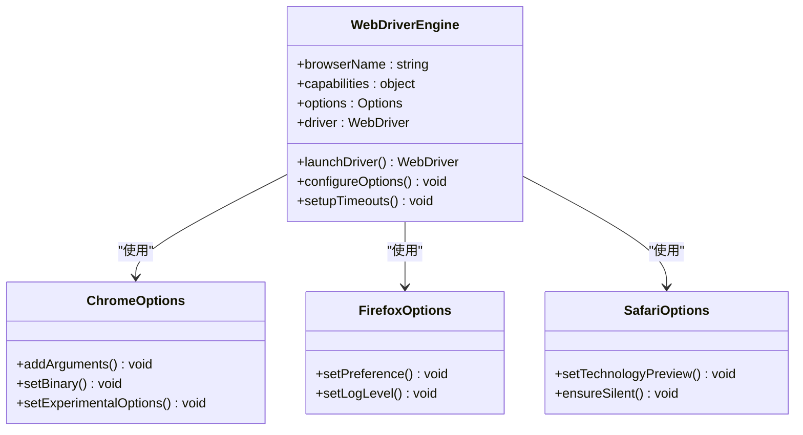
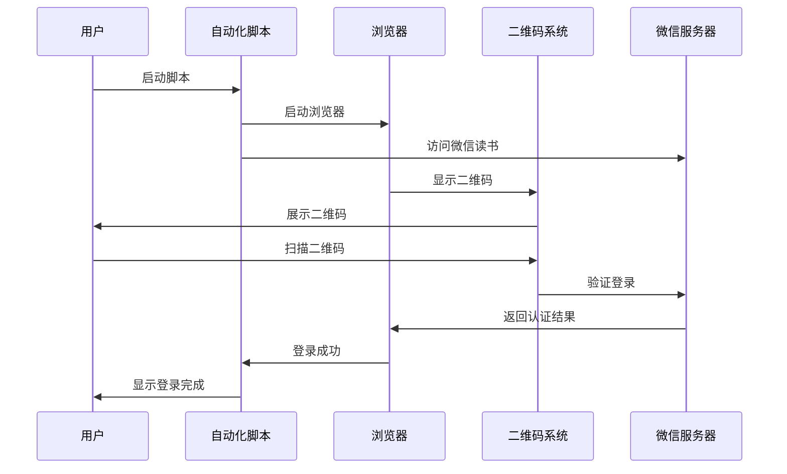
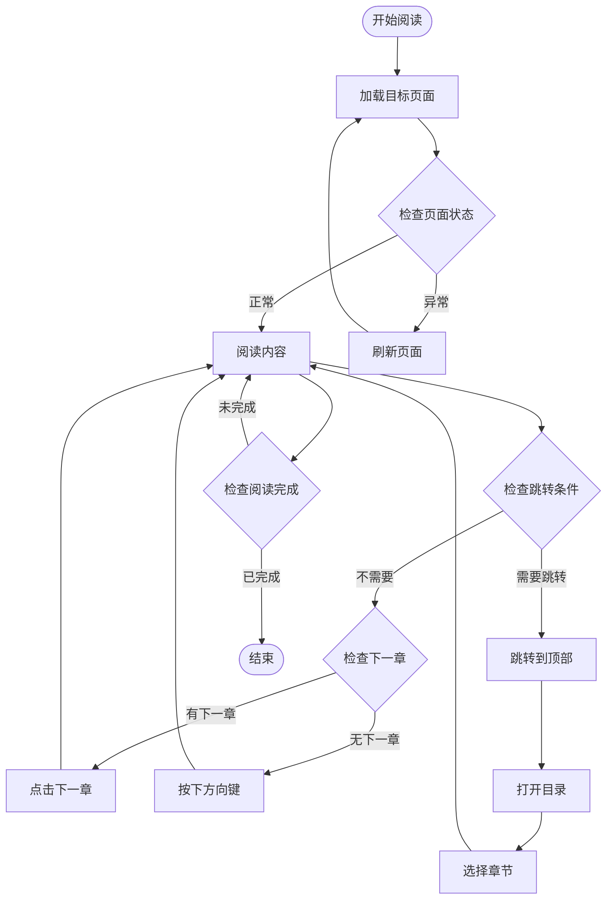
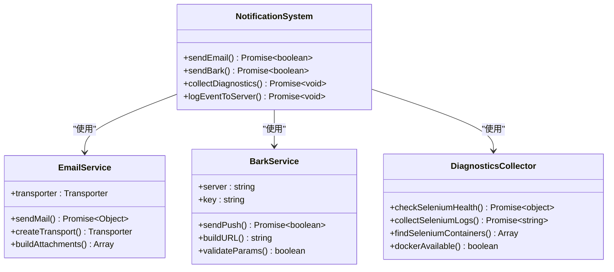
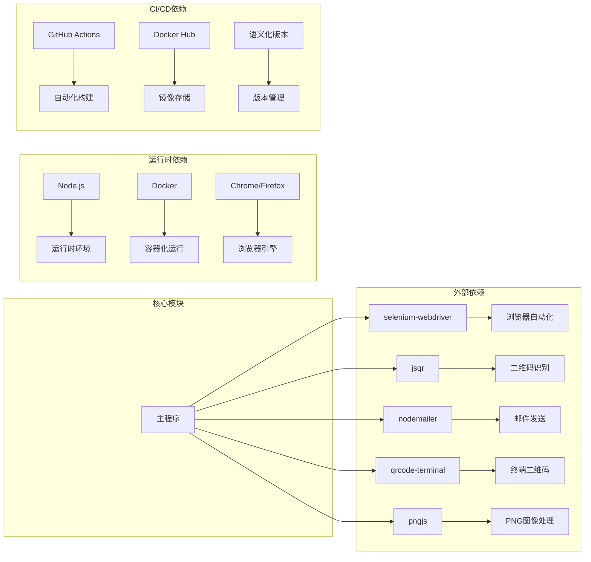
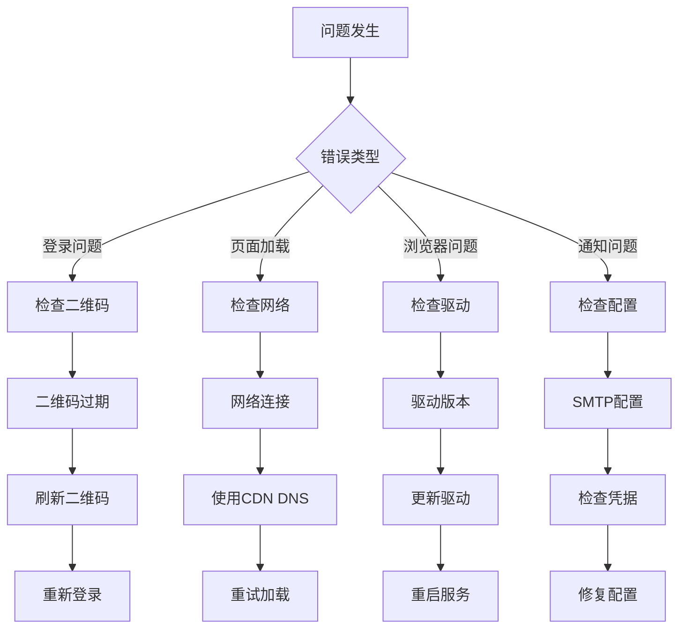

# CI/CD 流水线增强

<cite>
**本文档引用的文件**
- [package.json](file://package.json)
- [Dockerfile](file://Dockerfile)
- [docker-compose.yml](file://docker-compose.yml)
- [src/weread-challenge.js](file://src/weread-challenge.js)
- [.github/workflows/docker-publish.yml](file://.github/workflows/docker-publish.yml)
- [.github/workflows/docker-dev-publish.yml](file://.github/workflows/docker-dev-publish.yml)
- [README-dev.md](file://README-dev.md)
- [AGENTS.md](file://AGENTS.md)
- [.gitignore](file://.gitignore)
- [data/cookies.json](file://data/cookies.json)
- [data/output.log](file://data/output.log)
</cite>

## 目录
1. [简介](#简介)
2. [项目结构](#项目结构)
3. [核心组件](#核心组件)
4. [架构概览](#架构概览)
5. [详细组件分析](#详细组件分析)
6. [依赖关系分析](#依赖关系分析)
7. [性能考虑](#性能考虑)
8. [故障排除指南](#故障排除指南)
9. [结论](#结论)

## 简介

这是一个基于 Selenium 的微信读书挑战自动化脚本，专门设计用于增强 CI/CD 流水线的可靠性。该项目实现了完整的端到端测试流程，包括登录认证、阅读控制、截图监控和通知推送等功能。

项目的核心目标是提供一个可靠的自动化解决方案，能够在 CI/CD 环境中稳定运行，支持多种浏览器和部署方式。通过 Docker 容器化部署和 GitHub Actions 自动化构建，确保了跨平台的一致性和可重复性。

## 项目结构

项目采用模块化设计，主要包含以下核心组件：

**图表来源**
- [package.json](file://package.json#L1-L31)
- [Dockerfile](file://Dockerfile#L1-L8)
- [docker-compose.yml](file://docker-compose.yml#L1-L32)

**章节来源**
- [package.json](file://package.json#L1-L31)
- [Dockerfile](file://Dockerfile#L1-L8)
- [docker-compose.yml](file://docker-compose.yml#L1-L32)

## 核心组件

### 主要功能模块

项目包含以下核心功能模块：

1. **浏览器自动化引擎** - 基于 Selenium WebDriver 实现
2. **二维码识别系统** - 使用 jsqr 库进行二维码解码
3. **邮件通知系统** - 通过 nodemailer 发送邮件
4. **Bark 推送系统** - 支持移动端推送通知
5. **日志管理系统** - 结构化日志输出和文件管理
6. **截图监控系统** - 定时截图和页面状态监控

### 环境配置系统

系统支持丰富的环境变量配置：

| 配置项 | 类型 | 默认值 | 描述 |
|--------|------|--------|------|
| WEREAD_REMOTE_BROWSER | 字符串 | 未设置 | 远程浏览器地址 |
| WEREAD_DURATION | 数字 | 10 | 阅读时长（分钟） |
| WEREAD_SPEED | 字符串 | "slow" | 阅读速度（slow/normal/fast） |
| WEREAD_BROWSER | 字符串 | "chrome" | 浏览器类型 |
| ENABLE_EMAIL | 布尔值 | false | 启用邮件通知 |
| WEREAD_SCREENSHOT | 布尔值 | true | 启用截图功能 |
| DEBUG | 布尔值 | false | 调试模式 |

**章节来源**
- [src/weread-challenge.js](file://src/weread-challenge.js#L42-L75)
- [package.json](file://package.json#L15-L22)

## 架构概览

项目采用分层架构设计，实现了清晰的关注点分离：

**图表来源**
- [src/weread-challenge.js](file://src/weread-challenge.js#L794-L1330)
- [.github/workflows/docker-publish.yml](file://.github/workflows/docker-publish.yml#L1-L53)

## 详细组件分析

### Selenium 自动化引擎

系统使用 Selenium WebDriver 实现浏览器自动化，支持多种浏览器类型：

**图表来源**
- [src/weread-challenge.js](file://src/weread-challenge.js#L805-L877)

### 登录认证流程

登录流程实现了完整的二维码扫描和认证机制：

**图表来源**
- [src/weread-challenge.js](file://src/weread-challenge.js#L914-L1021)

### 阅读控制算法

阅读控制实现了智能的页面导航和内容浏览：

**图表来源**
- [src/weread-challenge.js](file://src/weread-challenge.js#L1139-L1271)

### 通知系统架构

通知系统提供了多种通知方式的统一接口：

**图表来源**
- [src/weread-challenge.js](file://src/weread-challenge.js#L621-L792)

**章节来源**
- [src/weread-challenge.js](file://src/weread-challenge.js#L794-L1330)

## 依赖关系分析

项目依赖关系展现了清晰的模块化架构：

**图表来源**
- [package.json](file://package.json#L23-L29)
- [Dockerfile](file://Dockerfile#L1-L8)

**章节来源**
- [package.json](file://package.json#L23-L29)
- [AGENTS.md](file://AGENTS.md#L29-L34)

## 性能考虑

### 浏览器性能优化

系统实现了多项性能优化措施：

1. **智能超时配置** - 动态设置隐式、显式和脚本超时
2. **随机化操作** - 随机延迟减少检测风险
3. **内存管理** - 及时释放浏览器资源
4. **网络优化** - CDN DNS 设置和连接池管理

### 容器化性能

Docker 配置针对性能进行了专门优化：

- **共享内存大小** - 2GB SHM 配置避免 Chrome 崩溃
- **多架构支持** - 同时支持 amd64 和 arm64
- **精简基础镜像** - Alpine Linux 减少镜像体积
- **生产环境优化** - 移除开发依赖减少包大小

### 监控和诊断

系统内置了全面的监控和诊断能力：

- **健康检查** - 自动检测 Selenium 服务状态
- **日志聚合** - 结构化日志输出和文件管理
- **错误追踪** - 完整的错误堆栈信息
- **性能指标** - 页面加载时间和操作耗时

## 故障排除指南

### 常见问题诊断

### 调试模式启用

系统提供了多种调试模式：

1. **控制台调试** - 设置 `DEBUG=true` 启用详细日志
2. **远程调试** - 通过 `WEREAD_REMOTE_BROWSER` 连接远程浏览器
3. **开发模式** - 使用 `npm run dev` 启动开发环境
4. **详细日志** - 查看 `data/output.log` 获取完整日志

### 性能监控

关键性能指标监控：

- **页面加载时间** - 目标页面加载完成时间
- **操作响应时间** - 关键操作的平均响应时间
- **内存使用情况** - 浏览器进程内存占用
- **CPU 使用率** - 自动化脚本 CPU 占用
- **网络延迟** - 请求响应时间统计

**章节来源**
- [src/weread-challenge.js](file://src/weread-challenge.js#L1291-L1327)
- [data/output.log](file://data/output.log#L1-L112)

## 结论

本项目成功实现了 CI/CD 流水线增强的关键目标，提供了：

1. **高度可靠的自动化** - 完整的端到端测试流程
2. **灵活的部署方式** - 支持本地和容器化部署
3. **强大的监控能力** - 全面的诊断和日志系统
4. **优雅的错误处理** - 完善的异常捕获和恢复机制
5. **标准化的 CI/CD** - GitHub Actions 自动化构建和发布

通过模块化设计和清晰的架构分离，项目为后续的功能扩展和维护奠定了坚实基础。建议在未来版本中增加单元测试覆盖率、性能基准测试和更多的监控指标。