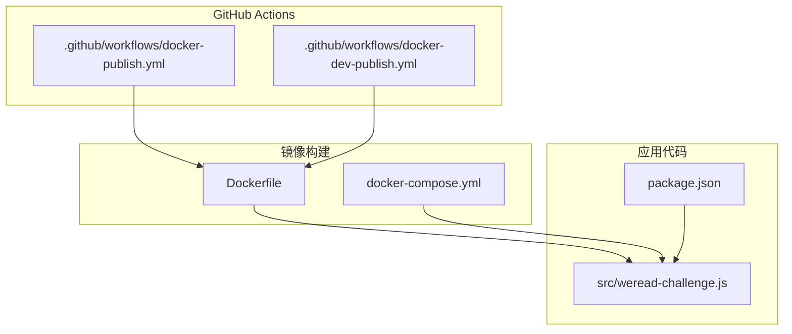
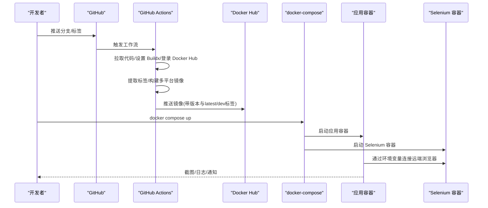
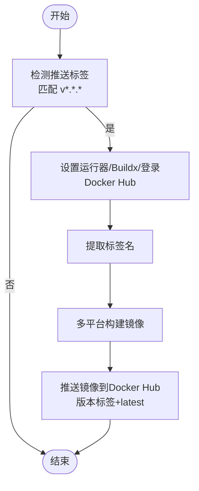
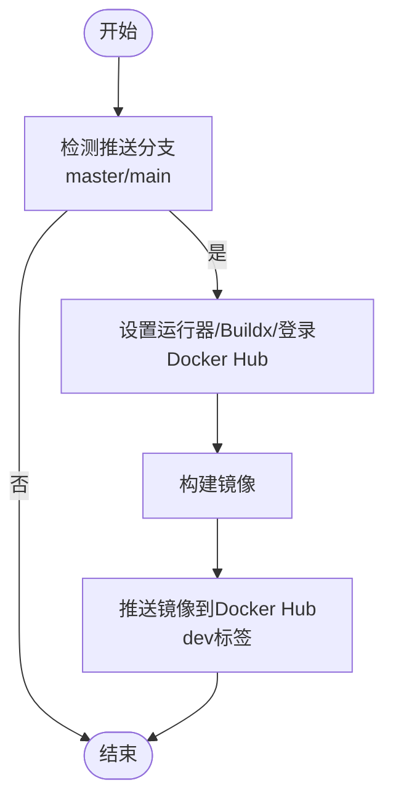
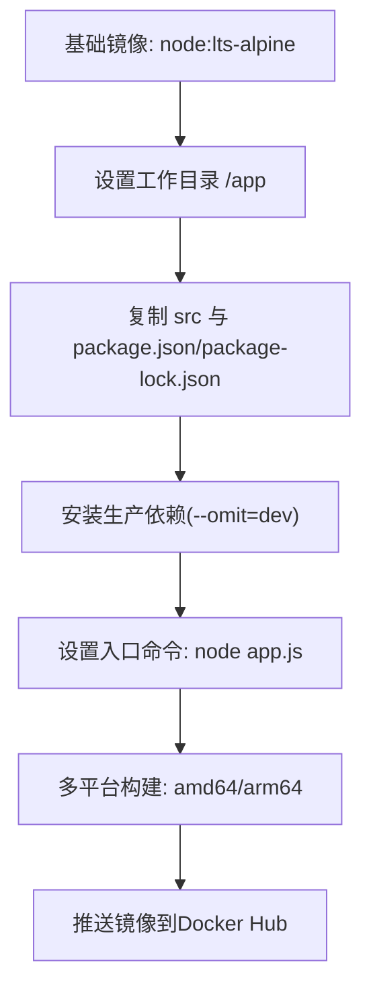
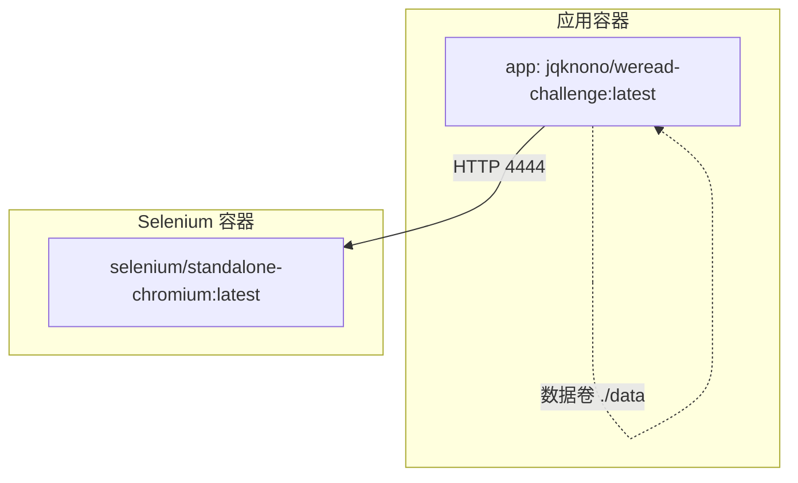
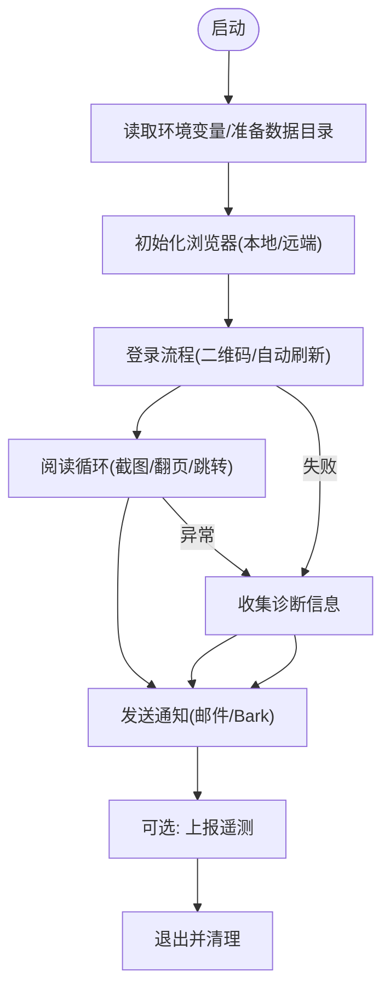
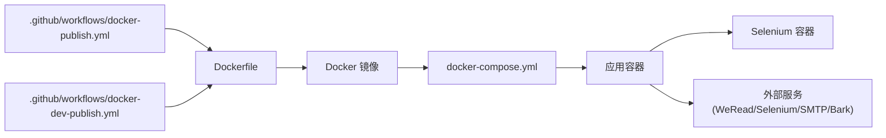

# CI/CD 流水线配置

<cite>
**本文引用的文件**
- [.github/workflows/docker-publish.yml](file://.github/workflows/docker-publish.yml)
- [.github/workflows/docker-dev-publish.yml](file://.github/workflows/docker-dev-publish.yml)
- [Dockerfile](file://Dockerfile)
- [docker-compose.yml](file://docker-compose.yml)
- [package.json](file://package.json)
- [src/weread-challenge.js](file://src/weread-challenge.js)
- [AGENTS.md](file://AGENTS.md)
- [README-dev.md](file://README-dev.md)
</cite>

## 目录
1. [简介](#简介)
2. [项目结构](#项目结构)
3. [核心组件](#核心组件)
4. [架构总览](#架构总览)
5. [详细组件分析](#详细组件分析)
6. [依赖关系分析](#依赖关系分析)
7. [性能考量](#性能考量)
8. [故障排查指南](#故障排查指南)
9. [结论](#结论)
10. [附录](#附录)

## 简介
本文件面向 WeRead 挑战赛自动化项目，系统化梳理并输出基于 GitHub Actions 的 CI/CD 流水线配置文档。内容覆盖：
- 触发条件与执行环境
- 构建与打包步骤
- 多平台镜像构建与发布
- 分支与标签策略
- 权限与密钥管理
- 错误处理与诊断
- 可扩展性与企业级集成建议

目标是帮助开发者与运维人员快速理解并维护该自动化流水线，确保镜像构建、测试与发布流程稳定可靠。

## 项目结构
该项目采用“前端自动化脚本 + Docker 化运行 + GitHub Actions 自动化”的整体架构。关键文件与职责如下：
- GitHub Actions 工作流：负责在推送标签或主干分支时自动构建并推送 Docker 镜像
- Dockerfile：定义镜像基础环境、复制应用与依赖、设置入口命令
- docker-compose.yml：本地/集成测试时编排应用与 Selenium 服务
- package.json：定义运行脚本与依赖
- src/weread-challenge.js：核心自动化脚本，负责登录、阅读、截图、邮件与 Bark 推送等
- AGENTS.md：仓库规范、测试指南、提交与安全提示
- README-dev.md：开发与调试指引

图表来源
- [.github/workflows/docker-publish.yml](file://.github/workflows/docker-publish.yml#L1-L39)
- [.github/workflows/docker-dev-publish.yml](file://.github/workflows/docker-dev-publish.yml#L1-L35)
- [Dockerfile](file://Dockerfile#L1-L8)
- [docker-compose.yml](file://docker-compose.yml#L1-L32)
- [src/weread-challenge.js](file://src/weread-challenge.js#L1-L1279)
- [package.json](file://package.json#L1-L10)

章节来源
- [.github/workflows/docker-publish.yml](file://.github/workflows/docker-publish.yml#L1-L39)
- [.github/workflows/docker-dev-publish.yml](file://.github/workflows/docker-dev-publish.yml#L1-L35)
- [Dockerfile](file://Dockerfile#L1-L8)
- [docker-compose.yml](file://docker-compose.yml#L1-L32)
- [package.json](file://package.json#L1-L10)
- [src/weread-challenge.js](file://src/weread-challenge.js#L1-L1279)
- [AGENTS.md](file://AGENTS.md#L1-L34)
- [README-dev.md](file://README-dev.md#L1-L14)

## 核心组件
- GitHub Actions 工作流
  - 生产镜像发布：仅在推送符合语义化版本标签时触发，构建多平台镜像并推送到 Docker Hub
  - 开发镜像发布：在推送到主干分支时触发，构建并推送 dev 标签镜像
- Docker 镜像
  - 基于 Node LTS Alpine，复制源码与依赖，安装生产依赖，设置入口命令
- 应用脚本
  - 支持本地与远端浏览器运行，内置健康检查、日志与诊断、截图与通知能力
- 本地编排
  - 使用 docker-compose 启动应用与 Selenium Standalone Chromium，便于集成测试与验收

章节来源
- [.github/workflows/docker-publish.yml](file://.github/workflows/docker-publish.yml#L1-L39)
- [.github/workflows/docker-dev-publish.yml](file://.github/workflows/docker-dev-publish.yml#L1-L35)
- [Dockerfile](file://Dockerfile#L1-L8)
- [docker-compose.yml](file://docker-compose.yml#L1-L32)
- [src/weread-challenge.js](file://src/weread-challenge.js#L1-L1279)

## 架构总览
下图展示从代码提交到镜像发布的端到端流程，以及本地编排与应用交互：

图表来源
- [.github/workflows/docker-publish.yml](file://.github/workflows/docker-publish.yml#L1-L39)
- [.github/workflows/docker-dev-publish.yml](file://.github/workflows/docker-dev-publish.yml#L1-L35)
- [docker-compose.yml](file://docker-compose.yml#L1-L32)
- [src/weread-challenge.js](file://src/weread-challenge.js#L1-L1279)

## 详细组件分析

### GitHub Actions 工作流：生产镜像发布
- 触发条件
  - 仅当推送符合语义化版本标签时触发
- 执行环境
  - Ubuntu 最新运行器
- 关键步骤
  - 拉取代码、设置 Docker Buildx、登录 Docker Hub
  - 提取标签名并作为镜像标签之一
  - 多平台构建（linux/amd64, linux/arm64）
  - 推送镜像至 Docker Hub，包含版本标签与 latest 标签
- 安全与密钥
  - 使用仓库密钥 DOCKERHUB_USERNAME 与 DOCKERHUB_TOKEN

图表来源
- [.github/workflows/docker-publish.yml](file://.github/workflows/docker-publish.yml#L1-L39)

章节来源
- [.github/workflows/docker-publish.yml](file://.github/workflows/docker-publish.yml#L1-L39)

### GitHub Actions 工作流：开发镜像发布
- 触发条件
  - 推送主干分支（master/main）
- 执行环境
  - Ubuntu 最新运行器
- 关键步骤
  - 拉取代码、设置 Docker Buildx、登录 Docker Hub
  - 构建并推送 dev 标签镜像
- 安全与密钥
  - 使用仓库密钥 DOCKERHUB_USERNAME 与 DOCKERHUB_TOKEN

图表来源
- [.github/workflows/docker-dev-publish.yml](file://.github/workflows/docker-dev-publish.yml#L1-L35)

章节来源
- [.github/workflows/docker-dev-publish.yml](file://.github/workflows/docker-dev-publish.yml#L1-L35)

### Docker 镜像构建与发布
- 基础镜像与工作目录
  - 基于 Node LTS Alpine，设置工作目录
- 复制与安装
  - 复制源码与依赖文件，仅安装生产依赖
- 入口命令
  - 以 Node 启动应用脚本
- 多平台支持
  - 工作流中通过 Buildx 指定 linux/amd64 与 linux/arm64
- 发布策略
  - 生产：版本标签与 latest
  - 开发：dev

图表来源
- [Dockerfile](file://Dockerfile#L1-L8)
- [.github/workflows/docker-publish.yml](file://.github/workflows/docker-publish.yml#L28-L37)
- [.github/workflows/docker-dev-publish.yml](file://.github/workflows/docker-dev-publish.yml#L25-L33)

章节来源
- [Dockerfile](file://Dockerfile#L1-L8)
- [.github/workflows/docker-publish.yml](file://.github/workflows/docker-publish.yml#L1-L39)
- [.github/workflows/docker-dev-publish.yml](file://.github/workflows/docker-dev-publish.yml#L1-L35)

### 本地编排与集成测试
- 服务编排
  - 应用服务：映射数据卷、依赖 Selenium、设置 DNS
  - Selenium 服务：独立容器，健康检查，共享内存与 Docker Socket
- 运行与验证
  - 通过 docker compose 启动，验证镜像可用性与端到端流程
- 环境变量
  - 应用通过环境变量控制远端浏览器、阅读时长、截图、通知等

图表来源
- [docker-compose.yml](file://docker-compose.yml#L1-L32)
- [src/weread-challenge.js](file://src/weread-challenge.js#L1-L1279)

章节来源
- [docker-compose.yml](file://docker-compose.yml#L1-L32)
- [src/weread-challenge.js](file://src/weread-challenge.js#L1-L1279)

### 应用脚本：自动化流程与错误处理
- 功能概览
  - 支持本地与远端浏览器运行，自动登录、阅读、截图、通知
  - 健康检查与诊断：Selenium 健康检查、容器日志采集
  - 环境变量驱动：浏览器类型、阅读时长、通知开关、截图策略等
- 错误处理与诊断
  - 异常捕获、错误信息增强、收集诊断信息（Selenium 健康状态、容器日志）
  - 失败时发送通知（邮件/Bark），并可上报遥测
- 性能与稳定性
  - 随机按键间隔、窗口尺寸随机化、页面刷新与重试策略

图表来源
- [src/weread-challenge.js](file://src/weread-challenge.js#L1-L1279)

章节来源
- [src/weread-challenge.js](file://src/weread-challenge.js#L1-L1279)
- [AGENTS.md](file://AGENTS.md#L1-L34)

## 依赖关系分析
- 工作流对镜像构建的依赖
  - docker-publish.yml 依赖 Dockerfile 与 Docker Hub 凭据
  - docker-dev-publish.yml 依赖 Dockerfile 与 Docker Hub 凭据
- 镜像对应用代码的依赖
  - Dockerfile 复制 src 与 package.json，安装生产依赖，CMD 启动应用
- 本地编排对应用与 Selenium 的依赖
  - docker-compose 启动应用与 Selenium，应用通过环境变量连接远端浏览器
- 应用对外部系统的依赖
  - WeRead 网站、Selenium Grid、SMTP/Bark 服务（可选）

图表来源
- [.github/workflows/docker-publish.yml](file://.github/workflows/docker-publish.yml#L1-L39)
- [.github/workflows/docker-dev-publish.yml](file://.github/workflows/docker-dev-publish.yml#L1-L35)
- [Dockerfile](file://Dockerfile#L1-L8)
- [docker-compose.yml](file://docker-compose.yml#L1-L32)
- [src/weread-challenge.js](file://src/weread-challenge.js#L1-L1279)

章节来源
- [.github/workflows/docker-publish.yml](file://.github/workflows/docker-publish.yml#L1-L39)
- [.github/workflows/docker-dev-publish.yml](file://.github/workflows/docker-dev-publish.yml#L1-L35)
- [Dockerfile](file://Dockerfile#L1-L8)
- [docker-compose.yml](file://docker-compose.yml#L1-L32)
- [src/weread-challenge.js](file://src/weread-challenge.js#L1-L1279)

## 性能考量
- 多平台构建
  - 通过 Buildx 同时构建 amd64 与 arm64，提升跨平台兼容性
- 运行时优化
  - 仅安装生产依赖，减少镜像体积
  - 随机按键间隔与窗口尺寸，降低被风控概率
- 资源与稳定性
  - docker-compose 设置共享内存与 DNS，提升浏览器稳定性
  - 健康检查与自动刷新策略，增强流程鲁棒性

章节来源
- [.github/workflows/docker-publish.yml](file://.github/workflows/docker-publish.yml#L33-L37)
- [Dockerfile](file://Dockerfile#L6-L6)
- [docker-compose.yml](file://docker-compose.yml#L16-L31)
- [src/weread-challenge.js](file://src/weread-challenge.js#L1090-L1126)

## 故障排查指南
- 常见问题与定位
  - 登录失败：检查二维码元素定位、自动刷新逻辑与截图保存路径
  - 远端浏览器不可达：检查 WEREAD_REMOTE_BROWSER 环境变量与健康检查
  - 截图异常：检查截图频率、文件大小阈值与页面刷新策略
  - 通知失败：检查 SMTP/Bark 配置与网络连通性
- 诊断工具
  - 应用内置健康检查与日志重定向
  - 诊断函数收集 Selenium 健康状态与容器日志
- 安全与密钥
  - 严禁在仓库中硬编码凭据，使用仓库密钥管理
  - 建议使用 .env.local 并加入 .gitignore

章节来源
- [src/weread-challenge.js](file://src/weread-challenge.js#L125-L152)
- [src/weread-challenge.js](file://src/weread-challenge.js#L186-L232)
- [AGENTS.md](file://AGENTS.md#L29-L33)

## 结论
本项目通过 GitHub Actions 实现了稳定的镜像构建与发布流程，配合 Docker 与 docker-compose 提供了可靠的本地与集成测试环境。应用脚本具备完善的错误处理与诊断能力，能够满足自动化挑战赛场景的需求。建议在企业环境中进一步完善分支保护、权限分级与审计日志，以满足合规要求。

## 附录

### 分支与标签策略
- 生产发布：仅在推送语义化版本标签时触发
- 开发发布：在推送到主干分支时触发
- 建议
  - 使用 Conventional Commits 规范提交信息
  - 对关键变更打上版本标签，便于回溯与发布

章节来源
- [.github/workflows/docker-publish.yml](file://.github/workflows/docker-publish.yml#L3-L6)
- [.github/workflows/docker-dev-publish.yml](file://.github/workflows/docker-dev-publish.yml#L3-L7)
- [AGENTS.md](file://AGENTS.md#L24-L27)

### 权限与密钥管理
- 密钥
  - DOCKERHUB_USERNAME、DOCKERHUB_TOKEN
- 建议
  - 限制密钥作用域与访问范围
  - 定期轮换密钥并审计访问日志

章节来源
- [.github/workflows/docker-publish.yml](file://.github/workflows/docker-publish.yml#L18-L22)
- [.github/workflows/docker-dev-publish.yml](file://.github/workflows/docker-dev-publish.yml#L19-L23)
- [AGENTS.md](file://AGENTS.md#L29-L33)

### 自定义扩展与企业级集成
- 扩展点
  - 新增工作流：如单元测试、安全扫描、发布注释生成
  - 多环境：区分 dev/stage/prod，分别推送不同标签
- 企业集成
  - 集成企业镜像仓库与私有网络
  - 加入权限校验与审计日志
  - 与 CI/CD 平台的工件与告警对接

章节来源
- [AGENTS.md](file://AGENTS.md#L19-L22)
- [README-dev.md](file://README-dev.md#L1-L14)