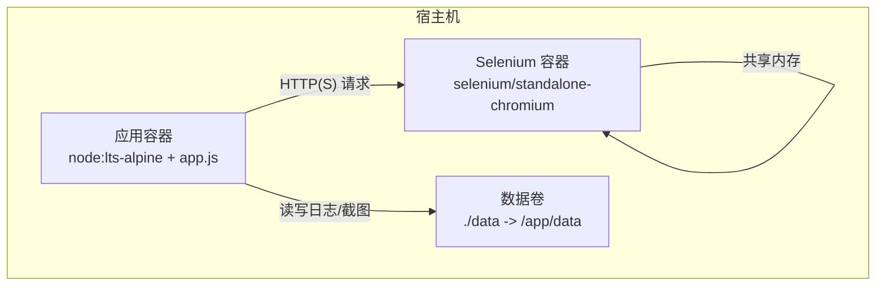
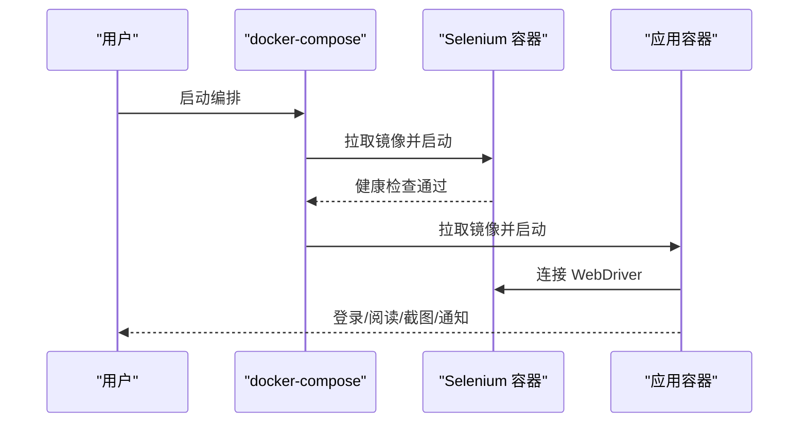
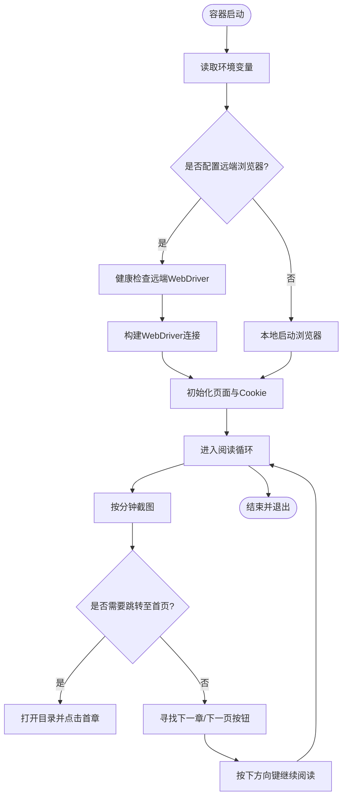

# Docker 容器化部署

<cite>
**本文引用的文件**
- [Dockerfile](file://Dockerfile)
- [docker-compose.yml](file://docker-compose.yml)
- [package.json](file://package.json)
- [src/weread-challenge.js](file://src/weread-challenge.js)
- [AGENTS.md](file://AGENTS.md)
- [README-dev.md](file://README-dev.md)
</cite>

## 目录
1. [简介](#简介)
2. [项目结构](#项目结构)
3. [核心组件](#核心组件)
4. [架构总览](#架构总览)
5. [组件详解](#组件详解)
6. [依赖关系分析](#依赖关系分析)
7. [性能与资源优化](#性能与资源优化)
8. [故障排除指南](#故障排除指南)
9. [结论](#结论)
10. [附录](#附录)

## 简介
本文件面向 WeRead 挑战赛自动化项目，提供从零到一的 Docker 容器化部署指南。内容涵盖 Dockerfile 构建配置、docker-compose 服务编排、部署流程、容器优化与安全实践，以及多环境部署示例与常见问题排查。

## 项目结构
该项目采用“单体应用 + Selenium 远程浏览器”的双容器编排模式：
- 应用容器负责登录、阅读循环、截图与通知等主流程；
- Selenium 容器作为远端浏览器节点，供应用容器通过 WebDriver 协议连接。



图表来源
- [docker-compose.yml](file://docker-compose.yml#L1-L32)
- [Dockerfile](file://Dockerfile#L1-L8)

章节来源
- [docker-compose.yml](file://docker-compose.yml#L1-L32)
- [Dockerfile](file://Dockerfile#L1-L8)

## 核心组件
- 应用镜像与入口
  - 基础镜像：基于 Node.js 的 Alpine 版本，体积小、启动快。
  - 工作目录：/app。
  - 文件复制：仅复制运行所需的源文件与依赖清单，减少镜像层数。
  - 依赖安装：仅安装生产依赖，剔除开发依赖，降低镜像体积。
  - 启动命令：以 node 执行应用入口文件。
- 服务编排
  - 应用服务：拉取最新镜像，注入环境变量，挂载数据卷，等待 Selenium 健康后再启动。
  - Selenium 服务：独立的 Chromium Standalone 容器，启用共享内存，暴露 WebDriver 端口。
  - 网络与 DNS：通过自定义 DNS 提升域名解析稳定性；服务间通过服务名互联。
  - 健康检查：Selenium 服务内置健康检查，确保 WebDriver 可用。

章节来源
- [Dockerfile](file://Dockerfile#L1-L8)
- [docker-compose.yml](file://docker-compose.yml#L1-L32)
- [package.json](file://package.json#L1-L10)

## 架构总览
下图展示容器启动顺序与交互流程：



图表来源
- [docker-compose.yml](file://docker-compose.yml#L1-L32)
- [src/weread-challenge.js](file://src/weread-challenge.js#L792-L815)

## 组件详解

### Dockerfile 构建配置
- 基础镜像选择
  - 使用 Node.js LTS 的 Alpine 版本，兼顾体积与稳定性。
- 工作目录
  - 设置 /app 为工作目录，后续 COPY 与 RUN 均在此上下文中执行。
- 文件复制策略
  - 仅复制运行所需文件：应用入口与依赖清单，避免无关文件进入镜像。
- 依赖安装
  - 仅安装生产依赖，减少镜像体积与攻击面。
- 启动命令
  - CMD 指定应用入口，确保容器启动即运行主流程。

章节来源
- [Dockerfile](file://Dockerfile#L1-L8)

### docker-compose.yml 服务编排
- 服务定义与镜像策略
  - 应用服务：始终拉取最新镜像，确保部署一致性。
  - Selenium 服务：仅当本地不存在时拉取，节省带宽。
- 环境变量传递
  - WEREAD_REMOTE_BROWSER：指向 Selenium 地址，支持 http/https。
  - WEREAD_DURATION：阅读时长（分钟）。
  - 其他变量：浏览器类型、邮件与 Bark 推送等（由应用读取）。
- 卷挂载
  - 将宿主机 ./data 映射到容器 /app/data，持久化 cookies、截图与日志。
- 网络与 DNS
  - 自定义 DNS 提升解析可靠性；服务间通过服务名互联。
- 健康检查
  - Selenium 服务对 /status 或 /wd/hub/status 进行探测，失败重试多次。

章节来源
- [docker-compose.yml](file://docker-compose.yml#L1-L32)

### 应用容器启动流程（代码级）
- 远端浏览器连接
  - 当配置了 WEREAD_REMOTE_BROWSER 时，应用会进行健康检查并连接远端 WebDriver。
- 本地浏览器运行
  - 未配置远端地址时，应用在本地启动浏览器实例。
- 超时与窗口尺寸
  - 设置隐式/页面加载/脚本超时；随机窗口尺寸提升反爬规避效果。
- 登录与阅读循环
  - 二维码识别与刷新、章节跳转、定时截图、异常处理与诊断日志采集。



图表来源
- [src/weread-challenge.js](file://src/weread-challenge.js#L745-L1279)

章节来源
- [src/weread-challenge.js](file://src/weread-challenge.js#L745-L1279)

### 环境变量与配置项
- 关键变量
  - WEREAD_REMOTE_BROWSER：远端 WebDriver 地址（http/https）。
  - WEREAD_DURATION：阅读时长（分钟）。
  - WEREAD_BROWSER：目标浏览器类型（chrome/edge/firefox/safari）。
  - ENABLE_EMAIL：是否启用邮件通知。
  - WEREAD_SCREENSHOT：是否按分钟截图。
  - EMAIL_*：SMTP 主机、端口、发件人、授权码、收件人等。
  - BARK_*：推送服务密钥与服务器地址。
  - WEREAD_AGREE_TERMS：是否上报事件统计。
- 数据卷
  - /app/data：cookies.json、login.png、output.log、截图等。

章节来源
- [src/weread-challenge.js](file://src/weread-challenge.js#L24-L55)
- [docker-compose.yml](file://docker-compose.yml#L8-L9)

## 依赖关系分析
- 组件耦合
  - 应用容器依赖 Selenium 服务提供的 WebDriver 接口；二者通过服务名互联。
  - 应用容器依赖数据卷以持久化状态与日志。
- 外部依赖
  - Selenium Standalone Chromium 镜像；Node.js 运行时。
- 潜在风险
  - 网络连通性与 DNS 解析失败会导致应用无法连接远端浏览器。
  - 共享内存不足可能导致浏览器崩溃。

```mermaid
graph LR
APP["应用容器"] --> |HTTP(S)| SE["Selenium 容器"]
APP --> VOL["数据卷 /app/data"]
SE --> SHM["共享内存"]
```

图表来源
- [docker-compose.yml](file://docker-compose.yml#L15-L31)
- [src/weread-challenge.js](file://src/weread-challenge.js#L792-L815)

章节来源
- [docker-compose.yml](file://docker-compose.yml#L15-L31)
- [src/weread-challenge.js](file://src/weread-challenge.js#L792-L815)

## 性能与资源优化
- 镜像体积优化
  - 仅复制必要文件与安装生产依赖，减少镜像层数与体积。
- 启动速度优化
  - 使用轻量基础镜像与精简依赖，缩短容器启动时间。
- 运行时性能
  - 设置合理的超时与随机窗口尺寸，避免长时间卡顿。
  - 通过健康检查与重试机制提升容错能力。
- 资源限制建议
  - 可在 docker-compose 中添加资源限制（CPU/内存配额）以避免资源争用。
- 共享内存
  - Selenium 容器已设置共享内存大小，确保浏览器稳定运行。

章节来源
- [Dockerfile](file://Dockerfile#L1-L8)
- [docker-compose.yml](file://docker-compose.yml#L17-L18)

## 故障排除指南
- 连接远端浏览器失败
  - 确认 WEREAD_REMOTE_BROWSER 地址正确且可达；检查 Selenium 服务健康状态。
  - 查看应用容器日志与 Selenium 容器日志，定位具体错误。
- 二维码过期或无法识别
  - 应用会自动刷新二维码并截图；若仍失败，检查页面元素变化与定位策略。
- 截图异常或为空
  - 检查截图频率与文件大小阈值；必要时增大共享内存或调整截图策略。
- 邮件或推送失败
  - 核对 EMAIL_* 与 BARK_* 环境变量配置；确认网络可达性。
- 容器退出或崩溃
  - 查看健康检查与日志输出；必要时增加重试次数或调整超时设置。

章节来源
- [src/weread-challenge.js](file://src/weread-challenge.js#L1240-L1279)
- [docker-compose.yml](file://docker-compose.yml#L27-L31)

## 结论
本部署方案通过轻量镜像与双容器编排，实现了稳定的自动化阅读流程。配合健康检查、数据卷持久化与环境变量配置，可在不同环境中可靠运行。建议在生产环境中结合资源限制与安全策略进一步加固。

## 附录

### 部署流程（从镜像构建到容器启动）
- 步骤概览
  - 准备环境变量与数据卷目录；
  - 构建应用镜像（可选，若使用预构建镜像则跳过）；
  - 启动编排：拉起 Selenium 与应用容器；
  - 观察健康检查与日志输出；
  - 验证登录、阅读与截图功能；
  - 下线时清理资源。
- 参考命令
  - 启动：docker compose up -d
  - 下线：docker compose down
  - 查看日志：docker compose logs -f app selenium

章节来源
- [docker-compose.yml](file://docker-compose.yml#L1-L32)
- [AGENTS.md](file://AGENTS.md#L12-L12)

### 多环境部署示例
- 开发环境
  - 使用本地远端浏览器地址，便于联调；开启调试日志。
- 生产环境
  - 使用远程 Selenium 集群；配置健康检查与重试；限制资源并启用只读数据卷。
- 多账户并行
  - 通过不同数据卷路径区分各账户状态与日志；避免冲突。

章节来源
- [AGENTS.md](file://AGENTS.md#L32-L34)

### 安全最佳实践
- 环境变量管理
  - 所有敏感信息通过环境变量注入，不在镜像或仓库中硬编码。
- 最小权限原则
  - 镜像内仅安装必要依赖；避免安装额外工具。
- 网络隔离
  - 通过自定义 DNS 与服务名互联，减少外部暴露面。
- 日志与审计
  - 将日志输出到标准输出与文件，便于集中采集与审计。

章节来源
- [AGENTS.md](file://AGENTS.md#L29-L34)
- [src/weread-challenge.js](file://src/weread-challenge.js#L57-L92)