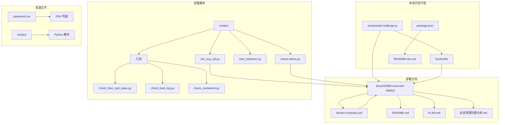
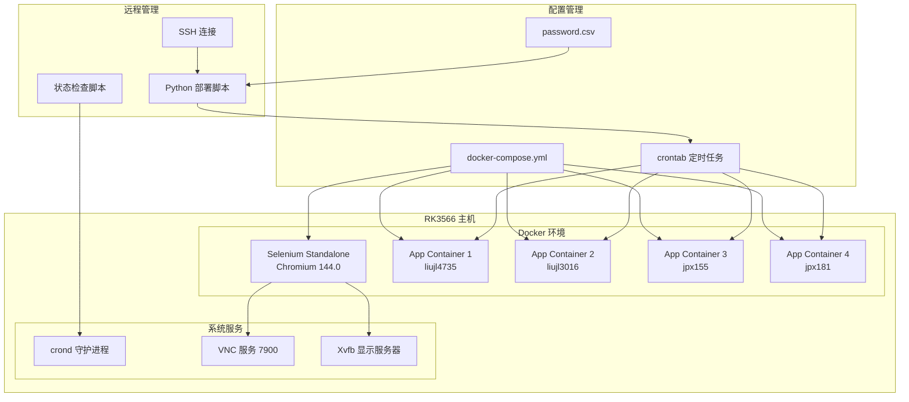
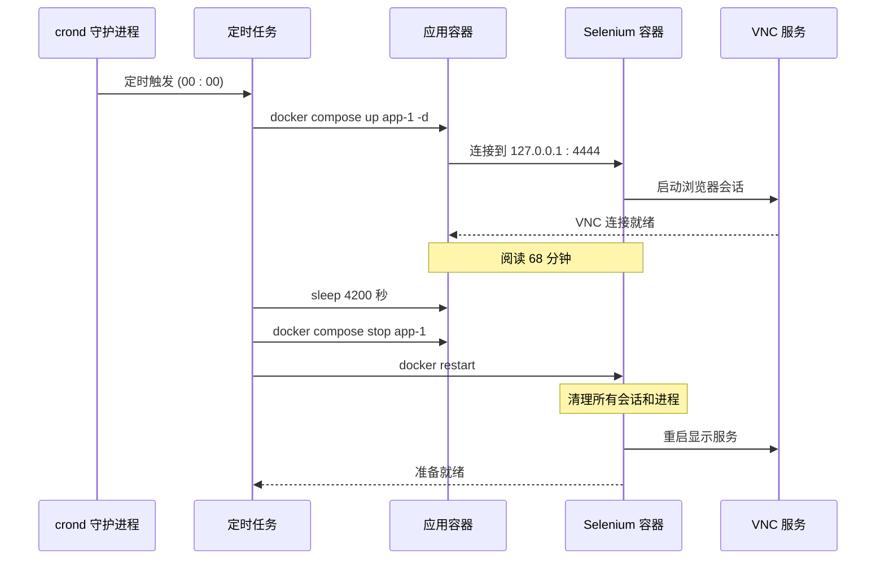
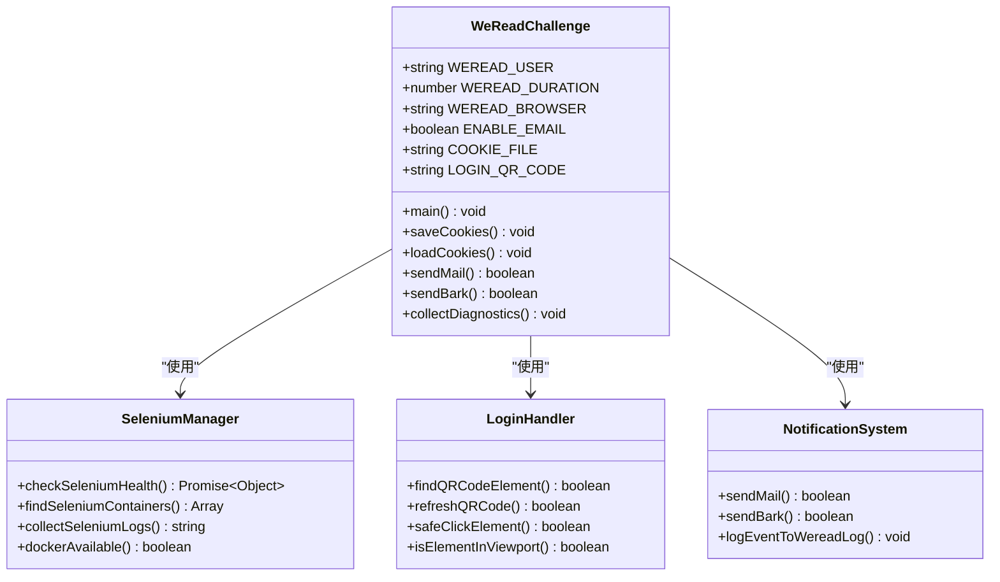
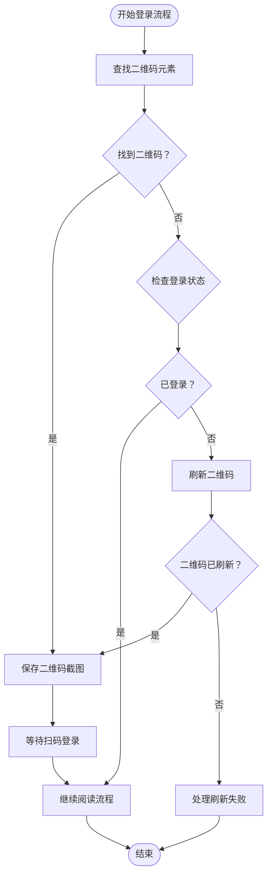
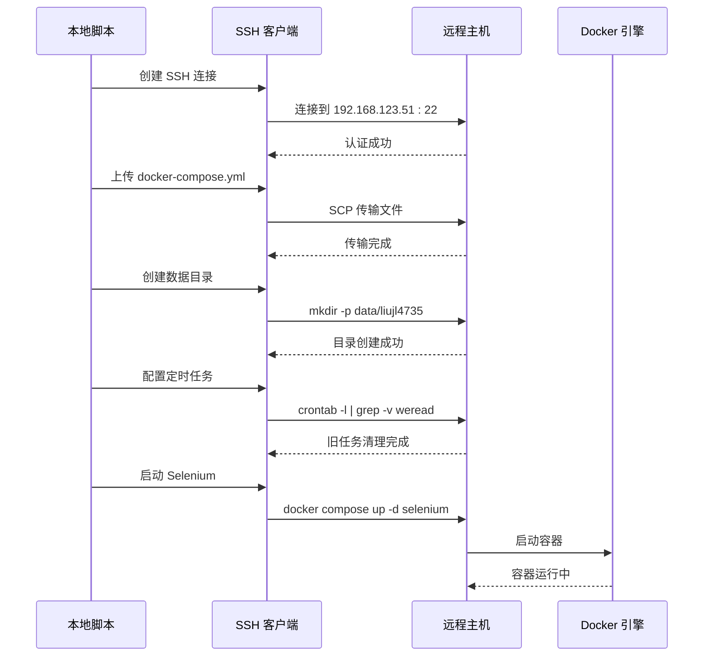
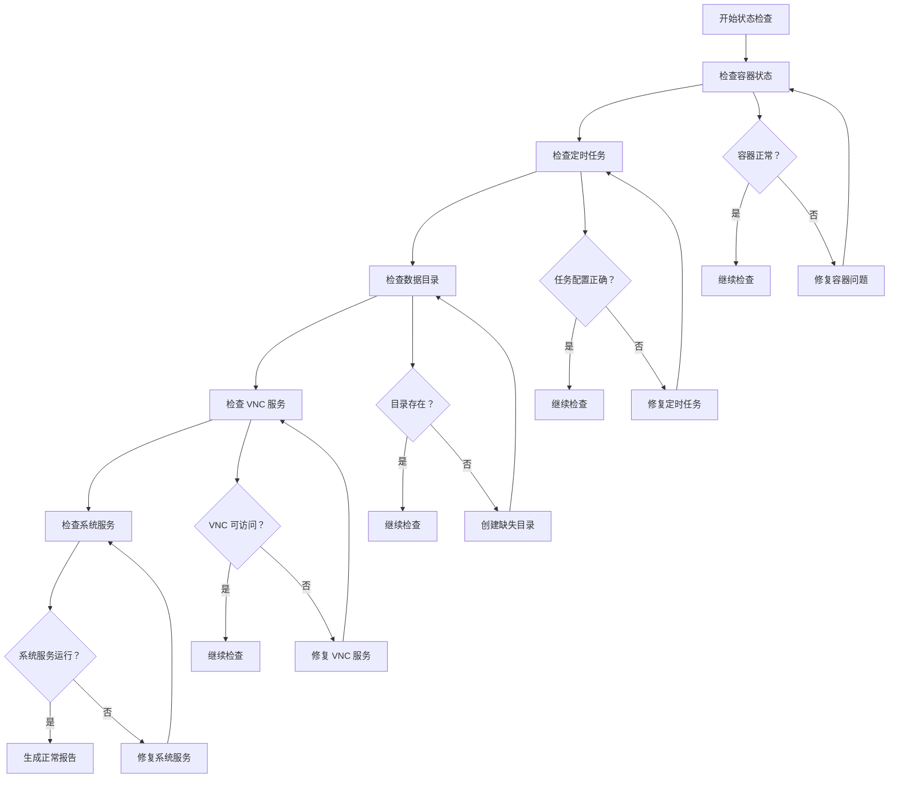
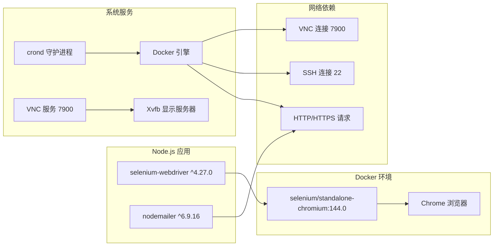
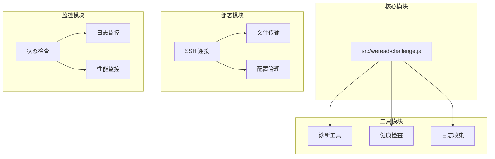

# RK3566 多用户部署系统

<cite>
**本文档引用的文件**
- [README-dev.md](file://README-dev.md)
- [package.json](file://package.json)
- [Dockerfile](file://Dockerfile)
- [src/weread-challenge.js](file://src/weread-challenge.js)
- [docs/rk3566-muti-user-deploy/README.md](file://docs/rk3566-muti-user-deploy/README.md)
- [docs/rk3566-muti-user-deploy/docker-compose.yml](file://docs/rk3566-muti-user-deploy/docker-compose.yml)
- [docs/rk3566-muti-user-deploy/password.csv](file://docs/rk3566-muti-user-deploy/password.csv)
- [docs/rk3566-muti-user-deploy/scripts/ssh_scp_util.py](file://docs/rk3566-muti-user-deploy/scripts/ssh_scp_util.py)
- [docs/rk3566-muti-user-deploy/scripts/check-status.py](file://docs/rk3566-muti-user-deploy/scripts/check-status.py)
- [docs/rk3566-muti-user-deploy/scripts/start_selenium.py](file://docs/rk3566-muti-user-deploy/scripts/start_selenium.py)
- [docs/rk3566-muti-user-deploy/scripts/工具/check_time_and_tasks.py](file://docs/rk3566-muti-user-deploy/scripts/工具/check_time_and_tasks.py)
- [docs/rk3566-muti-user-deploy/scripts/工具/check_boot_log.py](file://docs/rk3566-muti-user-deploy/scripts/工具/check_boot_log.py)
- [docs/rk3566-muti-user-deploy/scripts/工具/check_containers.py](file://docs/rk3566-muti-user-deploy/scripts/工具/check_containers.py)
- [docs/rk3566-muti-user-deploy/PLAN.md](file://docs/rk3566-muti-user-deploy/PLAN.md)
- [docs/rk3566-muti-user-deploy/会话清理问题分析.md](file://docs/rk3566-muti-user-deploy/会话清理问题分析.md)
</cite>

## 目录
1. [项目简介](#项目简介)
2. [项目结构](#项目结构)
3. [核心组件](#核心组件)
4. [架构概览](#架构概览)
5. [详细组件分析](#详细组件分析)
6. [依赖关系分析](#依赖关系分析)
7. [性能考虑](#性能考虑)
8. [故障排除指南](#故障排除指南)
9. [结论](#结论)

## 项目简介

RK3566 多用户部署系统是一个基于 Docker Compose 的自动化微信读书挑战系统，专为 RK3566 iStoreOS 主机构建，支持四个用户分时复用同一套 Selenium 环境进行自动化阅读。

### 系统特性

- **多用户分时复用**：4个用户共享同一套 Selenium 环境，通过定时任务实现时间片轮转
- **无人值守部署**：通过 Python 脚本自动完成部署、配置和监控
- **会话清理机制**：采用 Docker 重启方式彻底清理浏览器会话，避免内存泄漏
- **VNC 远程控制**：提供统一的 VNC 端口供用户远程访问和调试
- **开机自启动**：集成 OpenWrt 启动脚本，确保系统重启后自动恢复

## 项目结构

**图表来源**
- [src/weread-challenge.js:1-1279](file://src/weread-challenge.js#L1-L1279)
- [docs/rk3566-muti-user-deploy/docker-compose.yml:1-94](file://docs/rk3566-muti-user-deploy/docker-compose.yml#L1-L94)

**章节来源**
- [docs/rk3566-muti-user-deploy/README.md:1-390](file://docs/rk3566-muti-user-deploy/README.md#L1-L390)
- [docs/rk3566-muti-user-deploy/docker-compose.yml:1-94](file://docs/rk3566-muti-user-deploy/docker-compose.yml#L1-L94)

## 核心组件

### Selenium 服务容器

Selenium Standalone Chromium 作为核心服务容器，提供浏览器自动化能力：

- **镜像**：selenium/standalone-chromium:144.0
- **网络模式**：host 网络，直接暴露端口
- **资源配置**：
  - SE_NODE_MAX_SESSIONS=10（最大并发会话数）
  - SE_NODE_MAX_INSTANCES=10（最大实例数）
  - SHM_SIZE=2GB（共享内存）
- **显示配置**：DISPLAY=:98.0，VNC 端口 7900

### 应用服务容器

四个独立的应用容器分别对应不同用户：

- **app-1**：liujl4735 用户
- **app-2**：liujl3016 用户  
- **app-3**：jpx155 用户
- **app-4**：jpx181 用户

每个应用容器配置：
- **环境变量**：WEREAD_USER（用户标识）、WEREAD_DURATION（阅读时长）
- **网络模式**：host 网络
- **数据卷**：映射到独立的用户数据目录

### 部署自动化脚本

#### ssh_scp_util.py
- **功能**：自动部署和配置整个系统
- **特性**：从 password.csv 读取 SSH 凭据，自动创建目录结构，配置定时任务
- **部署流程**：读取凭据 → 上传文件 → 创建目录 → 配置任务 → 启动服务

#### check-status.py  
- **功能**：检查系统状态
- **检查内容**：容器状态、定时任务配置、数据目录完整性
- **输出格式**：结构化状态报告

**章节来源**
- [docs/rk3566-muti-user-deploy/docker-compose.yml:1-94](file://docs/rk3566-muti-user-deploy/docker-compose.yml#L1-L94)
- [docs/rk3566-muti-user-deploy/scripts/ssh_scp_util.py:1-229](file://docs/rk3566-muti-user-deploy/scripts/ssh_scp_util.py#L1-L229)
- [docs/rk3566-muti-user-deploy/scripts/check-status.py:1-92](file://docs/rk3566-muti-user-deploy/scripts/check-status.py#L1-L92)

## 架构概览

**图表来源**
- [docs/rk3566-muti-user-deploy/docker-compose.yml:50-94](file://docs/rk3566-muti-user-deploy/docker-compose.yml#L50-L94)
- [docs/rk3566-muti-user-deploy/scripts/ssh_scp_util.py:185-225](file://docs/rk3566-muti-user-deploy/scripts/ssh_scp_util.py#L185-L225)

### 时间调度架构

**图表来源**
- [docs/rk3566-muti-user-deploy/scripts/ssh_scp_util.py:188-207](file://docs/rk3566-muti-user-deploy/scripts/ssh_scp_util.py#L188-L207)
- [docs/rk3566-muti-user-deploy/PLAN.md:308-313](file://docs/rk3566-muti-user-deploy/PLAN.md#L308-L313)

**章节来源**
- [docs/rk3566-muti-user-deploy/PLAN.md:246-264](file://docs/rk3566-muti-user-deploy/PLAN.md#L246-L264)
- [docs/rk3566-muti-user-deploy/scripts/ssh_scp_util.py:185-225](file://docs/rk3566-muti-user-deploy/scripts/ssh_scp_util.py#L185-L225)

## 详细组件分析

### WeRead 挑战自动化脚本

#### 核心功能模块

**图表来源**
- [src/weread-challenge.js:745-800](file://src/weread-challenge.js#L745-L800)
- [src/weread-challenge.js:125-232](file://src/weread-challenge.js#L125-L232)
- [src/weread-challenge.js:417-570](file://src/weread-challenge.js#L417-L570)

#### 二维码登录处理流程

**图表来源**
- [src/weread-challenge.js:417-570](file://src/weread-challenge.js#L417-L570)

#### 邮件通知系统

邮件系统支持多种配置选项：

| 配置项 | 默认值 | 说明 |
|--------|--------|------|
| EMAIL_SMTP | 环境变量 | SMTP 服务器地址 |
| EMAIL_PORT | 465 | SMTP 端口号 |
| EMAIL_USER | 环境变量 | 发送者用户名 |
| EMAIL_PASS | 环境变量 | 发送者密码 |
| EMAIL_FROM | EMAIL_USER | 发送者邮箱地址 |
| EMAIL_TO | 环境变量 | 接收者邮箱地址 |

**章节来源**
- [src/weread-challenge.js:572-665](file://src/weread-challenge.js#L572-L665)
- [src/weread-challenge.js:667-743](file://src/weread-challenge.js#L667-L743)

### 部署自动化系统

#### SSH 连接管理

**图表来源**
- [docs/rk3566-muti-user-deploy/scripts/ssh_scp_util.py:43-127](file://docs/rk3566-muti-user-deploy/scripts/ssh_scp_util.py#L43-L127)

#### 定时任务管理系统

定时任务采用错时设计，避免资源竞争：

| 用户 | 账号 | 定时规则 | 阅读时间 |
|------|------|----------|----------|
| 第1轮 | liujl4735 | 0 0,6,13,19 * * * | 00:00, 06:00, 13:00, 19:00 |
| 第2轮 | liujl3016 | 10 1,7,14,20 * * * | 01:10, 07:10, 14:10, 20:10 |
| 第3轮 | jpx155 | 20 2,8,15,21 * * * | 02:20, 08:20, 15:20, 21:20 |
| 第4轮 | jpx181 | 30 3,9,16,22 * * * | 03:30, 09:30, 16:30, 22:30 |

每个任务执行完整流程：
1. 启动用户容器 (`docker compose up app-X -d`)
2. 等待 70 分钟 (`sleep 4200`)
3. 停止用户容器 (`docker compose stop app-X`)
4. 清理会话 (`docker restart selenium`)

**章节来源**
- [docs/rk3566-muti-user-deploy/scripts/ssh_scp_util.py:185-225](file://docs/rk3566-muti-user-deploy/scripts/ssh_scp_util.py#L185-L225)
- [docs/rk3566-muti-user-deploy/PLAN.md:265-341](file://docs/rk3566-muti-user-deploy/PLAN.md#L265-L341)

### 系统监控与诊断

#### 状态检查系统

**图表来源**
- [docs/rk3566-muti-user-deploy/scripts/check-status.py:36-87](file://docs/rk3566-muti-user-deploy/scripts/check-status.py#L36-L87)

**章节来源**
- [docs/rk3566-muti-user-deploy/scripts/check-status.py:1-92](file://docs/rk3566-muti-user-deploy/scripts/check-status.py#L1-L92)
- [docs/rk3566-muti-user-deploy/scripts/工具/check_time_and_tasks.py:1-83](file://docs/rk3566-muti-user-deploy/scripts/工具/check_time_and_tasks.py#L1-L83)

## 依赖关系分析

### 外部依赖

**图表来源**
- [package.json:5-8](file://package.json#L5-L8)
- [docs/rk3566-muti-user-deploy/docker-compose.yml:87-88](file://docs/rk3566-muti-user-deploy/docker-compose.yml#L87-L88)

### 内部模块依赖

**图表来源**
- [src/weread-challenge.js:125-232](file://src/weread-challenge.js#L125-L232)
- [docs/rk3566-muti-user-deploy/scripts/ssh_scp_util.py:18-27](file://docs/rk3566-muti-user-deploy/scripts/ssh_scp_util.py#L18-L27)

**章节来源**
- [package.json:1-10](file://package.json#L1-L10)
- [README-dev.md:1-14](file://README-dev.md#L1-L14)

## 性能考虑

### 资源优化策略

1. **内存管理**
   - Selenium 容器共享内存：2GB SHM_SIZE
   - 会话清理：通过 Docker 重启彻底释放内存
   - 多用户分时：避免同时运行多个浏览器实例

2. **网络优化**
   - host 网络模式：减少网络层开销
   - 直接端口映射：避免额外的代理层
   - VNC 共享：4用户共用单一 VNC 端口

3. **存储优化**
   - 数据卷分离：每个用户独立的数据目录
   - 定时清理：每日清理截图和日志文件
   - 持久化配置：crontab 任务在重启后自动恢复

### 性能监控指标

| 指标类型 | 监控方法 | 阈值建议 |
|----------|----------|----------|
| CPU 使用率 | `top` 命令 | < 80% |
| 内存使用 | `free -h` | < 70% |
| 磁盘空间 | `df -h` | > 20% 剩余 |
| 容器状态 | `docker ps` | 全部运行中 |
| VNC 连接 | `netstat -tlnp` | 端口 7900 监听 |

## 故障排除指南

### 常见问题及解决方案

#### 容器启动失败

**症状**：Selenium 或应用容器无法启动
**排查步骤**：
1. 检查 Docker 服务状态：`service docker status`
2. 查看容器日志：`docker compose logs selenium`
3. 验证端口占用：`netstat -tlnp | grep 4444`
4. 检查磁盘空间：`df -h`

**解决方案**：
- 重启 Docker 服务：`service docker restart`
- 清理僵尸容器：`docker system prune -f`
- 释放端口占用：`kill -9 $(lsof -t -i:4444)`

#### VNC 连接问题

**症状**：无法通过 VNC 访问浏览器界面
**排查步骤**：
1. 检查 VNC 服务状态：`ps aux | grep vnc`
2. 验证端口监听：`netstat -tlnp | grep 7900`
3. 检查 Xvfb 状态：`ps aux | grep Xvfb`

**解决方案**：
- 重启 VNC 服务：`docker restart selenium`
- 清理 X11 资源：`rm -f /tmp/.X*-lock /tmp/.X11-unix/X*`
- 检查防火墙设置：`iptables -L`

#### 定时任务异常

**症状**：定时任务未按预期执行
**排查步骤**：
1. 检查 crond 服务：`service cron status`
2. 验证任务配置：`crontab -l | grep weread`
3. 查看任务日志：`grep CRON /var/log/syslog`

**解决方案**：
- 重新配置任务：`python scripts/ssh_scp_util.py`
- 检查系统时间同步：`timedatectl status`
- 验证脚本权限：`chmod +x scripts/*.py`

#### 会话清理失败

**症状**：浏览器进程持续增长导致内存泄漏
**排查步骤**：
1. 检查 Chrome 进程数：`docker exec selenium ps aux | grep chrome | wc -l`
2. 验证清理机制：`docker compose stop app-1 && docker restart selenium`
3. 监控内存使用：`docker stats --no-stream`

**解决方案**：
- 手动重启 Selenium：`docker restart selenium`
- 检查清理脚本：确认使用 `docker restart` 替代旧的 API 调用
- 调整会话超时：修改 `SE_NODE_MAX_SESSIONS` 参数

**章节来源**
- [docs/rk3566-muti-user-deploy/会话清理问题分析.md:1-153](file://docs/rk3566-muti-user-deploy/会话清理问题分析.md#L1-L153)
- [docs/rk3566-muti-user-deploy/scripts/工具/check_boot_log.py:1-66](file://docs/rk3566-muti-user-deploy/scripts/工具/check_boot_log.py#L1-L66)

## 结论

RK3566 多用户部署系统通过巧妙的架构设计实现了高效的多用户自动化阅读。系统的核心优势包括：

### 技术亮点

1. **智能资源管理**：通过分时复用和会话清理机制，在有限硬件资源下实现稳定运行
2. **自动化程度高**：从部署到监控全流程自动化，减少人工干预
3. **故障恢复能力强**：完善的诊断和恢复机制确保系统稳定性
4. **运维友好**：提供丰富的监控和诊断工具，便于日常维护

### 应用价值

- **成本效益**：单套硬件资源支持4个用户，显著降低硬件成本
- **管理效率**：统一的管理界面和自动化脚本简化运维工作
- **可靠性保障**：多重备份和恢复机制确保业务连续性
- **扩展性强**：模块化设计便于功能扩展和系统升级

### 发展建议

1. **监控增强**：增加更细粒度的性能监控指标
2. **告警系统**：建立完善的告警机制和通知渠道
3. **自动化测试**：引入自动化测试确保系统质量
4. **文档完善**：持续更新技术文档和最佳实践

该系统为类似场景提供了优秀的参考模板，展现了如何在资源受限环境下实现高效的多用户自动化解决方案。