# 监控与运维

<cite>
**本文引用的文件**
- [src/weread-challenge.js](file://src/weread-challenge.js)
- [package.json](file://package.json)
- [docker-compose.yml](file://docker-compose.yml)
- [Dockerfile](file://Dockerfile)
- [README-dev.md](file://README-dev.md)
- [AGENTS.md](file://AGENTS.md)
</cite>

## 目录
1. [简介](#简介)
2. [项目结构](#项目结构)
3. [核心组件](#核心组件)
4. [架构概览](#架构概览)
5. [详细组件分析](#详细组件分析)
6. [依赖关系分析](#依赖关系分析)
7. [性能考虑](#性能考虑)
8. [故障排查指南](#故障排查指南)
9. [结论](#结论)
10. [附录](#附录)

## 简介

WeRead 挑战赛自动化项目是一个基于 Selenium WebDriver 的微信读书自动阅读脚本。该项目实现了完整的自动化登录、阅读控制和监控告警功能，支持远程浏览器集群部署和本地运行两种模式。

该系统的核心目标是在微信读书平台上自动完成阅读挑战任务，通过智能的二维码识别、章节导航和异常处理机制，确保长时间稳定的自动化运行。系统集成了多层次的日志监控、健康检查和故障诊断功能，为生产环境提供了可靠的运维保障。

## 项目结构

项目采用简洁的单文件架构设计，主要组件分布如下：

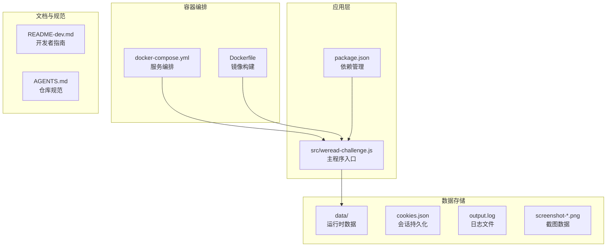

**图表来源**
- [src/weread-challenge.js](file://src/weread-challenge.js#L1-L50)
- [docker-compose.yml](file://docker-compose.yml#L1-L32)
- [Dockerfile](file://Dockerfile#L1-L8)

**章节来源**
- [src/weread-challenge.js](file://src/weread-challenge.js#L1-L100)
- [docker-compose.yml](file://docker-compose.yml#L1-L32)
- [Dockerfile](file://Dockerfile#L1-L8)

## 核心组件

### 日志管理系统

系统实现了统一的日志管理机制，支持多种日志级别的分类输出：

- **调试日志** (`DEBUG=true`)：启用详细的调试信息输出
- **业务日志** (`console.info`)：记录关键业务流程和状态变化
- **警告日志** (`console.warn`)：记录潜在问题和异常情况
- **错误日志** (`console.error`)：记录严重错误和故障信息

日志文件采用追加模式写入，确保历史数据的完整性。

### 健康检查系统

系统内置了多层健康检查机制：

- **Selenium 集群健康检查**：自动检测远程浏览器节点状态
- **容器健康检查**：通过 Docker 健康检查端点验证服务可用性
- **网络连通性检查**：验证外部服务连接状态

### 异常处理与恢复

实现了完善的异常处理和自动恢复机制：

- **重试逻辑**：对关键操作提供多次重试机会
- **超时处理**：设置合理的超时阈值防止长时间阻塞
- **优雅降级**：在部分功能失效时提供替代方案
- **自动诊断**：故障时自动收集诊断信息

**章节来源**
- [src/weread-challenge.js](file://src/weread-challenge.js#L62-L92)
- [src/weread-challenge.js](file://src/weread-challenge.js#L125-L152)
- [src/weread-challenge.js](file://src/weread-challenge.js#L224-L232)

## 架构概览

系统采用分布式架构设计，支持本地和远程两种运行模式：

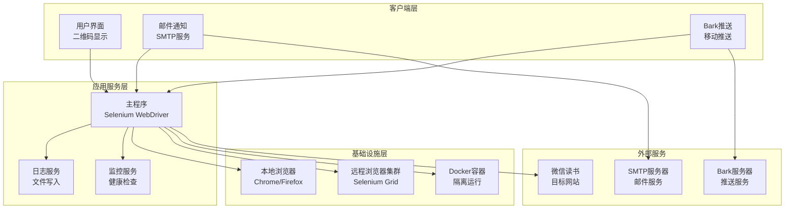

**图表来源**
- [src/weread-challenge.js](file://src/weread-challenge.js#L745-L828)
- [docker-compose.yml](file://docker-compose.yml#L1-L32)

## 详细组件分析

### 日志配置与管理

#### 日志级别分类

系统实现了标准化的日志级别管理：

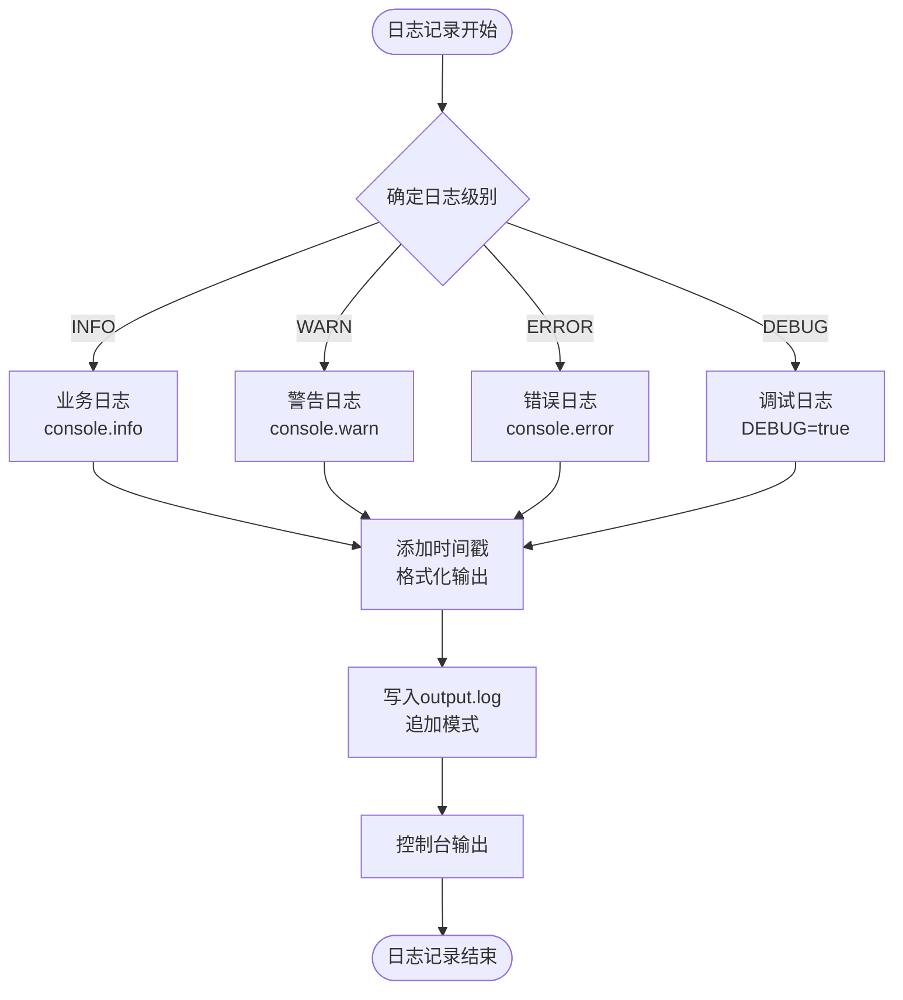

**图表来源**
- [src/weread-challenge.js](file://src/weread-challenge.js#L75-L92)

#### 日志文件管理

日志文件采用统一的管理策略：

- **文件位置**：`./data/output.log`
- **写入模式**：覆盖写入（每次启动清空）
- **时间戳格式**：`YYYY-MM-DD HH:mm:ss.SSS`
- **编码格式**：UTF-8

**章节来源**
- [src/weread-challenge.js](file://src/weread-challenge.js#L62-L92)

### 错误处理机制

#### 异常捕获与处理

系统实现了多层次的异常处理机制：

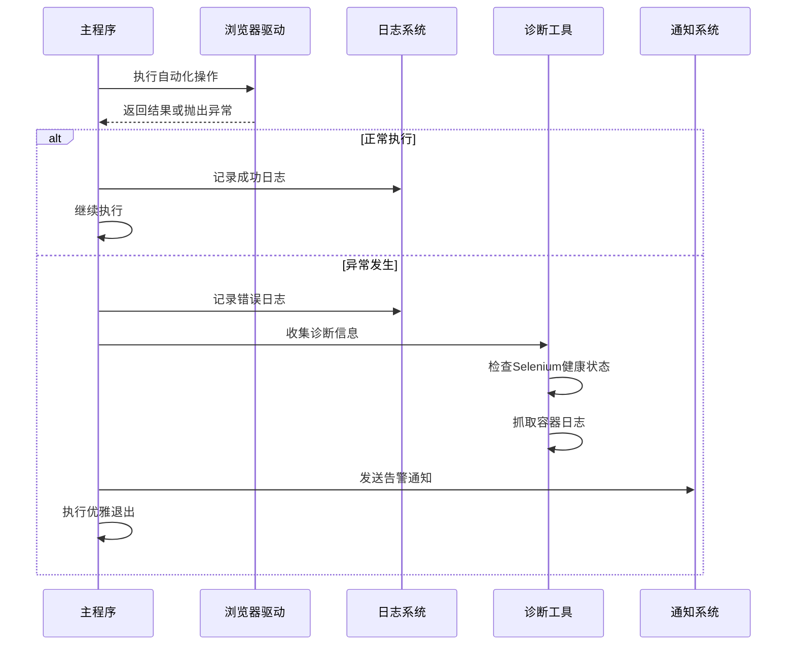

**图表来源**
- [src/weread-challenge.js](file://src/weread-challenge.js#L1240-L1275)

#### 重试逻辑实现

系统针对关键操作实现了智能重试机制：

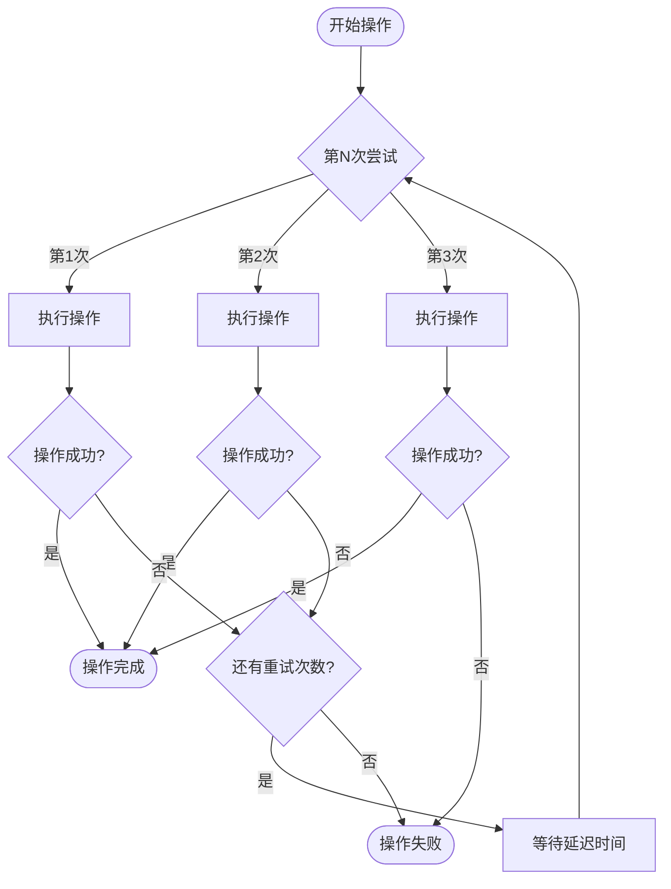

**图表来源**
- [src/weread-challenge.js](file://src/weread-challenge.js#L905-L957)

**章节来源**
- [src/weread-challenge.js](file://src/weread-challenge.js#L1240-L1275)
- [src/weread-challenge.js](file://src/weread-challenge.js#L905-L957)

### 性能监控指标

#### 执行时间统计

系统实现了详细的性能监控机制：

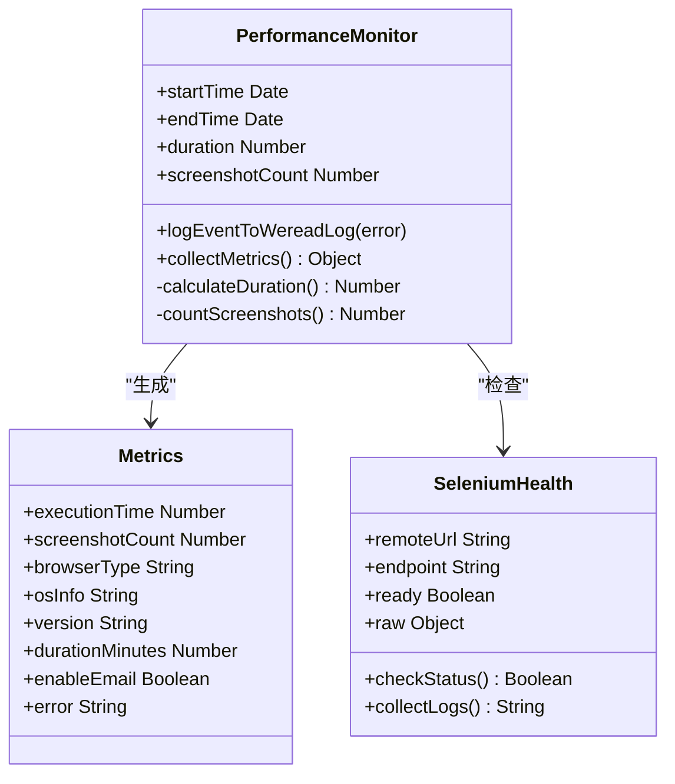

**图表来源**
- [src/weread-challenge.js](file://src/weread-challenge.js#L104-L152)
- [src/weread-challenge.js](file://src/weread-challenge.js#L249-L303)

#### 内存使用监控

系统通过以下方式监控内存使用：

- **进程内存监控**：利用 Node.js 进程监控能力
- **浏览器内存监控**：通过 Selenium Grid 监控浏览器进程
- **容器资源监控**：Docker 容器层面的资源使用统计

**章节来源**
- [src/weread-challenge.js](file://src/weread-challenge.js#L104-L152)
- [src/weread-challenge.js](file://src/weread-challenge.js#L249-L303)

### 健康检查端点

#### Selenium 集群健康检查

系统实现了智能的健康检查机制：

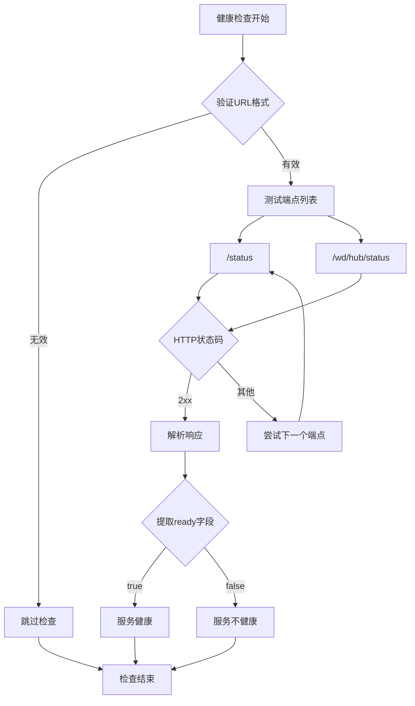

**图表来源**
- [src/weread-challenge.js](file://src/weread-challenge.js#L125-L152)

**章节来源**
- [src/weread-challenge.js](file://src/weread-challenge.js#L125-L152)

### 故障诊断系统

#### 自动诊断流程

系统实现了完整的自动诊断机制：

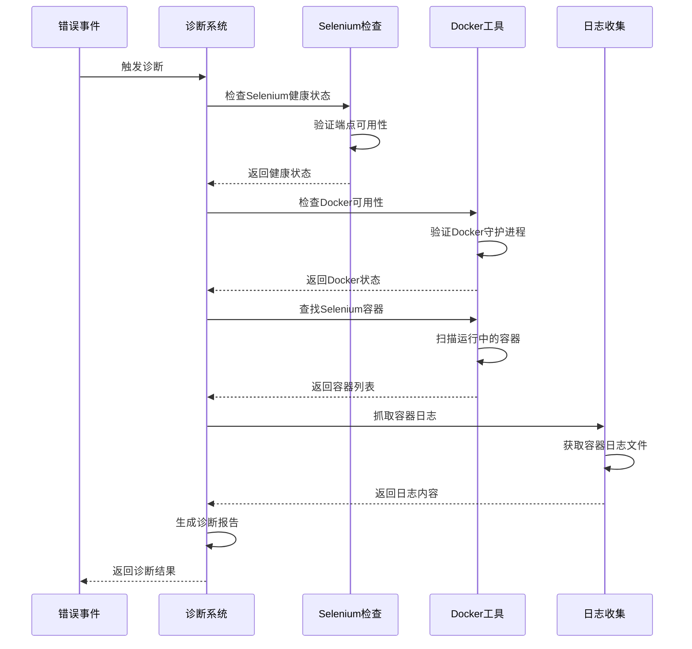

**图表来源**
- [src/weread-challenge.js](file://src/weread-challenge.js#L224-L232)
- [src/weread-challenge.js](file://src/weread-challenge.js#L186-L222)

**章节来源**
- [src/weread-challenge.js](file://src/weread-challenge.js#L224-L232)
- [src/weread-challenge.js](file://src/weread-challenge.js#L186-L222)

## 依赖关系分析

### 外部依赖

系统依赖的关键外部组件：

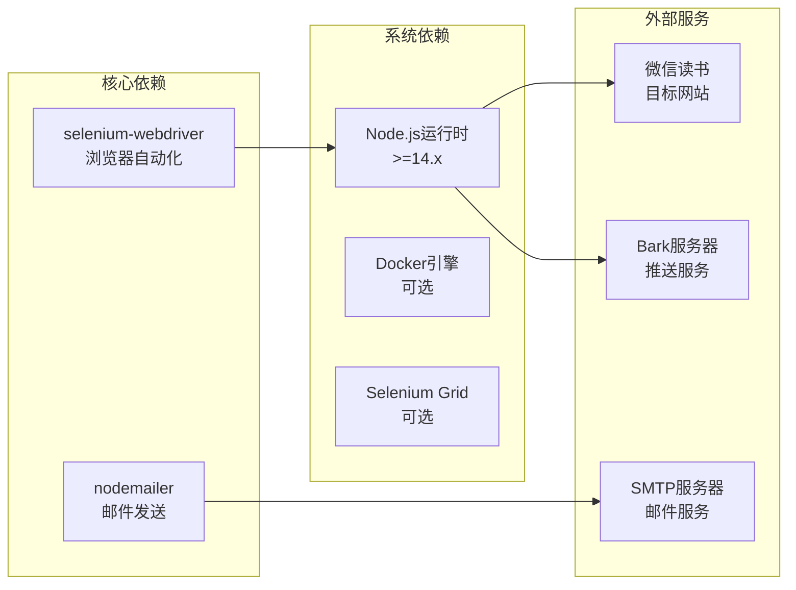

**图表来源**
- [package.json](file://package.json#L5-L8)

### 内部模块依赖

系统内部模块间的依赖关系：

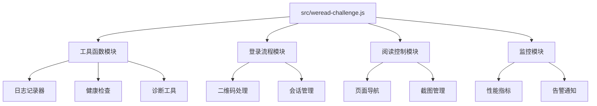

**图表来源**
- [src/weread-challenge.js](file://src/weread-challenge.js#L1-L50)

**章节来源**
- [package.json](file://package.json#L5-L8)
- [src/weread-challenge.js](file://src/weread-challenge.js#L1-L50)

## 性能考虑

### 资源优化策略

系统采用了多项性能优化措施：

#### 内存管理
- **垃圾回收优化**：合理释放浏览器驱动对象
- **文件句柄管理**：及时关闭日志文件和截图文件
- **内存泄漏防护**：在 finally 块中确保资源清理

#### 网络优化
- **连接池管理**：复用 HTTP 连接减少开销
- **超时配置**：设置合理的网络请求超时时间
- **重试策略**：智能的网络请求重试机制

#### 浏览器优化
- **窗口尺寸随机化**：避免固定窗口尺寸影响性能
- **无头模式支持**：可选的无头浏览器运行模式
- **资源限制**：合理设置浏览器内存和CPU使用限制

### 监控指标定义

系统监控的关键性能指标：

| 指标类型 | 指标名称 | 数据类型 | 单位 | 监控目的 |
|---------|---------|---------|------|---------|
| 时间指标 | 执行时长 | 数值 | 秒 | 性能评估 |
| 时间指标 | 登录耗时 | 数值 | 秒 | 用户体验 |
| 时间指标 | 阅读时长 | 数值 | 分钟 | 业务指标 |
| 计数指标 | 截图数量 | 数值 | 张 | 数据完整性 |
| 计数指标 | 错误次数 | 数值 | 次 | 系统稳定性 |
| 状态指标 | 浏览器状态 | 状态 | - | 系统健康度 |
| 状态指标 | 会话状态 | 状态 | - | 用户认证 |

## 故障排查指南

### 常见问题诊断

#### 登录失败排查

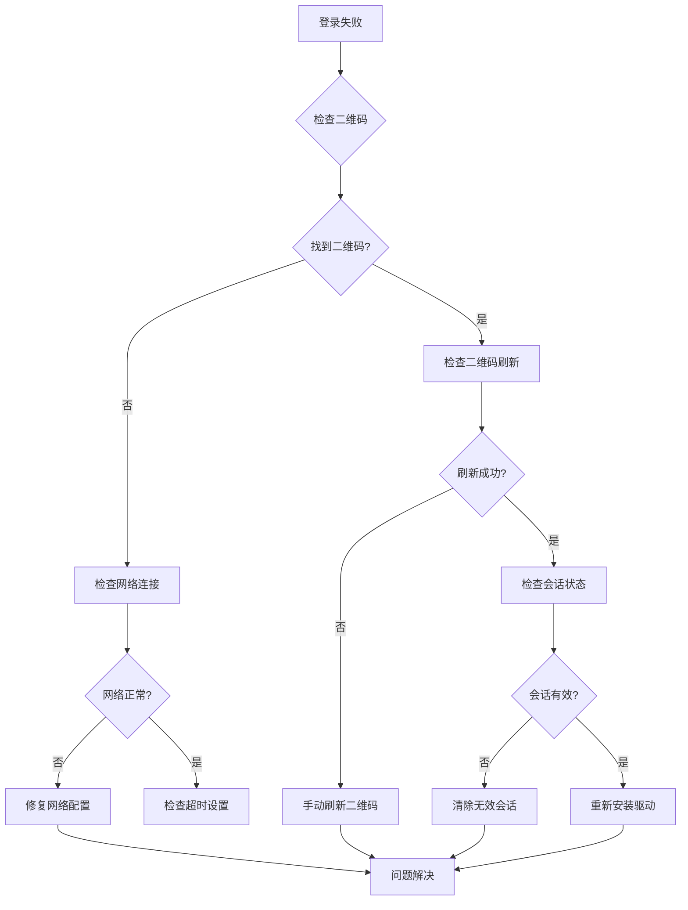

**图表来源**
- [src/weread-challenge.js](file://src/weread-challenge.js#L934-L957)

#### Selenium 连接问题

当遇到 Selenium 连接问题时，可以按照以下步骤排查：

1. **验证服务可用性**
   ```bash
   curl -f http://localhost:4444/status
   ```

2. **检查容器状态**
   ```bash
   docker ps | grep selenium
   ```

3. **查看容器日志**
   ```bash
   docker logs selenium-container
   ```

4. **验证网络配置**
   ```bash
   docker network ls
   docker inspect container-name
   ```

**章节来源**
- [src/weread-challenge.js](file://src/weread-challenge.js#L125-L152)
- [src/weread-challenge.js](file://src/weread-challenge.js#L186-L222)

### 应急响应预案

#### 系统故障应急流程

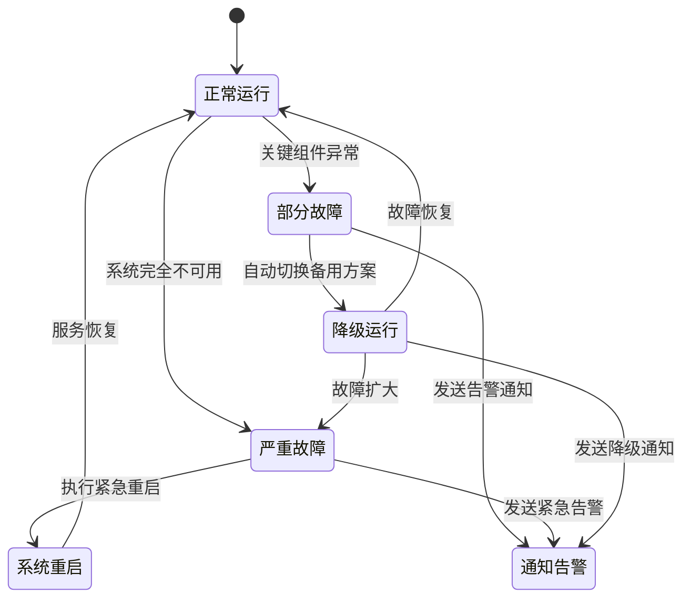

#### 通知与告警机制

系统实现了多层次的通知告警机制：

1. **Bark 推送**：移动端实时通知
2. **邮件通知**：详细的故障报告
3. **日志记录**：完整的故障追踪

**章节来源**
- [src/weread-challenge.js](file://src/weread-challenge.js#L572-L665)
- [src/weread-challenge.js](file://src/weread-challenge.js#L667-L743)

## 结论

WeRead 挑战赛自动化项目展现了优秀的工程实践，通过精心设计的监控与运维体系，为生产环境提供了可靠的保障。系统的主要优势包括：

### 技术亮点

- **完整的监控体系**：从日志记录到健康检查，形成了全方位的监控覆盖
- **智能的异常处理**：多重重试机制和优雅降级确保系统的稳定性
- **灵活的部署模式**：支持本地和远程两种运行模式，适应不同的部署需求
- **完善的诊断工具**：自动化的故障诊断和日志收集机制

### 运维价值

- **可观测性**：详细的日志记录和性能指标为运维提供了充分的信息支撑
- **可靠性**：多重保护机制确保系统在异常情况下仍能稳定运行
- **可维护性**：清晰的代码结构和完善的文档为后续维护提供了便利
- **可扩展性**：模块化的架构设计便于功能扩展和性能优化

该系统为类似的自动化项目提供了优秀的参考模板，其监控与运维最佳实践值得在其他项目中推广和应用。

## 附录

### 环境变量配置

| 变量名 | 类型 | 默认值 | 说明 |
|--------|------|--------|------|
| DEBUG | 布尔值 | false | 启用调试模式 |
| WEREAD_USER | 字符串 | weread-default | 用户标识 |
| WEREAD_REMOTE_BROWSER | 字符串 | 无 | 远程浏览器地址 |
| WEREAD_DURATION | 数值 | 10 | 阅读时长（分钟） |
| WEREAD_SPEED | 字符串 | slow | 阅读速度 |
| WEREAD_SELECTION | 数值 | 2 | 书籍选择策略 |
| WEREAD_BROWSER | 字符串 | chrome | 浏览器类型 |
| ENABLE_EMAIL | 布尔值 | false | 启用邮件通知 |
| WEREAD_SCREENSHOT | 布尔值 | true | 启用截图功能 |
| WEREAD_AGREE_TERMS | 布尔值 | true | 同意条款 |
| EMAIL_PORT | 数值 | 465 | SMTP端口号 |
| BARK_KEY | 字符串 | 空 | Bark推送密钥 |
| BARK_SERVER | 字符串 | https://api.day.app | Bark服务器地址 |

### 健康检查端点

系统支持以下健康检查端点：

- **/status**：基础健康检查
- **/wd/hub/status**：Selenium Grid 健康检查

### 运维脚本示例

#### 服务重启脚本
```bash
#!/bin/bash
echo "重启 WeRead 挑战赛服务..."
docker compose down
docker compose up -d
echo "服务已重启"
```

#### 配置更新脚本
```bash
#!/bin/bash
echo "更新配置并重启服务..."
docker compose build
docker compose up -d
echo "配置更新完成"
```

#### 数据备份脚本
```bash
#!/bin/bash
TIMESTAMP=$(date +%Y%m%d_%H%M%S)
echo "备份数据到 backup_$TIMESTAMP"
cp -r data data_backup_$TIMESTAMP
echo "备份完成"
```