# 硬件平台部署指南

<cite>
**本文档引用的文件**
- [README-dev.md](file://README-dev.md)
- [Dockerfile](file://Dockerfile)
- [package.json](file://package.json)
- [weread-challenge.js](file://src/weread-challenge.js)
- [README.md (iStoreOS)](file://docs/rk3566-istoreos-deploy/README.md)
- [docker-compose.yml (iStoreOS)](file://docs/rk3566-istoreos-deploy/docker-compose.yml)
- [README.md (多用户部署)](file://docs/rk3566-muti-user-deploy/README.md)
- [docker-compose.yml (多用户部署)](file://docs/rk3566-muti-user-deploy/docker-compose.yml)
- [ssh_scp_util.py (多用户部署)](file://docs/rk3566-muti-user-deploy/scripts/ssh_scp_util.py)
- [check-status.py (多用户部署)](file://docs/rk3566-muti-user-deploy/scripts/check-status.py)
- [check_boot_log.py (多用户部署)](file://docs/rk3566-muti-user-deploy/scripts/工具/check_boot_log.py)
- [README.md (OECT-2-fnOS)](file://docs/rk3566-oect-2-fnOS-deploy/README.md)
- [docker-compose.yml (OECT-2-fnOS)](file://docs/rk3566-oect-2-fnOS-deploy/docker-compose.yml)
- [ssh_scp_util.py (OECT-2-fnOS)](file://docs/rk3566-oect-2-fnOS-deploy/scripts/ssh_scp_util.py)
- [README.md (OECT-4-fnOS)](file://docs/rk3566-oect-4-fnOS-deploy/README.md)
- [docker-compose.yml (OECT-4-fnOS)](file://docs/rk3566-oect-4-fnOS-deploy/docker-compose.yml)
</cite>

## 目录
1. [简介](#简介)
2. [项目结构](#项目结构)
3. [核心组件](#核心组件)
4. [架构概览](#架构概览)
5. [详细组件分析](#详细组件分析)
6. [部署方案对比](#部署方案对比)
7. [性能考虑](#性能考虑)
8. [故障排除指南](#故障排除指南)
9. [结论](#结论)

## 简介

本指南面向RK3566硬件平台的微信读书挑战助手部署，提供三种不同的部署方案：

- **iStoreOS部署方案**：基于OpenWrt系统的轻量级部署
- **多用户部署方案**：支持4个用户分时复用的复杂部署
- **OECT-2/fnOS部署方案**：基于Debian系统的现代化部署

这些方案均采用Docker容器化架构，通过Selenium Grid实现浏览器自动化，支持VNC远程访问和定时任务调度。

## 项目结构

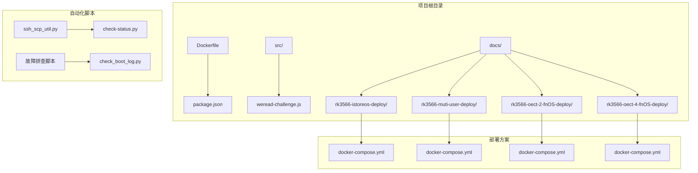

**图表来源**
- [Dockerfile:1-8](file://Dockerfile#L1-L8)
- [package.json:1-10](file://package.json#L1-L10)
- [README.md (多用户部署):50-93](file://docs/rk3566-muti-user-deploy/README.md#L50-L93)

**章节来源**
- [Dockerfile:1-8](file://Dockerfile#L1-L8)
- [package.json:1-10](file://package.json#L1-L10)
- [README-dev.md:1-14](file://README-dev.md#L1-L14)

## 核心组件

### Selenium Grid服务

Selenium Grid作为核心组件，提供浏览器自动化服务：

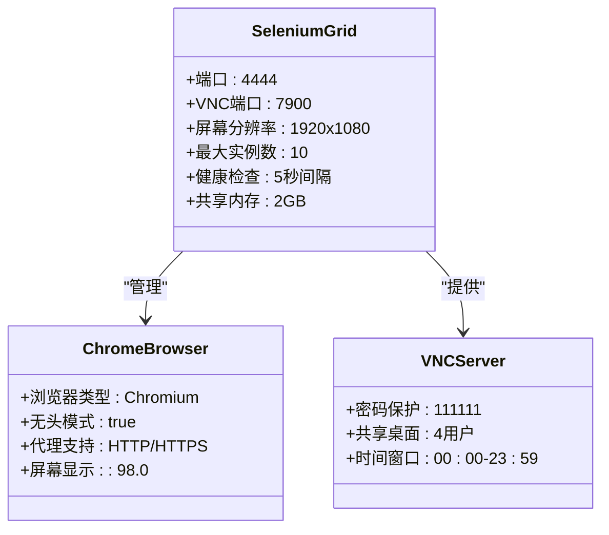

**图表来源**
- [docker-compose.yml (多用户部署):50-94](file://docs/rk3566-muti-user-deploy/docker-compose.yml#L50-L94)
- [docker-compose.yml (OECT-4-fnOS):50-94](file://docs/rk3566-oect-4-fnOS-deploy/docker-compose.yml#L50-L94)

### 应用容器架构

应用容器负责具体的微信读书自动化任务：

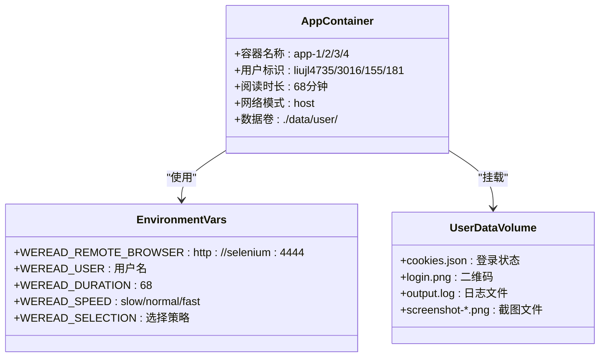

**图表来源**
- [docker-compose.yml (多用户部署):1-49](file://docs/rk3566-muti-user-deploy/docker-compose.yml#L1-L49)
- [weread-challenge.js:24-55](file://src/weread-challenge.js#L24-L55)

**章节来源**
- [docker-compose.yml (多用户部署):1-94](file://docs/rk3566-muti-user-deploy/docker-compose.yml#L1-L94)
- [docker-compose.yml (OECT-4-fnOS):1-94](file://docs/rk3566-oect-4-fnOS-deploy/docker-compose.yml#L1-L94)
- [weread-challenge.js:1-200](file://src/weread-challenge.js#L1-L200)

## 架构概览

### 系统架构图

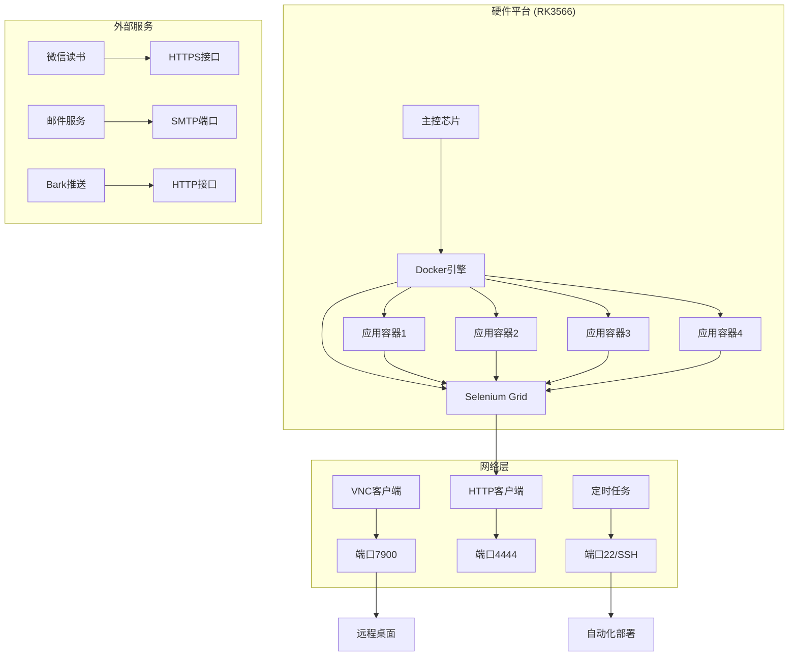

**图表来源**
- [README.md (多用户部署):365-381](file://docs/rk3566-muti-user-deploy/README.md#L365-L381)
- [README.md (OECT-4-fnOS):549-560](file://docs/rk3566-oect-4-fnOS-deploy/README.md#L549-L560)

### 数据流架构

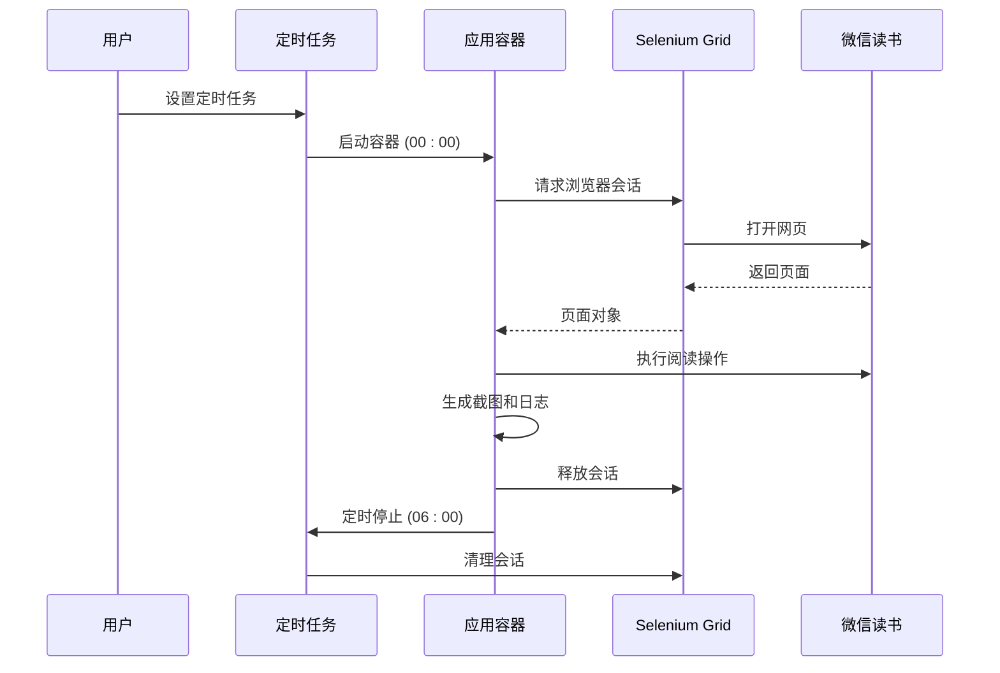

**图表来源**
- [README.md (多用户部署):294-309](file://docs/rk3566-muti-user-deploy/README.md#L294-L309)
- [README.md (OECT-4-fnOS):403-418](file://docs/rk3566-oect-4-fnOS-deploy/README.md#L403-L418)

## 详细组件分析

### 部署自动化脚本

#### ssh_scp_util.py 功能分析

该脚本实现了完整的自动化部署流程：

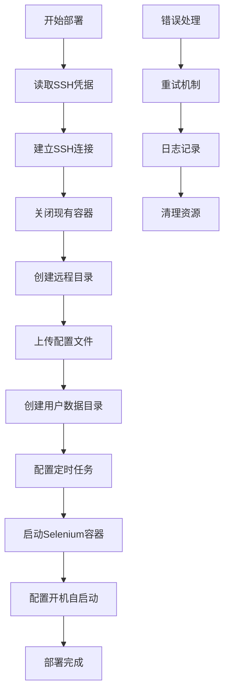

**图表来源**
- [ssh_scp_util.py (多用户部署):43-127](file://docs/rk3566-muti-user-deploy/scripts/ssh_scp_util.py#L43-L127)
- [ssh_scp_util.py (OECT-2-fnOS):43-127](file://docs/rk3566-oect-2-fnOS-deploy/scripts/ssh_scp_util.py#L43-L127)

#### 定时任务管理系统

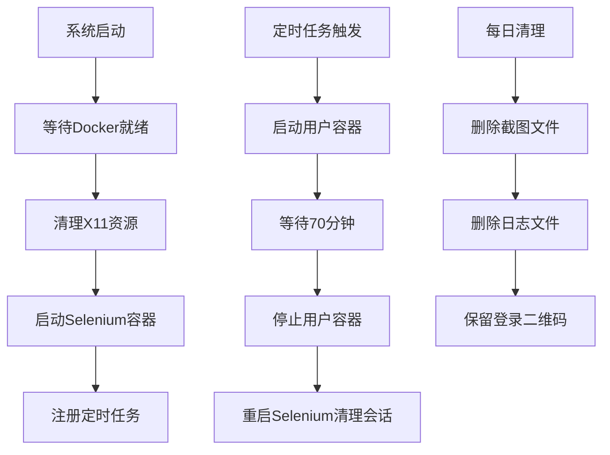

**图表来源**
- [README.md (多用户部署):282-318](file://docs/rk3566-muti-user-deploy/README.md#L282-L318)
- [README.md (OECT-4-fnOS):391-427](file://docs/rk3566-oect-4-fnOS-deploy/README.md#L391-L427)

**章节来源**
- [ssh_scp_util.py (多用户部署):1-229](file://docs/rk3566-muti-user-deploy/scripts/ssh_scp_util.py#L1-L229)
- [ssh_scp_util.py (OECT-2-fnOS):1-224](file://docs/rk3566-oect-2-fnOS-deploy/scripts/ssh_scp_util.py#L1-L224)

### 状态监控组件

#### check-status.py 状态检查

该脚本提供全面的系统状态监控：

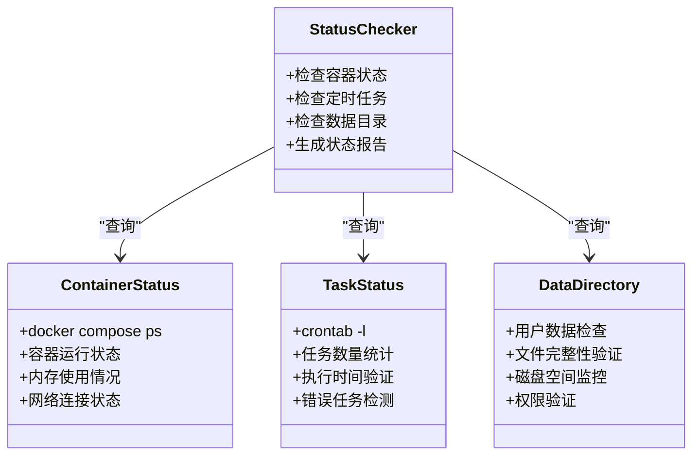

**图表来源**
- [check-status.py (多用户部署):36-87](file://docs/rk3566-muti-user-deploy/scripts/check-status.py#L36-L87)

**章节来源**
- [check-status.py (多用户部署):1-92](file://docs/rk3566-muti-user-deploy/scripts/check-status.py#L1-L92)

### 故障排查工具

#### 开机启动日志检查

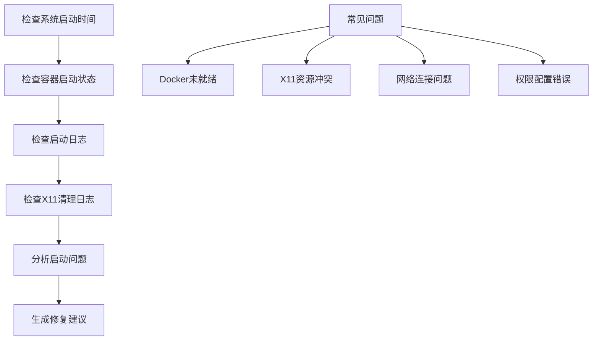

**图表来源**
- [check_boot_log.py (多用户部署):21-59](file://docs/rk3566-muti-user-deploy/scripts/工具/check_boot_log.py#L21-L59)

**章节来源**
- [check_boot_log.py (多用户部署):1-66](file://docs/rk3566-muti-user-deploy/scripts/工具/check_boot_log.py#L1-L66)

## 部署方案对比

### 平台特性对比

| 特性 | iStoreOS | 多用户部署 | OECT-2-fnOS | OECT-4-fnOS |
|------|----------|------------|-------------|-------------|
| 操作系统 | OpenWrt | OpenWrt | Debian | Debian |
| 初始化系统 | SysV init | SysV init | systemd | systemd |
| 开机启动 | /etc/init.d/ | /etc/init.d/ | /etc/systemd/ | /etc/systemd/ |
| 定时任务 | crond | crond | crond | crond |
| VNC共享 | 4用户共享 | 4用户共享 | 4用户共享 | 4用户共享 |
| 镜像版本 | 144.0 | 144.0 | 144.0 | 147.0 |
| 屏幕显示 | :99 | :98 | :98 | :98 |

### 部署复杂度对比

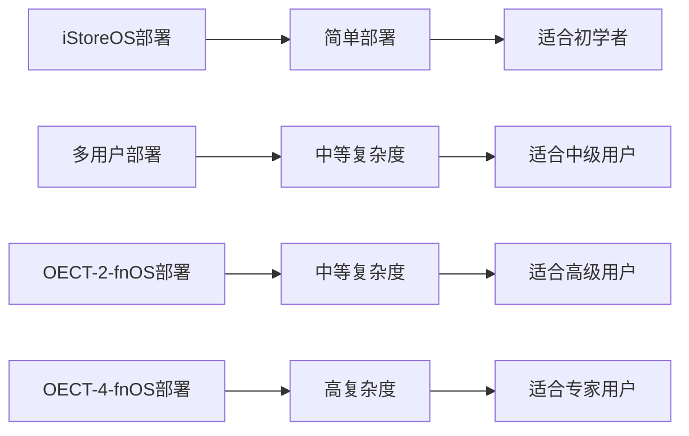

**图表来源**
- [README.md (iStoreOS):1-77](file://docs/rk3566-istoreos-deploy/README.md#L1-L77)
- [README.md (多用户部署):1-390](file://docs/rk3566-muti-user-deploy/README.md#L1-L390)
- [README.md (OECT-2-fnOS):1-499](file://docs/rk3566-oect-2-fnOS-deploy/README.md#L1-L499)
- [README.md (OECT-4-fnOS):1-574](file://docs/rk3566-oect-4-fnOS-deploy/README.md#L1-L574)

### 性能配置对比

| 配置项 | iStoreOS | 多用户部署 | OECT-2-fnOS | OECT-4-fnOS |
|--------|----------|------------|-------------|-------------|
| 共享内存 | 2GB | 2GB | 2GB | 2GB |
| 最大实例数 | 10 | 10 | 10 | 10 |
| 屏幕分辨率 | 1920x1080 | 1920x1080 | 1920x1080 | 1920x1080 |
| VNC密码 | 111111 | 111111 | 111111 | 111111 |
| 健康检查 | 5秒 | 5秒 | 5秒 | 5秒 |
| 重启策略 | unless-stopped | unless-stopped | unless-stopped | unless-stopped |

**章节来源**
- [docker-compose.yml (iStoreOS):1-37](file://docs/rk3566-istoreos-deploy/docker-compose.yml#L1-L37)
- [docker-compose.yml (多用户部署):50-94](file://docs/rk3566-muti-user-deploy/docker-compose.yml#L50-L94)
- [docker-compose.yml (OECT-4-fnOS):50-94](file://docs/rk3566-oect-4-fnOS-deploy/docker-compose.yml#L50-L94)

## 性能考虑

### 资源优化策略

1. **内存管理**
   - 共享内存设置为2GB，平衡性能和稳定性
   - 定期清理浏览器会话，防止内存泄漏
   - 监控容器内存使用情况，及时调整配置

2. **CPU优化**
   - 使用host网络模式减少网络开销
   - 合理设置并发实例数（默认10个）
   - 避免同时启动多个用户容器

3. **存储优化**
   - 定期清理截图和日志文件
   - 保留必要的登录状态文件
   - 监控磁盘空间使用情况

### 网络配置

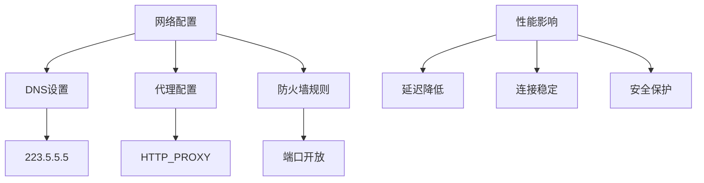

**图表来源**
- [docker-compose.yml (iStoreOS):13-14](file://docs/rk3566-istoreos-deploy/docker-compose.yml#L13-L14)
- [docker-compose.yml (多用户部署):74-76](file://docs/rk3566-muti-user-deploy/docker-compose.yml#L74-L76)

## 故障排除指南

### 常见问题及解决方案

#### 容器启动失败

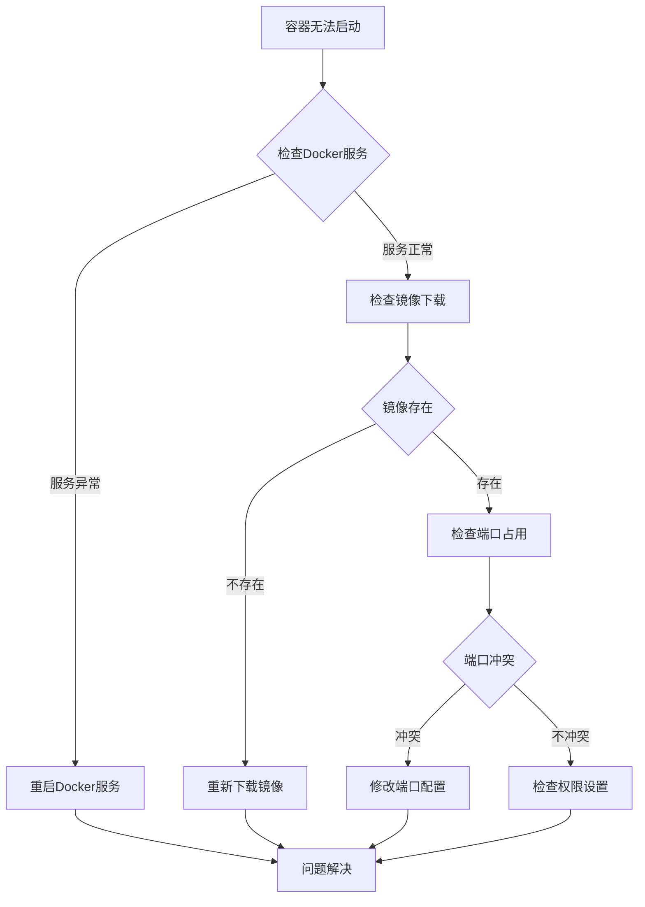

**图表来源**
- [README.md (多用户部署):320-330](file://docs/rk3566-muti-user-deploy/README.md#L320-L330)
- [README.md (OECT-4-fnOS):429-448](file://docs/rk3566-oect-4-fnOS-deploy/README.md#L429-L448)

#### VNC连接问题

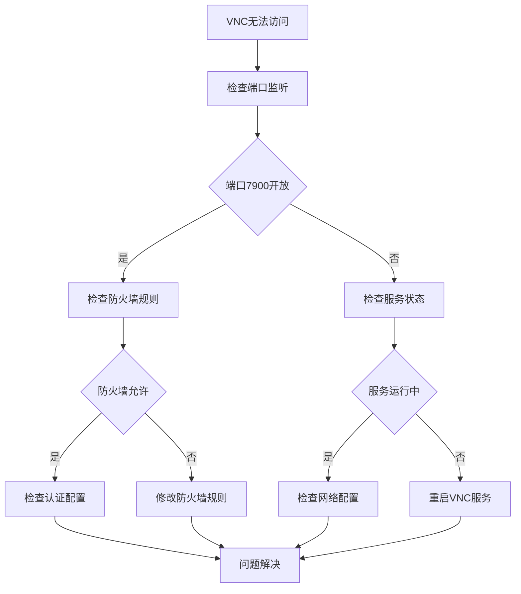

**图表来源**
- [README.md (多用户部署):358-363](file://docs/rk3566-muti-user-deploy/README.md#L358-L363)
- [README.md (OECT-4-fnOS):543-547](file://docs/rk3566-oect-4-fnOS-deploy/README.md#L543-L547)

#### 定时任务故障

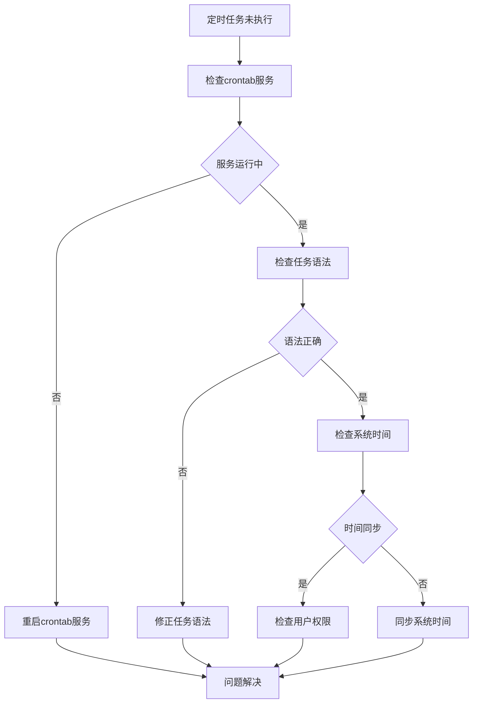

**图表来源**
- [README.md (多用户部署):430-450](file://docs/rk3566-muti-user-deploy/README.md#L430-L450)
- [README.md (OECT-4-fnOS):514-525](file://docs/rk3566-oect-4-fnOS-deploy/README.md#L514-L525)

### 诊断工具使用

#### 系统健康检查

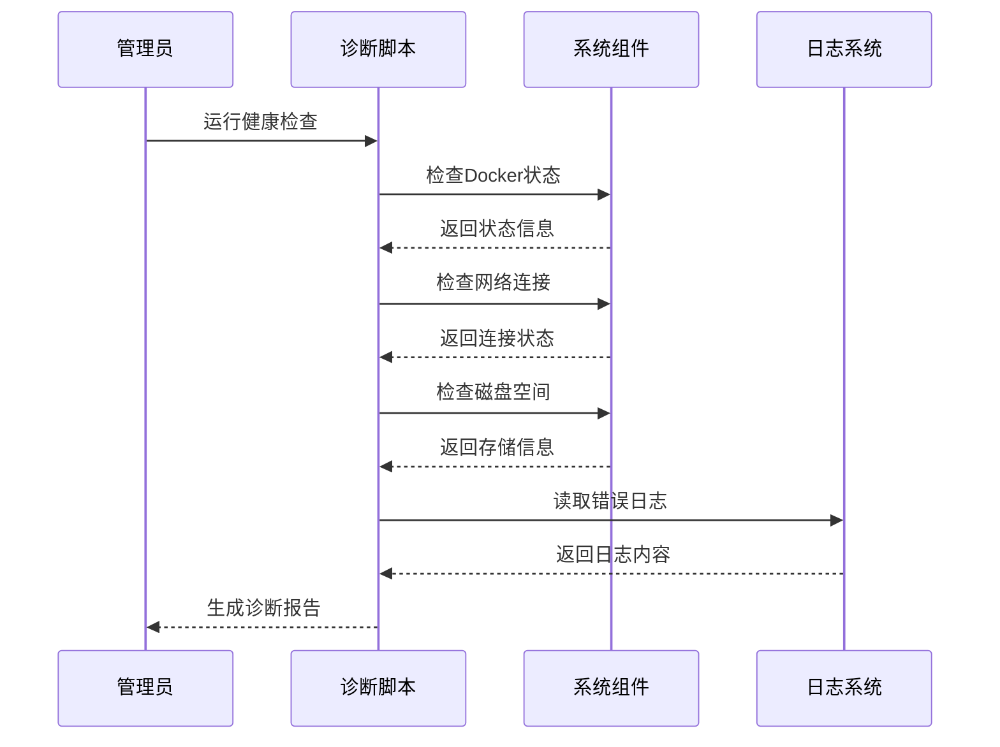

**图表来源**
- [check-status.py (多用户部署):36-87](file://docs/rk3566-muti-user-deploy/scripts/check-status.py#L36-L87)
- [check_boot_log.py (多用户部署):21-59](file://docs/rk3566-muti-user-deploy/scripts/工具/check_boot_log.py#L21-L59)

**章节来源**
- [README.md (多用户部署):320-363](file://docs/rk3566-muti-user-deploy/README.md#L320-L363)
- [README.md (OECT-4-fnOS):429-547](file://docs/rk3566-oect-4-fnOS-deploy/README.md#L429-L547)

## 结论

本硬件平台部署指南提供了三种不同复杂度的部署方案，满足从初学者到专家用户的不同需求：

### 方案选择建议

1. **iStoreOS部署方案**：适合资源有限、追求简单部署的用户
2. **多用户部署方案**：适合需要4用户分时复用的场景
3. **OECT-4-fnOS部署方案**：适合需要现代化系统管理和高级功能的用户

### 最佳实践

- 定期监控系统资源使用情况
- 建立完善的日志记录和分析机制
- 制定定期维护和更新计划
- 建立故障快速响应机制
- 保持配置文件的版本控制

### 未来发展方向

- 支持更多用户并发访问
- 增强自动化运维能力
- 优化资源利用效率
- 提升系统稳定性和可靠性
- 扩展监控和告警功能

通过遵循本指南的部署和运维建议，可以确保微信读书挑战助手在RK3566硬件平台上稳定高效地运行。