# 部署与运维

<cite>
**本文档引用的文件**
- [Dockerfile](file://Dockerfile)
- [docker-compose.yml](file://docker-compose.yml)
- [package.json](file://package.json)
- [src/weread-challenge.js](file://src/weread-challenge.js)
- [.github/workflows/docker-publish.yml](file://.github/workflows/docker-publish.yml)
- [.github/workflows/docker-dev-publish.yml](file://.github/workflows/docker-dev-publish.yml)
- [README.md](file://README.md)
- [README-dev.md](file://README-dev.md)
- [AGENTS.md](file://AGENTS.md)
- [.gitignore](file://.gitignore)
</cite>

## 目录
1. [简介](#简介)
2. [项目结构](#项目结构)
3. [核心组件](#核心组件)
4. [架构概览](#架构概览)
5. [详细组件分析](#详细组件分析)
6. [依赖关系分析](#依赖关系分析)
7. [性能考虑](#性能考虑)
8. [故障排除指南](#故障排除指南)
9. [CI/CD 流水线](#cicd-流水线)
10. [监控与日志管理](#监控与日志管理)
11. [多环境部署策略](#多环境部署策略)
12. [扩展性考虑](#扩展性考虑)
13. [结论](#结论)

## 简介

WeRead 挑战赛自动化项目是一个基于 Selenium WebDriver 的微信读书自动阅读脚本。该项目实现了完整的容器化部署解决方案，包括 Docker 容器化、docker-compose 服务编排，以及生产环境的最佳实践配置。项目支持多种浏览器（Chrome、Firefox、Edge、Safari），具备智能二维码登录、自动翻页、截图监控、邮件通知和 Bark 推送等功能。

该系统采用微服务架构，通过 Docker 容器分离应用逻辑和浏览器驱动，确保了部署的一致性和可扩展性。项目提供了完整的 CI/CD 流水线，支持多平台镜像构建和自动化发布。

## 项目结构

项目采用模块化设计，主要由以下核心部分组成：

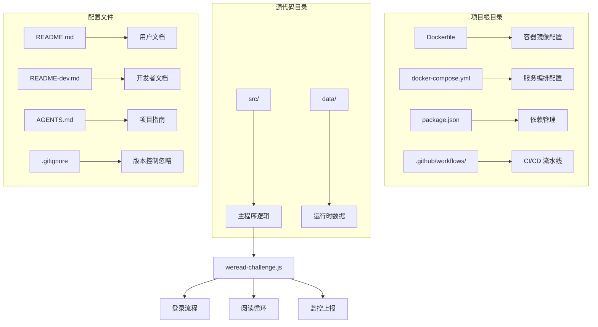

**图表来源**
- [Dockerfile](file://Dockerfile#L1-L8)
- [docker-compose.yml](file://docker-compose.yml#L1-L32)
- [package.json](file://package.json#L1-L10)

**章节来源**
- [Dockerfile](file://Dockerfile#L1-L8)
- [docker-compose.yml](file://docker-compose.yml#L1-L32)
- [package.json](file://package.json#L1-L10)
- [AGENTS.md](file://AGENTS.md#L3-L6)

## 核心组件

### 应用容器 (App Container)

应用容器负责执行 WeRead 自动化脚本，具有以下特性：

- **基础镜像**: 基于 Node.js LTS Alpine Linux
- **工作目录**: `/app`
- **依赖安装**: 使用 `npm install --omit=dev` 进行生产环境优化
- **启动命令**: `node app.js`

### Selenium 服务容器

Selenium 服务容器提供浏览器驱动服务：

- **镜像**: `selenium/standalone-chromium:latest`
- **共享内存**: 2GB (`shm_size: 2gb`)
- **网络配置**: 支持 Docker Socket 挂载
- **健康检查**: 自动监控服务可用性

### 数据持久化

系统通过卷挂载实现数据持久化：

- **Cookies 存储**: `./data/cookies.json`
- **登录截图**: `./data/login.png`
- **运行日志**: `./data/output.log`
- **阅读截图**: `./data/screenshot-*.png`

**章节来源**
- [Dockerfile](file://Dockerfile#L1-L8)
- [docker-compose.yml](file://docker-compose.yml#L8-L9)
- [src/weread-challenge.js](file://src/weread-challenge.js#L20-L60)

## 架构概览

系统采用分布式微服务架构，通过 Docker 容器实现服务解耦：

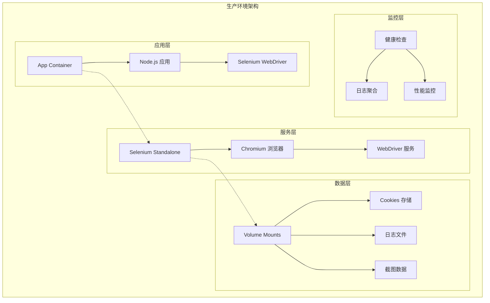

**图表来源**
- [docker-compose.yml](file://docker-compose.yml#L1-L32)
- [src/weread-challenge.js](file://src/weread-challenge.js#L745-L828)

### 服务交互流程

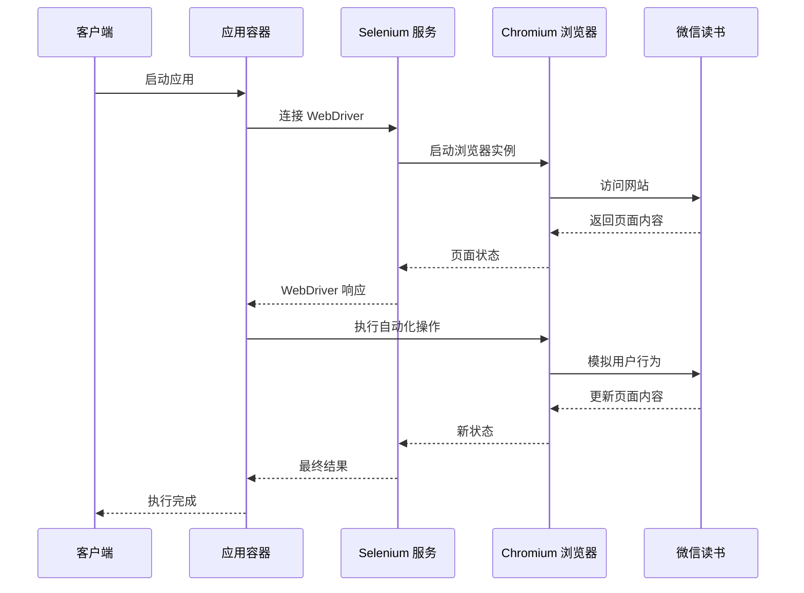

**图表来源**
- [src/weread-challenge.js](file://src/weread-challenge.js#L745-L828)
- [docker-compose.yml](file://docker-compose.yml#L15-L26)

## 详细组件分析

### Dockerfile 配置分析

Dockerfile 实现了最小化的生产环境配置：

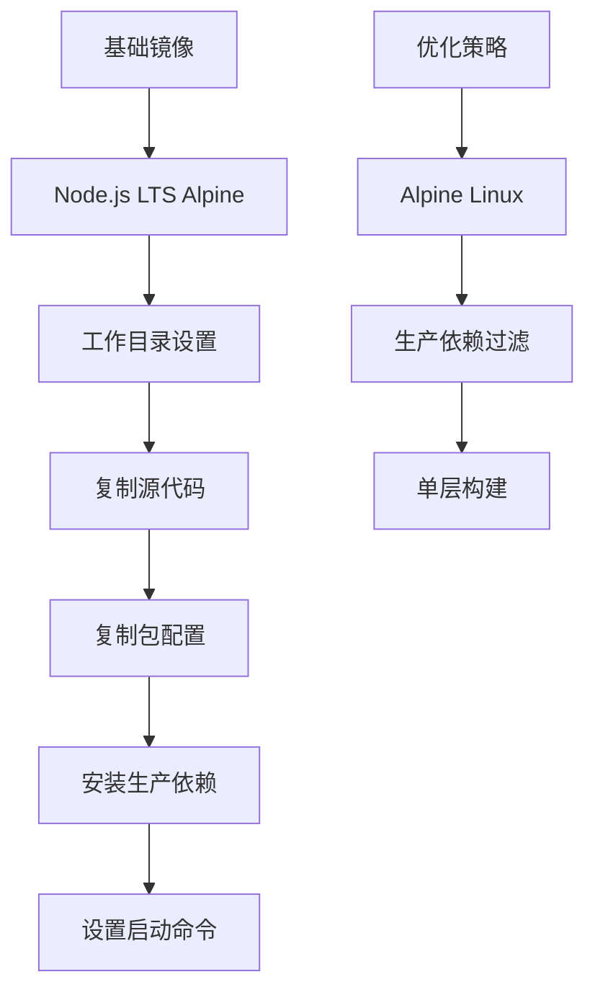

**图表来源**
- [Dockerfile](file://Dockerfile#L1-L8)

关键配置特点：
- **轻量化基础**: 使用 Alpine Linux 减少镜像大小
- **依赖优化**: 使用 `--omit=dev` 过滤开发依赖
- **工作目录**: 设置 `/app` 作为应用工作目录
- **启动策略**: 直接执行 `node app.js`

**章节来源**
- [Dockerfile](file://Dockerfile#L1-L8)

### docker-compose 编排分析

compose 文件定义了完整的微服务架构：

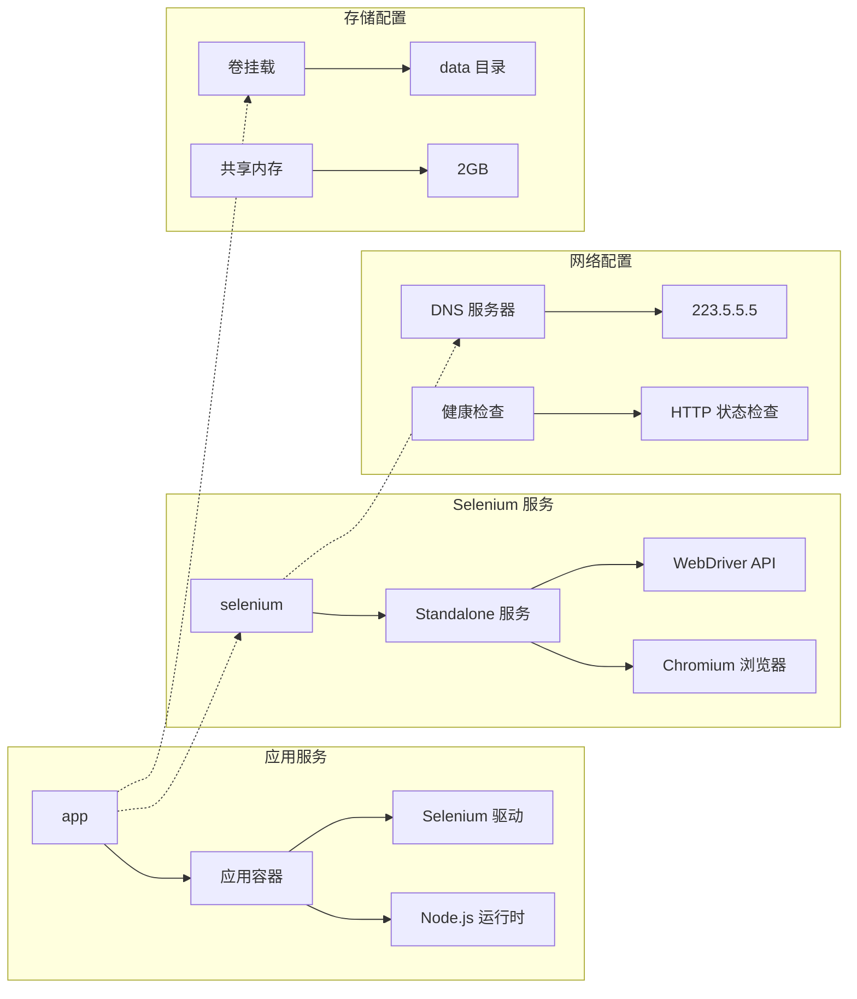

**图表来源**
- [docker-compose.yml](file://docker-compose.yml#L1-L32)

关键编排特性：
- **服务依赖**: 应用容器等待 Selenium 服务健康检查通过
- **网络隔离**: 使用独立的 Docker 网络
- **资源限制**: 配置共享内存大小
- **健康监控**: 自动健康检查机制

**章节来源**
- [docker-compose.yml](file://docker-compose.yml#L1-L32)

### 核心业务逻辑分析

主程序实现了完整的自动化阅读流程：

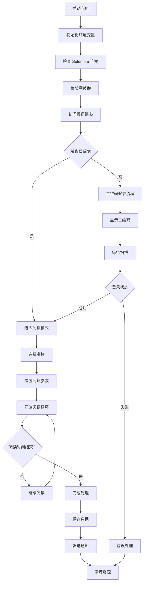

**图表来源**
- [src/weread-challenge.js](file://src/weread-challenge.js#L745-L1279)

**章节来源**
- [src/weread-challenge.js](file://src/weread-challenge.js#L745-L1279)

## 依赖关系分析

系统依赖关系呈现清晰的层次结构：

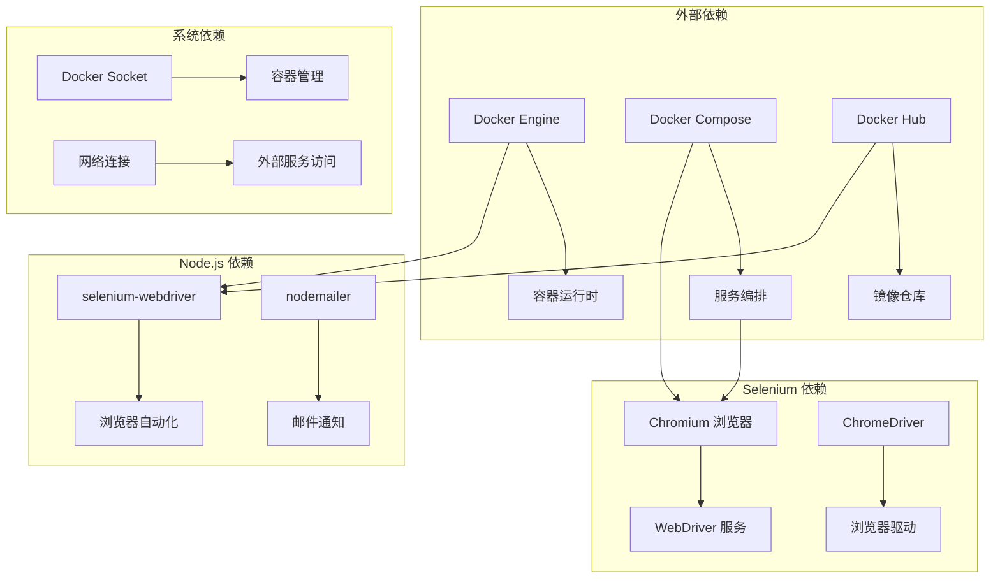

**图表来源**
- [package.json](file://package.json#L5-L8)
- [docker-compose.yml](file://docker-compose.yml#L16-L20)

**章节来源**
- [package.json](file://package.json#L5-L8)
- [docker-compose.yml](file://docker-compose.yml#L16-L20)

## 性能考虑

### 容器性能优化

系统在多个层面进行了性能优化：

- **镜像大小**: 使用 Alpine Linux 基础镜像减少资源占用
- **依赖管理**: 生产环境仅安装必要依赖，避免开发工具
- **内存配置**: Selenium 服务配置 2GB 共享内存，避免浏览器崩溃
- **网络优化**: DNS 服务器配置为 223.5.5.5，提高域名解析速度

### 浏览器性能调优

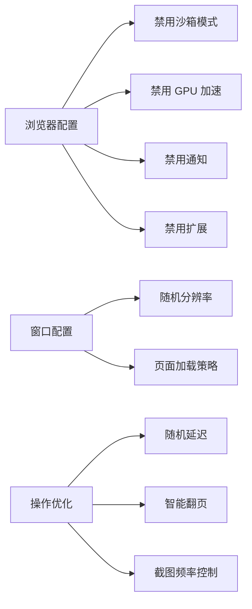

**图表来源**
- [src/weread-challenge.js](file://src/weread-challenge.js#L780-L828)

**章节来源**
- [src/weread-challenge.js](file://src/weread-challenge.js#L780-L828)

## 故障排除指南

### 常见问题诊断

系统内置了完善的诊断和错误处理机制：

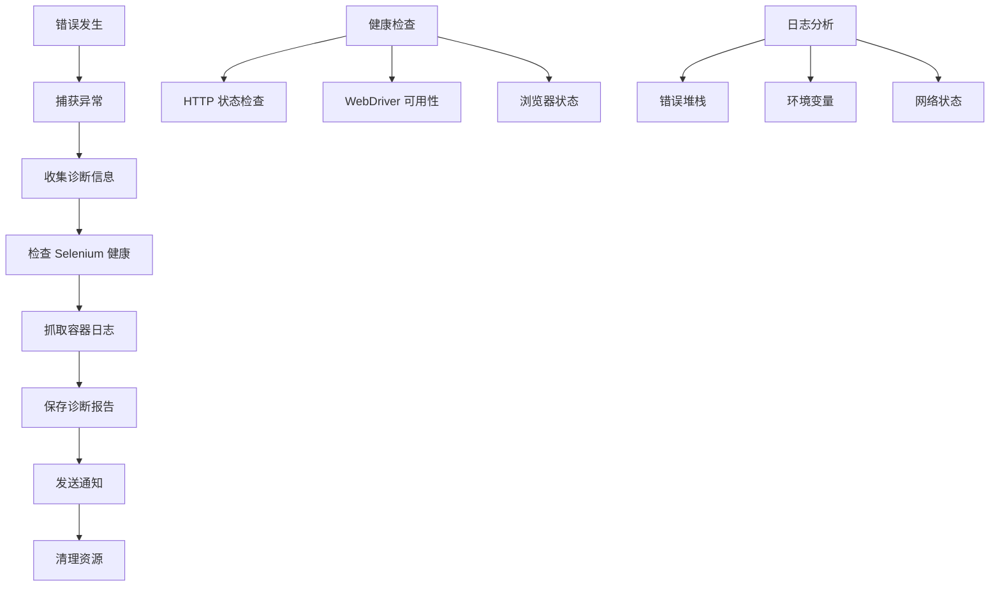

**图表来源**
- [src/weread-challenge.js](file://src/weread-challenge.js#L224-L232)

### 错误处理流程

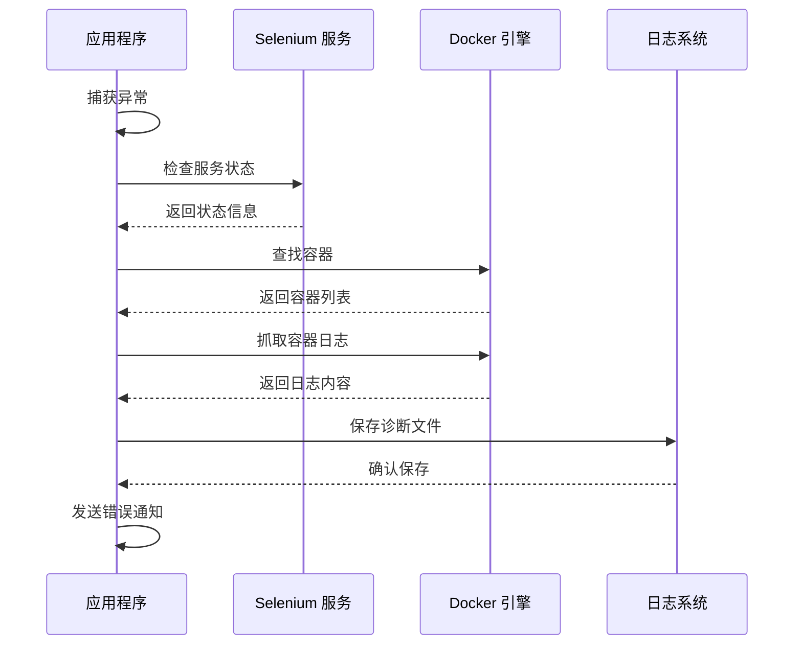

**图表来源**
- [src/weread-challenge.js](file://src/weread-challenge.js#L124-L232)

**章节来源**
- [src/weread-challenge.js](file://src/weread-challenge.js#L124-L232)

## CI/CD 流水线

### 生产版本发布

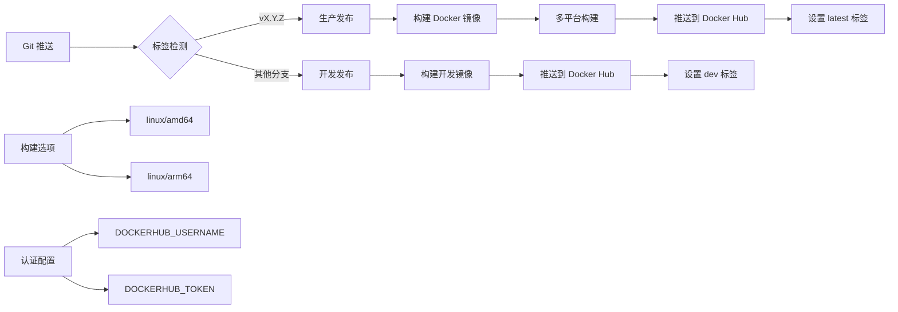

**图表来源**
- [.github/workflows/docker-publish.yml](file://.github/workflows/docker-publish.yml#L1-L39)
- [.github/workflows/docker-dev-publish.yml](file://.github/workflows/docker-dev-publish.yml#L1-L35)

### 流水线配置分析

**生产发布流水线**：
- 触发条件：Git 标签推送（`v*.*.*`）
- 构建平台：amd64 和 arm64
- 镜像标签：版本号和 `latest`
- 认证方式：Docker Hub 令牌认证

**开发发布流水线**：
- 触发条件：master/main 分支推送
- 构建平台：amd64 和 arm64
- 镜像标签：`dev`
- 认证方式：Docker Hub 令牌认证

**章节来源**
- [.github/workflows/docker-publish.yml](file://.github/workflows/docker-publish.yml#L1-L39)
- [.github/workflows/docker-dev-publish.yml](file://.github/workflows/docker-dev-publish.yml#L1-L35)

## 监控与日志管理

### 日志系统架构

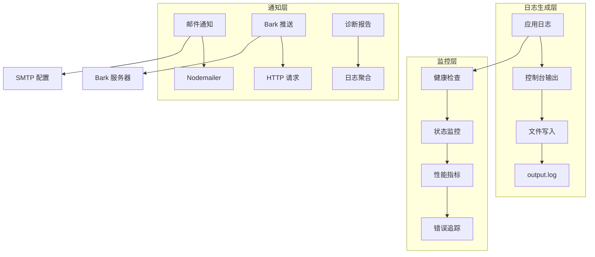

**图表来源**
- [src/weread-challenge.js](file://src/weread-challenge.js#L62-L92)
- [src/weread-challenge.js](file://src/weread-challenge.js#L572-L665)

### 日志管理策略

系统实现了多层次的日志管理：

- **文件日志**: 所有控制台输出重定向到 `./data/output.log`
- **实时监控**: 支持 `DEBUG=true` 开启详细调试模式
- **错误追踪**: 自动收集 Selenium 服务状态和容器日志
- **性能监控**: 记录阅读进度、截图频率等指标

**章节来源**
- [src/weread-challenge.js](file://src/weread-challenge.js#L62-L92)
- [src/weread-challenge.js](file://src/weread-challenge.js#L572-L665)

## 多环境部署策略

### 环境配置管理

系统支持多种部署环境：

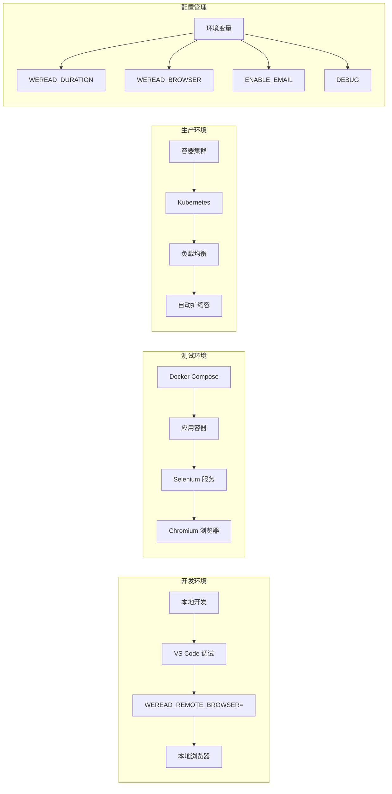

**图表来源**
- [docker-compose.yml](file://docker-compose.yml#L5-L7)
- [src/weread-challenge.js](file://src/weread-challenge.js#L24-L42)

### 部署最佳实践

- **环境隔离**: 使用不同的 Docker 网络隔离各环境
- **资源配置**: 为不同环境设置合适的资源限制
- **安全配置**: 通过环境变量管理敏感信息
- **监控集成**: 集成健康检查和性能监控

**章节来源**
- [docker-compose.yml](file://docker-compose.yml#L5-L7)
- [src/weread-challenge.js](file://src/weread-challenge.js#L24-L42)

## 扩展性考虑

### 水平扩展架构

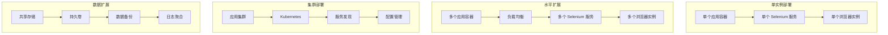

### 性能扩展策略

- **容器化部署**: 支持 Docker Swarm 和 Kubernetes 集群
- **负载均衡**: 通过反向代理实现请求分发
- **数据库扩展**: 支持外部数据库存储用户状态
- **缓存优化**: 实现 Redis 缓存提升性能

**章节来源**
- [AGENTS.md](file://AGENTS.md#L30-L33)

## 结论

WeRead 挑战赛自动化项目提供了一个完整的容器化解决方案，具有以下优势：

### 技术优势
- **容器化架构**: 基于 Docker 的微服务设计，部署简单可靠
- **自动化程度高**: 完整的 CI/CD 流水线，支持多平台镜像构建
- **监控完善**: 内置健康检查、日志管理和错误诊断机制
- **扩展性强**: 支持水平扩展和集群部署

### 运维价值
- **生产就绪**: 经过充分测试，适合生产环境部署
- **维护成本低**: 标准化的容器化部署，降低运维复杂度
- **安全性好**: 通过环境变量管理敏感信息，避免硬编码
- **可观测性**: 完善的日志和监控体系，便于问题排查

### 建议改进方向
- **测试覆盖**: 增加自动化单元测试和集成测试
- **配置管理**: 引入配置中心，支持动态配置更新
- **监控增强**: 集成 APM 工具，提供更详细的性能指标
- **安全加固**: 实施更严格的安全策略和访问控制

该系统为类似的企业级自动化项目提供了优秀的参考模板，展示了现代 DevOps 最佳实践的实际应用。