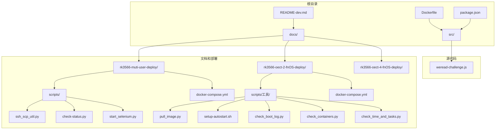
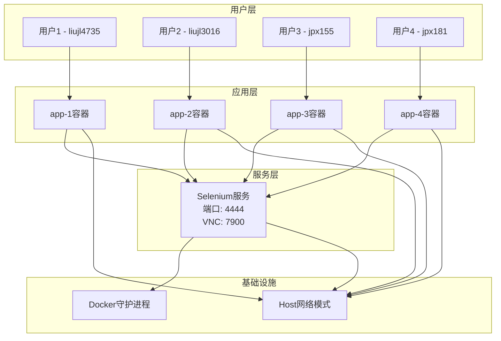
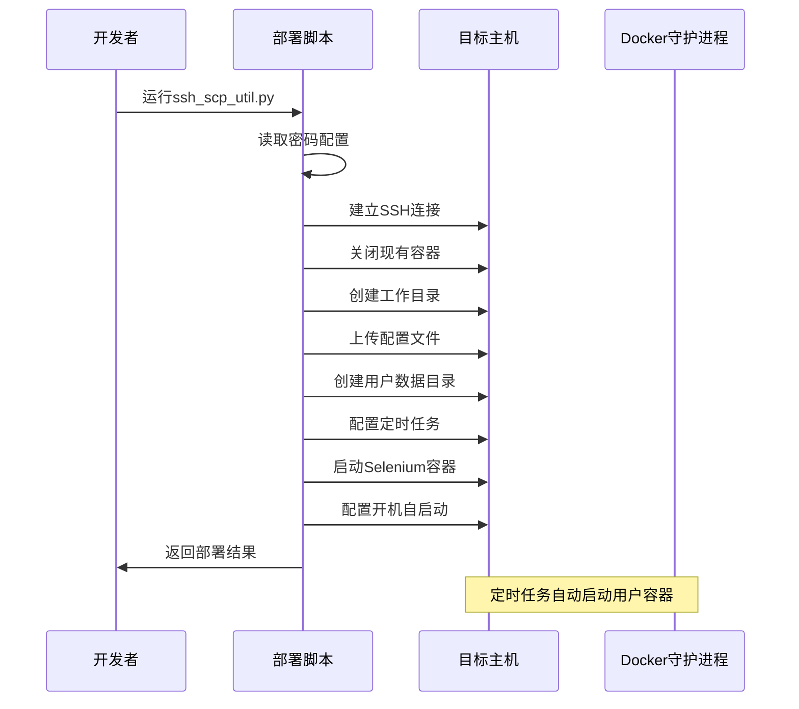
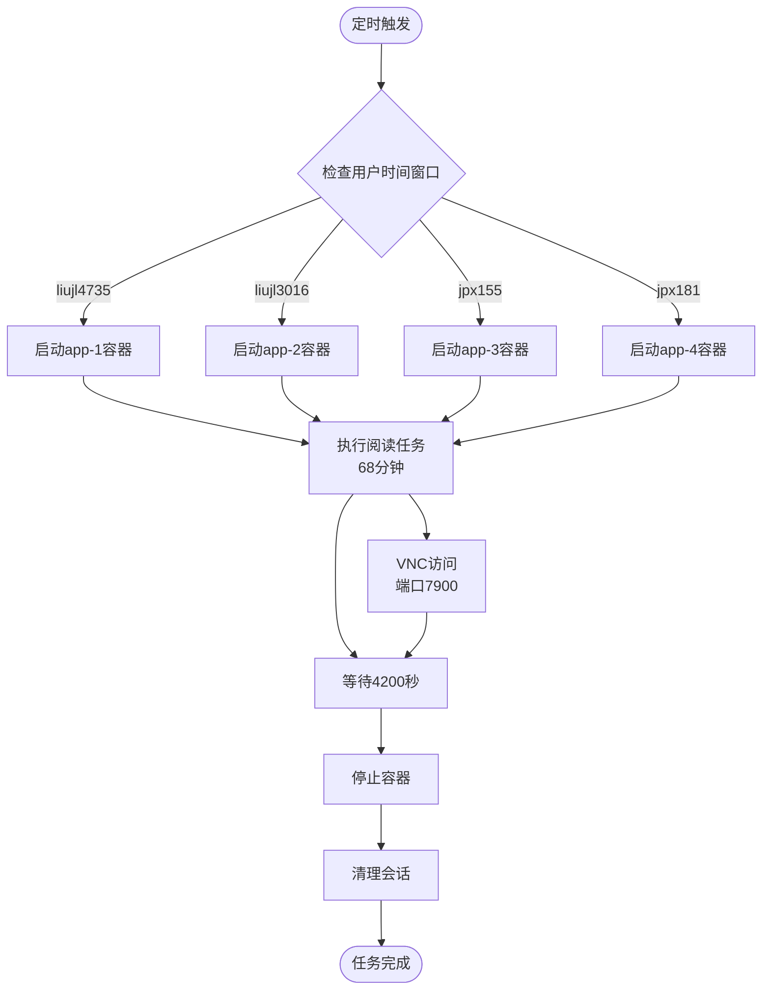
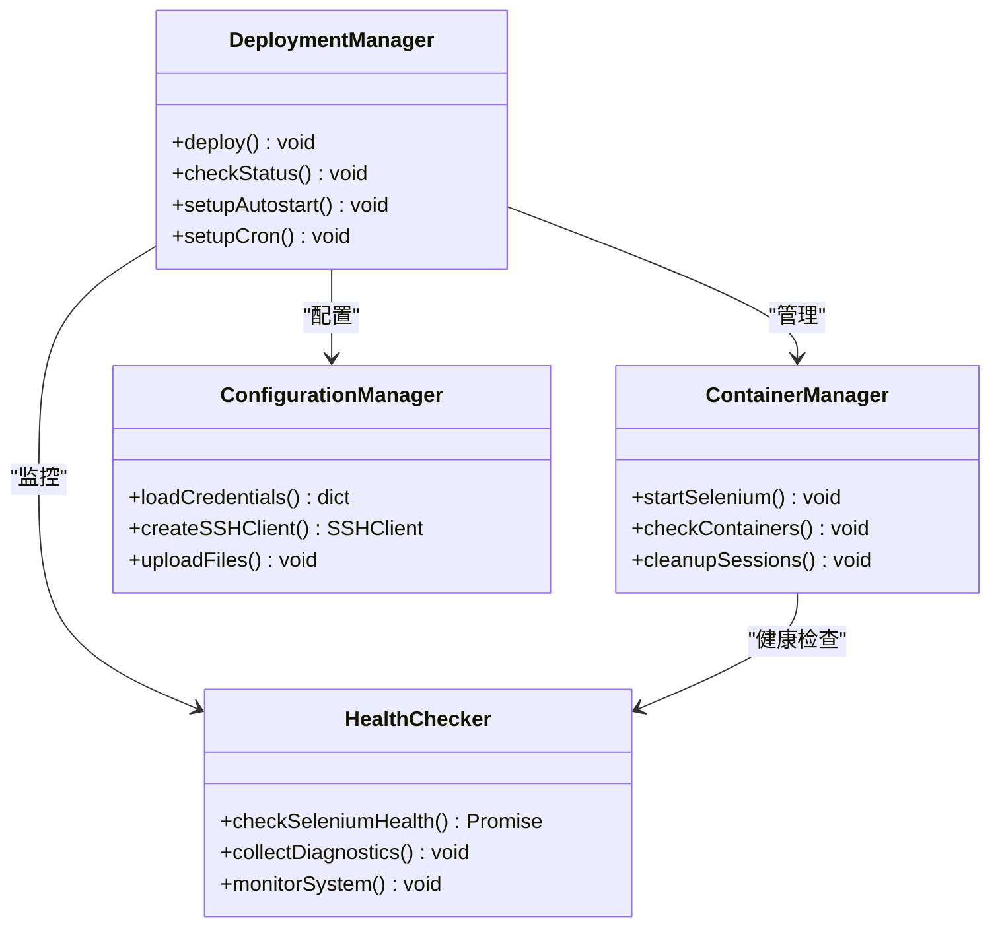
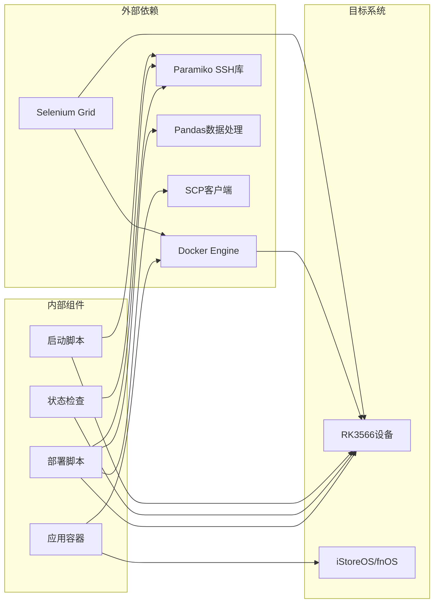

# 部署自动化脚本系统

<cite>
**本文档引用的文件**
- [README-dev.md](file://README-dev.md)
- [Dockerfile](file://Dockerfile)
- [package.json](file://package.json)
- [weread-challenge.js](file://src/weread-challenge.js)
- [PLAN.md](file://docs/rk3566-muti-user-deploy/PLAN.md)
- [ssh_scp_util.py](file://docs/rk3566-muti-user-deploy/scripts/ssh_scp_util.py)
- [check-status.py](file://docs/rk3566-muti-user-deploy/scripts/check-status.py)
- [start_selenium.py](file://docs/rk3566-muti-user-deploy/scripts/start_selenium.py)
- [docker-compose.yml](file://docs/rk3566-muti-user-deploy/docker-compose.yml)
- [pull_image.py](file://docs/rk3566-oect-2-fnOS-deploy/scripts/工具/pull_image.py)
- [setup-autostart.sh](file://docs/rk3566-oect-2-fnOS-deploy/scripts/工具/setup-autostart.sh)
- [check_boot_log.py](file://docs/rk3566-oect-2-fnOS-deploy/scripts/工具/check_boot_log.py)
- [check_containers.py](file://docs/rk3566-oect-2-fnOS-deploy/scripts/工具/check_containers.py)
- [check_time_and_tasks.py](file://docs/rk3566-oect-2-fnOS-deploy/scripts/工具/check_time_and_tasks.py)
</cite>

## 目录
1. [项目概述](#项目概述)
2. [项目结构](#项目结构)
3. [核心组件](#核心组件)
4. [架构概览](#架构概览)
5. [详细组件分析](#详细组件分析)
6. [依赖关系分析](#依赖关系分析)
7. [性能考虑](#性能考虑)
8. [故障排除指南](#故障排除指南)
9. [结论](#结论)

## 项目概述

部署自动化脚本系统是一个基于Docker的微信读书挑战自动化解决方案，专为RK3566设备设计。该系统通过容器化部署支持多用户同时运行，实现了完全自动化的阅读任务执行和监控。

系统的核心功能包括：
- 多用户分时复用的Selenium容器管理
- 自动化的SSH远程部署和配置
- 定时任务调度和执行监控
- 容器健康检查和故障恢复
- VNC远程桌面访问和调试支持

## 项目结构

**图表来源**
- [Dockerfile:1-8](file://Dockerfile#L1-8)
- [package.json:1-10](file://package.json#L1-10)
- [weread-challenge.js:1-50](file://src/weread-challenge.js#L1-50)

**章节来源**
- [Dockerfile:1-8](file://Dockerfile#L1-8)
- [package.json:1-10](file://package.json#L1-10)
- [README-dev.md:1-14](file://README-dev.md#L1-14)

## 核心组件

### 应用程序核心

weread-challenge.js是系统的核心应用程序，实现了完整的微信读书自动化功能：

- **浏览器自动化**：使用Selenium WebDriver进行网页交互
- **二维码登录**：自动检测和处理登录二维码
- **阅读控制**：模拟用户阅读行为，支持多种速度配置
- **数据持久化**：自动保存登录状态和截图
- **通知系统**：支持邮件和Bark推送通知

### 部署管理系统

系统包含多个Python脚本用于自动化部署和管理：

- **ssh_scp_util.py**：主部署脚本，支持无人值守部署
- **check-status.py**：状态检查脚本，验证部署结果
- **start_selenium.py**：手动启动脚本，用于调试和维护

### Docker编排

使用docker-compose.yml定义了完整的容器编排配置，支持多用户环境：

- **Selenium服务**：提供共享的浏览器环境
- **应用服务**：为每个用户创建独立的应用容器
- **网络配置**：使用host网络模式确保最佳性能

**章节来源**
- [weread-challenge.js:745-800](file://src/weread-challenge.js#L745-800)
- [ssh_scp_util.py:43-127](file://docs/rk3566-muti-user-deploy/scripts/ssh_scp_util.py#L43-127)
- [docker-compose.yml:1-94](file://docs/rk3566-muti-user-deploy/docker-compose.yml#L1-94)

## 架构概览

**图表来源**
- [PLAN.md:52-67](file://docs/rk3566-muti-user-deploy/PLAN.md#L52-67)
- [docker-compose.yml:50-94](file://docs/rk3566-muti-user-deploy/docker-compose.yml#L50-94)

系统采用分时复用架构，4个用户共享同一个Selenium实例，通过以下机制实现隔离：

1. **会话隔离**：每个用户拥有独立的浏览器会话
2. **数据隔离**：每个用户有独立的数据目录
3. **时间隔离**：定时任务错开执行时间
4. **资源隔离**：通过Docker容器实现资源限制

## 详细组件分析

### 部署自动化流程

**图表来源**
- [ssh_scp_util.py:43-127](file://docs/rk3566-muti-user-deploy/scripts/ssh_scp_util.py#L43-127)

### 多用户调度机制

**图表来源**
- [PLAN.md:256-264](file://docs/rk3566-muti-user-deploy/PLAN.md#L256-264)
- [PLAN.md:318-341](file://docs/rk3566-muti-user-deploy/PLAN.md#L318-341)

### 系统健康监控

**图表来源**
- [ssh_scp_util.py:43-127](file://docs/rk3566-muti-user-deploy/scripts/ssh_scp_util.py#L43-127)
- [check-status.py:36-87](file://docs/rk3566-muti-user-deploy/scripts/check-status.py#L36-87)

**章节来源**
- [ssh_scp_util.py:18-229](file://docs/rk3566-muti-user-deploy/scripts/ssh_scp_util.py#L18-229)
- [check-status.py:1-92](file://docs/rk3566-muti-user-deploy/scripts/check-status.py#L1-92)
- [PLAN.md:1-341](file://docs/rk3566-muti-user-deploy/PLAN.md#L1-341)

## 依赖关系分析

### 系统依赖图

**图表来源**
- [ssh_scp_util.py:7-10](file://docs/rk3566-muti-user-deploy/scripts/ssh_scp_util.py#L7-10)
- [docker-compose.yml:1-94](file://docs/rk3566-muti-user-deploy/docker-compose.yml#L1-94)

### 数据流分析

系统中的主要数据流包括：

1. **配置数据流**：从password.csv到各个脚本的配置传递
2. **部署数据流**：从本地文件到远程主机的文件传输
3. **监控数据流**：从远程主机到本地的状态反馈
4. **执行数据流**：从定时任务到容器执行的任务传递

**章节来源**
- [ssh_scp_util.py:12-27](file://docs/rk3566-muti-user-deploy/scripts/ssh_scp_util.py#L12-27)
- [docker-compose.yml:4-49](file://docs/rk3566-muti-user-deploy/docker-compose.yml#L4-49)

## 性能考虑

### 资源优化策略

系统针对RK3566设备的硬件限制进行了专门优化：

- **内存管理**：Selenium容器使用2GB共享内存
- **CPU优化**：4用户分时复用，避免资源竞争
- **存储优化**：独立数据目录，便于清理和维护
- **网络优化**：使用host网络模式减少性能损耗

### 扩展性设计

系统支持灵活的扩展配置：

- **用户数量**：可根据需要增加或减少用户数量
- **执行时间**：可调整每个用户的阅读时长
- **并发控制**：通过SE_NODE_MAX_SESSIONS控制并发会话数
- **监控范围**：可扩展到更多监控指标和告警机制

## 故障排除指南

### 常见问题及解决方案

#### 部署相关问题

| 问题类型 | 症状描述 | 解决方案 |
|---------|----------|----------|
| SSH连接失败 | 连接超时或认证失败 | 检查密码配置和网络连通性 |
| 文件传输失败 | SCP传输中断 | 验证目标路径权限和磁盘空间 |
| 容器启动失败 | Docker compose错误 | 检查镜像版本和依赖服务 |

#### 运行时问题

| 问题类型 | 症状描述 | 解决方案 |
|---------|----------|----------|
| 定时任务未执行 | crontab任务缺失 | 检查crond服务状态和任务配置 |
| 容器无法访问 | 网络连接问题 | 验证host网络模式和端口映射 |
| VNC连接失败 | 显示服务异常 | 检查X11服务和显示配置 |

#### 监控和诊断

系统提供了完善的诊断工具：

- **状态检查脚本**：验证容器、定时任务和数据目录状态
- **日志收集工具**：自动收集Selenium和系统日志
- **健康检查接口**：监控Selenium Grid健康状态
- **VNC调试支持**：提供远程桌面访问能力

**章节来源**
- [check-status.py:36-87](file://docs/rk3566-muti-user-deploy/scripts/check-status.py#L36-87)
- [check_boot_log.py:21-65](file://docs/rk3566-oect-2-fnOS-deploy/scripts/工具/check_boot_log.py#L21-65)
- [check_time_and_tasks.py:21-82](file://docs/rk3566-oect-2-fnOS-deploy/scripts/工具/check_time_and_tasks.py#L21-82)

## 结论

部署自动化脚本系统为RK3566设备提供了一个完整、可靠的微信读书自动化解决方案。系统的主要优势包括：

1. **高度自动化**：从部署到日常运维实现全流程自动化
2. **多用户支持**：通过分时复用实现4用户同时运行
3. **稳定可靠**：完善的健康检查和故障恢复机制
4. **易于维护**：清晰的架构设计和丰富的监控工具
5. **性能优化**：针对嵌入式设备的专门优化

该系统不仅满足了当前的业务需求，还为未来的扩展和维护奠定了坚实的基础。通过模块化的架构设计和完善的文档体系，系统能够适应不断变化的业务场景和技术要求。