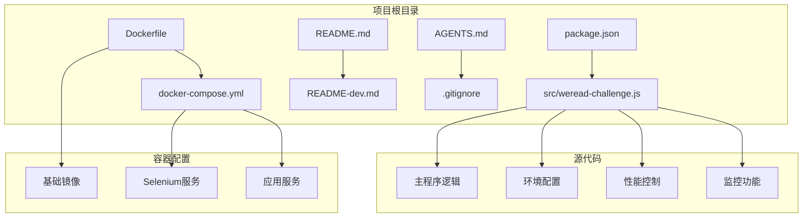
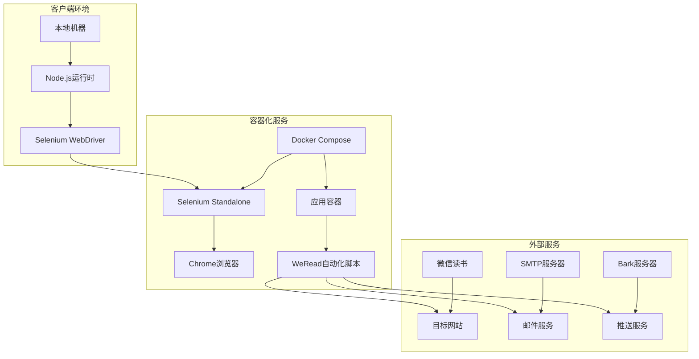
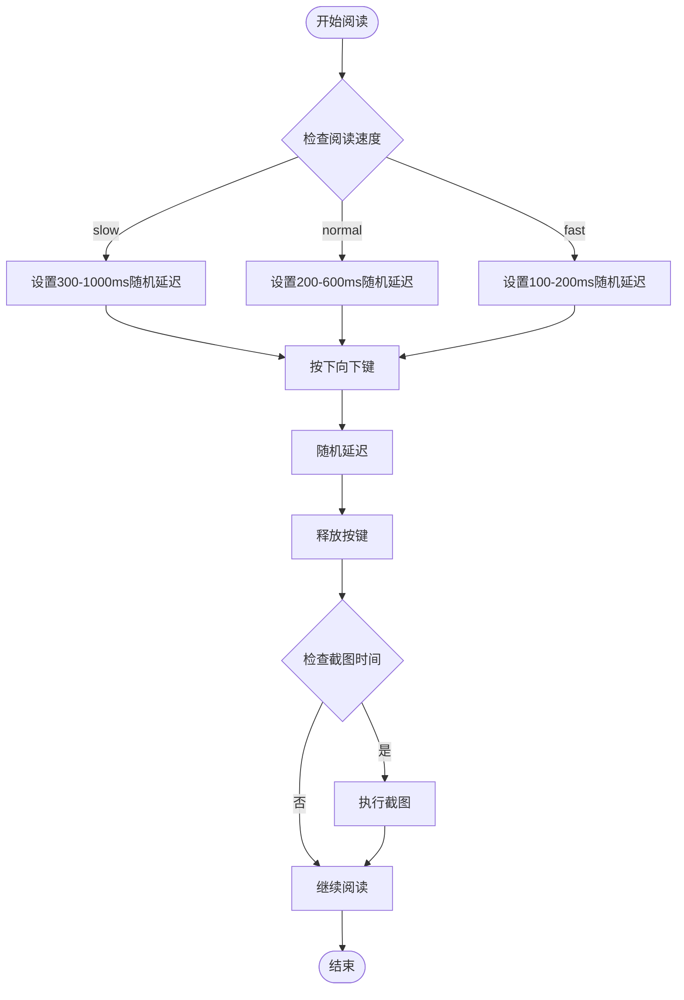
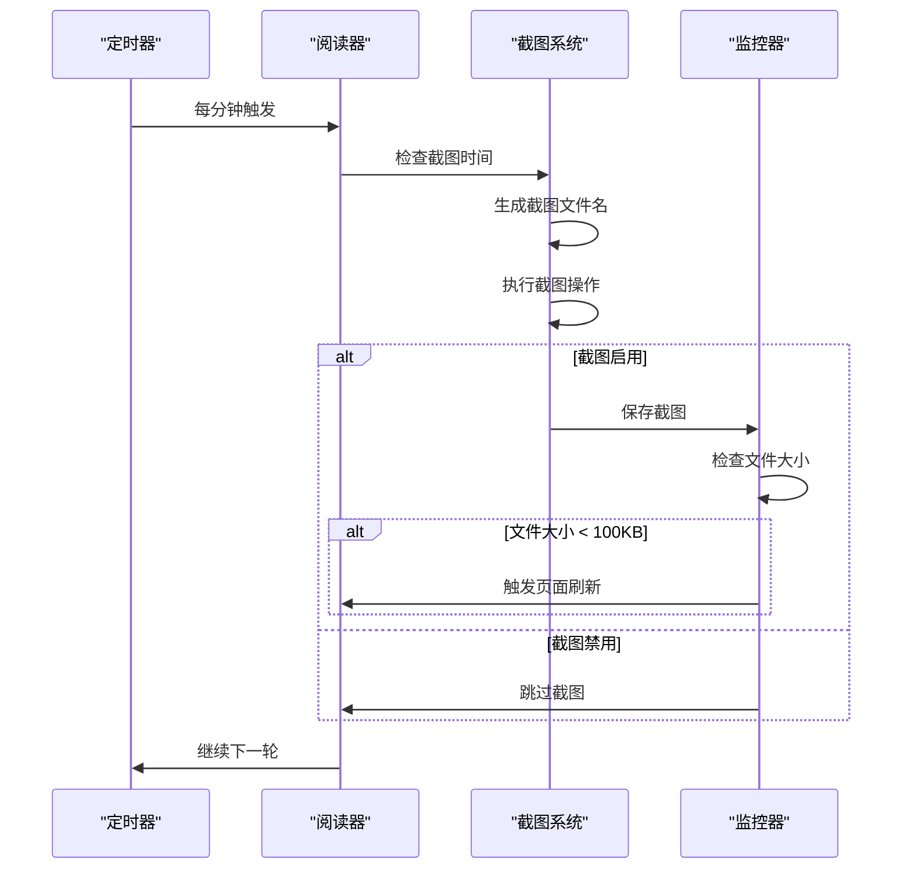
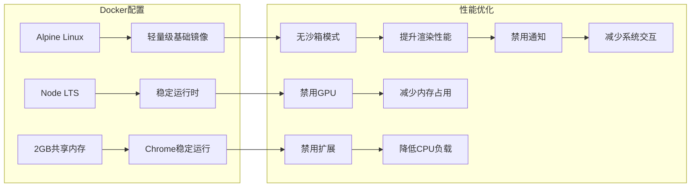
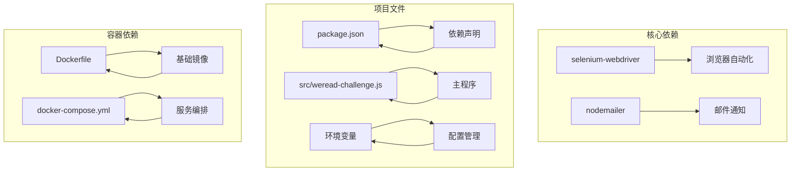
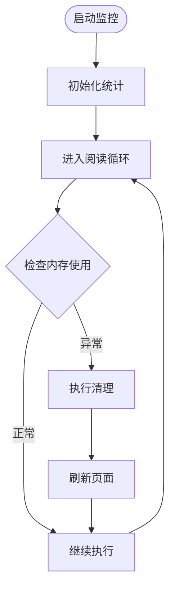

# 性能优化配置

<cite>
**本文档引用的文件**
- [package.json](file://package.json)
- [src/weread-challenge.js](file://src/weread-challenge.js)
- [Dockerfile](file://Dockerfile)
- [docker-compose.yml](file://docker-compose.yml)
- [AGENTS.md](file://AGENTS.md)
- [README-dev.md](file://README-dev.md)
</cite>

## 目录
1. [简介](#简介)
2. [项目结构](#项目结构)
3. [核心组件](#核心组件)
4. [架构概览](#架构概览)
5. [详细组件分析](#详细组件分析)
6. [依赖关系分析](#依赖关系分析)
7. [性能考虑因素](#性能考虑因素)
8. [故障排除指南](#故障排除指南)
9. [结论](#结论)

## 简介

WeRead 挑战赛自动化项目是一个基于 Selenium WebDriver 的自动化脚本，用于自动完成微信读书的挑战赛阅读任务。该项目实现了智能的阅读控制、截图监控、邮件通知和 Bark 推送等功能。本文档专注于项目的性能优化配置，包括阅读速度控制、截图频率设置、内存使用优化和并发控制参数等关键性能指标。

## 项目结构

项目采用简洁的单文件架构设计，主要组件分布如下：

**图表来源**
- [package.json](file://package.json#L1-L10)
- [src/weread-challenge.js](file://src/weread-challenge.js#L1-L50)
- [Dockerfile](file://Dockerfile#L1-L8)
- [docker-compose.yml](file://docker-compose.yml#L1-L32)

**章节来源**
- [package.json](file://package.json#L1-L10)
- [src/weread-challenge.js](file://src/weread-challenge.js#L1-L100)
- [Dockerfile](file://Dockerfile#L1-L8)
- [docker-compose.yml](file://docker-compose.yml#L1-L32)

## 核心组件

### 性能配置参数

项目提供了多个关键的性能配置参数，这些参数直接影响自动化脚本的执行效率和资源消耗：

#### 阅读速度配置
- **slow**: 随机等待 300-1000ms，最慢但最稳定
- **normal**: 随机等待 200-600ms，平衡性能与稳定性  
- **fast**: 随机等待 100-200ms，最高性能但风险较高

#### 截图监控配置
- **WEREAD_SCREENSHOT**: 控制是否每分钟截图，默认开启
- **截图频率**: 每分钟自动截图一次，用于监控阅读进度
- **文件大小检测**: 当截图小于100KB时自动刷新页面

#### 内存管理配置
- **页面加载策略**: 使用 `pageLoadStrategy: 'eager'` 提高响应速度
- **窗口尺寸随机化**: 随机生成 800x700 到 1800x1500 的窗口尺寸
- **Cookie持久化**: 自动保存和加载登录状态，避免重复登录开销

**章节来源**
- [src/weread-challenge.js](file://src/weread-challenge.js#L25-L42)
- [src/weread-challenge.js](file://src/weread-challenge.js#L1090-L1126)

## 架构概览

项目采用客户端-服务器架构，结合 Docker 容器化部署：

**图表来源**
- [docker-compose.yml](file://docker-compose.yml#L1-L32)
- [src/weread-challenge.js](file://src/weread-challenge.js#L756-L828)

## 详细组件分析

### 性能控制组件

#### 阅读速度控制系统

阅读速度控制是性能优化的核心组件，通过动态调整按键间隔来平衡性能和稳定性：

**图表来源**
- [src/weread-challenge.js](file://src/weread-challenge.js#L1090-L1126)

#### 截图监控系统

截图监控系统实现了智能的进度跟踪和异常检测机制：

**图表来源**
- [src/weread-challenge.js](file://src/weread-challenge.js#L1098-L1126)

#### 内存优化策略

项目采用了多项内存优化技术来减少资源消耗：

| 优化策略 | 实现方式 | 性能收益 |
|---------|----------|----------|
| 窗口尺寸随机化 | 动态设置浏览器窗口大小 | 减少内存峰值占用 |
| Cookie持久化 | 自动保存登录状态 | 避免重复登录开销 |
| 页面加载策略 | 使用 eager 模式 | 提高页面响应速度 |
| 异步操作 | 全面使用 async/await | 减少阻塞等待 |

**章节来源**
- [src/weread-challenge.js](file://src/weread-challenge.js#L830-L846)
- [src/weread-challenge.js](file://src/weread-challenge.js#L350-L371)

### 容器化性能配置

#### Docker 配置优化

Docker 环境提供了专门的性能优化配置：

**图表来源**
- [Dockerfile](file://Dockerfile#L1-L8)
- [docker-compose.yml](file://docker-compose.yml#L16-L26)

**章节来源**
- [Dockerfile](file://Dockerfile#L1-L8)
- [docker-compose.yml](file://docker-compose.yml#L16-L26)

## 依赖关系分析

项目依赖关系相对简单，主要依赖于 Selenium WebDriver 和 Node.js 生态系统：

**图表来源**
- [package.json](file://package.json#L5-L8)
- [src/weread-challenge.js](file://src/weread-challenge.js#L10-L18)

**章节来源**
- [package.json](file://package.json#L5-L8)
- [src/weread-challenge.js](file://src/weread-challenge.js#L10-L18)

## 性能考虑因素

### 阅读速度配置详解

#### 性能影响分析

| 配置级别 | 延迟范围(ms) | CPU使用率 | 内存占用 | 稳定性 |
|---------|-------------|-----------|----------|--------|
| slow | 300-1000 | 低 | 低 | 最高 |
| normal | 200-600 | 中等 | 中等 | 高 |
| fast | 100-200 | 高 | 高 | 中等 |

#### 最佳实践建议

1. **生产环境推荐**: 使用 `normal` 配置，在性能和稳定性间取得平衡
2. **测试环境推荐**: 使用 `slow` 配置，确保脚本稳定性
3. **高负载环境**: 使用 `fast` 配置，但需要密切监控系统状态

### 内存使用优化

#### 内存消耗监控

项目通过以下机制监控内存使用情况：

#### 内存优化策略

1. **定期清理**: 每次截图后检查文件大小，避免无效数据积累
2. **资源释放**: 确保浏览器实例正确关闭
3. **缓存管理**: 合理使用 Cookie 缓存，避免过度存储

### 网络请求优化

#### 请求策略

项目在网络请求方面采用了以下优化策略：

| 优化类型 | 实现方式 | 效果 |
|---------|----------|------|
| 健康检查 | 自动检查 Selenium 服务状态 | 提升连接稳定性 |
| 超时控制 | 设置合理的请求超时时间 | 防止长时间阻塞 |
| DNS优化 | 使用国内DNS服务器 | 加速域名解析 |

**章节来源**
- [src/weread-challenge.js](file://src/weread-challenge.js#L125-L152)
- [docker-compose.yml](file://docker-compose.yml#L13-L15)

## 故障排除指南

### 常见性能问题及解决方案

#### 页面加载缓慢

**症状**: 页面加载超时或响应缓慢

**解决方案**:
1. 检查网络连接稳定性
2. 调整 `pageLoad` 超时时间
3. 确认 Selenium 服务正常运行

#### 内存不足

**症状**: 浏览器崩溃或系统卡顿

**解决方案**:
1. 减少同时运行的实例数量
2. 调整 Chrome 参数禁用不必要的功能
3. 增加系统内存或容器内存限制

#### 截图异常

**症状**: 截图文件过小或无法生成

**解决方案**:
1. 检查浏览器权限设置
2. 确认截图目录具有写入权限
3. 调整截图频率设置

### 性能基准测试

#### 基准测试方法

1. **测试环境准备**: 使用相同的硬件配置和网络环境
2. **测试参数设置**: 固定阅读时长和速度配置
3. **数据收集**: 记录执行时间、内存使用和错误率
4. **结果分析**: 对比不同配置下的性能表现

#### 性能指标监控

| 指标类型 | 监控方法 | 告警阈值 |
|---------|----------|----------|
| 执行时间 | 统计总执行时长 | 超过预期20% |
| 内存使用 | 监控RSS内存 | 超过容器限制 |
| 错误率 | 统计异常次数 | 超过1% |
| 截图质量 | 检查文件大小 | 小于100KB |

**章节来源**
- [src/weread-challenge.js](file://src/weread-challenge.js#L1240-L1275)

## 结论

WeRead 挑战赛自动化项目通过精心设计的性能优化配置，在保证功能完整性的前提下实现了高效的自动化阅读。项目的关键性能优化点包括：

1. **灵活的阅读速度控制**: 支持三种不同的速度配置，适应不同场景需求
2. **智能的截图监控**: 自动检测页面状态，确保阅读过程的连续性
3. **容器化部署优化**: 通过 Docker 配置实现资源的有效利用
4. **内存管理策略**: 采用多种技术减少内存占用和提高稳定性

建议用户根据实际使用场景选择合适的配置参数，并建立完善的监控体系来跟踪性能表现。对于生产环境，推荐使用 `normal` 阅读速度配置，并配合适当的监控和告警机制。