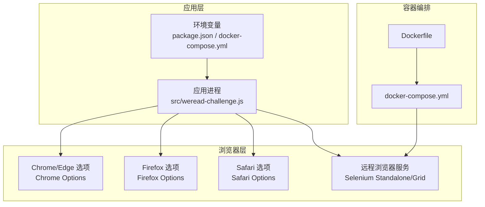
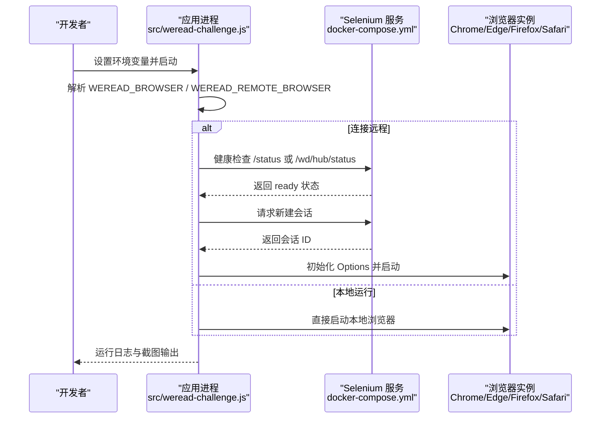
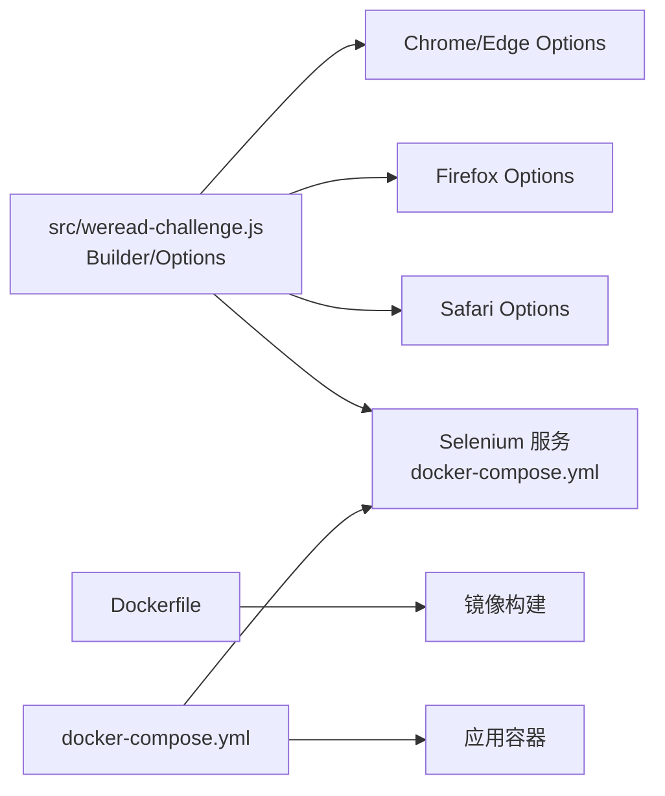
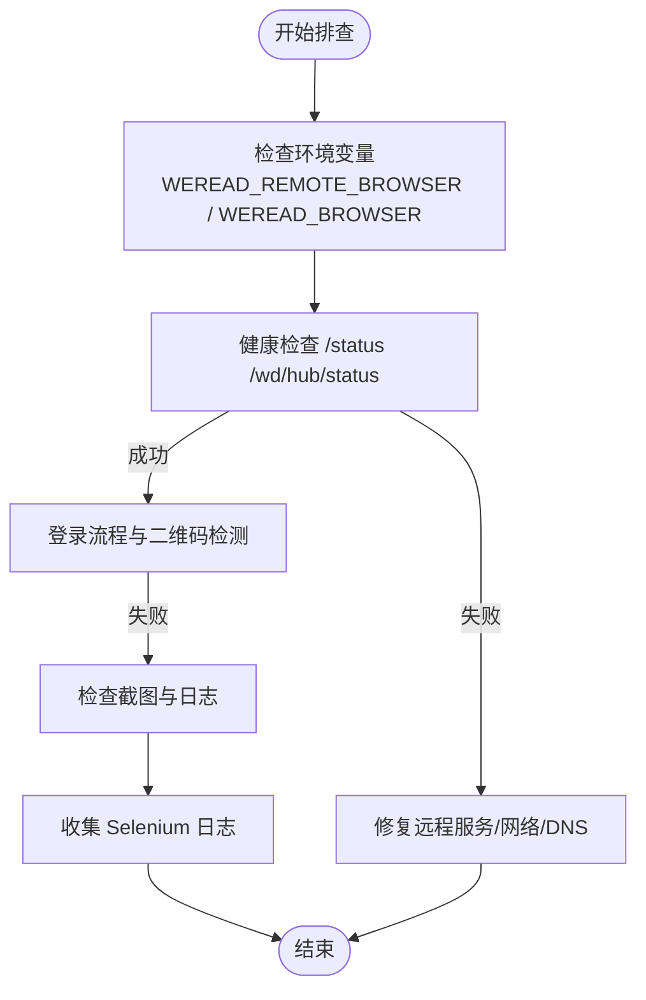

# 浏览器配置

<cite>
**本文引用的文件**
- [package.json](file://package.json)
- [Dockerfile](file://Dockerfile)
- [docker-compose.yml](file://docker-compose.yml)
- [src/weread-challenge.js](file://src/weread-challenge.js)
- [README-dev.md](file://README-dev.md)
- [AGENTS.md](file://AGENTS.md)
</cite>

## 目录
1. [简介](#简介)
2. [项目结构](#项目结构)
3. [核心组件](#核心组件)
4. [架构总览](#架构总览)
5. [详细组件分析](#详细组件分析)
6. [依赖关系分析](#依赖关系分析)
7. [性能考量](#性能考量)
8. [故障排除指南](#故障排除指南)
9. [结论](#结论)
10. [附录](#附录)

## 简介
本文件面向 WeRead 挑战赛自动化项目，系统化梳理浏览器配置与运行机制，覆盖以下主题：
- 支持的浏览器类型与特性差异（Chrome、Firefox、Edge、Safari）
- 启动参数、性能优化、无头模式与远程浏览器集群
- 浏览器选择指南、兼容性与功能限制、最佳实践
- Docker 容器化部署中的浏览器配置与 Selenium Grid 集群示例
- 故障排除与诊断方法

## 项目结构
该项目围绕一个主流程脚本展开，配合 Docker 化编排与环境变量驱动的配置，形成“本地/远程”双模式运行能力。

图表来源
- [src/weread-challenge.js](file://src/weread-challenge.js#L756-L828)
- [docker-compose.yml](file://docker-compose.yml#L15-L32)
- [Dockerfile](file://Dockerfile#L1-L8)

章节来源
- [src/weread-challenge.js](file://src/weread-challenge.js#L1-L120)
- [docker-compose.yml](file://docker-compose.yml#L1-L32)
- [Dockerfile](file://Dockerfile#L1-L8)

## 核心组件
- 浏览器选择与构建
  - 通过环境变量选择浏览器类型，并根据类型动态加载对应 Options 类型。
  - 支持 Chrome、Firefox、Edge、Safari 四种主流浏览器。
- 远程浏览器与健康检查
  - 可连接远程 Selenium Standalone 或 Grid，内置健康检查与日志采集。
- 容器化运行
  - 使用 Dockerfile 构建镜像，docker-compose.yml 编排应用与 Selenium 服务。
- 性能与稳定性
  - 设置隐式等待、页面加载与脚本超时，随机窗口尺寸，降低被识别风险。
  - 提供截图与日志输出，便于问题定位。

章节来源
- [src/weread-challenge.js](file://src/weread-challenge.js#L25-L56)
- [src/weread-challenge.js](file://src/weread-challenge.js#L745-L828)
- [docker-compose.yml](file://docker-compose.yml#L1-L32)

## 架构总览
WeRead 自动化脚本在“本地/远程”两种模式下运行：
- 本地模式：直接启动本地浏览器实例（Chrome/Edge/Firefox/Safari）。
- 远程模式：连接到 Selenium Standalone/Grid，由容器统一管理浏览器实例。

图表来源
- [src/weread-challenge.js](file://src/weread-challenge.js#L125-L152)
- [src/weread-challenge.js](file://src/weread-challenge.js#L792-L815)
- [docker-compose.yml](file://docker-compose.yml#L15-L32)

## 详细组件分析

### 浏览器类型与配置
- 支持的浏览器
  - Chrome、Firefox、Edge、Safari。默认使用 Chrome，可通过环境变量切换。
- 选项初始化与参数
  - Chrome/Edge：通过 Chrome Options 注入常用参数（如禁用沙箱、GPU、内存共享等），并设置用户配置目录、禁用通知与弹窗等。
  - Firefox：使用 Firefox Options，默认构建器启动。
  - Safari：使用 Safari Options，登录态保存时对 Cookie 的 secure 标记进行统一修正，提升跨平台一致性。
- 无头模式
  - 代码中未显式设置 headless 参数，因此默认以有头模式运行。如需无头模式，可在对应 Options 上添加相应参数。
- 页面加载策略
  - 使用 eager 策略，减少页面等待时间，提高稳定性。

章节来源
- [src/weread-challenge.js](file://src/weread-challenge.js#L29-L29)
- [src/weread-challenge.js](file://src/weread-challenge.js#L756-L828)
- [src/weread-challenge.js](file://src/weread-challenge.js#L350-L371)

### 远程浏览器集群与健康检查
- 连接方式
  - 通过 WEREAD_REMOTE_BROWSER 环境变量指定远程服务地址；若为空则走本地模式。
  - 连接前进行健康检查，优先尝试 /status，其次 /wd/hub/status。
- 容器化集群
  - docker-compose 使用 selenium/standalone-chromium 作为远程浏览器节点，共享内存 2GB，启用健康检查。
  - 应用容器依赖 selenium 服务健康后再启动，DNS 指向国内加速地址。
- 日志采集
  - 异常时自动抓取 Selenium 容器日志并保存至 data 目录，便于诊断。

章节来源
- [src/weread-challenge.js](file://src/weread-challenge.js#L25-L25)
- [src/weread-challenge.js](file://src/weread-challenge.js#L125-L152)
- [src/weread-challenge.js](file://src/weread-challenge.js#L224-L232)
- [docker-compose.yml](file://docker-compose.yml#L15-L32)

### Docker 容器化部署
- 镜像构建
  - 基于 node:lts-alpine，复制依赖与脚本，仅安装生产依赖。
- 编排服务
  - app 服务挂载数据卷，依赖 selenium 服务健康。
  - selenium 服务使用 standalone-chromium，设置共享内存与健康检查。
- 运行建议
  - 生产部署建议开启健康检查与日志采集，合理设置 DNS 与网络策略。

章节来源
- [Dockerfile](file://Dockerfile#L1-L8)
- [docker-compose.yml](file://docker-compose.yml#L1-L32)
- [AGENTS.md](file://AGENTS.md#L32-L32)

### 性能优化与稳定性
- 超时配置
  - 隐式等待、页面加载、脚本执行分别设置，避免长时间阻塞。
- 窗口尺寸
  - 随机设置窗口宽高，降低被识别为自动化风险。
- 截图与日志
  - 每分钟截图（可配置），输出运行日志；异常时抓取 Selenium 日志。
- 阅读节奏
  - 根据速度配置随机按键间隔，模拟人类行为。

章节来源
- [src/weread-challenge.js](file://src/weread-challenge.js#L830-L835)
- [src/weread-challenge.js](file://src/weread-challenge.js#L840-L845)
- [src/weread-challenge.js](file://src/weread-challenge.js#L1088-L1126)

### 兼容性差异与功能限制
- Safari
  - 登录态保存时对 Cookie 的 secure 标记进行统一修正，以适配跨平台一致性。
  - 文档明确指出 Safari 的网页解析不同于 Chrome，尚未进行兼容性测试。
- Firefox
  - 使用 Firefox Options 构建，未附加额外参数，适合基础功能验证。
- Edge
  - 与 Chrome 选项一致，参数相同，可互换使用。
- Chrome
  - 默认参数覆盖常见容器化场景，适合大规模并发与远程集群。

章节来源
- [src/weread-challenge.js](file://src/weread-challenge.js#L350-L371)
- [README-dev.md](file://README-dev.md#L13-L13)

### 浏览器选择指南
- 本地开发
  - 推荐 Chrome，便于调试与快速迭代。
- 远程集群
  - 使用 selenium/standalone-chromium，统一版本与参数，便于横向扩展。
- Safari
  - 当前未进行兼容性测试，不建议在生产环境使用。
- Firefox
  - 适合轻量验证与非复杂交互场景。

章节来源
- [src/weread-challenge.js](file://src/weread-challenge.js#L762-L778)
- [README-dev.md](file://README-dev.md#L13-L13)

### 最佳实践
- 环境变量
  - 明确设置 WEREAD_BROWSER、WEREAD_REMOTE_BROWSER、WEREAD_DURATION、WEREAD_SPEED 等关键参数。
- 容器化
  - 为 selenium 服务设置共享内存与健康检查，确保稳定性。
- 日志与监控
  - 开启输出日志与截图，异常时自动采集 Selenium 日志。
- 安全
  - 所有敏感凭据通过环境变量传递，避免硬编码。

章节来源
- [package.json](file://package.json#L2-L4)
- [AGENTS.md](file://AGENTS.md#L29-L34)

## 依赖关系分析
- 应用与浏览器驱动
  - 应用根据 WEREAD_BROWSER 动态加载对应 Options 类型，再构建 WebDriver 实例。
- 远程连接
  - 通过 Builder.withCapabilities 与 setChromeOptions/setSafariOptions 等接口连接远程服务。
- 容器编排
  - docker-compose 将应用与 selenium 服务解耦，通过网络与健康检查协调启动顺序。

图表来源
- [src/weread-challenge.js](file://src/weread-challenge.js#L756-L828)
- [docker-compose.yml](file://docker-compose.yml#L1-L32)
- [Dockerfile](file://Dockerfile#L1-L8)

章节来源
- [src/weread-challenge.js](file://src/weread-challenge.js#L756-L828)
- [docker-compose.yml](file://docker-compose.yml#L1-L32)
- [Dockerfile](file://Dockerfile#L1-L8)

## 性能考量
- 超时与等待
  - 合理设置隐式等待与页面加载超时，避免长时间阻塞。
- 窗口尺寸随机化
  - 随机窗口尺寸有助于降低被识别为自动化脚本的风险。
- 截图频率
  - 每分钟截图可作为进度记录，但需权衡磁盘与 I/O 压力。
- 远程集群
  - 使用统一的 standalone-chromium 节点，便于横向扩展与负载均衡。

章节来源
- [src/weread-challenge.js](file://src/weread-challenge.js#L830-L835)
- [src/weread-challenge.js](file://src/weread-challenge.js#L840-L845)
- [src/weread-challenge.js](file://src/weread-challenge.js#L1088-L1126)
- [docker-compose.yml](file://docker-compose.yml#L15-L32)

## 故障排除指南
- 连接远程失败
  - 检查 WEREAD_REMOTE_BROWSER 地址与协议，确保服务可达；查看健康检查返回值。
- Safari 登录态异常
  - 确认 Cookie 的 secure 标记已被统一修正；如仍异常，考虑更换浏览器类型。
- Chrome 在容器中崩溃
  - 确认共享内存设置与 DNS 配置；必要时增大共享内存大小。
- 截图无效或过小
  - 检查截图路径与权限；当截图小于阈值时会自动刷新页面。
- 日志与诊断
  - 异常时自动抓取 Selenium 容器日志并保存至 data 目录，便于定位问题。

图表来源
- [src/weread-challenge.js](file://src/weread-challenge.js#L125-L152)
- [src/weread-challenge.js](file://src/weread-challenge.js#L224-L232)
- [src/weread-challenge.js](file://src/weread-challenge.js#L1110-L1126)

章节来源
- [src/weread-challenge.js](file://src/weread-challenge.js#L125-L152)
- [src/weread-challenge.js](file://src/weread-challenge.js#L224-L232)
- [src/weread-challenge.js](file://src/weread-challenge.js#L1110-L1126)

## 结论
本项目提供了灵活的浏览器配置与运行模式，支持本地与远程两种部署形态。通过环境变量与 Options 参数，可针对不同浏览器进行差异化配置；借助 Docker 编排与健康检查，实现稳定的远程集群运行。建议在生产环境中优先使用 Chrome/Edge，并结合 standalone-chromium 集群与日志采集机制，确保稳定性与可观测性。

## 附录

### 环境变量清单
- WEREAD_BROWSER：浏览器类型（chrome、firefox、edge、safari）
- WEREAD_REMOTE_BROWSER：远程浏览器服务地址（如 http://selenium:4444）
- WEREAD_DURATION：阅读时长（分钟）
- WEREAD_SPEED：阅读速度（slow、normal、fast）
- WEREAD_SCREENSHOT：是否每分钟截图（true/false）
- ENABLE_EMAIL：是否启用邮件通知（true/false）
- EMAIL_SMTP/EMAIL_PORT/EMAIL_USER/EMAIL_PASS/EMAIL_FROM/EMAIL_TO：SMTP 配置
- BARK_KEY/BARK_SERVER：Bark 推送配置
- WEREAD_AGREE_TERMS：是否上报统计事件（true/false）

章节来源
- [src/weread-challenge.js](file://src/weread-challenge.js#L25-L56)
- [package.json](file://package.json#L2-L4)

### Docker 与 Selenium Grid 示例
- 单节点 standalone-chromium
  - 使用 selenium/standalone-chromium 作为远程浏览器节点，设置共享内存与健康检查。
- 多节点 Grid
  - 可在 docker-compose 中增加 node-chrome/node-firefox 节点，按需扩展容量与版本。
- DNS 与网络
  - 为容器设置国内 DNS，提升访问稳定性。

章节来源
- [docker-compose.yml](file://docker-compose.yml#L15-L32)
- [AGENTS.md](file://AGENTS.md#L32-L32)