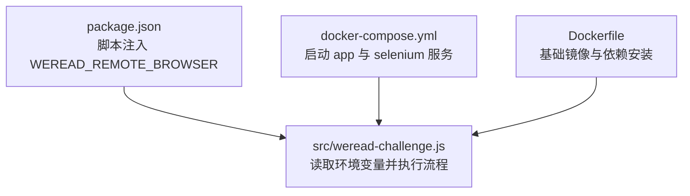
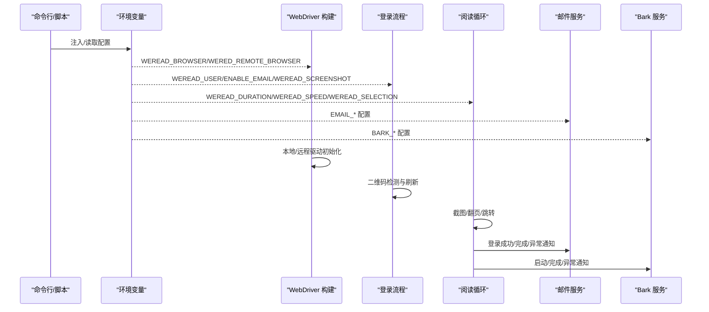
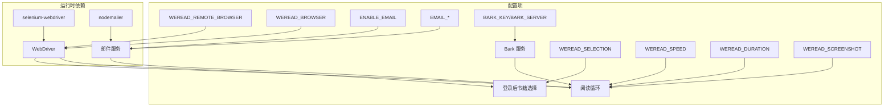

# 环境变量配置

<cite>
**本文引用的文件**
- [src/weread-challenge.js](file://src/weread-challenge.js)
- [package.json](file://package.json)
- [docker-compose.yml](file://docker-compose.yml)
- [Dockerfile](file://Dockerfile)
- [AGENTS.md](file://AGENTS.md)
</cite>

## 目录
1. [简介](#简介)
2. [项目结构](#项目结构)
3. [核心组件](#核心组件)
4. [架构总览](#架构总览)
5. [详细组件分析](#详细组件分析)
6. [依赖关系分析](#依赖关系分析)
7. [性能考量](#性能考量)
8. [故障排除指南](#故障排除指南)
9. [结论](#结论)
10. [附录](#附录)

## 简介
本文件系统性梳理 WeRead 挑战赛自动化脚本的环境变量配置，覆盖所有与登录、阅读、通知相关的配置项，明确参数含义、默认值、取值范围、使用场景、配置验证规则、参数冲突处理与相互影响，并提供完整配置示例与最佳实践建议，帮助用户在不同运行环境中稳定部署与维护。

## 项目结构
- 核心脚本位于 src/weread-challenge.js，负责登录、阅读循环、截图、邮件与 Bark 推送等。
- 运行入口通过 package.json 的脚本注入远程浏览器地址，或通过 docker-compose.yml 启动应用服务与 Selenium Standalone 容器。
- Dockerfile 定义了基础镜像与工作目录，确保依赖安装与运行一致。

图表来源
- [package.json](file://package.json#L2-L4)
- [docker-compose.yml](file://docker-compose.yml#L1-L32)
- [Dockerfile](file://Dockerfile#L1-L8)
- [src/weread-challenge.js](file://src/weread-challenge.js#L745-L828)

章节来源
- [package.json](file://package.json#L1-L10)
- [docker-compose.yml](file://docker-compose.yml#L1-L32)
- [Dockerfile](file://Dockerfile#L1-L8)

## 核心组件
本节对所有可用的环境变量进行逐项说明，包括参数含义、默认值、取值范围、使用场景、配置验证规则、参数冲突处理与相互影响。

- WEREAD_USER
  - 含义：用户标识，用于浏览器配置文件目录区分不同用户。
  - 默认值：weread-default
  - 取值范围：任意字符串
  - 使用场景：本地 Chrome/Edge 启动时指定 profile 目录，便于多账号隔离。
  - 验证规则：无强制校验，但建议仅包含字母数字与常见字符，避免路径非法。
  - 冲突与影响：与浏览器类型无关，但会影响本地浏览器 profile 存储路径。

- WEREAD_DURATION
  - 含义：阅读时长（分钟）。
  - 默认值：10
  - 取值范围：正整数（建议 1~若干小时，具体受网络与设备性能限制）
  - 使用场景：控制阅读循环时长，决定截图频率与结束时间。
  - 验证规则：解析为整数，小于等于 0 时行为未显式限定，建议保证正值。
  - 冲突与影响：与 WEREAD_SPEED、WEREAD_SCREENSHOT 共同影响运行节奏与资源占用。

- WEREAD_SPEED
  - 含义：阅读速度，控制按键间隔随机范围。
  - 默认值：slow
  - 取值范围：slow | normal | fast
  - 使用场景：平衡稳定性与效率，避免过于频繁导致页面卡顿或风控。
  - 验证规则：字符串匹配，非目标值时按默认 slow 处理。
  - 冲突与影响：与 WEREAD_DURATION 协同决定阅读节奏；fast 会缩短每次等待时间。

- WEREAD_SELECTION
  - 含义：选择书籍的方式。
  - 默认值：2
  - 取值范围：-1 | 0 | 正整数
  - 使用场景：
    - -1：尝试打开特定书籍；若失败则回退到默认链接。
    - 0：随机选择 1~4 之间的一本书。
    - 正整数 n：选择第 n 个书籍卡片。
  - 验证规则：解析为数字；当 n 超出实际书籍数量时回退到第一个书籍卡片。
  - 冲突与影响：与书架布局变化相关，建议在稳定书架结构下使用固定编号。

- WEREAD_BROWSER
  - 含义：使用的浏览器类型。
  - 默认值：chrome
  - 取值范围：chrome | MicrosoftEdge | firefox | safari
  - 使用场景：根据部署环境选择本地或远程浏览器驱动。
  - 验证规则：字符串匹配；未知值时回退到 chrome。
  - 冲突与影响：与远程浏览器配置、驱动安装、容器支持相关。

- WEREAD_REMOTE_BROWSER
  - 含义：远程 Selenium Grid 地址（协议可省略时自动补全 http://）。
  - 默认值：未设置
  - 取值范围：http/https URL
  - 使用场景：在 docker-compose 或 CI 环境中连接远端 Selenium Standalone。
  - 验证规则：必须是合法 URL；为空时走本地启动流程；非空时进行健康检查。
  - 冲突与影响：与本地浏览器驱动互斥；启用后忽略本地浏览器选项。

- ENABLE_EMAIL
  - 含义：是否启用邮件通知。
  - 默认值：false
  - 取值范围："true" | 其他
  - 使用场景：登录成功/失败、项目启动/完成、异常时发送邮件。
  - 验证规则：严格匹配 "true" 时启用。
  - 冲突与影响：与 EMAIL_* 相关配置共同决定邮件功能可用性。

- WEREAD_SCREENSHOT
  - 含义：是否在阅读期间每分钟截图。
  - 默认值：true（未显式设置时）
  - 取值范围："true" | 其他
  - 使用场景：生成进度截图，辅助问题排查与报告。
  - 验证规则：严格匹配 "true" 时启用；关闭时不会生成截图。
  - 冲突与影响：与磁盘空间、IO 性能相关；建议在资源紧张时关闭。

- WEREAD_AGREE_TERMS
  - 含义：是否同意条款并上报遥测数据。
  - 默认值：true（未显式设置时）
  - 取值范围："true" | 其他
  - 使用场景：上报运行统计（含浏览器、时长、版本等）。
  - 验证规则：严格匹配 "true" 时上报。
  - 冲突与影响：与隐私策略相关，关闭后不上传统计。

- EMAIL_PORT
  - 含义：SMTP 端口。
  - 默认值：465
  - 取值范围：整数端口（常见 465/587/25）
  - 使用场景：邮件传输端口选择。
  - 验证规则：解析为整数；465 自动启用 SSL。
  - 冲突与影响：与 EMAIL_SMTP、EMAIL_USER、EMAIL_PASS 共同决定邮件可用性。

- EMAIL_SMTP
  - 含义：SMTP 服务器地址。
  - 默认值：未设置
  - 取值范围：合法主机名或 IP
  - 使用场景：邮件发送服务器。
  - 验证规则：必填项；未设置时邮件功能不可用。
  - 冲突与影响：与 EMAIL_PORT、EMAIL_USER、EMAIL_PASS 共同决定邮件可用性。

- EMAIL_USER
  - 含义：SMTP 用户名。
  - 默认值：未设置
  - 取值范围：任意字符串
  - 使用场景：SMTP 认证用户名。
  - 验证规则：必填项；未设置时邮件功能不可用。
  - 冲突与影响：与 EMAIL_PASS、EMAIL_SMTP 共同决定认证。

- EMAIL_PASS
  - 含义：SMTP 密码或授权码。
  - 默认值：未设置
  - 取值范围：任意字符串
  - 使用场景：SMTP 认证密码。
  - 验证规则：必填项；未设置时邮件功能不可用。
  - 冲突与影响：与 EMAIL_USER、EMAIL_SMTP 共同决定认证。

- EMAIL_FROM
  - 含义：发件人地址（可选，未设置时回退到 EMAIL_USER）。
  - 默认值：未设置
  - 取值范围：合法邮箱地址
  - 使用场景：邮件发件人显示。
  - 验证规则：可选；建议与 EMAIL_USER 一致或为同一发件域。
  - 冲突与影响：与 EMAIL_USER 共同决定发件人显示。

- EMAIL_TO
  - 含义：收件人地址。
  - 默认值：未设置
  - 取值范围：合法邮箱地址
  - 使用场景：接收通知邮件。
  - 验证规则：必填项；未设置时邮件功能不可用。
  - 冲突与影响：与 EMAIL_* 共同决定邮件可用性。

- BARK_KEY
  - 含义：Bark 推送密钥。
  - 默认值：空字符串
  - 取值范围：任意字符串
  - 使用场景：向 Bark 服务推送通知。
  - 验证规则：可选；未设置时不推送。
  - 冲突与影响：与 BARK_SERVER 共同决定推送可用性。

- BARK_SERVER
  - 含义：Bark 服务器地址。
  - 默认值：https://api.day.app
  - 取值范围：HTTP/HTTPS URL
  - 使用场景：自定义 Bark 服务器。
  - 验证规则：可选；未设置时使用默认官方服务器。
  - 冲突与影响：与 BARK_KEY 共同决定推送可用性。

章节来源
- [src/weread-challenge.js](file://src/weread-challenge.js#L23-L41)
- [src/weread-challenge.js](file://src/weread-challenge.js#L572-L665)
- [src/weread-challenge.js](file://src/weread-challenge.js#L667-L743)
- [docker-compose.yml](file://docker-compose.yml#L5-L6)
- [package.json](file://package.json#L2-L4)

## 架构总览
下图展示环境变量在启动流程中的作用与交互关系。

图表来源
- [src/weread-challenge.js](file://src/weread-challenge.js#L745-L828)
- [src/weread-challenge.js](file://src/weread-challenge.js#L847-L970)
- [src/weread-challenge.js](file://src/weread-challenge.js#L1071-L1220)
- [src/weread-challenge.js](file://src/weread-challenge.js#L572-L665)
- [src/weread-challenge.js](file://src/weread-challenge.js#L667-L743)

## 详细组件分析

### 配置读取与默认值
- 所有配置项均通过 process.env 读取，未设置时采用代码内默认值。
- 邮件端口默认 465，自动启用 SSL；其他端口需自行配置。
- 截图默认开启，可通过 WEREAD_SCREENSHOT 关闭。
- 同意条款默认开启，可通过 WEREAD_AGREE_TERMS 关闭。

章节来源
- [src/weread-challenge.js](file://src/weread-challenge.js#L23-L41)

### 远程浏览器与健康检查
- 当设置 WEREAD_REMOTE_BROWSER 时，脚本会进行健康检查，优先尝试 /status，其次尝试 /wd/hub/status。
- 若未设置或非法，跳过健康检查并走本地启动流程。
- 远程地址未带协议时自动补全 http://。

章节来源
- [src/weread-challenge.js](file://src/weread-challenge.js#L125-L152)
- [src/weread-challenge.js](file://src/weread-challenge.js#L792-L801)

### 邮件配置与发送
- 邮件发送依赖 nodemailer，SMTP 主机、端口、用户名、密码、收件人均为必填项。
- 发件人可单独设置 EMAIL_FROM，未设置时回退到 EMAIL_USER。
- 端口为 465 时自动启用 SSL，其他端口不启用。
- 支持附件（截图）发送，HTML 内嵌图片 CID 引用。

章节来源
- [src/weread-challenge.js](file://src/weread-challenge.js#L572-L665)

### Bark 推送
- 通过 BARK_KEY 与 BARK_SERVER 控制推送。
- 支持附加参数：subtitle、sound、group、icon、url、level。
- 未设置 BARK_KEY 时不推送。

章节来源
- [src/weread-challenge.js](file://src/weread-challenge.js#L667-L743)

### 阅读循环与截图策略
- 依据 WEREAD_DURATION 控制结束时间，每分钟截图一次（受 WEREAD_SCREENSHOT 控制）。
- 当截图文件小于 100KB 时触发页面刷新，避免无效截图。
- 根据 WEREAD_SPEED 动态调整按键间隔，平衡稳定性与效率。

章节来源
- [src/weread-challenge.js](file://src/weread-challenge.js#L1071-L1126)

### 登录与二维码刷新
- 登录阶段检测二维码元素，若出现“点击刷新二维码”或“二维码已失效”，自动刷新。
- 成功登录后保存 cookies，下次启动可复用。

章节来源
- [src/weread-challenge.js](file://src/weread-challenge.js#L880-L957)
- [src/weread-challenge.js](file://src/weread-challenge.js#L350-L371)

## 依赖关系分析
- 运行时依赖
  - selenium-webdriver：驱动浏览器与远程 Grid。
  - nodemailer：邮件发送。
- 配置依赖
  - 远程浏览器：WEREAD_REMOTE_BROWSER 与 docker-compose.yml 中的 selenium 服务配合。
  - 邮件：ENABLE_EMAIL 为 true 时，EMAIL_* 必须完整配置。
  - Bark：BARK_KEY 为非空时生效。
- 参数耦合
  - WEREAD_BROWSER 与驱动类型强相关，不同浏览器需对应安装相应驱动。
  - WEREAD_SELECTION 与书架布局强相关，建议固定编号以减少不确定性。
  - WEREAD_SPEED 与 WEREAD_DURATION 共同决定运行节奏与资源消耗。

图表来源
- [src/weread-challenge.js](file://src/weread-challenge.js#L10-L17)
- [src/weread-challenge.js](file://src/weread-challenge.js#L23-L41)
- [src/weread-challenge.js](file://src/weread-challenge.js#L572-L665)
- [src/weread-challenge.js](file://src/weread-challenge.js#L667-L743)
- [docker-compose.yml](file://docker-compose.yml#L1-L32)

章节来源
- [src/weread-challenge.js](file://src/weread-challenge.js#L10-L17)
- [docker-compose.yml](file://docker-compose.yml#L1-L32)

## 性能考量
- 浏览器与驱动
  - 本地运行建议使用 Chrome/Edge，确保驱动版本匹配。
  - 远程运行建议使用 docker-compose，确保 Selenium 容器健康。
- 资源占用
  - 截图开启会增加 IO 与存储压力，建议在资源紧张时关闭 WEREAD_SCREENSHOT。
  - 阅读速度越快，CPU 与网络占用越高，建议根据设备性能选择合适速度。
- 稳定性
  - 页面刷新与截图大小检查有助于规避无效状态，提升稳定性。
  - 邮件与 Bark 推送为异步操作，不影响主流程，但需确保网络可达。

## 故障排除指南
- 远程浏览器连接失败
  - 检查 WEREAD_REMOTE_BROWSER 是否为合法 URL，必要时添加协议。
  - 查看 docker-compose 中 selenium 服务健康状态与端口映射。
  - 参考健康检查逻辑与日志输出定位问题。
- 邮件发送失败
  - 确认 ENABLE_EMAIL 为 "true"，并完整配置 EMAIL_*。
  - 端口为 465 时自动启用 SSL，其他端口需确认服务器支持。
  - 检查网络连通性与 SMTP 服务器白名单。
- Bark 推送失败
  - 确认 BARK_KEY 非空，BARK_SERVER 可达。
  - 检查 Bark 服务状态与网络访问权限。
- 登录异常
  - 二维码过期时会自动刷新，若仍失败，检查网络与二维码生成。
  - 登录成功后保存 cookies，下次启动可复用。
- 阅读循环异常
  - 截图小于 100KB 会触发刷新，若频繁刷新，检查网络与页面状态。
  - 调整 WEREAD_SPEED 与 WEREAD_DURATION 以适配设备性能。

章节来源
- [src/weread-challenge.js](file://src/weread-challenge.js#L125-L152)
- [src/weread-challenge.js](file://src/weread-challenge.js#L572-L665)
- [src/weread-challenge.js](file://src/weread-challenge.js#L667-L743)
- [src/weread-challenge.js](file://src/weread-challenge.js#L880-L957)
- [src/weread-challenge.js](file://src/weread-challenge.js#L1071-L1126)

## 结论
通过系统化梳理环境变量的含义、默认值、取值范围与相互影响，用户可在不同运行环境中稳定地配置 WeRead 自动化脚本。建议在生产环境中：
- 使用 .env.local 管理敏感凭据，避免硬编码。
- 明确各配置项的用途与边界，避免不必要的冲突。
- 结合设备性能与网络状况合理设置 WEREAD_SPEED 与 WEREAD_DURATION。
- 在远程运行时确保 Selenium 容器健康与网络可达。

## 附录

### 配置示例
- 本地运行（Chrome）
  - 设置 WEREAD_BROWSER=chrome，WEREAD_DURATION=68，WEREAD_SPEED=normal，WEREAD_SELECTION=2，WEREAD_USER=weread-default。
  - 如需邮件通知，设置 ENABLE_EMAIL=true 与 EMAIL_*。
  - 如需 Bark 推送，设置 BARK_KEY 与 BARK_SERVER。
- 远程运行（Docker）
  - 使用 docker-compose 启动，app 服务依赖 selenium 服务健康。
  - 在 app 服务中设置 WEREAD_REMOTE_BROWSER=http://selenium:4444，WEREAD_DURATION=68。
  - 如需邮件通知，设置 ENABLE_EMAIL 与 EMAIL_*。
  - 如需 Bark 推送，设置 BARK_KEY 与 BARK_SERVER。

章节来源
- [docker-compose.yml](file://docker-compose.yml#L1-L32)
- [package.json](file://package.json#L2-L4)
- [AGENTS.md](file://AGENTS.md#L29-L33)