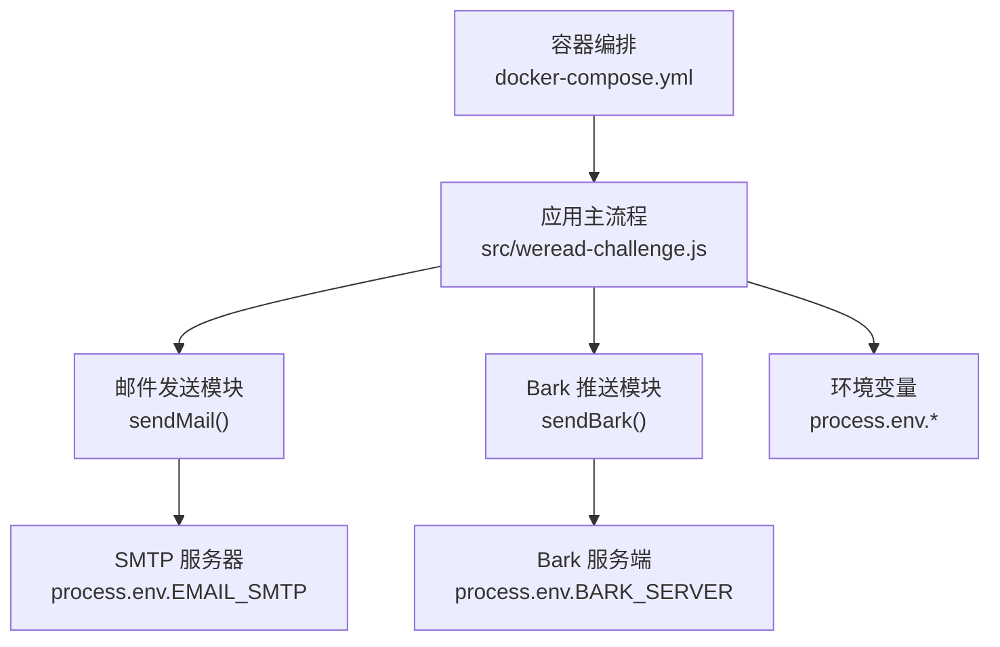
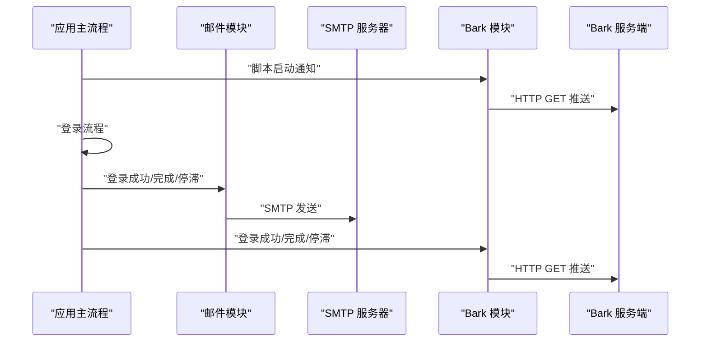
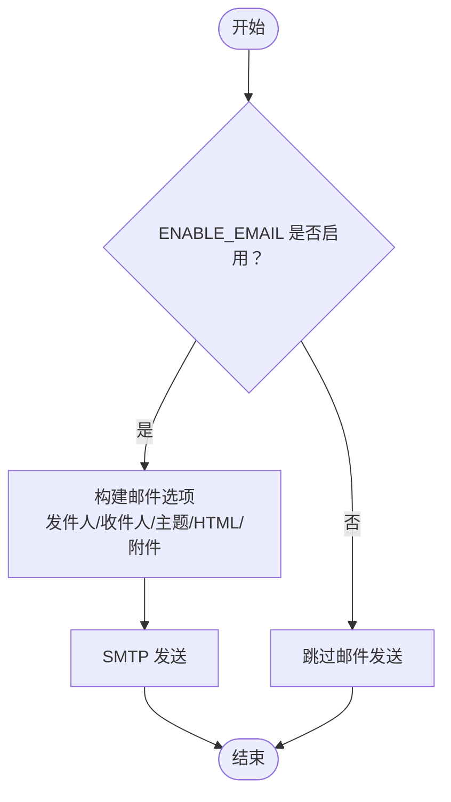
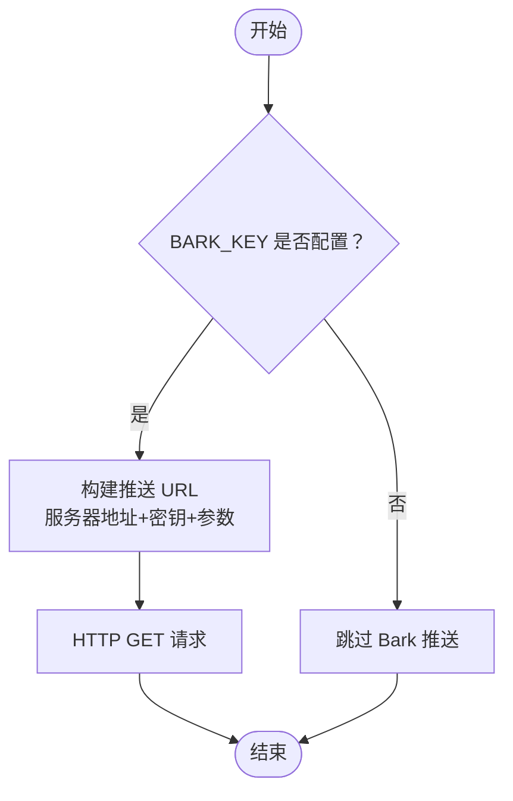
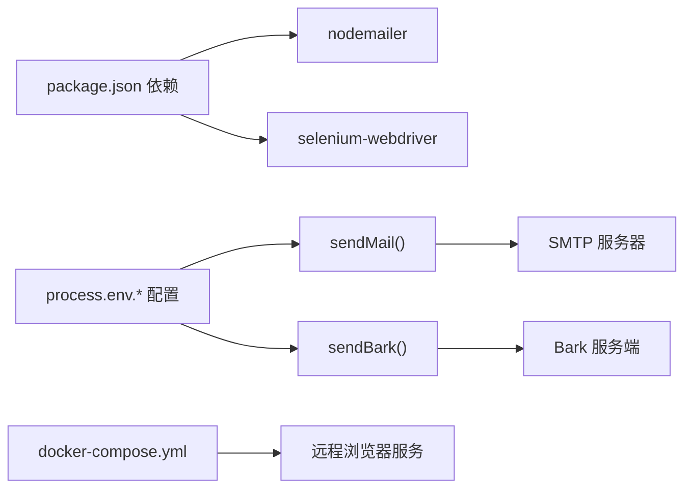

# 通知配置

<cite>
**本文引用的文件**
- [package.json](file://package.json)
- [src/weread-challenge.js](file://src/weread-challenge.js)
- [docker-compose.yml](file://docker-compose.yml)
- [AGENTS.md](file://AGENTS.md)
- [README-dev.md](file://README-dev.md)
</cite>

## 目录
1. [简介](#简介)
2. [项目结构](#项目结构)
3. [核心组件](#核心组件)
4. [架构总览](#架构总览)
5. [详细组件分析](#详细组件分析)
6. [依赖关系分析](#依赖关系分析)
7. [性能考虑](#性能考虑)
8. [故障排查指南](#故障排查指南)
9. [结论](#结论)
10. [附录](#附录)

## 简介
本文件面向 WeRead 挑战赛自动化项目的运维与开发者，系统化梳理通知系统的配置与实现，包括：
- 邮件通知配置（SMTP 服务器、认证方式、端口、发件人与收件人）
- Bark 推送配置（推送密钥、服务器地址、推送参数）
- 邮件模板与推送消息格式
- 通知触发条件与使用场景
- 第三方邮件服务集成指南
- 自定义通知渠道开发方法
- 错误处理机制、重试策略与故障恢复方案

## 项目结构
通知系统主要由以下部分组成：
- 应用主流程与通知调用：位于主脚本中，贯穿登录、阅读、完成、错误等阶段
- 邮件发送模块：基于 nodemailer 的 SMTP 发送
- Bark 推送模块：基于 HTTP 请求向 Bark 服务推送
- 环境变量与配置：通过 process.env 注入
- 容器编排：docker-compose 提供运行时环境

图表来源
- [src/weread-challenge.js](file://src/weread-challenge.js#L572-L743)
- [docker-compose.yml](file://docker-compose.yml#L1-L32)

章节来源
- [src/weread-challenge.js](file://src/weread-challenge.js#L22-L60)
- [docker-compose.yml](file://docker-compose.yml#L1-L32)

## 核心组件
- 邮件通知模块
  - 功能：通过 SMTP 发送带附件的 HTML 邮件
  - 触发时机：登录成功、阅读完成、项目停滞（含错误）
  - 关键配置项：SMTP 主机、端口、认证、发件人、收件人、附件
- Bark 推送模块
  - 功能：向 Bark 服务推送通知
  - 触发时机：脚本启动、登录成功、阅读完成、项目停滞
  - 关键配置项：推送密钥、服务器地址、推送参数（副标题、声音、分组、图标、链接、级别）

章节来源
- [src/weread-challenge.js](file://src/weread-challenge.js#L572-L743)

## 架构总览
通知系统在主流程中按阶段触发，邮件与 Bark 各自独立工作，互不影响。SMTP 与 Bark 服务均通过环境变量配置，便于在不同部署环境中灵活切换。

图表来源
- [src/weread-challenge.js](file://src/weread-challenge.js#L745-L1279)

## 详细组件分析

### 邮件通知配置
- 启用开关
  - ENABLE_EMAIL：布尔值，默认 false
- SMTP 服务器设置
  - EMAIL_SMTP：SMTP 主机地址
  - EMAIL_PORT：SMTP 端口，默认 465
  - 认证方式：用户/密码（EMAIL_USER、EMAIL_PASS）
  - 发件人：EMAIL_FROM（若未设置则回退到 EMAIL_USER）
  - 收件人：EMAIL_TO
- 邮件模板与附件
  - 邮件正文为 HTML，包含标题、日期、正文段落、图片附件展示区与结尾说明
  - 附件：截图文件（如登录成功、完成、停滞时截取的屏幕快照）
- 触发条件
  - 登录成功：发送“项目启动”主题邮件
  - 阅读完成：发送“项目完成”主题邮件
  - 项目停滞：发送“项目停滞”主题邮件（含错误摘要）
  - 登录失败：发送“项目停滞”主题邮件
- 端口与加密
  - 当 EMAIL_PORT 为 465 时自动启用 SSL 加密
  - 其他端口（如 587、25）不启用 SSL

图表来源
- [src/weread-challenge.js](file://src/weread-challenge.js#L572-L665)

章节来源
- [src/weread-challenge.js](file://src/weread-challenge.js#L29-L55)
- [src/weread-challenge.js](file://src/weread-challenge.js#L572-L665)

### Bark 推送配置
- 启用开关
  - 无需显式开关，仅需设置 BARK_KEY 即可启用推送
- 服务器地址
  - BARK_SERVER：默认 https://api.day.app
- 推送参数
  - 标题（title）、副标题（subtitle）、正文（body）
  - 声音（sound）、分组（group）、图标（icon）、链接（url）、级别（level）
- 触发条件
  - 脚本启动、登录成功、阅读完成、项目停滞（含错误摘要）
- 参数构建规则
  - 根据传入参数动态拼接路径与查询字符串
  - 支持仅传入 body、或 title+body、或 subtitle+title+body 的组合

图表来源
- [src/weread-challenge.js](file://src/weread-challenge.js#L667-L743)

章节来源
- [src/weread-challenge.js](file://src/weread-challenge.js#L39-L41)
- [src/weread-challenge.js](file://src/weread-challenge.js#L667-L743)

### 通知触发条件与使用场景
- 登录阶段
  - 登录成功：发送“项目启动”主题邮件与 Bark 通知
  - 登录失败：发送“项目停滞”主题邮件与 Bark 通知
- 阅读阶段
  - 每分钟截图（可配置）：当截图大小异常时自动刷新页面
  - 阅读完成：发送“项目完成”主题邮件与 Bark 通知
- 异常阶段
  - 发生错误：发送“项目停滞”主题邮件与 Bark 通知，并采集诊断信息
- Telemetry 上报
  - 可选：向 WeRead 服务器上报事件与错误信息

章节来源
- [src/weread-challenge.js](file://src/weread-challenge.js#L958-L970)
- [src/weread-challenge.js](file://src/weread-challenge.js#L1055-L1069)
- [src/weread-challenge.js](file://src/weread-challenge.js#L1225-L1239)
- [src/weread-challenge.js](file://src/weread-challenge.js#L1240-L1263)

### 第三方邮件服务集成指南
- 通用 SMTP 配置
  - 设置 EMAIL_SMTP、EMAIL_PORT、EMAIL_USER、EMAIL_PASS
  - 若端口为 465，自动启用 SSL；否则按普通 SMTP 处理
  - 发件人优先使用 EMAIL_FROM，未设置则回退到 EMAIL_USER
- 常见服务商参考
  - Gmail：smtp.gmail.com:587 或 465
  - Outlook/Hotmail：smtp-mail.outlook.com:587 或 465
  - QQ/163/126：smtp.qq.com:465 或 smtp.126.com:25/465
- 安全注意事项
  - 使用应用专用密码或授权码
  - 避免在代码中硬编码凭据，通过环境变量注入
  - 建议使用 TLS/SSL 加密通道

章节来源
- [src/weread-challenge.js](file://src/weread-challenge.js#L38-L55)
- [src/weread-challenge.js](file://src/weread-challenge.js#L572-L665)
- [AGENTS.md](file://AGENTS.md#L29-L33)

### Bark 服务配置
- 获取密钥
  - 在 Bark 客户端中获取推送密钥（BARK_KEY）
- 服务器地址
  - 默认使用官方服务端（BARK_SERVER），也可指向自建服务端
- 推送参数
  - 副标题、声音、分组、图标、链接、级别等均可按需配置
- 使用建议
  - 为不同阶段设置不同的声音与级别，便于区分紧急程度

章节来源
- [src/weread-challenge.js](file://src/weread-challenge.js#L39-L41)
- [src/weread-challenge.js](file://src/weread-challenge.js#L667-L743)

### 自定义通知渠道开发方法
- 设计原则
  - 保持与现有模块相同的接口风格（异步函数、返回布尔结果）
  - 对外暴露统一的调用入口（如 sendCustomNotification(title, body, options)）
  - 将配置项集中于环境变量，便于在 docker-compose 中注入
- 实现步骤
  - 新增 sendCustomNotification 函数，封装第三方 API 调用
  - 在主流程中按需调用该函数（登录成功、完成、停滞等）
  - 在 docker-compose 中添加对应环境变量
- 示例参考
  - 参考 sendMail 与 sendBark 的实现风格与错误处理方式

章节来源
- [src/weread-challenge.js](file://src/weread-challenge.js#L572-L743)
- [docker-compose.yml](file://docker-compose.yml#L5-L12)

## 依赖关系分析
- 依赖库
  - nodemailer：用于 SMTP 邮件发送
  - selenium-webdriver：用于浏览器自动化（与通知模块解耦）
- 运行时依赖
  - docker-compose：提供 Selenium 远程浏览器服务
  - 环境变量：通过 process.env 注入配置

图表来源
- [package.json](file://package.json#L5-L8)
- [src/weread-challenge.js](file://src/weread-challenge.js#L572-L743)
- [docker-compose.yml](file://docker-compose.yml#L15-L32)

章节来源
- [package.json](file://package.json#L5-L8)
- [docker-compose.yml](file://docker-compose.yml#L1-L32)

## 性能考虑
- 邮件发送
  - 仅在必要时发送（登录成功、完成、停滞），避免频繁发送造成资源浪费
  - 附件大小控制：截图文件过大可能影响传输效率，建议在 docker-compose 中合理挂载存储
- Bark 推送
  - 仅在关键节点触发，减少网络请求次数
  - 使用 GET 请求，轻量高效
- 运行时环境
  - docker-compose 提供健康检查与资源限制，有助于稳定运行

## 故障排查指南
- 邮件发送失败
  - 检查 EMAIL_SMTP、EMAIL_PORT、EMAIL_USER、EMAIL_PASS 是否正确
  - 确认端口与加密方式匹配（465 启用 SSL）
  - 查看输出日志中的错误信息，定位具体失败环节
- Bark 推送失败
  - 检查 BARK_KEY 是否配置
  - 确认 BARK_SERVER 地址可达
  - 查看 HTTP 响应状态码与错误信息
- 诊断信息采集
  - 发生异常时会尝试采集 Selenium 健康状态与容器日志，便于定位问题
- 常见问题
  - 端口与加密：465 与 587 的差异
  - 发件人回退：EMAIL_FROM 未设置时回退到 EMAIL_USER
  - 截图异常：当截图过小时自动刷新页面，避免无效数据

章节来源
- [src/weread-challenge.js](file://src/weread-challenge.js#L1240-L1263)
- [src/weread-challenge.js](file://src/weread-challenge.js#L1250-L1251)
- [AGENTS.md](file://AGENTS.md#L29-L33)

## 结论
通知系统通过环境变量灵活配置，邮件与 Bark 各自独立运行，满足不同场景下的通知需求。建议在生产环境中：
- 使用环境变量管理敏感信息，避免硬编码
- 为不同阶段设置差异化的声音与级别，提升可读性
- 控制邮件发送频率，避免不必要的资源消耗
- 在 docker-compose 中统一注入配置，便于多账户与多实例管理

## 附录
- 环境变量一览
  - ENABLE_EMAIL：是否启用邮件通知
  - EMAIL_SMTP：SMTP 主机
  - EMAIL_PORT：SMTP 端口（默认 465）
  - EMAIL_USER：SMTP 用户名
  - EMAIL_PASS：SMTP 密码
  - EMAIL_FROM：发件人（可选）
  - EMAIL_TO：收件人
  - BARK_KEY：Bark 推送密钥
  - BARK_SERVER：Bark 服务器地址（默认官方服务端）
- 容器编排
  - docker-compose 提供远程浏览器服务与健康检查，便于稳定运行

章节来源
- [src/weread-challenge.js](file://src/weread-challenge.js#L29-L55)
- [src/weread-challenge.js](file://src/weread-challenge.js#L39-L41)
- [docker-compose.yml](file://docker-compose.yml#L5-L12)