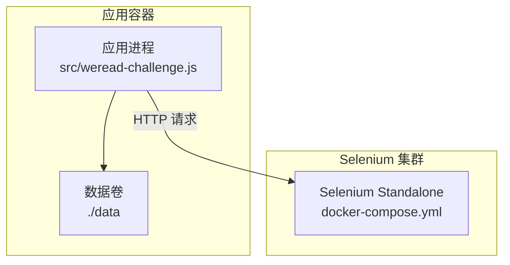
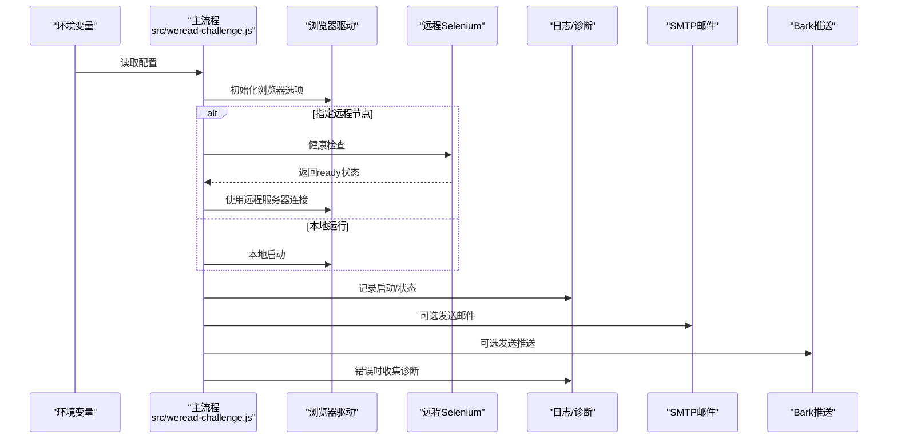
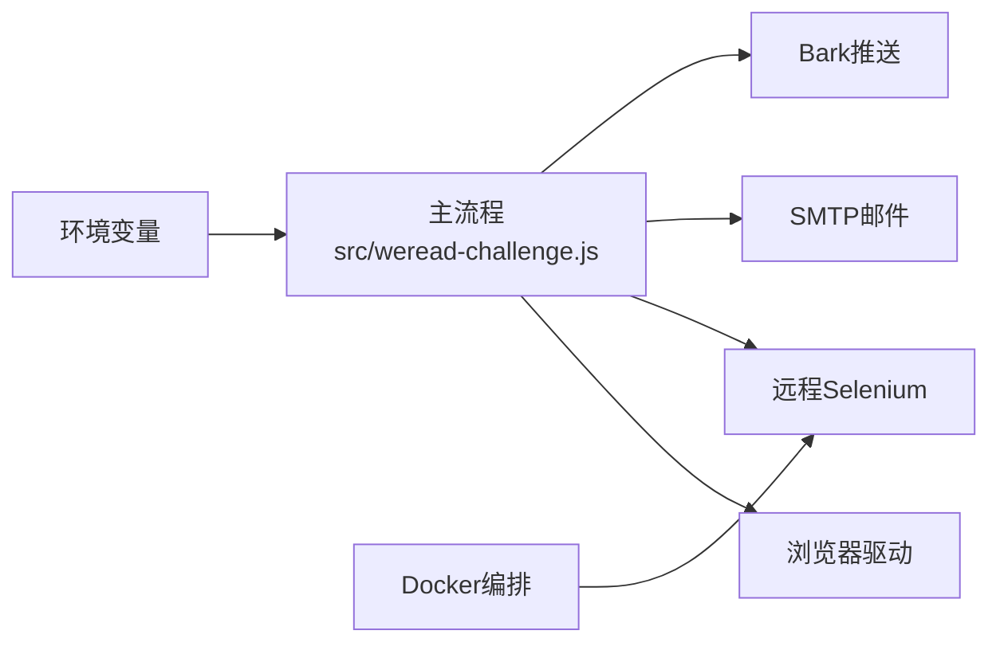

# 配置管理

<cite>
**本文引用的文件**
- [package.json](file://package.json)
- [src/weread-challenge.js](file://src/weread-challenge.js)
- [docker-compose.yml](file://docker-compose.yml)
- [Dockerfile](file://Dockerfile)
- [README-dev.md](file://README-dev.md)
- [AGENTS.md](file://AGENTS.md)
</cite>

## 目录
1. [简介](#简介)
2. [项目结构](#项目结构)
3. [核心组件](#核心组件)
4. [架构总览](#架构总览)
5. [详细组件分析](#详细组件分析)
6. [依赖分析](#依赖分析)
7. [性能考虑](#性能考虑)
8. [故障排除指南](#故障排除指南)
9. [结论](#结论)
10. [附录](#附录)

## 简介
本文件面向 WeRead 挑战赛自动化项目，系统梳理并解释所有可用的环境变量配置项、参数含义与默认值，涵盖浏览器配置（Chrome、Firefox、Edge、Safari）、远程浏览器集群设置、性能优化配置、参数验证规则、配置最佳实践、配置项之间的依赖关系与冲突处理机制，以及不同使用场景下的推荐配置方案与故障排除指南。目标是帮助使用者在本地或远程集群环境中稳定、高效地运行自动化脚本。

## 项目结构
该项目采用“单脚本主流程 + Docker 编排 + 环境变量驱动”的结构：
- 单脚本主流程：src/weread-challenge.js 负责登录、阅读循环、截图、邮件/Bark 推送、日志与诊断等。
- Docker 编排：docker-compose.yml 启动应用容器与 Selenium Standalone 容器，支持远程浏览器集群。
- 环境变量：通过 process.env 注入配置，覆盖默认行为。
- 包管理：package.json 定义脚本与依赖。

图表来源
- [docker-compose.yml](file://docker-compose.yml#L1-L32)
- [src/weread-challenge.js](file://src/weread-challenge.js#L792-L815)

章节来源
- [docker-compose.yml](file://docker-compose.yml#L1-L32)
- [Dockerfile](file://Dockerfile#L1-L8)
- [package.json](file://package.json#L1-L10)
- [src/weread-challenge.js](file://src/weread-challenge.js#L1-L120)

## 核心组件
本节聚焦于配置相关的“核心组件”：环境变量、浏览器选项、远程集群、通知与日志、健康检查与诊断。

- 环境变量与默认值
  - 通过 process.env 读取的配置项均在脚本顶部集中声明，包含浏览器类型、远程节点、阅读时长、速度、截图、条款同意、邮件与 Bark 推送、调试开关等。
  - 关键默认值包括：WEREAD_BROWSER 默认 Chrome、WEREAD_DURATION 默认 10 分钟、WEREAD_SPEED 默认 slow、WEREAD_SCREENSHOT 默认开启、WEREAD_AGREE_TERMS 默认开启、EMAIL_PORT 默认 465、BARK_SERVER 默认官方服务地址等。
- 浏览器配置
  - 支持 Chrome、Firefox、Edge、Safari 四种浏览器；针对 Chrome/Edge 添加了若干无头/沙箱相关参数；Safari 下会统一设置 Cookie 的 secure 标记。
- 远程浏览器集群
  - 通过 WEREAD_REMOTE_BROWSER 指定 Selenium Grid/Hub 地址；脚本会在连接前进行健康检查；支持自动补全协议头。
- 性能与稳定性
  - 设置全局隐式等待、页面加载超时、脚本执行超时；随机窗口尺寸；阅读循环按速度动态控制按键间隔；每分钟截图并检测截图大小以触发刷新。
- 通知与日志
  - 支持 SMTP 邮件与 Bark 推送；日志重定向至文件；错误时收集 Selenium 健康状态与容器日志。

章节来源
- [src/weread-challenge.js](file://src/weread-challenge.js#L22-L61)
- [src/weread-challenge.js](file://src/weread-challenge.js#L780-L835)
- [src/weread-challenge.js](file://src/weread-challenge.js#L125-L152)
- [src/weread-challenge.js](file://src/weread-challenge.js#L572-L665)
- [src/weread-challenge.js](file://src/weread-challenge.js#L667-L743)
- [src/weread-challenge.js](file://src/weread-challenge.js#L75-L92)

## 架构总览
下图展示配置如何影响运行时行为：环境变量驱动浏览器初始化、远程节点连接、通知与日志、健康检查与诊断。

图表来源
- [src/weread-challenge.js](file://src/weread-challenge.js#L22-L61)
- [src/weread-challenge.js](file://src/weread-challenge.js#L756-L828)
- [src/weread-challenge.js](file://src/weread-challenge.js#L125-L152)
- [src/weread-challenge.js](file://src/weread-challenge.js#L572-L665)
- [src/weread-challenge.js](file://src/weread-challenge.js#L667-L743)

## 详细组件分析

### 环境变量清单与默认值
以下为所有通过 process.env 读取的配置项及其默认值与含义（仅列出与本项目直接相关的项）：

- WEREAD_USER
  - 类型：字符串
  - 默认值："weread-default"
  - 作用：Chrome/Edge Profile 目录名，用于隔离用户数据
- WEREAD_REMOTE_BROWSER
  - 类型：字符串（URL）
  - 默认值：未设置
  - 作用：远程 Selenium Grid/Hub 地址；为空则本地运行
  - 行为：若未带协议，脚本会自动补全为 http://
- WEREAD_DURATION
  - 类型：整数（分钟）
  - 默认值：10
  - 作用：阅读总时长
- WEREAD_SPEED
  - 类型：枚举字符串
  - 取值："slow" | "normal" | "fast"
  - 默认值："slow"
  - 作用：控制按键间隔随机范围，影响阅读节奏
- WEREAD_SELECTION
  - 类型：整数
  - 取值：-1 | 0 | 正整数
  - 默认值：2
  - 作用：选择书籍的方式；-1 尝试打开特定书籍；0 随机；其他为第 N 本书
- WEREAD_BROWSER
  - 类型：枚举字符串
  - 取值：Browser.CHROME | Browser.EDGE | Browser.FIREFOX | Browser.SAFARI
  - 默认值：Browser.CHROME
  - 作用：指定浏览器类型
- ENABLE_EMAIL
  - 类型：布尔字符串
  - 取值："true" | 其他
  - 默认值：false
  - 作用：是否启用邮件通知
- WEREAD_SCREENSHOT
  - 类型：布尔字符串
  - 取值："true" | 其他
  - 默认值：true
  - 作用：是否每分钟截图
- WEREAD_AGREE_TERMS
  - 类型：布尔字符串
  - 取值："true" | 其他
  - 默认值：true
  - 作用：是否上报遥测事件（含用户信息片段）
- EMAIL_PORT
  - 类型：整数
  - 默认值：465
  - 作用：SMTP 端口；465 自动启用 SSL
- EMAIL_SMTP
  - 类型：字符串
  - 默认值：未设置
  - 作用：SMTP 服务器地址
- EMAIL_USER
  - 类型：字符串
  - 默认值：未设置
  - 作用：SMTP 用户名
- EMAIL_PASS
  - 类型：字符串
  - 默认值：未设置
  - 作用：SMTP 密码
- EMAIL_FROM
  - 类型：字符串
  - 默认值：未设置（回退到 EMAIL_USER）
  - 作用：发件人地址
- EMAIL_TO
  - 类型：字符串
  - 默认值：未设置
  - 作用：收件人地址
- BARK_KEY
  - 类型：字符串
  - 默认值：空
  - 作用：Bark 推送密钥
- BARK_SERVER
  - 类型：字符串
  - 默认值："https://api.day.app"
  - 作用：Bark 服务地址
- DEBUG
  - 类型：布尔字符串
  - 取值："true" | 其他
  - 默认值：false
  - 作用：是否启用调试模式（影响日志输出）

章节来源
- [src/weread-challenge.js](file://src/weread-challenge.js#L22-L61)
- [src/weread-challenge.js](file://src/weread-challenge.js#L572-L606)
- [src/weread-challenge.js](file://src/weread-challenge.js#L667-L706)

### 浏览器配置选项
- Chrome/Edge
  - 添加了无沙箱、禁用 GPU、禁用 dev-shm 使用、禁用 infobars、扩展、通知、弹窗拦截等参数，提升稳定性与兼容性。
  - 使用 WEREAD_USER 作为 profile 目录，实现多用户隔离。
- Firefox
  - 直接构建 Firefox 驱动实例，未额外传入选项。
- Safari
  - 通过 Safari Options 构建驱动；对 Cookie 的 secure 标志进行统一设置，以适配 Safari 的 Cookie 行为差异。

章节来源
- [src/weread-challenge.js](file://src/weread-challenge.js#L780-L828)
- [src/weread-challenge.js](file://src/weread-challenge.js#L350-L358)

### 远程浏览器集群设置
- 连接方式
  - 通过 WEREAD_REMOTE_BROWSER 指定远程地址；若未带协议，脚本会自动补全为 http://。
  - 连接前进行健康检查，优先尝试 /status，其次 /wd/hub/status。
- 编排与部署
  - docker-compose.yml 提供了示例：app 服务依赖 selenium 服务健康；selenium 使用 selenium/standalone-chromium 镜像，共享内存 2GB，健康检查端点为 /status。
  - package.json 的 start 脚本提供了示例：通过环境变量注入远程地址并运行脚本。

章节来源
- [src/weread-challenge.js](file://src/weread-challenge.js#L792-L815)
- [src/weread-challenge.js](file://src/weread-challenge.js#L125-L152)
- [docker-compose.yml](file://docker-compose.yml#L1-L32)
- [package.json](file://package.json#L2-L4)

### 性能优化配置
- 超时设置
  - 隐式等待：5 秒；页面加载：60 秒；脚本执行：30 秒，避免单次操作长时间阻塞。
- 随机窗口尺寸
  - 启动后设置随机宽高，降低反爬特征。
- 阅读节奏
  - 根据 WEREAD_SPEED 动态调整按键间隔随机范围，slow/normal/fast 对应不同的区间。
- 截图与刷新
  - 每分钟截图；若截图小于 100KB，认为页面异常，触发刷新。
- 日志与诊断
  - 非调试模式下重定向日志至文件；错误时收集 Selenium 健康状态与容器日志。

章节来源
- [src/weread-challenge.js](file://src/weread-challenge.js#L830-L835)
- [src/weread-challenge.js](file://src/weread-challenge.js#L839-L846)
- [src/weread-challenge.js](file://src/weread-challenge.js#L1090-L1126)
- [src/weread-challenge.js](file://src/weread-challenge.js#L224-L232)

### 参数验证规则与冲突处理
- 协议与 URL 合法性
  - WEREAD_REMOTE_BROWSER 为空或非 HTTP(S) URL 时，跳过健康检查。
  - 未带协议时自动补全为 http://。
- 布尔字符串解析
  - 仅当值严格等于 "true" 时视为真；其余情况为假。
- 数值解析
  - EMAIL_PORT 解析为整数，未设置时默认 465。
- 浏览器与选项匹配
  - Chrome/Edge 使用 Chrome Options；Safari 使用 Safari Options；Firefox 直接构建驱动。
- 截图与刷新的冲突
  - 当 WEREAD_SCREENSHOT 关闭时，跳过截图与大小检查；否则按分钟截图并检测异常刷新。

章节来源
- [src/weread-challenge.js](file://src/weread-challenge.js#L125-L152)
- [src/weread-challenge.js](file://src/weread-challenge.js#L796-L801)
- [src/weread-challenge.js](file://src/weread-challenge.js#L38-L41)
- [src/weread-challenge.js](file://src/weread-challenge.js#L29-L34)
- [src/weread-challenge.js](file://src/weread-challenge.js#L780-L828)
- [src/weread-challenge.js](file://src/weread-challenge.js#L1090-L1126)

### 配置最佳实践
- 本地开发
  - 使用 DEBUG=true 观察日志；设置 WEREAD_BROWSER=chrome；WERAED_DURATION=68；WERAED_SELECTION=0（随机）。
  - 若无远程节点，保持 WEREAD_REMOTE_BROWSER 为空。
- 远程集群
  - 在 docker-compose.yml 中配置 WEREAD_REMOTE_BROWSER 为 selenium 服务名与端口；确保 selenium 健康检查通过。
  - 为 selenium 设置合适的 shm_size（例如 2GB）以避免 Chrome 崩溃。
- 通知与安全
  - 邮件与 Bark 的密钥通过环境变量注入，不要硬编码在仓库中。
  - 默认同意条款并上报遥测事件；如需拒绝，显式设置 WEREAD_AGREE_TERMS=false。
- 稳定性
  - 适当提高 WEREAD_DURATION 与 WEREAD_SPEED，观察截图质量与刷新频率。
  - 若遇到页面空白或截图过小，检查网络与 DNS 设置（compose 中已提供 DNS 示例）。

章节来源
- [README-dev.md](file://README-dev.md#L9-L13)
- [docker-compose.yml](file://docker-compose.yml#L15-L32)
- [AGENTS.md](file://AGENTS.md#L29-L34)

### 不同使用场景下的推荐配置方案
- 单机调试
  - WEREAD_BROWSER=chrome；WEREAD_DURATION=68；WEREAD_SPEED=normal；WEREAD_SCREENSHOT=true；ENABLE_EMAIL=false；DEBUG=true
- 远程集群（Docker Compose）
  - 保持 docker-compose.yml 中的 WEREAD_REMOTE_BROWSER 与 selenium 服务一致；WEREAD_DURATION=68；WERAED_SELECTION=0
- 多账户并发
  - 通过挂载不同 data 目录区分日志与二维码；为每个账户设置独立 WEREAD_USER；必要时调整 EMAIL_TO 与 Bark 推送目标
- 高稳定性要求
  - 降低 WEREAD_SPEED（slow）；开启 WEREAD_SCREENSHOT 并配合刷新逻辑；确保 selenium shm_size 与 DNS 正确

章节来源
- [docker-compose.yml](file://docker-compose.yml#L1-L32)
- [AGENTS.md](file://AGENTS.md#L30-L34)

## 依赖分析
- 组件耦合
  - 主流程与浏览器驱动强耦合（根据 WEREAD_BROWSER 选择对应 Options）；与远程节点弱耦合（仅在 WEREAD_REMOTE_BROWSER 存在时才连接）。
  - 通知模块（邮件/Bark）与配置模块松耦合（仅读取环境变量）。
- 外部依赖
  - selenium-webdriver：驱动浏览器与远程节点通信
  - nodemailer：SMTP 邮件发送
  - Docker：编排远程浏览器集群

图表来源
- [src/weread-challenge.js](file://src/weread-challenge.js#L756-L828)
- [src/weread-challenge.js](file://src/weread-challenge.js#L572-L665)
- [src/weread-challenge.js](file://src/weread-challenge.js#L667-L743)
- [docker-compose.yml](file://docker-compose.yml#L1-L32)

章节来源
- [package.json](file://package.json#L5-L8)
- [docker-compose.yml](file://docker-compose.yml#L1-L32)

## 性能考虑
- 超时与稳定性
  - 合理设置隐式等待与页面加载超时，避免长时间卡死。
- 阅读节奏
  - slow/normal/fast 三档速度影响按键间隔，建议在保证稳定性的前提下逐步提升。
- 截图与刷新
  - 每分钟截图会增加 I/O；若截图过小自动刷新可减少无效渲染，但频繁刷新会影响稳定性。
- 远程节点
  - 网络延迟与节点负载直接影响成功率；建议在 compose 中配置健康检查与 DNS，确保节点可用。

[本节为通用指导，无需具体文件引用]

## 故障排除指南
- 远程节点不可达
  - 现象：连接失败或健康检查返回非 ready
  - 处理：检查 WEREAD_REMOTE_BROWSER 是否带协议；确认 selenium 服务健康；查看 compose 健康检查端点
- 页面空白或截图过小
  - 现象：截图小于 100KB
  - 处理：触发刷新；检查网络/DNS；增大 WEREAD_DURATION；降低 WEREAD_SPEED
- 邮件发送失败
  - 现象：SMTP 报错
  - 处理：核对 EMAIL_SMTP/EMAIL_PORT/EMAIL_USER/EMAIL_PASS；465 端口自动启用 SSL
- Safari Cookie 异常
  - 现象：登录或 Cookie 读取异常
  - 处理：脚本已在保存时统一设置 secure 标志；确保 Safari 支持并允许第三方 Cookie
- 诊断信息收集
  - 错误时自动检查 Selenium 健康状态并抓取容器日志，便于定位问题

章节来源
- [src/weread-challenge.js](file://src/weread-challenge.js#L125-L152)
- [src/weread-challenge.js](file://src/weread-challenge.js#L1110-L1126)
- [src/weread-challenge.js](file://src/weread-challenge.js#L572-L606)
- [src/weread-challenge.js](file://src/weread-challenge.js#L350-L358)
- [src/weread-challenge.js](file://src/weread-challenge.js#L224-L232)

## 结论
本配置管理文档系统化梳理了 WeRead 挑战赛自动化项目的所有环境变量、浏览器配置、远程集群设置与性能优化策略。通过明确的默认值、严格的参数解析与冲突处理、以及针对不同场景的最佳实践，用户可以在本地或远程集群环境中稳定运行自动化脚本。建议在生产环境中遵循安全与稳定性原则，合理配置远程节点与通知通道，并定期收集与分析诊断信息以持续优化。

[本节为总结，无需具体文件引用]

## 附录

### 配置文件模板
- Docker Compose（远程集群）
  - 参考路径：docker-compose.yml
  - 关键点：app 服务依赖 selenium 健康；selenium 使用 standalone-chromium；shm_size 2GB；DNS 223.5.5.5
- Package（脚本与依赖）
  - 参考路径：package.json
  - 关键点：start 脚本注入 WEREAD_REMOTE_BROWSER 并运行主脚本；依赖 selenium-webdriver 与 nodemailer
- 应用镜像（Dockerfile）
  - 参考路径：Dockerfile
  - 关键点：基于 node:lts-alpine；复制脚本与依赖；安装生产依赖；CMD 运行 app.js

章节来源
- [docker-compose.yml](file://docker-compose.yml#L1-L32)
- [package.json](file://package.json#L1-L10)
- [Dockerfile](file://Dockerfile#L1-L8)