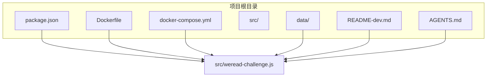
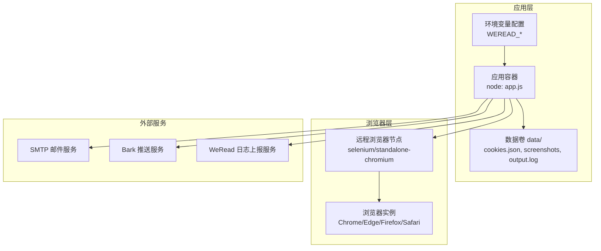
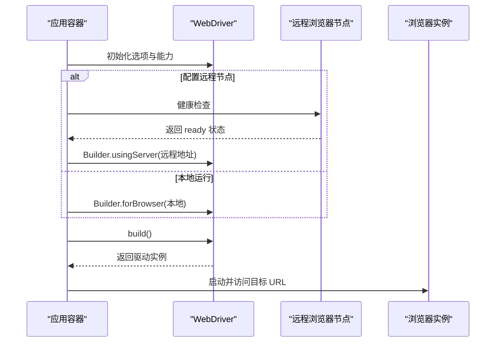
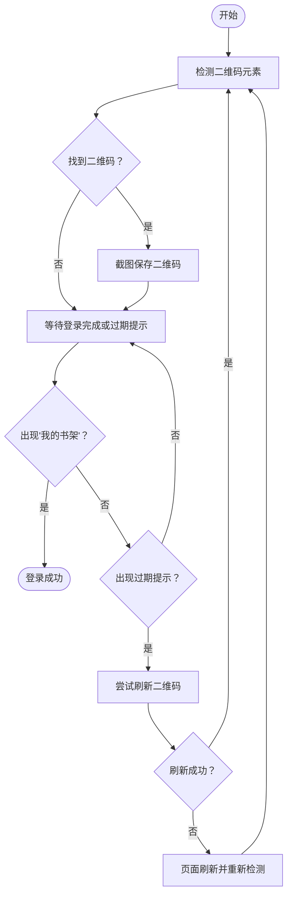
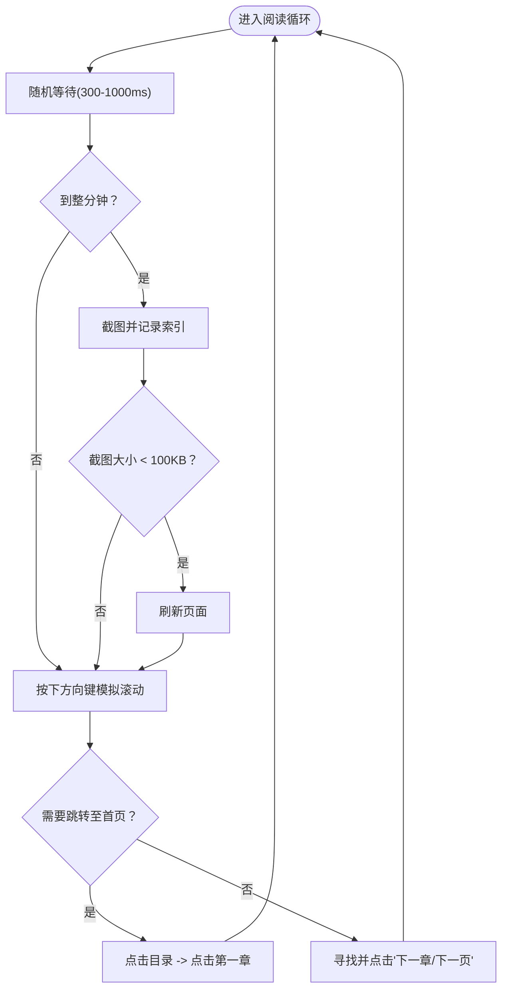
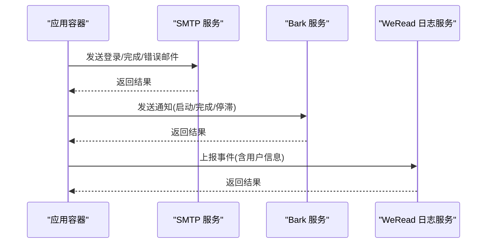
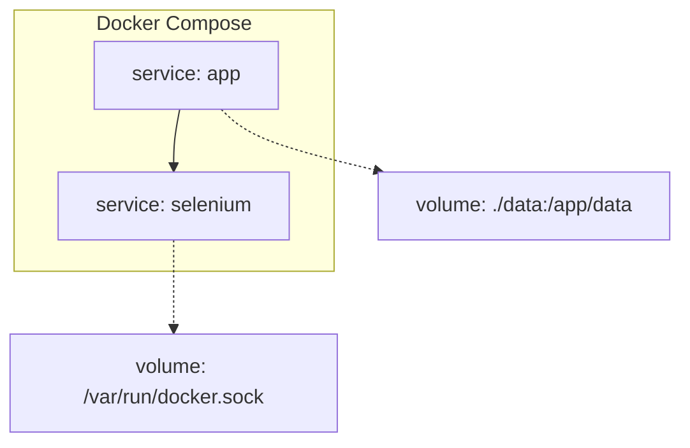
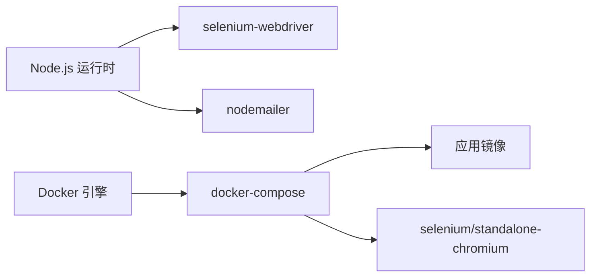

# 项目概述

<cite>
**本文档引用的文件**
- [package.json](file://package.json)
- [Dockerfile](file://Dockerfile)
- [docker-compose.yml](file://docker-compose.yml)
- [src/weread-challenge.js](file://src/weread-challenge.js)
- [README-dev.md](file://README-dev.md)
- [AGENTS.md](file://AGENTS.md)
</cite>

## 目录
1. [简介](#简介)
2. [项目结构](#项目结构)
3. [核心组件](#核心组件)
4. [架构总览](#架构总览)
5. [详细组件分析](#详细组件分析)
6. [依赖分析](#依赖分析)
7. [性能考虑](#性能考虑)
8. [故障排除指南](#故障排除指南)
9. [结论](#结论)
10. [附录](#附录)

## 简介
本项目旨在为微信读书挑战赛提供自动化阅读解决方案，通过 Selenium WebDriver 实现从二维码登录到书籍阅读、章节翻页与状态统计的全流程自动化。项目支持本地与远程浏览器运行模式，内置邮件与 Bark 推送通知能力，并提供 Docker 化部署方案，便于在 CI/CD 环境或生产环境中稳定运行。

- 目标用户：希望在微信读书挑战赛中提升阅读时长与完成度的用户，以及需要自动化运维与监控的团队。
- 使用价值：降低人工值守成本，提高阅读时长稳定性，提供日志与截图等可观测性数据，便于审计与复盘。

## 项目结构
项目采用“根目录配置 + 单一主流程脚本”的组织方式，核心逻辑集中在 src/weread-challenge.js，配合 Dockerfile 与 docker-compose.yml 实现一键编排。

图表来源
- [package.json](file://package.json#L1-L10)
- [Dockerfile](file://Dockerfile#L1-L8)
- [docker-compose.yml](file://docker-compose.yml#L1-L32)
- [src/weread-challenge.js](file://src/weread-challenge.js#L1-L1279)

章节来源
- [package.json](file://package.json#L1-L10)
- [Dockerfile](file://Dockerfile#L1-L8)
- [docker-compose.yml](file://docker-compose.yml#L1-L32)
- [AGENTS.md](file://AGENTS.md#L3-L6)

## 核心组件
- 自动化驱动层：基于 Selenium WebDriver，支持 Chrome、Edge、Firefox、Safari，可本地或远程运行。
- 登录与二维码处理：检测登录态、保存/加载 Cookie、截图二维码、自动刷新过期二维码。
- 阅读循环：根据配置进行随机按键模拟滚动、章节翻页、异常处理与跳转。
- 通知与遥测：邮件通知、Bark 推送、WeRead 服务端事件上报、诊断日志采集。
- 容器化编排：Dockerfile 与 docker-compose.yml 提供一键部署与健康检查。

章节来源
- [src/weread-challenge.js](file://src/weread-challenge.js#L10-L56)
- [src/weread-challenge.js](file://src/weread-challenge.js#L350-L371)
- [src/weread-challenge.js](file://src/weread-challenge.js#L416-L445)
- [src/weread-challenge.js](file://src/weread-challenge.js#L489-L570)
- [src/weread-challenge.js](file://src/weread-challenge.js#L745-L828)
- [src/weread-challenge.js](file://src/weread-challenge.js#L1071-L1220)
- [src/weread-challenge.js](file://src/weread-challenge.js#L250-L303)
- [src/weread-challenge.js](file://src/weread-challenge.js#L1224-L1276)

## 架构总览
系统采用“应用容器 + 远程浏览器节点”的分布式架构，应用容器负责业务流程控制，浏览器节点负责页面渲染与交互。

图表来源
- [docker-compose.yml](file://docker-compose.yml#L1-L32)
- [Dockerfile](file://Dockerfile#L1-L8)
- [src/weread-challenge.js](file://src/weread-challenge.js#L756-L828)
- [src/weread-challenge.js](file://src/weread-challenge.js#L572-L665)
- [src/weread-challenge.js](file://src/weread-challenge.js#L667-L743)
- [src/weread-challenge.js](file://src/weread-challenge.js#L250-L303)

## 详细组件分析

### 自动化驱动与浏览器初始化
- 支持多浏览器：通过环境变量选择 Chrome、Edge、Firefox、Safari，并针对 Chrome/Edge 设置无头与沙箱相关参数。
- 远程/本地双模式：当配置了 WEREAD_REMOTE_BROWSER 时，使用 Builder.usingServer 连接远程节点；否则本地启动。
- 超时与窗口尺寸：统一设置隐式/页面加载/脚本超时，并随机设置窗口大小以规避反爬特征。

图表来源
- [src/weread-challenge.js](file://src/weread-challenge.js#L756-L828)
- [src/weread-challenge.js](file://src/weread-challenge.js#L830-L835)
- [src/weread-challenge.js](file://src/weread-challenge.js#L847-L858)

章节来源
- [src/weread-challenge.js](file://src/weread-challenge.js#L756-L828)
- [src/weread-challenge.js](file://src/weread-challenge.js#L830-L835)
- [src/weread-challenge.js](file://src/weread-challenge.js#L847-L858)

### 二维码登录与 Cookie 管理
- 二维码检测：优先通过 XPath 精确匹配二维码图片或包含“扫码/二维码”的文本元素。
- 登录等待：轮询两种可能的结束条件（二维码过期提示或“我的书架”出现），最长等待 5 分钟。
- 二维码刷新：当检测到过期提示时，尝试多种定位器点击刷新按钮，并回退到页面刷新与截图保存。
- Cookie 管理：登录成功后保存 Cookie，下次启动自动加载以减少扫码频率。

图表来源
- [src/weread-challenge.js](file://src/weread-challenge.js#L416-L445)
- [src/weread-challenge.js](file://src/weread-challenge.js#L880-L896)
- [src/weread-challenge.js](file://src/weread-challenge.js#L898-L957)
- [src/weread-challenge.js](file://src/weread-challenge.js#L489-L570)
- [src/weread-challenge.js](file://src/weread-challenge.js#L350-L371)

章节来源
- [src/weread-challenge.js](file://src/weread-challenge.js#L416-L445)
- [src/weread-challenge.js](file://src/weread-challenge.js#L880-L896)
- [src/weread-challenge.js](file://src/weread-challenge.js#L898-L957)
- [src/weread-challenge.js](file://src/weread-challenge.js#L489-L570)
- [src/weread-challenge.js](file://src/weread-challenge.js#L350-L371)

### 阅读循环与行为模拟
- 阅读时长：由环境变量 WEREAD_DURATION 控制（分钟），默认 10。
- 行为模拟：每轮随机等待 300–1000ms（fast 模式 100–200ms，normal 200–600ms），按下方向键模拟滚动。
- 章节翻页：优先点击“下一章/下一页”按钮，若不在可视区域则跳过；若遇到“已读完/需要开通/全书完”等状态，自动回到目录并点击第一章。
- 截图策略：每分钟截一张图，若截图小于 100KB 则刷新页面以恢复渲染。
- 结束与收尾：完成后保存 Cookie，发送邮件与 Bark 通知。

图表来源
- [src/weread-challenge.js](file://src/weread-challenge.js#L1088-L1220)
- [src/weread-challenge.js](file://src/weread-challenge.js#L1128-L1190)
- [src/weread-challenge.js](file://src/weread-challenge.js#L1217-L1220)
- [src/weread-challenge.js](file://src/weread-challenge.js#L373-L380)

章节来源
- [src/weread-challenge.js](file://src/weread-challenge.js#L1088-L1220)
- [src/weread-challenge.js](file://src/weread-challenge.js#L1128-L1190)
- [src/weread-challenge.js](file://src/weread-challenge.js#L373-L380)

### 通知与遥测
- 邮件通知：通过 SMTP 发送带截图附件的 HTML 邮件，支持自定义发件人与端口。
- Bark 推送：向 Bark 服务发送消息，支持声音、分组、图标、链接与级别。
- 事件上报：向 WeRead 服务端上报 OS、浏览器、时长、是否启用邮件、版本等信息，便于统计与审计。

图表来源
- [src/weread-challenge.js](file://src/weread-challenge.js#L572-L665)
- [src/weread-challenge.js](file://src/weread-challenge.js#L667-L743)
- [src/weread-challenge.js](file://src/weread-challenge.js#L250-L303)
- [src/weread-challenge.js](file://src/weread-challenge.js#L305-L348)

章节来源
- [src/weread-challenge.js](file://src/weread-challenge.js#L572-L665)
- [src/weread-challenge.js](file://src/weread-challenge.js#L667-L743)
- [src/weread-challenge.js](file://src/weread-challenge.js#L250-L303)
- [src/weread-challenge.js](file://src/weread-challenge.js#L305-L348)

### 容器化与编排
- 应用镜像：基于 node:lts-alpine，复制依赖与脚本，安装生产依赖后以 node app.js 启动。
- 编排服务：app 服务依赖 selenium 健康，selenium 服务使用 selenium/standalone-chromium，共享内存 2GB，健康检查端点为 /status。
- 数据持久化：将 ./data 映射到容器内 /app/data，保存 cookies、截图与日志。

图表来源
- [Dockerfile](file://Dockerfile#L1-L8)
- [docker-compose.yml](file://docker-compose.yml#L1-L32)

章节来源
- [Dockerfile](file://Dockerfile#L1-L8)
- [docker-compose.yml](file://docker-compose.yml#L1-L32)

## 依赖分析
- 运行时依赖：selenium-webdriver（浏览器自动化）、nodemailer（邮件发送）。
- 构建与运行：Node.js LTS，Docker 与 docker-compose。
- 环境变量：WEREAD_REMOTE_BROWSER、WEREAD_DURATION、WEREAD_SPEED、WEREAD_SELECTION、WEREAD_BROWSER、ENABLE_EMAIL、WEREAD_SCREENSHOT、WEREAD_AGREE_TERMS、EMAIL_*、BARK_* 等。

图表来源
- [package.json](file://package.json#L5-L8)
- [Dockerfile](file://Dockerfile#L1-L8)
- [docker-compose.yml](file://docker-compose.yml#L1-L32)

章节来源
- [package.json](file://package.json#L5-L8)
- [AGENTS.md](file://AGENTS.md#L9-L12)

## 性能考虑
- 随机化行为：按键间隔与窗口尺寸随机化，降低被识别为机器人的概率。
- 超时与等待：统一超时配置，避免单次操作长时间阻塞。
- 截图与刷新：按分钟截图并校验大小，异常时刷新页面，保证渲染一致性。
- 远程节点：通过健康检查与日志采集，快速定位浏览器节点问题。

## 故障排除指南
- 登录失败：检查二维码是否保存、是否出现过期提示、是否正确刷新；查看 data/output.log 与 selenium 日志。
- 页面无响应：确认 WEREAD_REMOTE_BROWSER 地址与协议，执行健康检查；检查 selenium 容器日志。
- 截图异常：确认截图大小阈值与存储路径；必要时禁用截图以排除 I/O 影响。
- 邮件/推送失败：核对 SMTP 配置与凭据、Bark 密钥与服务器地址；查看返回状态码与错误日志。

章节来源
- [src/weread-challenge.js](file://src/weread-challenge.js#L224-L232)
- [src/weread-challenge.js](file://src/weread-challenge.js#L1240-L1276)
- [src/weread-challenge.js](file://src/weread-challenge.js#L572-L665)
- [src/weread-challenge.js](file://src/weread-challenge.js#L667-L743)

## 结论
本项目通过 Selenium WebDriver 将微信读书挑战赛的关键流程自动化，覆盖登录、阅读、翻页与通知等环节，并提供容器化部署与可观测性能力。其模块化设计与丰富的环境变量配置，使其易于在不同环境下运行与维护，适合个人用户与团队在 CI/CD 场景中稳定使用。

## 附录
- 快速启动
  - 本地运行：设置环境变量后执行脚本，或使用 npm run start。
  - 容器运行：docker compose up -d 启动，compose 文件已配置健康检查与数据卷。
- 开发与调试
  - VS Code 直接调试，默认使用 Chrome；可结合 DEBUG=true 观察日志。
- 最佳实践
  - 使用独立数据卷隔离多账户数据；
  - 生产环境建议固定 WEREAD_DURATION 与 WEREAD_SPEED；
  - 定期清理 data/login.png 与轮换 cookies，保障账号安全。

章节来源
- [README-dev.md](file://README-dev.md#L1-L14)
- [AGENTS.md](file://AGENTS.md#L9-L12)
- [docker-compose.yml](file://docker-compose.yml#L1-L32)
- [package.json](file://package.json#L2-L4)